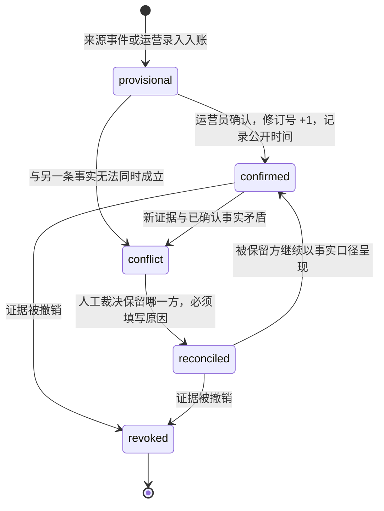
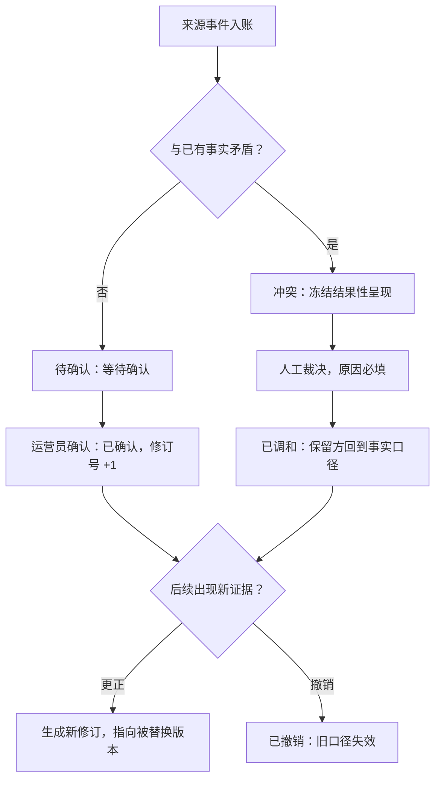

# 附录D：比赛事实状态机、数据字典与消息示例

我们在做一个陪用户看球的数字人。它说的每一句赛况，都必须能回答一个问题：这句话是从哪里来的、经过了几道确认。本篇对外说明我们如何管理比赛事实：事实的五种状态、状态之间如何流转、支撑这套流转的数据结构，以及客户端会收到的实时消息长什么样。

## 1. 核心思想：信号不会自动变成用户听到的事实

一条来源上报的进球、一张红牌、一个比分变化，只是"信号"。信号进入系统后首先入账，处于"待确认"状态；只有通过确认，它才成为可以呈现给用户的事实。我们不让任何一条未经确认或仍在冲突中的信息，以确定事实的口吻出现在用户面前——这是产品红线之一，也是本篇全部设计的出发点。

围绕事实，我们维护几层对象：比赛本身、比赛事件的账本记录、事件的事实修订链，以及事件之间的冲突记录。角色的表达、运营的动作属于各自的层，不会冒充比赛事实。

## 2. 不变量

无论功能如何演进，以下规则不变：

- **待确认不等于已确认。** 只有 `已确认` 状态的事实才进入公开读取范围，才会驱动比分、结果性语气或通知。
- **旧版本不能覆盖新版本。** 每条事实带单调递增的修订号，确认与更正都使修订号加一，迟到的旧数据无法回写。
- **更正必须指向被替换的版本。** 每次修订通过"修订自"字段形成替换链，历史可以被追溯，不能被静默改写。
- **接收时间不等于发生时间。** 事件的发生时间、入账时间、公开时间分别记录，不用其中一个冒充另一个。
- **撤销要使旧呈现失效。** 一条事实被撤销后，系统不允许继续以旧口径呈现。
- **同一动作只生效一次。** 运营与来源写入均携带幂等键，重试不会产生第二份事实或第二次播报。

## 3. 事实状态机

比赛事实有五种状态：**待确认（provisional）、已确认（confirmed）、冲突（conflict）、已调和（reconciled）、已撤销（revoked）**。



两种典型流转值得展开。

**确认流**：来源或运营写入的事件以"待确认"入账；运营员执行确认操作时，系统校验操作者身份，将状态置为"已确认"，修订号加一，并写入确认人与公开时间。从这一刻起，该事实才进入对用户的公开读取范围。

**冲突调和流**：当两条事实无法同时成立（例如两个来源对同一进球给出不同球员），系统生成一条冲突记录，把相关事实登记为冲突成员，并冻结它们的结果性呈现。冲突不会由系统"猜一个更可信的"来自动了结——裁决必须由运营员执行，并且**必须填写原因**，缺少原因的裁决请求会被直接拒绝。裁决结果（保留了哪条事实、由谁裁决、依据是什么）连同原因一起留痕在冲突调和审计中。



## 4. 数据字典

以下是我们实际存储事实的对象。字段按真实实现说明。

### 4.1 `matches`：比赛

- `id`：比赛标识，不透明的稳定 ID。
- `home_team` / `away_team`：主客队。
- `competition`：赛事。
- `kickoff`：开球时间。
- `created_at` / `updated_at`：记录创建与更新时间。

### 4.2 `match_events`：比赛事件账本

一场比赛的每个事件在这里有一行，事实字段与内容字段同 row 管理：

- `id`、`match_id`：事件与所属比赛。
- `source`：来源类别（运营录入或外部数据提供方）；`provider_name`、`operator_id` 分别记录提供方名称与操作者。
- `period`、`clock`、`event_type`：比赛阶段、时间点与事件类型（进球、红黄牌、换人等）。
- `team_id` / `team_name`、`player_name`、`score_home` / `score_away`：事件主体与当时的比分。
- `intensity`、`sentiment`、`description`、`tags`：为呈现准备的内容字段；`proactive_text`、`recommended_action` 是给主动播报的候选素材。
- `fact_status`：事实状态，五种取值——`provisional` / `confirmed` / `conflict` / `reconciled` / `revoked`，由数据库约束限定。
- `fact_revision`：修订号。确认与更正都会使其加一；旧修订号的数据不能覆盖新修订号。
- `confidence`：置信度，0 到 1 之间。
- `evidence`：证据信息（JSON），说明这条事实凭什么成立。
- `confirmed_by`：确认人。
- `public_at`：公开时间。只有"已确认"的事实才写入公开时间，也只有这类事实进入公开读取索引。
- `revision_of`：本事件替换了哪条旧事件，形成替换链。
- `status`：记录本身的存续状态——`active` / `corrected` / `deleted`，被更正或删除的旧记录不再出现。
- `visibility`：内容可见性标记，默认公开。
- `created_at` / `updated_at`：入账与更新时间。

### 4.3 `fact_revisions`：事实修订链

每次状态变化与更正都会追加一条修订记录，主键是（事实、修订号）：

- `fact_id`、`revision`：事实与单调递增的修订号。
- `status`：该修订对应的事实状态（五种状态同上）。
- `source_type`：修订来源——`operator` / `provider` / `system`。
- `source_event_id`：触发本修订的来源事件。
- `revision_of`：被替换的修订。
- `confidence`、`evidence`、`confirmed_by`：与事件账本同义。
- `occurred_at` / `recorded_at` / `public_at`：发生时间、入账时间、公开时间，三者分开记录。

修订链让"这条事实曾经是什么、何时变的、为什么变"始终可查——用户听到的每个口径都能对到一行修订记录。

### 4.4 `fact_conflicts`：冲突记录

- `id`、`match_id`：冲突与所属比赛。
- `status`：`open` / `resolved`。
- `chosen_fact_id`：裁决后保留的事实。
- `reason`：裁决原因，**必填**——没有原因的裁决在接口层就被拒绝。
- `detected_at`、`resolved_at`、`resolved_by`：发现、裁决时间与裁决人。
- 成员表 `fact_conflict_members` 登记参与冲突的事实及其角色（`accepted` / `candidate`）；`fact_conflict_edges` 维护事实之间的矛盾关系图；调和结果连同原因写入调和审计，供事后追溯。

## 5. 实时消息

客户端通过 WebSocket 连接接收推送。消息形状如下，示例均为真实格式。

**连接建立**——服务端立即发送欢迎消息：

```json
{ "type": "welcome", "message": "connected" }
```

**心跳**——客户端发送 `{"type": "ping"}`，服务端回答：

```json
{ "type": "pong" }
```

**回复事件**——球球的一条回复，以 `event` 类型推送，`deliveryKey` 是这次投递的去重键，客户端凭它做幂等；`presentation` 携带表情、动作与语音风格等呈现计划：

```json
{
  "type": "event",
  "event": "qiuqiu_reply",
  "data": {
    "text": "这球漂亮！第 63 分钟禁区外一脚远射，比分变成 2 比 1。",
    "traceId": "trace-8f2a",
    "source": "chat",
    "deliveryKey": "trace-8f2a",
    "presentation": {
      "expression": "excited",
      "motion": "cheer",
      "voiceStyle": "energetic"
    }
  }
}
```

**独立呈现**——除了随回复一起送出的呈现计划，有些场景会单独推送一条 `presentation` 消息，例如一次播报被用户打断后，球球给出的即时反应：

```json
{
  "type": "presentation",
  "data": { "expression": "attentive", "motion": "lean_in" },
  "deliveryKey": "delivery-interrupted:trace-8f2a",
  "source": "delivery_interrupted"
}
```

## 6. 顺序、去重与断线恢复

**去重靠键。** 每条投递都带 `deliveryKey`，客户端对同一键只呈现一次；服务端对运营写入使用幂等键记录，同一操作重试只会返回同一个已生效结果。

**断线不丢内容。** 连接恢复时，客户端不需要"猜"错过了什么：服务端按会话检查未完成的投递，把已就绪的回复以 `recovered_delivery` 来源重放，未成功的则以记录留痕，不会拼造内容补位。

**被取代的输出不再出现。** 回合可能因为新输入或会话状态变化而作废（账本中的 `turn_stale` 事件）；作废回合的内容不会在之后重新出现。

## 7. 可见性与剧透保护

当前版本的可见性规则很朴素：**只有"已确认"状态的事实才进入公开读取与呈现**；待确认、冲突中的信息不参与结果性表达，撤销的事实立即退出。事实的内容字段带有一个可见性标记，默认公开。

**剧透保护**（延迟观看时避免比分与关键事件被提前透露）是我们规划中的能力：设计方向是让用户对"自动更新"与"主动查看"有明确控制，确认后的信息在用户未请求时不主动剧透。该能力上线前，本节描述的"仅确认事实可见"是唯一的可见性门。

## 8. 概念设计（未实现）

我们在早期设计稿中推敲过一些更细的机制，它们**没有进入当前实现**，为避免误解如实列出：

- 八态的"知识状态"枚举（received / candidate / corrected / expired / rejected 等）——现行实现是上述五态。
- 跨通道消息信封上的四级 `visibility`（hidden / available_on_request / visible / suppressed）与 `causation_id` 因果链字段——现行消息即第 5 节所列的真实形状，不携带这些字段。
- 独立的"观察上下文"对象（含剧透模式开关、信息密度、控制版本等字段）——剧透保护仍在规划中，落地时会在本篇补充真实字段。

## 9. 相关公开资料

- [IETF, RFC 6455](https://www.rfc-editor.org/rfc/rfc6455)：WebSocket 实时通道。
- [IETF, RFC 3339](https://www.rfc-editor.org/rfc/rfc3339)：时间戳与时区语义。
- [IETF, RFC 7807](https://www.rfc-editor.org/rfc/rfc7807)：结构化问题说明。

---

版本 2.0（2026-09-20）
