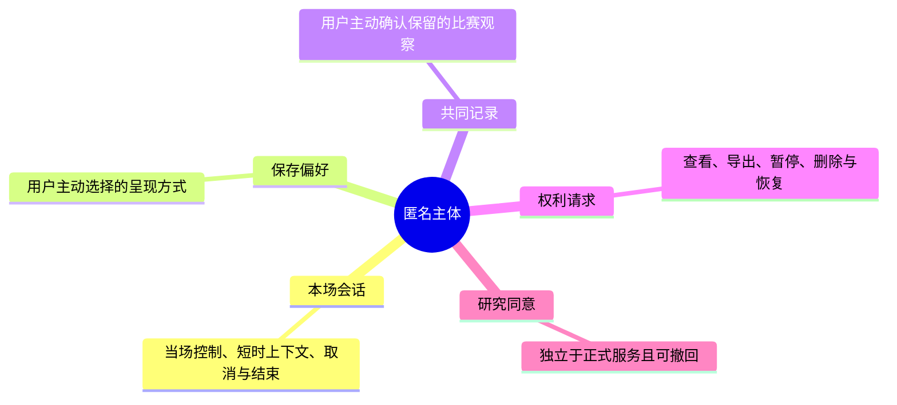
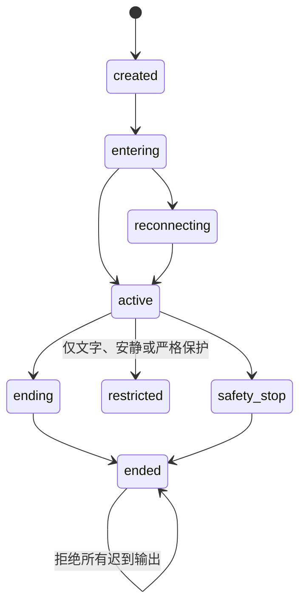

# 附录E：关系、偏好与用户边界数据字典

> 文档性质：0→1 数据与体验规范。它定义可以被保存、读取、展示、暂停和删除的最小对象，不把“关系感”当成一个可无限收集的画像。  
> 适用对象：产品、体验、工程、研究、隐私与值守成员。  
> 决策状态：首轮假设。任何新字段进入服务前，均须重新说明用户价值、许可、访问范围、保留期限、删除结果和回退方式。  
> 公开资料访问日：2026-01-28。

## 1. 目的：把“记住用户”拆成用户可以理解和控制的对象

足球陪看服务若把所有互动都塞进一个叫作“记忆”或“关系”的容器，会很快失去边界：一次本场吐槽可能被当作长期偏好，一次沉默可能被推断为情绪，一次投诉可能被拿来调整角色语气，一条已删除资料可能在缓存或生成上下文中重新出现。用户无法看见这些推断，也就无法有效拒绝、纠正或结束。

因此首轮不建立“亲密度”“依赖度”“用户价值”“情绪标签”或“关系评分”一类对象。服务只处理五类能被用户解释的资料：匿名会话、当场控制、用户主动保存的偏好、用户主动保存的共同记录、以及为完成用户请求而产生的权利状态。角色的表达稳定性来自公开可审议的人格规则和本场上下文，不来自对用户脆弱性或依恋程度的推断。

本文给出字段字典、状态机、读写规则、删除语义、消息示例、访问矩阵和验收场景。它不是数据库建表指令，也不授权收集真实资料；它是进入实现前的边界合同。任何候选技术方案都应能实现这些语义，不能实现就应缩小功能，而不是悄悄放宽用户权利。

### 1.1 首轮要解决的问题

| 问题 | 用户可能受到的影响 | 本附录的决定 |
| --- | --- | --- |
| 用户想让下一场默认更安静 | 每次重复设置很麻烦 | 仅保存用户主动选择的展示偏好，可查看、暂停、修改和删除 |
| 用户想留下自己对一场比赛的观察 | 记录可能混入角色虚构内容或被无限召回 | 共同记录只保存用户明确确认的文本与可选标签，不等同于角色记忆 |
| 用户在共享设备或网络异常下切换会话 | 偏好串用、删除失效、旧内容复活 | 会话、身份、资料版本与删除屏障分离，晚到写入被拒绝 |
| 用户不想被过度“懂得” | 系统可能从沉默、语速或表达推断敏感状态 | 不建立情绪、脆弱性、孤独、亲密度、健康或关系价值字段 |
| 用户要结束或删除 | 系统仍可能在下一场引用旧内容 | 结束、暂停和删除有不同语义；删除优先于任何连续性收益 |

### 1.2 设计原则

1. **主动保存优先于自动推断。** 用户没有清楚说“保存”或在可见设置中确认时，内容只属于本场短时上下文。
2. **目的小于可能性。** 某字段“以后可能有用”不是收集理由。每个字段只为一个当下用户任务服务。
3. **每个长期对象都能被用户命名。** 用户应能说出“我保存的是文字优先”“我写下了一条比赛观察”，而不是面对无法理解的“关系数据”。
4. **暂停不是删除，删除不是隐藏。** 暂停停止未来读取；删除要求停止读取并拒绝晚到写入；两者均不能被运营便利绕过。
5. **角色不能消费投诉与风险资料。** 投诉、申诉、求助和高风险表达只服务于处理与保护，不进入角色语气、模型上下文或商业分析。
6. **默认不跨场。** 任何本场状态若要在下一场出现，都需单独列入本文的对象字典和用户可见控制。

## 2. 统一对象模型

### 2.1 六类资料对象



比赛事实、角色规则、运营配置与投诉案件不属于上述连续性对象，不能被当作“用户关系记忆”读写。

> 信息卡：原宽表已改为纵向阅读，字段含义不变。

- **对象：匿名主体 `subject`**
  - **生命周期**：直到用户主动结束身份或提出删除
  - **用户能否看见**：以“此设备/此账号的服务资料”说明
  - **默认是否创建**：访问服务时创建最少标识
  - **能否进入角色上下文**：不能直接进入，只提供权限判断

- **对象：本场会话 `match_session`**
  - **生命周期**：一场比赛或明确结束为止
  - **用户能否看见**：当前场可见
  - **默认是否创建**：进入本场时创建
  - **能否进入角色上下文**：仅当前场、最少必要上下文

- **对象：呈现偏好 `presentation_preference`**
  - **生命周期**：用户保存到暂停或删除
  - **用户能否看见**：设置中可见
  - **默认是否创建**：否
  - **能否进入角色上下文**：仅用于选择文字/声音/动态默认值

- **对象：共同记录 `shared_note`**
  - **生命周期**：用户保留到编辑或删除
  - **用户能否看见**：记录页可见
  - **默认是否创建**：否
  - **能否进入角色上下文**：仅当用户在本场主动打开指定记录时可读入

- **对象：权利请求 `rights_request`**
  - **生命周期**：到完成、拒绝或法定/政策期满
  - **用户能否看见**：请求进度可见
  - **默认是否创建**：用户请求时创建
  - **能否进入角色上下文**：永不进入角色上下文

- **对象：研究同意 `research_consent`**
  - **生命周期**：独立研究周期
  - **用户能否看见**：研究说明与撤回页可见
  - **默认是否创建**：否
  - **能否进入角色上下文**：永不进入正式服务上下文

### 2.2 明确禁止的对象与派生标签

以下对象在首轮数据模型中不存在。若未来有人提议引入，必须从用户研究、隐私影响、关系风险、可见性、删除、人工权限和停止条件重新立项，不能作为“偏好优化”偷偷加入：

- 用户孤独程度、脆弱程度、心理状态、依恋程度、情感需求、恋爱可得性；
- 对角色的亲密度、忠诚度、留存价值、付费倾向、可操纵性或唤回概率；
- 基于沉默、语速、面部、环境声音、观看时长推断的情绪或关系标签；
- 未经用户确认的球队、球员、地点、联系人、作息、家庭或健康信息；
- 全量原始声音、完整对话历史、完整屏幕行为轨迹或可重建私人表达的向量化资料；
- 投诉、求助、举报、删除原因、人工支持备注进入角色记忆或增长分群。

禁止对象不表示团队否认用户会有复杂感受。恰恰相反，它承认服务不应把这些感受变成可被自动化利用的标签。美国联邦贸易委员会在其关于 AI 伴侣的公开调查中，将未成年人、情绪依赖与潜在伤害列为关注方向；可参考 [FTC: Inquiry into AI companion chatbots](https://www.ftc.gov/news-events/news/press-releases/2025/09/ftc-launches-inquiry-ai-chatbots-acting-companions)，但具体服务仍需自行研究适用风险和保护措施。

## 3. 字段字典：匿名主体与本场会话

### 3.1 `subject`：最小服务主体

`subject` 不是“完整用户画像”。它只让服务能够将同一主体的明确权利、偏好和删除状态彼此区分。身份方案可在访客、账户或受信任登录之间选择，但无论选哪一种，都不应把可识别身份当成陪看能力的前置条件。

> 信息卡：原宽表已改为纵向阅读，字段含义不变。

- **字段：`subject_id`**
  - **类型/示例**：随机、不连续标识
  - **目的**：关联用户主动保存的对象
  - **创建方式**：服务端生成
  - **可见性与删除**：不向其他用户展示；删除请求触发关联处理

- **字段：`identity_mode`**
  - **类型/示例**：`guest` / `account` / `recovery_pending`
  - **目的**：决定可用恢复方式
  - **创建方式**：明确进入路径
  - **可见性与删除**：设置中说明；不可用于推断身份属性

- **字段：`created_at`**
  - **类型/示例**：时间戳
  - **目的**：排查生命周期与权利请求
  - **创建方式**：自动生成
  - **可见性与删除**：可在导出中说明；不进入角色上下文

- **字段：`status`**
  - **类型/示例**：`active` / `restricted` / `deletion_pending` / `deleted`
  - **目的**：阻止不应继续的读写
  - **创建方式**：系统根据明确事件变化
  - **可见性与删除**：用户可看到与服务权利相关的状态说明

- **字段：`deletion_barrier_version`**
  - **类型/示例**：单调递增数字
  - **目的**：拒绝早于删除请求的晚到写入
  - **创建方式**：删除流程写入
  - **可见性与删除**：不向角色暴露；用于可验证删除

首轮不要求填写姓名、手机号、通讯录、精确地址、生日、社交账号或照片。若某种恢复路径确需联系信息，应将其从陪看主体中分离为专门、可撤回、最小化的联系对象，并在上线前另行进行隐私与合规审议。

### 3.2 `match_session`：只服务于当前比赛

> 信息卡：原宽表已改为纵向阅读，字段含义不变。

- **字段：`session_id`**
  - **类型/示例**：随机标识
  - **允许用途**：关联本场控制与实时消息
  - **不允许用途**：跨场跟踪用户
  - **结束后处理**：标记结束并过期

- **字段：`subject_id`**
  - **类型/示例**：引用
  - **允许用途**：权限与用户控制
  - **不允许用途**：用于角色称呼或情绪判断
  - **结束后处理**：与主体权利状态一致

- **字段：`match_context_id`**
  - **类型/示例**：公开赛事/场次引用
  - **允许用途**：限定事实与时间范围
  - **不允许用途**：自动推断球队忠诚度
  - **结束后处理**：仅保留最少运行审计

- **字段：`mode`**
  - **类型/示例**：`text` / `voice` / `quiet` / `strict_protection`
  - **允许用途**：决定本场呈现
  - **不允许用途**：推断长期偏好，除非用户另行保存
  - **结束后处理**：随会话结束失效

- **字段：`started_at` / `ended_at`**
  - **类型/示例**：时间戳
  - **允许用途**：管理过期与取消
  - **不允许用途**：形成作息、健康或活跃画像
  - **结束后处理**：按短期运行规则处理

- **字段：`session_epoch`**
  - **类型/示例**：整数
  - **允许用途**：拒绝旧连接、重复消息
  - **不允许用途**：评价用户活跃度
  - **结束后处理**：会话销毁后不可复用

- **字段：`end_reason`**
  - **类型/示例**：`user_end` / `timeout` / `safety_stop` / `service_unavailable`
  - **允许用途**：选择中性降级与排障
  - **不允许用途**：生成内疚式挽回、长期分群
  - **结束后处理**：仅最小化运行统计

`end_reason` 必须避免把用户离开解释为关系信号。界面上的对应文案应当是“本场已结束”“你可以随时进入另一场”，而不是“我会等你回来”或“你是不是不喜欢我了”。

### 3.3 本场状态机



规则：

1. `ended` 为终态。同一 `session_epoch` 的声音、动作、事实提示、生成请求和写入请求均不得重新激活它。
2. `reconnecting` 只恢复用户已经选择的本场控制，不重放用户取消、静音或严格保护之前的内容。
3. `restricted` 是保护性降级，不是惩罚。它可以在声音不可用、来源冲突或用户选择低动态时启用，核心文字和结束路径必须保留。
4. `safety_stop` 只描述服务已停止自动行为，不要求用户解释原因，也不让角色代替人工处理高风险情况。

## 4. 字段字典：用户主动保存的呈现偏好

### 4.1 为什么偏好不等于记忆

偏好是用户为了降低下一场操作成本而明确保存的选择。它必须是有限枚举、可预期的效果和可见的修改入口。若字段需要从用户行为中推断，或会改变角色对用户的“理解”，它就不是首轮偏好。

### 4.2 `presentation_preference` 字典

> 信息卡：原宽表已改为纵向阅读，字段含义不变。

- **字段：`preference_id`**
  - **可选值**：随机标识
  - **用户价值**：管理单条偏好
  - **默认**：不创建
  - **读写规则**：仅用户可查看和编辑

- **字段：`subject_id`**
  - **可选值**：引用
  - **用户价值**：归属与删除
  - **默认**：无
  - **读写规则**：不能跨主体读取

- **字段：`text_priority`**
  - **可选值**：`always` / `when_available` / `off`
  - **用户价值**：选择文字是否优先
  - **默认**：本场选择，不保存
  - **读写规则**：必须由用户明确保存

- **字段：`audio_mode`**
  - **可选值**：`off` / `manual_start`
  - **用户价值**：避免意外出声
  - **默认**：`off`
  - **读写规则**：不能因使用频率自动改为开启

- **字段：`motion_intensity`**
  - **可选值**：`low` / `standard`
  - **用户价值**：降低动态和感官负担
  - **默认**：`low` 或本场选择
  - **读写规则**：必须提供文字等效信息

- **字段：`spoiler_protection_default`**
  - **可选值**：`ask_each_match` / `off`
  - **用户价值**：降低延迟观看剧透
  - **默认**：`ask_each_match`
  - **读写规则**：不得根据沉默自动关闭

- **字段：`status`**
  - **可选值**：`active` / `paused` / `deleted`
  - **用户价值**：用户控制应用范围
  - **默认**：`active` 仅在明确保存后
  - **读写规则**：`paused` 不读，`deleted` 不读不写

- **字段：`version`**
  - **可选值**：整数
  - **用户价值**：防止旧写入覆盖
  - **默认**：1
  - **读写规则**：每次用户修改递增

- **字段：`updated_at`**
  - **可选值**：时间戳
  - **用户价值**：告知最近修改
  - **默认**：自动
  - **读写规则**：不用于行为画像

首轮的最大偏好集合应保持很小。文本优先、声音启动方式、动态强度和剧透保护已经覆盖了用户最常见的控制需求。增加“角色性格”“情绪陪伴程度”“亲密称呼”“自动关心频率”等字段会把用户控制扭曲成关系调优，应被拒绝或转为独立研究议题。

### 4.3 用户可见的读写流程


禁止流程包括：第一次使用声音后自动保存声音偏好；根据用户没有关掉动画而把它设为长期标准；在用户深夜观看后推断“希望被陪伴”；因用户多次进入同一球队比赛就保存球队忠诚度。

## 5. 字段字典：共同记录

### 5.1 共同记录是什么，不是什么

共同记录是用户主动留存的一条比赛观察，例如“第 70 分钟开始中场压迫明显减弱”。角色可以在用户明确打开该条记录、且本场需要回看时提供辅助整理，但不能把角色编造的回忆、未经证实的战术结论或用户私密表达自动写入。

它不是聊天历史备份，不是关系证明，不是用于唤回用户的内容池，也不是对用户情绪和喜好的隐性训练资料。

### 5.2 `shared_note` 字典

**字段：`note_id`**
- **类型/限制**：随机标识
- **为什么需要**：编辑与删除
- **禁止事项**：不能用可猜测序号暴露其他记录

**字段：`subject_id`**
- **类型/限制**：引用
- **为什么需要**：归属
- **禁止事项**：不共享给其他主体

**字段：`match_context_id`**
- **类型/限制**：公开场次引用，可为空
- **为什么需要**：帮用户定位自己的观察
- **禁止事项**：不能据此自动推断支持对象

**字段：`author_mode`**
- **类型/限制**：固定为 `user_confirmed`
- **为什么需要**：表明用户确认保存
- **禁止事项**：不允许 `agent_inferred`

**字段：`body`**
- **类型/限制**：用户可编辑文字，长度上限待研究
- **为什么需要**：保留用户主动表达
- **禁止事项**：不自动保存完整对话或音频转写

**字段：`user_labels`**
- **类型/限制**：可选、用户选择的有限标签
- **为什么需要**：便于用户自己筛选
- **禁止事项**：不做自动情绪、人格或价值标签

**字段：`created_at` / `updated_at`**
- **类型/限制**：时间戳
- **为什么需要**：编辑与导出
- **禁止事项**：不形成作息分析

**字段：`status`**
- **类型/限制**：`active` / `archived` / `deleted`
- **为什么需要**：用户控制可见性
- **禁止事项**：`archived` 不等于隐形永久保存

**字段：`version`**
- **类型/限制**：整数
- **为什么需要**：防止编辑冲突和晚到覆盖
- **禁止事项**：不允许旧版本恢复删除内容

### 5.3 角色参与的边界

角色可以做的：把用户已选文字压缩为更易读的候选标题；提醒“这是一条你的观察，不是已确认比赛事实”；在用户选择后把事实来源与个人观察分成两段；在用户要求删除时确认删除动作。

角色不能做的：自行把对话摘要写入记录；把用户沉默、激动或抱怨总结成“你一直很在意这支球队”；用历史记录制造“我们共同经历过”的排他叙事；在用户未主动打开记录时引用私密段落；把风险、投诉或脆弱表达改写成可供陪伴调用的“记忆”。

## 6. 权利请求、暂停与删除

### 6.1 `rights_request` 字典

**字段：`request_id`**
- **值/示例**：随机标识
- **目的**：跟踪一次请求
- **用户可见信息**：可复制的请求编号

**字段：`subject_id`**
- **值/示例**：引用
- **目的**：限定资料归属
- **用户可见信息**：不展示内部标识细节

**字段：`request_type`**
- **值/示例**：`view` / `export` / `pause` / `resume` / `delete` / `correct`
- **目的**：表达用户权利
- **用户可见信息**：说明每种动作的效果

**字段：`scope`**
- **值/示例**：`preference` / `note` / `all_eligible_data`
- **目的**：防止过宽或过窄处理
- **用户可见信息**：用户可选择并确认范围

**字段：`status`**
- **值/示例**：`received` / `verifying` / `in_progress` / `completed` / `rejected`
- **目的**：处理透明度
- **用户可见信息**：中性说明与下一步

**字段：`requested_at` / `completed_at`**
- **值/示例**：时间戳
- **目的**：服务时限与审计
- **用户可见信息**：不把等待写成角色承诺

**字段：`result_summary`**
- **值/示例**：最少说明
- **目的**：告诉用户完成了什么
- **用户可见信息**：不泄露其他主体或内部安全信息

### 6.2 暂停、恢复与删除的差异

> 信息卡：原宽表已改为纵向阅读，字段含义不变。

- **动作：本场结束**
  - **未来读取**：不再读取本场上下文
  - **未来写入**：拒绝本场迟到输出与写入
  - **既有可见性**：本场界面结束
  - **适用情境**：用户离开一场比赛

- **动作：偏好暂停**
  - **未来读取**：不在未来自动应用
  - **未来写入**：不修改原值
  - **既有可见性**：用户仍可在设置中看到
  - **适用情境**：想临时每场手动选择

- **动作：偏好恢复**
  - **未来读取**：恢复自动应用
  - **未来写入**：只从当前版本读取
  - **既有可见性**：保持用户可见
  - **适用情境**：用户重新确认需要

- **动作：共同记录归档**
  - **未来读取**：默认不在日常入口展示
  - **未来写入**：不自动新增
  - **既有可见性**：用户仍可自行查看
  - **适用情境**：用户整理旧记录

- **动作：删除**
  - **未来读取**：立即停止读取
  - **未来写入**：以删除屏障拒绝晚到写入
  - **既有可见性**：对用户不可再访问，处理结果可见
  - **适用情境**：用户要求移除内容

删除不是把界面项藏起来。它至少包含四个承诺：主存储标为删除或清除、缓存和短时上下文失效、异步写入被版本屏障拒绝、后续生成和通知候选不能重新引用。由于不同法域、备份机制和法律义务可能影响最终实现，用户说明必须区分“服务中已不可访问”“待完成的系统清理”“依法必须保留的最少记录”，并提供可理解的处理进度。有关个人信息处理、最小必要和删除请求的公开研究可从 [《中华人民共和国个人信息保护法》](https://flk.npc.gov.cn/detail2.html?ZmY4MDgxODE3YjE2ZWQ4YjAxN2I2Y2I2MzY0ZDMzZjg%3D) 开始，具体适用仍需专业审阅。

### 6.3 删除屏障与晚到写入规则

```text
写入请求携带：subject_id + object_id + object_version + subject_barrier_version

若 request.barrier_version < subject.deletion_barrier_version：拒绝写入
若 object.status == deleted：拒绝写入
若 request.object_version <= stored.version：拒绝或幂等返回
若会话已结束且写入属于本场自动摘要：拒绝写入
否则：在允许范围内写入并递增版本
```

任何拒绝必须被当作正确保护结果，而不是“自动重试直到成功”。若离线设备提交的是用户明确编辑后的新资料，系统应要求用户在看到删除状态后重新确认创建，而不能把旧内容静默恢复。

## 7. 读取、写入与访问矩阵

### 7.1 服务角色权限

**角色：用户端**
- **可读取**：自己当前会话、自己可见偏好与记录、自己的权利进度
- **可写入**：用户明确动作产生的偏好、记录、请求
- **明确禁止**：其他主体资料、运营备注、删除屏障细节

**角色：陪看运行时**
- **可读取**：当前本场所需控制、用户已主动启用的最少偏好
- **可写入**：本场短时状态、经用户确认的候选动作
- **明确禁止**：长期资料推断、投诉读取、删除后内容

**角色：资料权利服务**
- **可读取**：范围内对象与权利请求
- **可写入**：暂停、删除、导出任务与屏障
- **明确禁止**：角色语气、运营营销、关系状态

**角色：研究服务**
- **可读取**：独立同意范围内的去标识材料
- **可写入**：研究同意与汇总
- **明确禁止**：正式服务偏好、聊天记录、投诉材料

**角色：值守人员**
- **可读取**：与具体支持请求有关的最少状态
- **可写入**：处理结果与中性服务动作
- **明确禁止**：批量浏览记录、读取无关私密内容、把资料用于角色生成

**角色：角色呈现层**
- **可读取**：已被运行时过滤的当前回应和舞台指令
- **可写入**：不直接写长期资料
- **明确禁止**：原始偏好、权利请求、删除原因、风险标签

### 7.2 “能看见”不等于“能使用”

即使系统为删除或支持流程短期保留某些元数据，角色和增长流程也没有使用权。访问控制应同时区分技术可达性、业务目的和呈现许可。举例：值守人员可以知道某删除请求处于“处理中”，并不意味着角色可以提到“我知道你删掉了我们的回忆”；研究人员可看到去标识任务完成率，也不意味着可以恢复用户原话来寻找更高留存的表达。

## 8. 面向用户的说明与文案准则

### 8.1 偏好说明示例

| 情境 | 推荐说明 | 不推荐说明 |
| --- | --- | --- |
| 保存文字优先 | “保存为下次默认：优先显示文字。你可随时在设置中修改或暂停。” | “我会记住你喜欢安静。” |
| 本场覆盖 | “这场仅使用你的临时选择，不会改变已保存默认。” | “我知道你今天心情不一样。” |
| 删除记录 | “这条记录将不再用于后续查看或陪看引用。处理完成后会显示结果。” | “我会努力忘掉这件事。” |
| 服务降级 | “声音暂不可用，已切换为文字。你的本场控制仍然有效。” | “我失声了，别丢下我。” |

文案的目标是准确描述服务动作与用户选择，避免拟人化承诺掩盖系统边界。数字角色可以有风格，但当涉及资料、删除、同意、故障和投诉时，应使用清楚、中性、可核验的语言。

### 8.2 用户查看页最小内容

用户应能在一个稳定入口看到：已保存的偏好及具体值、共同记录及编辑/删除入口、是否有研究同意、正在处理的权利请求、如何结束本场和关闭声音/动态、如何获得支持。该页不需要展示内部标识、日志或复杂技术状态，但不能把“资料管理”藏在难找的多层菜单里。

## 9. 研究假设、风险与验收

### 9.1 待验证假设

> 信息卡：原宽表已改为纵向阅读，字段含义不变。

- **编号：H-E1**
  - **假设**：用户能理解偏好与本场设置的区别
  - **验证方式**：原型任务访谈
  - **支持扩大范围的最低条件**：多数参与者可独立说明“仅这场”和“下次默认”
  - **停止或缩小信号**：用户误以为所有行为都会被记住

- **编号：H-E2**
  - **假设**：小型共同记录能带来价值而不形成压力
  - **验证方式**：可撤回的原型研究
  - **支持扩大范围的最低条件**：用户主动使用且能找到编辑/删除
  - **停止或缩小信号**：用户觉得被要求维系共同历史

- **编号：H-E3**
  - **假设**：删除说明能让用户理解处理状态
  - **验证方式**：可用性测试
  - **支持扩大范围的最低条件**：用户知道删除后什么不再发生
  - **停止或缩小信号**：用户误认为删除只是隐藏或立即影响所有备份

- **编号：H-E4**
  - **假设**：低动态、文字优先可覆盖核心任务
  - **验证方式**：无障碍与弱网走查
  - **支持扩大范围的最低条件**：不使用声音/动画也能完成观看与控制
  - **停止或缩小信号**：核心事实只通过声音或动作表达

### 9.2 必测验收场景

1. 用户没有保存任何偏好进入比赛：系统不能假装“记得你”，只按本场默认提供控制。
2. 用户主动保存文字优先：下一场进入前可见具体值，用户可一键仅覆盖本场。
3. 用户暂停偏好：下一场不自动应用，原值仍可见且可恢复。
4. 用户删除偏好后重连：不显示旧默认，晚到写入被拒绝并留下中性处理结果。
5. 用户创建一条共同记录但未确认保存：离开后不能自动变成长久内容。
6. 用户删除共同记录：角色、搜索、通知候选和后续场次均不能再引用。
7. 共享设备切换匿名主体：偏好、记录和删除状态不得串用。
8. 语音、声音或动画不可用：用户仍可用文字完成保存、暂停、删除和结束。
9. 值守人员处理请求：仅能看到必要范围，不可批量浏览其他记录，也不可将处理内容送入角色。
10. 研究同意被撤回：正式服务仍可使用，研究流程停止继续收集或使用可关联材料。

## 10. 公开资料

1. [《中华人民共和国个人信息保护法》](https://flk.npc.gov.cn/detail2.html?ZmY4MDgxODE3YjE2ZWQ4YjAxN2I2Y2I2MzY0ZDMzZjg%3D)，2021。
2. [NIST Privacy Framework](https://www.nist.gov/privacy-framework)，持续更新。
3. [NIST AI 600-1: Generative AI Profile](https://nvlpubs.nist.gov/nistpubs/ai/NIST.AI.600-1.pdf)，2024。
4. [FTC: Inquiry into AI companion chatbots](https://www.ftc.gov/news-events/news/press-releases/2025/09/ftc-launches-inquiry-ai-chatbots-acting-companions)，2025。
5. [W3C Web Content Accessibility Guidelines 2.2](https://www.w3.org/TR/WCAG22/)，2023。

这些公开材料用于形成问题清单和研究方向，不替代对实际资料流、运营地区、供应商、赛事权利和用户人群的专业审查。

## 11. 资料处理操作规程：从用户动作到可验证结果

字段字典只能说明“应该保存什么”。真正决定用户权利是否成立的是操作顺序：用户在哪个界面看到什么、系统何时开始读写、失败时是否诚实、人工何时介入、以及怎样证明旧资料没有重新进入体验。本节提供不依赖特定技术栈的工作流程。

### 11.1 保存偏好的完整流程

```text
1. 用户在本场选择文字优先、手动开启声音或低动态。
2. 系统明确区分“仅本场使用”与“保存为下次默认”。
3. 用户主动选择保存，看到即将保存的每个值和取消入口。
4. 系统验证主体状态不是 deletion_pending/deleted。
5. 生成新版本的偏好对象，并记录最少审计信息。
6. 向用户显示“已保存”及查看、暂停、修改、删除入口。
7. 下一场进入前展示将要应用的值，允许本场覆盖。
```

每一步的失败行为如下：

**失败点：本场未选择任何项**
- **用户看到什么**：不显示保存诱导
- **服务必须做什么**：维持本场默认
- **不得做什么**：根据停留或点击推断偏好

**失败点：网络不可用**
- **用户看到什么**：“暂未保存；本场选择仍有效”
- **服务必须做什么**：保持本场控制，提供重试
- **不得做什么**：静默写入不明队列或假装成功

**失败点：主体正在删除**
- **用户看到什么**：“资料删除处理中，无法创建新默认”
- **服务必须做什么**：拒绝写入，说明下一步
- **不得做什么**：用新偏好撤销删除意图

**失败点：版本冲突**
- **用户看到什么**：“设置已在另一处更新，请查看后再选择”
- **服务必须做什么**：返回当前可见值
- **不得做什么**：覆盖较新的明确选择

**失败点：服务降级**
- **用户看到什么**：“这场可手动选择；默认暂不可读取”
- **服务必须做什么**：使用安全本场默认
- **不得做什么**：将旧缓存当作确定偏好

### 11.2 创建共同记录的完整流程


如需角色协助整理，应采用“双确认”而非自动保存：角色仅展示候选摘要，用户可以编辑或放弃，只有用户最终确认的文字进入 `body`。这降低了模型误解被写成长期资料的风险，也让用户能区分“我自己想留下什么”与“系统替我猜了什么”。

候选提示词示例：

```text
状态：DESIGN
目标：用户可以把本场的一句观察主动保存为共同记录。
请只设计确认流程和失败路径。
约束：记录必须标为 user_confirmed；角色只能提出候选标题，不能自动保存；
记录不是确认赛况；用户可编辑、归档、删除；服务不可用时不丢失用户正在输入的本地草稿，
也不得在未确认情况下上传。
请输出：状态、用户文案、资料读写点、无障碍要求、删除与冲突场景、回退方式。
```

### 11.3 暂停、恢复与删除流程


对于暂停，用户应立即看到下一场不会自动应用的结果。对于删除，用户应获得请求范围、处理状态、何时可再次查看的解释，以及存在依法或技术上必须单独处理部分时的透明说明。系统不能要求用户写长篇理由、接受角色挽留或多次穿过营销页面才能删除。

### 11.4 导出与更正流程

导出并非简单把所有内部字段打包。用户需要的是可理解的资料说明：已保存的偏好、主动确认的共同记录、权利请求进度、研究同意状态，以及与这些对象相关的创建和修改时间。内部安全字段、其他主体资料、反欺诈规则、密钥、系统提示词和人工访问控制细节不应在导出中泄露。

更正的适用范围也要准确：用户可修改自己的偏好和记录；若用户指出公开比赛事实有误，应进入事实来源核验流程，而不是由角色或资料管理页直接改写。这样能避免将“用户观察”和“公开事实”混为一层。

## 12. 数据质量与一致性规则

### 12.1 版本、时钟与幂等

用户资料的正确性不能只依赖“最后一条消息先到”。移动网络、离线恢复和多设备切换会让旧操作晚到。每个可持久化对象至少需要对象版本、主体删除屏障版本、请求标识和发生时间；但发生时间不能单独决定胜负，因为设备时钟可能错误。

| 规则 | 目的 | 例子 |
| --- | --- | --- |
| 对象版本单调递增 | 防旧编辑覆盖新编辑 | 版本 4 的偏好不能覆盖版本 5 |
| 删除屏障优先 | 防已删内容被重建 | 删除屏障为 9 时，携带 8 的写入被拒绝 |
| 请求去重 | 防重试生成多条记录 | 同一保存请求重发只产生一份对象 |
| 主体隔离 | 防共享设备串用 | 会话令牌变化时不复用旧主体偏好 |
| 明确冲突 | 防静默选择错误版本 | 两个并发编辑要求用户查看后再决定 |
| 状态不可逆约束 | 防删除/结束被自动撤销 | `deleted` 与 `ended` 不接受常规更新 |

### 12.2 资料最小化检查

新字段评审时，负责人对每一个字段填写以下问题：

1. 用户能否在一句话内理解此字段保存什么？
2. 不收集它时，当前用户任务具体缺少什么？
3. 它是用户明确输入，还是从行为/声音/沉默推断？后者为何不可避免？
4. 谁能读取，读取时如何限制到目的？角色是否真的需要它？
5. 用户能否查看、修改、暂停、导出或删除？若不能，为什么？
6. 它保存多久，届满如何清理，异步副本如何处理？
7. 它会不会让人推断健康、情绪、关系、位置、身份或其他敏感信息？
8. 删除后是否会在缓存、日志、检索索引、生成上下文或离线队列中重新出现？

任何问题不能回答时，默认结论是“不新增字段”。这不妨碍服务交付核心陪看任务：本场控制、可解释事实、文字降级和用户主动的少量偏好，本身不需要建立大规模个人画像。

### 12.3 观察数据与体验资料分离

为发现故障，团队可能需要记录聚合的技术信号，例如某类请求被删除屏障拒绝的次数、会话结束后消息被丢弃的次数、文字降级是否触发。这些信号应使用去标识化会话类别、事件类型和时间桶，而不是完整用户文本、音频、姓名或精确行为轨迹。

| 可以收集的最少运行信号 | 不应借机收集的内容 |
| --- | --- |
| `late_message_rejected` 的聚合次数 | 迟到消息中的完整角色内容 |
| `preference_pause_applied` 的聚合次数 | 用户为什么暂停的自由文本，除非单独同意研究 |
| `deletion_barrier_rejected` 的类别统计 | 被删除偏好的旧值 |
| `text_fallback_shown` 的聚合次数 | 用户当时正在说的话或环境声音 |
| 权利请求各状态的处理时长分布 | 可关联的删除原因、身份资料或人工备注 |

NIST Privacy Framework 提供了识别、治理、控制、沟通与保护隐私风险的公开方法框架，可用作评审提问清单；它不要求某一组固定字段，也不替代团队对特定资料流的判断。[NIST Privacy Framework](https://www.nist.gov/privacy-framework)

## 13. 支持与人工处理边界

### 13.1 何时需要人工支持

用户应能自助完成保存、暂停、恢复、删除和退出；人工支持只处理自助路径无法解决的情况，例如主体恢复困难、删除范围无法理解、导出不可用、错误事实纠正的渠道指引、投诉或可访问性障碍。支持不应成为角色的“亲密关系延伸”，更不能以人工身份扮演角色延续陪伴。

### 13.2 最小支持工单

**工单字段：请求类型**
- **是否必需**：是
- **原因**：路由到正确流程
- **禁止项**：不用“用户价值”或“黏性”分类

**工单字段：关联对象范围**
- **是否必需**：是，最小化
- **原因**：确定删除/导出/更正目标
- **禁止项**：不批量附带所有历史资料

**工单字段：当前状态**
- **是否必需**：是
- **原因**：告知处理进度
- **禁止项**：不写角色记忆摘要

**工单字段：用户选择的回复方式**
- **是否必需**：可选
- **原因**：让用户控制联系
- **禁止项**：不自动订阅营销

**工单字段：无障碍需求说明**
- **是否必需**：可选且最小化
- **原因**：提供适配支持
- **禁止项**：不推断健康状况

**工单字段：处理结果**
- **是否必需**：是
- **原因**：完成透明度
- **禁止项**：不把主观评价写进画像

人工权限按“完成本次请求所需的最少信息”配置。任何支持成员不应因为能帮助删除，就默认能浏览共同记录、语音内容、完整对话或其他案件。处理结束后，工单按既定期限关闭和最小化，不转交给角色、推荐或增长流程。

### 13.3 投诉与关系伤害的隔离

若用户认为角色表达造成压力、依赖、误导或不适，投诉通道应立即提供中性确认、关闭相关表达的选项、文字与人工支持入口。处理信息不能被重新喂给角色，使角色说出“我知道我刚才让你不舒服”之类把支持案件带回陪看体验的话。修复的优先级是停止可能伤害的行为、解释用户控制、提供退出和必要支持，而不是让角色更会道歉以维持使用。

## 14. 审计、保留与清理的设计问题

### 14.1 审计记录最小字段

审计用于回答“谁在何时对哪一类对象执行了哪种授权动作，结果如何”，而不是重建用户全部内容。首轮审计可包含：去标识主体引用、对象类别、动作类别、请求标识、前后状态、授权角色、时间、结果和拒绝原因类别。它不应保存偏好原值、记录正文、原始语音、完整提示词或人工主观意见。

### 14.2 保留计划需要的字段

**对象：本场短时上下文**
- **首轮保留问题**：用户离场后还需要吗？
- **到期动作**：到期失效并拒绝重放
- **需要独立确认的例外**：必要安全与故障排查的最少元数据

**对象：保存偏好**
- **首轮保留问题**：用户是否仍保持主体与偏好？
- **到期动作**：用户删除或账户关闭时清理
- **需要独立确认的例外**：适用法律或争议处理义务

**对象：共同记录**
- **首轮保留问题**：用户是否主动保留？
- **到期动作**：用户删除、到期策略或主体关闭时清理
- **需要独立确认的例外**：用户明确导出前的短时准备

**对象：权利请求**
- **首轮保留问题**：完成证明需要保存多久？
- **到期动作**：完成后最小化并按规则清理
- **需要独立确认的例外**：法定证明义务

**对象：研究同意**
- **首轮保留问题**：研究是否仍在进行？
- **到期动作**：撤回或研究结束时停止使用
- **需要独立确认的例外**：经单独审查的去标识汇总

本文不写固定天数，因为不同地区、业务方式、备份架构和法律义务不同。正确的 0→1 做法是先将每类资料的目的与终止条件写清，再由隐私、法律和工程共同确定可执行期限、备份清理和用户说明。把一个未经研究的数字写得很精确，并不能增加用户保护。

## 15. 本附录放行清单

- [ ] 任何长期对象都能由用户用自己的语言说明其内容与用途；
- [ ] 没有亲密度、孤独、脆弱、情绪、留存价值或自动关系评分字段；
- [ ] 本场控制默认不会跨场保存；
- [ ] 偏好只由用户明确保存，且可查看、暂停、修改、删除；
- [ ] 共同记录必须由用户确认，不是角色或模型自动摘要；
- [ ] 删除包含读写屏障、缓存失效、晚到写入拒绝和后续引用检查；
- [ ] 投诉、求助和权利请求永不进入角色上下文或增长用途；
- [ ] 共享设备、断线、重连和降级场景已被纳入验收；
- [ ] 高风险新增字段会重新经过研究、权限、保留、删除和回退审议；
- [ ] 用户说明准确、可理解，不使用拟人化承诺替代服务语义。
