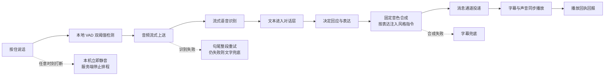

# 实时语音：从开口到回应的真实链路

> **文档性质**：工程资料——实时语音链路、消息通道、降级行为与延迟测量口径  
> **所属**：球球全套资料，卷 8「附录」第 F 篇

在这篇附录里，我们如实描述球球的语音是怎么工作的：用户开口说一句话之后，系统里依次发生了什么；哪些环节可能失败，失败之后用户看到什么；以及我们如何测量延迟。我们只写今天已经实现的行为，不把设想写成事实；少数停留在设计阶段的旧想法，集中放在文末的"概念设计备注"里，并明确标出它们没有进入实现。

## 1. 一句话是怎么变成一句回应的

**按住说话与本地检测。** 用户按住说话键开始一轮语音。客户端在录音的同时做本地的语音活动检测（VAD），用两道能量阈值区分"开始说话"与"还在说话"：开口的门槛更高，避免把呼吸、环境杂音当成语音；确认开口后门槛降低，避免把句中自然停顿误切成两句话。检测在用户设备上完成，开始说话之前不上传音频。

**流式识别。** 确认开口后，音频以小块流式发往后端。每个语音片段（utterance）是一条独立的识别会话：开始、追加音频块、结束、取消各是一个显式动作，音频块带序号，乱序或超出长度上限的块会被拒绝。一条连接最多同时持有 8 条识别会话，防止异常客户端占满资源。识别按流返回中间结果与最终结果：中间结果即时回传，用户能在说话过程中看到临时字幕；最终结果带修订号交给对话层，晚到的旧结果不会覆盖新结果。

**文本进入对话。** 识别出的文本进入与打字输入完全相同的对话管线：理解意图、核对比赛事实状态、决定沟通动作，产出回应文本和表达计划——这一轮用什么表情、什么动作、什么样的说话风格。

**合成与播放。** 回应文本交给语音合成（TTS），使用固定音色；合成时按本轮表达计划注入风格指令，比如进球时刻的语气和安静陈述不同。合成完成后，文字、表情、动作、声音一起通过消息通道投递到客户端，字幕与声音同步呈现。客户端播完后回传播放回执，服务端据此更新投递状态——同一条回应不会被重复投递，静音跳过也会有记录。

**打断即停。** 用户在任何时刻点击打断：客户端立即停止本机播放和录音，服务端停止这一轮的后续排程。迟到的音频不会在打断之后继续播出。

## 2. 消息通道

语音链路跑在一条 WebSocket 连接上，消息按类型区分。下行（服务端到客户端）主要有：

- `welcome`：连接建立后的确认；
- `pong`：对心跳 `ping` 的应答；
- `transcript_partial` / `transcript_final` / `transcript_error`：识别的中间结果、最终结果与错误，均携带片段标识，结果带修订号；
- 回应消息：回应文本加上表达计划（表情、动作、声音风格）和投递键 `deliveryKey`——服务端用它做去重与幂等，重连或重试时同一条回应不会发两遍；
- 赛事事件与演示消息：`event` 与 `presentation` 同样携带 `deliveryKey`；
- `voice_status`：语音链路的状态通报，识别失败时给出 `failed` 或 `text_fallback`；
- `talkativeness_ack`：对用户改话痨程度的确认回执。

上行（客户端到服务端）主要有：

- `ping`：心跳；
- `identify`：连接身份确认；
- `set_talkativeness`：修改话痨程度（安静 / 刚好 / 热闹三档），服务端即时持久化并回 `talkativeness_ack`，改档立即生效，不依赖下一条语音顺带生效；
- `asr_start` / `asr_chunk` / `asr_finish` / `asr_cancel`：流式识别的生命周期，`asr_cancel` 用于用户中途放弃；
- `user_speech`：一次完整的用户发言，可带文本、整段音频或两者，整段音频路径用于说完一次识别，也是断线重连后补发的载体；
- `interrupt`：打断，停止本机播放并通知服务端；
- `voice_playback`：播放回执（开始、完成、静音跳过等），服务端据此推进投递状态；
- `reply_displayed`：文字已展示的确认。

信封层面的约定刻意保持简单：没有统一的事件包装器，每类消息只携带自己需要的字段；协议里不出现原始音频之外的敏感内容，调试信息以去标识化的状态类别传递。

## 3. 失败链与降级矩阵

语音不是唯一通道。任何一环失败，用户都能在文字里完成同一件事。这是我们处理失败的底线，也是下面这张降级矩阵的由来。

| 情况 | 系统自动做什么 | 用户看到什么 |
| --- | --- | --- |
| 未授权麦克风 | 不开始录音，不反复弹窗 | 完整文字路径保留，说明如何继续 |
| 流式识别中断 | 句尾自动用整段音频重试识别 | 提示"转写中断，句尾会自动重试" |
| 识别最终失败 | 回合切换为文字路径（`text_fallback`），不再猜测用户说了什么 | 文字照常进入对话，可重试或直接打字 |
| 语音合成失败 | 字幕兜底（`tts_fallback`），回应文字照常展示 | 看得到回应，听不到声音；不把故障演成情绪事件 |
| 用户静音 | 播放回执记为跳过，声音与语音驱动动作停止 | 字幕与文字照常，不用更强的动画补偿 |
| 用户打断 | 本机立即静音，服务端停止排程 | 立刻安静，没有迟到内容 |
| 网络中断 | 客户端把断线期间的语音排队（至多 4 条），重连后整段补发 | 重连后对话延续，不重复、不丢失 |
| 本场结束 | 拒绝一切迟到内容，不再接受旧回合输出 | 结束状态保持，没有告别挽留 |

其中"重连补发"值得展开一句：断线时用户可能正在说话。客户端会把断线期间的语音片段（含整段音频与回合标识）排入队列，至多保留 4 条；重连成功后按顺序补发。排队是有限度的——超过容量的最早片段会被丢弃，我们选择诚实丢弃而不是无限积压。

## 4. 延迟：我们怎么测，而不是许诺

我们没有对外公布过一个"平均延迟"数字，因为我们认为单一平均数会掩盖最重要的体验差异：打断是否立即生效、文字是否先于声音出现、失败时是否有完整替代路径。我们做的是把等待拆开测量。

**测量工具。** 仓库里有一个专门的延迟测试工具，用脚本化的比赛事件（进球、黄牌、半场、射门、开场）驱动完整链路，每次分别记录语言生成耗时、语音合成耗时和端到端总耗时，汇总报告中位数与 95 分位（P95）。

**工程闸门。** 端到端延迟的 95 分位低于 3 秒是当前发布闸门；每次影响语音链路的改动，都用同一工具在同一口径下复测。

**如实说明。** 我们没有可类比的公开分位数基线——不同产品的链路构成、网络条件和统计口径差异很大，直接对比没有意义。因此本文给出的预算是设计目标，不是经第三方验证的性能承诺；具体数值来自我们自己的工具在自己的网络与设备条件下测得的结果。

**除了速度还看什么。** 单次测量之外，我们同样关注：打断后到本机静音的间隔、文字兜底出现的成功率、重连补发的完成情况。一次"快但停不下来"的语音，比一次"稍慢但可控"的语音更失败。

## 5. 声音留下来吗

默认不留。原始音频只存在于完成当前识别所需的短时缓冲中；识别文本只用于当前这轮交互；用户打断、结束或处理失败后，缓冲被清理。没有用户的明确选择，语音和转写不会进入长期记忆、偏好档案或任何跨场资料。这一点与整册资料的数据边界承诺一致。

## 6. 概念设计备注

早期设计稿里出现过一套更"重"的协议设想：统一的事件信封、显式的取消令牌（cancel token）、`V` 前缀的状态码体系、`voice.turn.*` 事件族。这些想法服务于同一批目标——让取消穿透所有环节、让错误可分类、让输出可回执——但它们没有进入实现。

实现选择了更直接的机制达成同样的目标：打断在客户端本地立即生效，识别会话用显式的取消动作终止，识别结果用终态事件收尾，投递用 `deliveryKey` 去重，播放用回执确认。保留这段备注，是为了说明设计演进的方向：协议从"描述理想控制流"收敛为"实现可验证的最小机制"。

## 7. 演练方法

在每次影响语音链路的发布前，我们至少核对以下场景：

1. **拒绝麦克风权限**：文字路径三步内可用，界面不反复打扰；
2. **识别失败**：句尾整段重试触发，仍失败则文字兜底，系统不猜测用户说了什么；
3. **字幕兜底**：合成不可用时回应文字完整展示，故障不被写成情感事件；
4. **打断**：本机立即安静，服务端在途排程停止，无迟到播放；
5. **重连补发**：断网期间连续说话，重连后至多 4 条排队语音按序补发，不重复、不越积越多；
6. **防剧透**：严格保护下，关键赛事信息不经字幕、音色或动作泄露；
7. **本场结束**：结束后网络恢复，旧回合内容不重放、不写入。

演练结果按场景记录通过与否；任何一条失败链存在旁路，对应改动不进入发布。

## 8. 公开资料

- [MDN: MediaDevices](https://developer.mozilla.org/en-US/Web/API/MediaDevices)：麦克风采集与权限模型。
- [MDN: Web Audio API](https://developer.mozilla.org/en-US/Web/API/Web_Audio_API)：音频处理与播放。
- [W3C WCAG 2.2](https://www.w3.org/TR/WCAG22/)：无障碍要求，语音之外的等效路径是其核心关切之一。
- [IETF RFC 6455](https://www.rfc-editor.org/rfc/rfc6455)：WebSocket 协议语义。

---

版本 2.0（2026-09-20）
