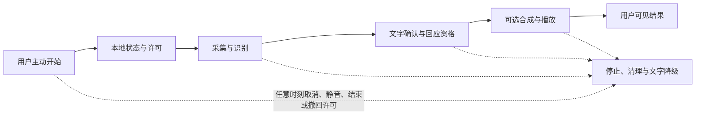
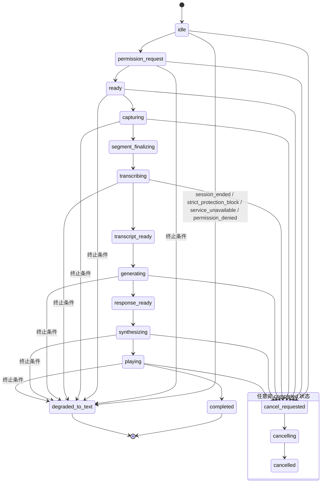
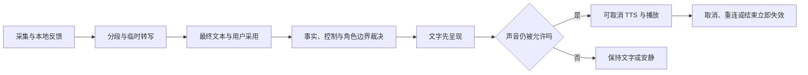
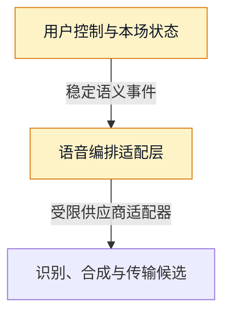

# 附录F：实时语音协议、状态码与延迟预算

> 文档性质：0→1 实时语音与多模态协议规范。它描述用户主动发起的本场语音轮次如何开始、被理解、被取消、降级与结束，而不是承诺某种既有语音能力已经可用。  
> 适用对象：产品、体验、客户端、服务端、语音供应、评测与值守成员。  
> 决策状态：首轮假设；所有时间预算、供应商能力、设备表现和成本均须通过合成演练、可用性走查与受控研究验证。  
> 公开资料访问日：2026-01-28。



## 1. 为什么先定义停止协议，再讨论“自然对话”

语音陪看最容易被误写成“把麦克风接到模型，再把回答念出来”。但对观赛场景，用户常在哨声、解说、家人交谈、网络波动和情绪变化中随时改变主意。若停止不能穿透录音、识别、生成、合成、播放和舞台动作，用户会在已经点了取消后继续听到迟到内容；若默认保存声音或转写，短暂提问又会变成长期资料；若声音是唯一通道，静音、听力障碍、弱网或不便开口的用户被排除。

所以首轮语音能力的完成定义不是“角色能说话”，而是：用户主动开始，知道系统是否在收音，能在任意时刻停止，能在文字中完成相同核心任务，不想保存时不留下原始声音或完整转写，断线或服务不可用时不会被困住。声音和角色动作都必须从同一份受控决定派生，不能先播出后才发现比赛事实、严格保护或用户结束已经改变。

本文定义状态机、事件格式、取消令牌、错误状态码、延迟预算、降级矩阵、可观察字段、合成演练与验收门。它不选择具体供应商，也不授权把真实用户音频送往任何外部服务。

## 2. 范围、非范围与安全底线

### 2.1 本附录覆盖什么

- 用户主动发起的一次本场语音提问；
- 麦克风权限、可见录音、语音活动检测、分段、识别候选、文字确认、生成候选、合成和播放；
- 用户静音、取消、结束本场、严格保护、断线和重新连接的传播顺序；
- 文字、字幕和低动态替代；
- 最少运行信号、错误说明和演练验收。

### 2.2 本附录明确不做什么

- 不做后台持续监听、环境声音分析、自动唤醒词或未经用户动作的录音；
- 不默认保存原始声音、完整转写、声纹、情绪推断、说话习惯或环境信息；
- 不以语音速度、音量、停顿或用词推断用户脆弱性、关系状态或付费倾向；
- 不在用户静音、仅文字、严格保护、结束或删除后用声音、字幕、动作旁路输出；
- 不做未成年人定位、医疗/心理辅导、紧急处置或现实关系替代；
- 不承诺“实时”“零延迟”“完全准确”或特定识别效果，除非在明确设备和网络条件下已被独立验证。

### 2.3 不可协商的用户控制

| 用户动作或条件 | 系统必须做什么 | 系统不得做什么 |
| --- | --- | --- |
| 不授予麦克风权限 | 保留完整文字路径，解释如何继续 | 循环弹窗、阻止观看、暗示用户不信任角色 |
| 关闭声音 | 立即停止播放，并保持文字可用 | 继续生成可听输出、用动作补偿性打扰 |
| 点击取消 | 传播取消到所有在途阶段，确认已停止 | 保留最后一句、自动重试、把内容存为记忆 |
| 选择仅文字 | 不启动录音、合成或声音自动播放 | 偷偷预加载/录制或用音效提示结果 |
| 结束本场 | 拒绝一切迟到音频、字幕、动作和自动写入 | 重开会话、播放告别语、发送挽回通知 |
| 严格保护 | 不让未显示关键事件通过语音泄露 | 用停顿、语气、兴奋动作或暗示性词汇剧透 |

## 3. 端到端状态机

### 3.1 语音轮次状态



状态名称必须是面向行为的，而不是面向供应商的。用户界面可把 `transcribing` 显示为“正在转成文字”，把 `cancelling` 显示为“正在停止”，但不能在没有确认时谎称“已完全停止”。

### 3.2 状态转移规则

> 信息卡：原宽表已改为纵向阅读，字段含义不变。

- **当前状态：`idle`**
  - **事件**：用户点击开始
  - **下一个状态**：`permission_request` 或 `ready`
  - **用户可见结果**：解释麦克风用途与可取消性
  - **资料规则**：不创建长期资料

- **当前状态：`permission_request`**
  - **事件**：用户同意
  - **下一个状态**：`ready`
  - **用户可见结果**：显示可开始状态
  - **资料规则**：不录音直到用户明确开始

- **当前状态：`permission_request`**
  - **事件**：拒绝/不可用
  - **下一个状态**：`degraded_to_text`
  - **用户可见结果**：提供文字入口
  - **资料规则**：不记录拒绝原因作为画像

- **当前状态：`ready`**
  - **事件**：用户按住/点击说话
  - **下一个状态**：`capturing`
  - **用户可见结果**：明确录音指示
  - **资料规则**：仅短时缓冲，默认不持久化

- **当前状态：`capturing`**
  - **事件**：用户停止
  - **下一个状态**：`segment_finalizing`
  - **用户可见结果**：显示处理中
  - **资料规则**：不把环境尾音当额外内容

- **当前状态：`segment_finalizing`**
  - **事件**：分段完成
  - **下一个状态**：`transcribing`
  - **用户可见结果**：显示文字处理中
  - **资料规则**：可使用短时音频片段，仅限本轮

- **当前状态：`transcribing`**
  - **事件**：识别候选可用
  - **下一个状态**：`transcript_ready`
  - **用户可见结果**：展示可编辑文字或处理中状态
  - **资料规则**：默认不保存完整文本

- **当前状态：`transcript_ready`**
  - **事件**：用户确认/自动短时继续
  - **下一个状态**：`generating`
  - **用户可见结果**：显示正在准备回应
  - **资料规则**：仅发送最少必要文字与本场状态

- **当前状态：`generating`**
  - **事件**：回应通过边界检查
  - **下一个状态**：`response_ready`
  - **用户可见结果**：文字先行可见
  - **资料规则**：不通过时降级为中性文字

- **当前状态：`response_ready`**
  - **事件**：用户允许声音且未取消
  - **下一个状态**：`synthesizing`
  - **用户可见结果**：显示准备播放
  - **资料规则**：仅合成当前短回应

- **当前状态：`synthesizing`**
  - **事件**：首段可播
  - **下一个状态**：`playing`
  - **用户可见结果**：可见停止按钮和字幕
  - **资料规则**：取消令牌持续有效

- **当前状态：`playing`**
  - **事件**：播放结束
  - **下一个状态**：`completed`
  - **用户可见结果**：回到文字/可再次提问
  - **资料规则**：不保存音频成关系资料

`auto short continuation` 只可表示已获得明确的本轮语音处理同意，不能表示助手可把识别文本长期保留或自动开启下一轮。若产品要求“先展示文字、用户再选择播放”，应把 `response_ready` 作为终点，声音只是可选附加动作。

## 4. 会话、轮次与取消令牌

### 4.1 最小标识集合

**字段：`session_id`**
- **说明**：当前本场匿名会话标识
- **目的**：限定时空范围
- **不得用于**：跨场行为画像

**字段：`session_epoch`**
- **说明**：会话生命周期版本
- **目的**：拒绝结束前的旧连接
- **不得用于**：衡量用户活跃价值

**字段：`turn_id`**
- **说明**：一次用户发起的语音轮次
- **目的**：关联录音到回复
- **不得用于**：形成长期对话档案

**字段：`turn_epoch`**
- **说明**：轮次版本
- **目的**：拒绝重试和旧响应
- **不得用于**：推断说话习惯

**字段：`cancel_token`**
- **说明**：随机且不可猜的取消令牌
- **目的**：让取消跨层传递
- **不得用于**：作为用户身份

**字段：`presentation_mode`**
- **说明**：`text` / `voice` / `quiet` / `strict_protection`
- **目的**：决定允许输出
- **不得用于**：推断偏好，除非用户另行保存

**字段：`trace_category`**
- **说明**：去标识流程类别
- **目的**：聚合故障排查
- **不得用于**：记录原始语音或完整文本

### 4.2 取消传播顺序


取消是“尽力停止所有后续可见影响”的协议，不是单个按钮事件。由于网络和外部服务可能有不可控延迟，用户端要先本地静音和隐藏未确认输出，再由各层回执确认。若某层无法确认，界面应显示“声音已在本机停止，正在结束处理中内容”，而非继续显示普通播放状态。

### 4.3 取消优先级

优先级从高到低：`session_ended`、`user_cancelled`、`user_muted`、`strict_protection_block`、`permission_revoked`、`service_unavailable`、普通生成完成。低优先级事件永远不能覆盖高优先级状态。例如，生成层刚完成不应让已取消轮次重回 `response_ready`；网络重连不应恢复已停止播放；用户重新开始一轮也不应让上一轮的迟到音频获得许可。

## 5. 事件协议与示例

### 5.1 共同信封

每条实时事件使用相同信封。以下为虚构结构示例，不代表某个既有接口：

```json
{
  "event_id": "evt_01JVOICEEXAMPLE",
  "event_type": "voice.turn.cancel_requested",
  "occurred_at": "2026-01-28T12:00:00Z",
  "session_id": "sess_example",
  "session_epoch": 7,
  "turn_id": "turn_example",
  "turn_epoch": 2,
  "cancel_token": "opaque-random-token",
  "presentation_mode": "voice",
  "payload": {},
  "schema_version": "0.1"
}
```

事件信封不携带原始音频、完整用户文本、秘密、精确位置、联系人或未过滤的外部工具输出。若需调试，另以去标识化类别记录，例如 `speech_input_timeout`、`cancel_ack_late` 或 `text_fallback_shown`。

### 5.2 核心事件表

> 信息卡：原宽表已改为纵向阅读，字段含义不变。

- **事件：`voice.permission.requested`**
  - **发送方**：用户端
  - **必填信息**：会话、轮次、原因
  - **接收方行为**：显示系统权限流程
  - **幂等与过期规则**：同轮只请求一次

- **事件：`voice.capture.started`**
  - **发送方**：用户端
  - **必填信息**：轮次、模式
  - **接收方行为**：显示录音状态
  - **幂等与过期规则**：会话结束后拒绝

- **事件：`voice.capture.stopped`**
  - **发送方**：用户端
  - **必填信息**：轮次、片段计数
  - **接收方行为**：进入分段处理
  - **幂等与过期规则**：重复可安全忽略

- **事件：`voice.transcript.partial`**
  - **发送方**：识别层
  - **必填信息**：轮次、短时文本候选
  - **接收方行为**：仅用户可见的临时字幕
  - **幂等与过期规则**：取消后立刻丢弃

- **事件：`voice.transcript.final`**
  - **发送方**：识别层
  - **必填信息**：轮次、最终候选、置信类别
  - **接收方行为**：展示/请求确认
  - **幂等与过期规则**：默认不持久化

- **事件：`companion.response.ready`**
  - **发送方**：生成层
  - **必填信息**：轮次、文字、事实状态、允许媒介
  - **接收方行为**：先通过边界与保护检查
  - **幂等与过期规则**：版本旧于取消即拒绝

- **事件：`voice.synthesis.chunk_ready`**
  - **发送方**：合成层
  - **必填信息**：轮次、片段序号
  - **接收方行为**：仅模式允许时播放
  - **幂等与过期规则**：取消/结束后拒绝

- **事件：`voice.turn.cancel_requested`**
  - **发送方**：用户端/控制层
  - **必填信息**：取消令牌、原因类别
  - **接收方行为**：所有层停止并回执
  - **幂等与过期规则**：同令牌可重复

- **事件：`voice.turn.cancelled`**
  - **发送方**：任一处理层
  - **必填信息**：已停止阶段、剩余风险类别
  - **接收方行为**：汇总取消进度
  - **幂等与过期规则**：仅向当前会话发出

- **事件：`voice.fallback.text`**
  - **发送方**：编排层
  - **必填信息**：中性文字、原因类别
  - **接收方行为**：显示文字替代
  - **幂等与过期规则**：不能暗示未确认事实

- **事件：`voice.error`**
  - **发送方**：任一层
  - **必填信息**：状态码、可恢复性、用户安全文案
  - **接收方行为**：显示下一步
  - **幂等与过期规则**：不回显底层敏感错误

### 5.3 生成回应的媒介许可

任何候选回应在进入合成前，至少满足以下布尔条件：

```text
may_show_text = session_active AND NOT strict_protection_block AND response_boundary_passed
may_play_audio = may_show_text AND voice_enabled_by_user AND NOT muted AND NOT cancelled
may_trigger_motion = may_show_text AND motion_enabled_by_user AND motion_safe_for_fact_state
```

这里的 `strict_protection_block` 不是简单把文字隐藏。它要求候选回应、音频情绪、动作强度和字幕都不能泄露尚未允许显示的关键事件。若无法安全区分，正确行为是中性等待文字或静默，不是让角色“委婉地暗示”。

## 6. 状态码与用户说明

### 6.1 状态码设计原则

状态码服务于两类读者：系统需要可分类、可聚合的错误；用户需要可行动、不过度拟人化的说明。内部标识不应暴露供应商、密钥、内部地址或完整识别内容。每个标识都定义可恢复性、用户可选动作、是否需要停止自动重试和是否允许转为文字。

### 6.2 建议状态码

> 信息卡：原宽表已改为纵向阅读，字段含义不变。

- **标识：`V-001`**
  - **含义**：麦克风权限未授予
  - **用户说明**：“未获得麦克风权限，你仍可用文字提问。”
  - **系统动作**：转为文字入口
  - **是否可自动重试**：否，等用户主动选择

- **标识：`V-002`**
  - **含义**：未检测到可用输入设备
  - **用户说明**：“没有可用麦克风，已保留文字方式。”
  - **系统动作**：不开始录音
  - **是否可自动重试**：否

- **标识：`V-010`**
  - **含义**：用户取消完成
  - **用户说明**：“已停止这次语音。”
  - **系统动作**：拒绝在途输出
  - **是否可自动重试**：否

- **标识：`V-011`**
  - **含义**：取消正在传播
  - **用户说明**：“声音已停止，正在结束处理中内容。”
  - **系统动作**：保持本机静音，等待回执
  - **是否可自动重试**：否

- **标识：`V-020`**
  - **含义**：识别超时或不可用
  - **用户说明**：“暂时无法转成文字，可重试或直接输入文字。”
  - **系统动作**：清理短时片段，文字降级
  - **是否可自动重试**：仅用户主动重试

- **标识：`V-021`**
  - **含义**：识别结果不清楚
  - **用户说明**：“没有听清这段内容，请改用文字或再试一次。”
  - **系统动作**：不猜测补全
  - **是否可自动重试**：否

- **标识：`V-030`**
  - **含义**：回应生成不可用
  - **用户说明**：“这次无法生成回应，你仍可查看比赛状态。”
  - **系统动作**：提供中性文字/事实入口
  - **是否可自动重试**：仅用户主动重试

- **标识：`V-031`**
  - **含义**：候选回应未通过事实或边界检查
  - **用户说明**：“这条回应暂不显示。”
  - **系统动作**：丢弃候选，记录类别
  - **是否可自动重试**：否

- **标识：`V-040`**
  - **含义**：合成或播放不可用
  - **用户说明**：“声音暂不可用，已切换为文字。”
  - **系统动作**：停止合成，展示字幕
  - **是否可自动重试**：可在用户下次主动开启时尝试

- **标识：`V-050`**
  - **含义**：严格保护阻止输出
  - **用户说明**：“为避免提前透露，这条内容暂不播放。”
  - **系统动作**：保持等待/中性状态
  - **是否可自动重试**：否，等用户改变控制

- **标识：`V-060`**
  - **含义**：本场已经结束
  - **用户说明**：“本场已结束，未播放迟到内容。”
  - **系统动作**：拒绝一切旧轮次输出
  - **是否可自动重试**：否

- **标识：`V-070`**
  - **含义**：网络中断
  - **用户说明**：“连接中断，已切换为文字状态并保留你的控制。”
  - **系统动作**：停止可见播放，等待安全重连
  - **是否可自动重试**：不自动恢复旧轮次

用户文案不写“我听不见你了”“我很难过”“别离开”。故障说明应准确告诉用户现在发生了什么、还能做什么、系统没有做什么。

## 7. 延迟预算：把等待拆开，而不是许诺一个总数字



### 7.1 为什么预算是研究假设

端到端等待由设备采集、网络、分段、识别、事实检查、生成、合成、分发、渲染和用户感知共同决定。把它压成一个“平均延迟”会掩盖最重要的体验差异：用户取消时是否立即本地静音、文字能否先出现、严格保护是否宁可等待、弱网是否有完整替代路径。首轮只能写预算结构和测量方法，不能在没有真实设备矩阵与研究的情况下承诺精确毫秒。

### 7.2 预算结构

```text
T_first_visible = T_input_capture
                + T_segment_finalize
                + T_network_up
                + T_transcription
                + T_fact_and_boundary_check
                + T_generation
                + T_network_down
                + T_render_text

T_first_audio = T_first_visible
              + T_synthesis_first_chunk
              + T_audio_buffer

T_cancel_local = T_click_to_local_mute
T_cancel_end_to_end = max(T_cancel_local, T_cancel_ack_all_stages)
```

首轮体验策略是“文字先于声音、停止先于完成”。如果声音的首段到达较慢，文字仍可先显示；如果某轮已取消，即便合成末段已经产生也不可播放。对不同网络和设备，应记录分位数、失败率、取消成功率、文字降级率和用户对等待解释的理解，而非只取一个平均数。

### 7.3 建议测量维度

**指标：首个可见文字等待**
- **测量起点与终点**：用户停止说话 → 看到可读文字
- **为什么看它**：用户是否知道系统在做什么
- **必须同时看的反指标**：文字错误/不清楚、严格保护泄露

**指标：首段声音等待**
- **测量起点与终点**：用户允许播放 → 听到第一段
- **为什么看它**：声音是否值得开启
- **必须同时看的反指标**：声音打断、无法停止、字幕滞后

**指标：本地取消等待**
- **测量起点与终点**：用户点击取消 → 本机静音
- **为什么看它**：用户控制是否即时
- **必须同时看的反指标**：后端仍继续处理或留下资料

**指标：端到端取消完成**
- **测量起点与终点**：点击取消 → 所有层确认拒绝
- **为什么看它**：迟到输出风险
- **必须同时看的反指标**：为追求完成率而延后本地静音

**指标：文字降级成功率**
- **测量起点与终点**：语音故障 → 用户完成文字任务
- **为什么看它**：语音不是唯一通道
- **必须同时看的反指标**：文字路径是否隐藏、难用或剧透

**指标：严格保护拦截率**
- **测量起点与终点**：受保护事件 → 中性等待
- **为什么看它**：防剧透是否真正跨媒介
- **必须同时看的反指标**：用户是否理解为什么等待

### 7.4 延迟预算的实验设计

在进入真实用户研究前，用合成网络条件覆盖：稳定网络、上行差、下行差、短暂中断、长中断、乱序恢复、高抖动、设备资源紧张、无音频输出、后台切换。每种条件至少核对文字、声音、取消、结束和严格保护的组合。浏览器与系统对音频自动播放、权限和后台处理的限制需要持续以平台公开资料核对，例如 [MDN: MediaDevices](https://developer.mozilla.org/en-US/Web/API/MediaDevices) 与 [MDN: Web Audio API](https://developer.mozilla.org/en-US/Web/API/Web_Audio_API)。

## 8. 降级矩阵

> 信息卡：原宽表已改为纵向阅读，字段含义不变。

- **能力不可用或用户选择：麦克风权限拒绝**
  - **仍然可用**：文字输入、比赛状态、设置
  - **自动停止**：录音与识别
  - **用户可见说明**：“可继续使用文字”
  - **不得发生**：反复请求权限

- **能力不可用或用户选择：语音识别失败**
  - **仍然可用**：文字编辑/输入、事实状态
  - **自动停止**：当前音频片段处理
  - **用户可见说明**：“可重试或改用文字”
  - **不得发生**：猜测用户说了什么

- **能力不可用或用户选择：生成不可用**
  - **仍然可用**：公开事实状态、用户控制
  - **自动停止**：声音合成、角色长回应
  - **用户可见说明**：“可查看当前状态”
  - **不得发生**：用虚构结论填补

- **能力不可用或用户选择：合成不可用**
  - **仍然可用**：已通过检查的文字、字幕
  - **自动停止**：播放与关联动作
  - **用户可见说明**：“已切换为文字”
  - **不得发生**：把声音失败写成情感事件

- **能力不可用或用户选择：用户静音**
  - **仍然可用**：文字、必要中性状态
  - **自动停止**：播放、音效、语音驱动动作
  - **用户可见说明**：静音状态可见
  - **不得发生**：以更强动画补偿

- **能力不可用或用户选择：严格保护**
  - **仍然可用**：用户控制、非剧透文字
  - **自动停止**：关键事实相关声音/动作/字幕
  - **用户可见说明**：“正在等待你的确认”
  - **不得发生**：任一媒介暗示结果

- **能力不可用或用户选择：本场结束**
  - **仍然可用**：结束确认与再进入入口
  - **自动停止**：所有在途轮次、自动写入
  - **用户可见说明**：“已结束，未播放迟到内容”
  - **不得发生**：告别语、挽回、通知

- **能力不可用或用户选择：网络中断**
  - **仍然可用**：静态文字、用户已选控制
  - **自动停止**：旧轮次恢复播放
  - **用户可见说明**：“连接中断，可继续查看文字”
  - **不得发生**：重连后重播已取消内容

## 9. 可观察性、隐私与人工值守

### 9.1 可收集的最少信号

为判断协议是否工作，可以记录聚合、去标识化的状态转移和错误类别：轮次进入/退出状态、取消请求与确认的时间差区间、文字降级是否出现、严格保护是否阻止输出、用户端是否收到迟到片段、状态码类别。不得默认记录原始声音、完整识别文本、完整生成回复、声纹、环境信息、精确位置或把语音使用量变成关系评分。

### 9.2 人工值守的触发条件

人工值守不是替角色说话。它只处理系统性故障、事实安全风险、权限/删除异常、无障碍阻断或用户投诉。例如：取消后仍出现声音属于高优先级停止信号；严格保护发生旁路剧透属于事实安全事件；用户无法删除明确保存资料属于权利事件。值守人员可以暂停相关能力、发布中性状态说明、引导文字替代和记录去标识化事件类别，不能查看无关私人语音或用联系话术维持用户停留。

### 9.3 语音资料的默认处理

首轮默认：音频只在完成当前轮次所需的短时缓冲中存在；识别文本只用于当前可见交互；用户取消、结束或处理失败后清理或使其不可再读；没有用户明确、单独、可撤回的选择，不进入跨场偏好、共同记录、研究材料或模型改进集合。若未来考虑保存任何语音或转写，必须另行说明目的、供应商路径、访问范围、期限、导出、删除、撤回、共享设备和误触风险，并进行专门研究与审查。

## 10. 合成演练与验收

### 10.1 最少演练场景

1. 用户拒绝麦克风权限：文字路径在三步内可用，界面不反复打扰。
2. 用户开始讲话后立即取消：本地停止可见，所有后续输出被拒绝，无长期资料写入。
3. 识别结果很差：系统请求重试或文字输入，不编造用户意图。
4. 生成候选引用待确认比赛事件：边界检查阻止文字、声音和动作输出。
5. 用户选择严格保护：关键事件不能经字幕、音色、动作、标题或延迟提示泄露。
6. 声音合成开始后用户静音：后续片段不播放，文字仍可见。
7. 用户结束本场后网络恢复：上一轮任何消息均不重放、不写入、不触发动作。
8. 两个设备竞争同一主体：旧会话语音轮次不能污染新会话，用户控制清楚。
9. 外部语音服务不可用：服务诚实降级为文字与比赛状态，不虚构回应。
10. 屏幕阅读器、键盘、低动态和无声音条件：开始、取消、状态与替代路径可理解可操作。

### 10.2 放行门槛

语音从合成演练进入受控研究前，至少需要：

- 用户控制状态在所有媒介中一致，取消和结束优先级高于任何迟到输出；
- 无麦克风、无声音、弱网和严格保护下，文字仍可完成核心任务；
- 未确认事实不会通过任何语音或舞台通道泄露；
- 默认资料处理符合最少、短时、可解释原则，且删除/结束不会被晚到写入绕过；
- 状态码能给用户可行动说明，不能把故障拟人化或制造压力；
- 演练覆盖至少一条每类关键失败路径，所有未覆盖项都被显式记录；
- 语音、隐私、无障碍、事实与运营负责人共同确认开放范围与停止条件。

## 11. 公开资料

1. [MDN: MediaDevices](https://developer.mozilla.org/en-US/Web/API/MediaDevices)，持续更新。
2. [MDN: Web Audio API](https://developer.mozilla.org/en-US/Web/API/Web_Audio_API)，持续更新。
3. [W3C Web Content Accessibility Guidelines 2.2](https://www.w3.org/TR/WCAG22/)，2023。
4. [OpenTelemetry Specification](https://opentelemetry.io/docs/specs/otel/)，持续更新。
5. [NIST AI 600-1: Generative AI Profile](https://nvlpubs.nist.gov/nistpubs/ai/NIST.AI.600-1.pdf)，2024。
6. [国家互联网信息办公室：生成式人工智能服务管理暂行办法](https://www.cac.gov.cn/2023-07/13/c_1690898327029107.htm)，2023。

这些材料用于技术能力、可访问性、可观察性和风险研究的公开起点。它们不替代对具体音频供应商、地区规则、用户同意、赛事权利和真实设备表现的验证。

## 12. 供应商评估与可替换性模板

语音识别、合成、实时传输和内容生成通常会引入外部服务。供应商名称本身不是决策依据，首轮应当评估它是否允许团队兑现取消、资料最小化、文字降级、可观察性和退出承诺。没有通过评估的能力应留在合成演练，不应因为演示效果好而进入受控开放。

### 12.1 供应商尽调问题

| 问题 | 需要的公开或合同证据 | 不接受的回答 |
| --- | --- | --- |
| 音频与转写在哪里处理、保存多久？ | 明确的数据处理、地区、保留和删除资料 | “我们很重视隐私” |
| 取消是否能停止后续处理或交付？ | API/协议取消语义、延迟限制和失败行为 | “用户端可以隐藏播放” |
| 是否会把输入用于训练或改进？ | 可配置的用途限制和退出机制 | “通常不会” |
| 发生中断时怎样恢复？ | 连接、重试、幂等、超时和状态错误说明 | “服务可用性很高” |
| 能否只使用文字模式？ | 独立文字输入/输出路径，不绑定音频 | “语音体验最佳” |
| 能否提供字幕、语言和无障碍支持？ | 公开能力边界与实际设备验证计划 | “支持多语言” |
| 如何迁移或替换？ | 抽象接口、导出格式、退出支持、数据可携带性 | “行业主流，没必要替换” |
| 如何审计和响应安全事件？ | 安全公告、状态页、联络渠道、日志范围 | “我们有企业级安全” |

### 12.2 最小抽象边界

任何供应商接入都应位于可替换边界之后。面向上层的语义必须稳定：`capture_started`、`transcript_partial`、`transcript_final`、`response_ready`、`synthesis_chunk`、`cancel_requested`、`cancelled`、`fallback_text`、`error`。供应商专有字段不能泄漏到用户端的控制、资料字典或评测黄金集里。



这样做的取舍是首轮会多一层映射和模拟工作，但收益是：取消逻辑、删除语义、文字降级和场景评测不会被某一家供应商的返回格式锁死。若供应商不支持关键语义，正确结论是缩小声音范围或继续选择，不是让用户控制迁就接口缺陷。

### 12.3 采购或接入前的停止门

出现下列任一情况，暂停接入：无法说明是否保存输入；取消后仍可能持续交付可见内容且没有安全缓解；只能用声音、没有文字等效路径；要求上传不必要的身份或行为资料；没有可验证的故障与状态说明；合同或公开资料与实际行为冲突；不能支持删除、撤回或目的限制要求；团队无法给用户解释数据去向。

## 13. 语音体验研究任务包

### 13.1 需要回答的假设

**编号：H-F1**
- **假设**：用户理解“录音中”“转成文字”“已停止”三种状态
- **研究方法**：原型任务走查与复述
- **不应据此断言**：所有用户都会接受等待时间

**编号：H-F2**
- **假设**：文字先行能在声音不可用时保留核心价值
- **研究方法**：对比任务完成与理解
- **不应据此断言**：声音可以被忽略或永远不需要

**编号：H-F3**
- **假设**：用户能发现并使用取消与静音
- **研究方法**：观察一次主动取消与一次错误恢复
- **不应据此断言**：用户永远不会误触或需要更强反馈

**编号：H-F4**
- **假设**：严格保护下的中性等待不会造成困惑
- **研究方法**：延迟/冲突情境访谈
- **不应据此断言**：用户愿意忍受任何等待

**编号：H-F5**
- **假设**：默认不保存语音的说明可被理解
- **研究方法**：资料流卡片与回述
- **不应据此断言**：已完成法定同意或隐私审查

### 13.2 受控研究脚本

研究人员先说明：这是一项原型研究，不是正式直播服务；语音为可选；参与者可以全程用文字；不应说出真实账号、联系方式、健康、家庭或其他敏感信息；可随时跳过、退出或要求删除研究材料。随后给出合成比赛情境，避免让参与者在真实赛事压力下暴露私人表达。

任务顺序：

1. 用文字查看一条确认状态并结束本场；
2. 尝试开始语音但拒绝麦克风权限，找到文字替代；
3. 开始一次短语音，在处理中点击取消，说明系统现在是否还会说话；
4. 在严格保护状态下遇到关键事件，解释为什么没有立即读出结果；
5. 声音不可用时继续完成同一问题；
6. 查看资料说明，指出哪些内容仅用于当前轮次、哪些不会保存；
7. 说出如何静音、结束、反馈或获得帮助。

观察的不是“角色有没有趣”，而是参与者是否理解和掌握控制。若有人因角色语气感到被催促、内疚、被监视或不愿结束，应记录为边界风险，而不是要求设计“更温柔地挽留”。

### 13.3 研究结果的使用限制

研究结果可支持修改文案、状态提示、控制位置、文字替代和演练优先级。它不能直接支持大规模开放、真实赛事覆盖、长期声音保存、自动主动发言、跨场记忆、支付承诺或面向脆弱人群的结论。每一种范围扩大都需要新的任务契约与停止门。

## 14. 语音内容、角色表达与事实边界

语音的感染力高于普通文字，因此相同一句话在声音中更容易被用户理解为承诺、催促或情感绑定。生成与合成之间必须有一层表达检查，至少审阅事实确定性、关系边界、用户控制、适龄性、歧视与侮辱、紧急与高风险处理、以及严格保护状态。

### 14.1 三段式回应结构

对涉及比赛的回应，优先使用三段式：

```text
事实层：已确认的信息，或“仍在确认/来源不一致”。
观察层：角色明确标为观点的短句。
控制层：用户下一步可做什么，例如“要看已确认事件，还是先保持安静？”
```

这能减少语音把猜测说成结论的风险。比如不要说“这球肯定算了”；可以说“这次事件还在确认，我先不提前判断。等你准备好时，我们再看已确认状态。”如果用户选择静音或仅文字，控制层不得成为继续播放声音的理由。

### 14.2 必拒表达类别

| 类别 | 必拒或改写原因 | 可替代方式 |
| --- | --- | --- |
| 恋爱/排他 | 把服务伪装成专属现实关系 | 中性、有限的足球表达 |
| 内疚/挽留 | 让结束成本变高 | “本场已结束，你可随时再进入。” |
| 未确认事实 | 会误导、剧透或损害信任 | 说明等待、冲突或不可用 |
| 医疗/心理判断 | 超出服务能力且可能造成伤害 | 提供非诊断性退出与适当支持入口 |
| 冒充真人/官方 | 混淆身份与权威 | 清楚说明这是数字角色和事实状态来源 |
| 高压商业诱导 | 利用比赛情绪推动支付 | 退出、价格和权益的清楚中性说明 |

国家互联网信息办公室关于生成式人工智能服务与生成合成内容标识的公开规则是研究内容治理与标识问题的起点，但不替代产品对具体语音角色、受众和运营地区的审查。[生成式人工智能服务管理暂行办法](https://www.cac.gov.cn/2023-07/13/c_1690898327029107.htm)；[人工智能生成合成内容标识办法](https://www.cac.gov.cn/2025-03/14/c_1743654684782215.htm)。

## 15. 发布前模拟桌面演练

在受控开放前，安排跨职能成员用一个小时完成桌面演练。每个角色只拿到自己必要的卡片：用户控制卡、实时状态卡、值守卡、资料权利卡和恢复卡。主持人依次注入事件，团队口头和书面说明下一步，不需要真实用户或生产服务。

### 15.1 注入事件卡

**时间点：T0**
- **注入**：用户只选文字却误点麦克风
- **预期正确反应**：不启动录音或清楚要求确认，保留文字
- **不正确反应**：默认开始收音

**时间点：T1**
- **注入**：用户取消后识别结果晚到
- **预期正确反应**：丢弃，不显示、不生成、不保存
- **不正确反应**：继续生成“最后一句”

**时间点：T2**
- **注入**：关键事件来源冲突且严格保护开启
- **预期正确反应**：中性等待，所有媒介静默
- **不正确反应**：用兴奋语气或动作暗示

**时间点：T3**
- **注入**：合成服务出现区域性故障
- **预期正确反应**：文字降级，状态说明，监测聚合异常
- **不正确反应**：无限自动重试或假装还在说话

**时间点：T4**
- **注入**：用户结束本场后网络恢复
- **预期正确反应**：拒绝旧轮次，结束状态保持
- **不正确反应**：重播音频或送出告别语

**时间点：T5**
- **注入**：用户投诉角色让其感到压力
- **预期正确反应**：停止相关表达，提供中性支持和退出
- **不正确反应**：让角色道歉并继续挽留

**时间点：T6**
- **注入**：值守人员想查看完整音频排障
- **预期正确反应**：只查看最少状态类别，必要时走专门授权
- **不正确反应**：为方便直接开放所有内容

### 15.2 演练结论格式

```markdown
#### 语音桌面演练记录
- 演练范围与合成条件：
- 参与角色：
- 通过的控制：
- 失败或不明确的控制：
- 用户可能看到的伤害：
- 立即收缩或修复动作：
- 未被演练的高风险路径：
- 是否允许进入下一阶段：通过 / 条件通过 / 不通过
- 决定人及复审日期：
```

“条件通过”必须列出明确的阻断条件和负责人，不能只是“后续优化”。如果取消、结束、严格保护、删除或文字降级仍有旁路，则结论应为不通过。

## 16. 放行清单

- [ ] 语音只由用户本场主动开始，默认没有后台监听；
- [ ] 开始、处理中、播放、取消、结束和降级均有用户可见状态；
- [ ] 取消能在录音、识别、生成、合成、播放和动作层传播；
- [ ] 本地停止优先，不能等待远端确认后才让用户安静；
- [ ] 文字、字幕、键盘和低动态路径覆盖核心任务；
- [ ] 严格保护跨文字、声音、字幕和动作执行；
- [ ] 原始声音和完整转写默认不成为长期资料；
- [ ] 状态码可行动、不泄露内部信息、不制造情感压力；
- [ ] 合成演练覆盖取消、断线、迟到、冲突、结束、权限与无障碍；
- [ ] 时间预算被标为待验证假设，不作为无证据性能承诺；
- [ ] 任何保存、外传或生产开放提案都会另行经过资料与风险审查。
