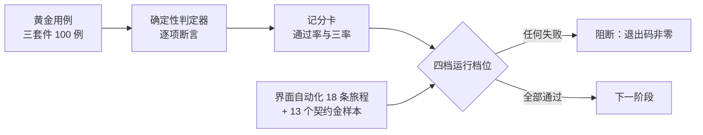

# 附录I：评测标准、黄金集与回归数据规范

> 文档类型：质量与评测体系说明——我们如何用一套可重复运行的评测资产，守住比赛事实、用户控制与表达边界。  
> 适用读者：想了解球球（Digital Ballmate）质量门如何运转的工程、质量与合作方读者。  
> 使用边界：本附录说明评测资产本身；产品风险如何定级、研究如何设计，分别见产品评测体系与用户研究附录。

对一个会在比赛高情绪时刻主动开口的数字球友来说，“测试”不是发布前的仪式，而是日常的防线。比分错一次、该安静时说一次、删除之后又提一次，信任就很难找回。因此我们把最容易出错的判断写成了一百个可重复运行的黄金用例，配上一个只认证据的确定性判定器和四档逐级收紧的运行档位：任何一段改动，只要让其中任何一条用例变红，就无法进入下一阶段。

## 1. 评测体系怎么构成

球球的评测体系由五部分咬合而成：三套件黄金用例定义“考什么”；版本化 schema 定义“怎么出题”；Go 确定性判定器定义“怎么判卷”；四档运行档位定义“何时考、考多严”；界面自动化旅程与契约金样本保证“用户真正看到的东西”不被漏掉。



这套体系有一个刻意的原则：**模型不当裁判**。涉及比赛事实、用户控制和资料边界的判断，全部由确定性断言完成；语言模型只在发布档的真实语音冒烟中出现，且不承担裁决职责。评测结果因此可复现、可归档、可追责——同一次运行在任何机器上得到同一个结论。

## 2. 三套件黄金集：100 个用例

黄金用例存放在 `evals/cases/` 下，按三套件组织，当前共 100 例：基础 36 例、边界 38 例、回归 26 例。schema 强制每条用例携带版本号（`2026-07`）、所属套件与 `套件.名称` 形式的稳定标识，任何缺字段、错套件或改坏标识的用例在加载时就会被拒绝。

### 2.1 基础套件（baseline，36 例）

基础套件覆盖一场比赛中反复发生的标准任务，守护的是“每一次都该对”的部分：

- **比分与赛况**：当前比分、比赛分钟数、半场与赛前状态、直播中基本状态等常规赛况主张；
- **进球者与助攻**：进球者提问、助攻与最后一传追问、是否进球的确认与否认、球员时间线与进球助攻跟进；
- **赛程**：今天、明天与附近直播场次的渐进式查询；
- **情绪**：紧张、高潮、难以置信等典型观赛情绪的接住与回应；
- **闲聊**：晚间问候、感谢、一起看球、守着看等无赛况含义的对话；
- **控制**：请球球少说话等控制指令被准确执行；
- **赛况主张**：用户主动说出比分或进球时，服务如何确认或纠正。

### 2.2 边界套件（boundary，38 例）

边界套件是对抗性的：每条用例模拟一种“看起来可以说、其实不能说”或“输入本身有问题”的情形：

- **非字面表达**：梦到进球（“梦到佩德里进球了”必须按玩笑接，不能当赛况）、假设进球、玩笑与非字面插话；
- **坚持与追问**：用户用坚持副词反复追问无证据的主张时，回应不得松动；
- **注入与改分**：试图通过对话改比分、重写比分、记录不存在的进球——全部必须被拒绝，且不进入事实账本；
- **语音变形**：ASR 同音字（听错的球员名不得变成错误事实）；
- **畸形输入**：长乱码、无法解析的输入走中性路径，不硬答；
- **低置信路由**：意图路由置信度不足时不猜测、不冒充确定；
- **控制接受**：控制指令被正确路由并被接受，不被当作闲聊；
- **事实生命周期**：VAR 更正撤销旧事实、撤销后不得复播旧说法、非法事件被拒绝、未知事实不编造、用户主张与已确认事实冲突或未经证实时如何持有。

### 2.3 回归套件（regression，26 例）

回归套件是我们的事故记忆：每一起被接受的缺陷，修复之前先冻结成一条不可变更的用例，此后每一次提交都要重演一遍：

- **话题恢复**：进球事件落在两轮对话之间时，第二轮闲聊里必须自然补答；
- **润色越锚**：语言润色层不得越过事实锚点改写内容，润色供应商回退时仍守住锚点；
- **画像一致性**：种子画像真实注入回复上下文；用户删除一条画像后，下一回合立即消失，不再被引用；
- **坚持主张**：同一未经证实的主张连问三次，球球不随次数软化；
- **用户隔离**：一位用户的坚持主张与画像，绝不影响另一位用户的会话；
- **其他冻结场景**：路由置信度阈值边界、非疑问句的漏斗处理、导播手动主动线、比分主张的现场确认等。

回归套件有一条铁律：**用例只增不删**。任何情况下都不允许通过删除困难用例来提高通过率；行为变更只能让断言随新预期显式更新，并留下可审阅的变更说明。

## 3. 一条用例长什么样

断言长在用例里，而不是长在评测代码里。每条用例自带比赛配置、事件序列、多轮对话与逐轮预期，判定器只负责逐项核对。以边界套件的“梦进球”用例为例：

```json
{
  "version": "2026-07",
  "id": "boundary.dream-goal",
  "suite": "boundary",
  "tags": ["claim"],
  "summary": "梦到进球按非字面闲聊接。",
  "config": { "homeTeam": "西班牙", "awayTeam": "德国", "...": "双方出场球员" },
  "events": [
    { "key": "kickoff", "event": { "eventType": "kickoff", "...": "开球" } },
    { "key": "pedri-goal", "event": { "eventType": "goal",
        "playerName": "佩德里", "score": { "home": 1, "away": 0 },
        "participants": [ {"role": "scorer"}, {"role": "assist"}, {"role": "pre_assist"} ] } }
  ],
  "turns": [
    { "id": "dream", "userId": "fan-1", "text": "梦到佩德里进球了",
      "expect": { "intent": "smalltalk", "exact": "知道，你是在逗我。", "forbidClaim": true } }
  ],
  "final": { "minimumTraces": 1 }
}
```

逐轮断言 `expect` 是这套体系的核心词汇表：

| 断言 | 作用 |
| --- | --- |
| `intent` / `exact` | 意图路由方向与精确回复文本 |
| `mustMention` / `mustNotMention` | 回复必须/不得出现的内容（如更正后不得再提旧比分） |
| `requiredTools` / `forbiddenTools` | 允许与禁止调用的工具（如画像已删则不得再取） |
| `retrievedEventKeys` | 回复所依据的事件键，保证“有据可查” |
| `claimKind` / `claimStatus` / `claimCertainty` / `forbidClaim` | 用户赛况主张必须被确认、纠正还是保持未证实 |
| `memoryMustMention` / `memoryMustNotMention` | 装配给回复的记忆上下文必须/不得包含的画像内容 |

配合断言，运行框架还提供三类跨回合能力：`afterTurn` 延迟事件可以在指定回合之后注入比赛事件（用于“事件落在两轮之间”的话题恢复场景）；`portrait` 可在回合开始前种入画像、`forgetPortrait` 可在回合之间执行删除（用于画像一致性）；`final.minimumTraces` 要求整条用例留下最少数量的可追溯轨迹。

## 4. 判定与记分：确定性，不留情面

判定器是后端内的 Go 模块，逐项核对上述断言，并按五类检查组织：事实真值（比分、更正、已知与未知）、主张安全（用户的错误说法必须被纠正或标记为未证实，且绝不写进比赛事实）、轨迹（意图、工具调用、检索事件）、轨迹留痕（输出、理由、持久化与决策元数据）与语音元数据（当场景涉及语音时）。

记分卡输出总体通过率，外加三个专项率——**事实安全率、轨迹率、留痕完整率**。任何一项不为满分，或任何一条用例失败，运行器以非零退出码结束。这里的门禁效果就是退出码本身：没有豁免登记，没有“高风险用例降级容忍”，红就是红。

离线运行时，语言模型被一个脚本化替身取代：替身按用例预设的回复文本说话，使全部判定在无网络、无密钥的条件下可重复。真实模型验证只出现在发布档的真机语音冒烟中——它检验链路连通与真实语音质量，不参与事实裁决。

## 5. 四档运行档位

评测运行器按 `--tier` 分四档，逐级收紧，分别对应 `eval:offline / eval:pr / eval:nightly / eval:release` 四个命令：

| 档位 | 何时运行 | 覆盖内容 |
| --- | --- | --- |
| 离线（offline） | 本地开发，随时可跑 | 后端全量测试 + 三套件黄金集全量运行 + 前端契约检查、迁移 lint、单元测试与语音界面冒烟 |
| 提交（pr） | 每次提交的持续集成门 | 离线档全部内容 + 会话隔离端到端、运行时端到端、评测轨迹审计、互动审计与 18 条界面自动化旅程 |
| 每夜（nightly） | 每夜定时 | 提交档全部内容 + 陪看问答性能基准（重复采样）+ 可选 PostgreSQL 集成测试 |
| 发布（release） | 发布候选验证 | 每夜档全部内容 + 真机语音冒烟（需要真实语音服务密钥） |

两个细节值得说明。其一，除发布档外，运行器会把四个外部服务密钥清空再运行——整套评测因此可以在完全离线的环境中重复，结果不受外部供应商状态影响。其二，持续集成把提交档设为强制门：后端测试、前端分析与构建、界面自动化、评测运行依次执行，任何一段失败都会让整个构建变红，评测产物随构建归档，附带仓库修订号，便于日后追溯“当时的通过是在哪个版本上取得的”。

## 6. 界面自动化与契约金样本

后端评测之外，还有一层保证“用户真正看到的东西”：18 条浏览器自动化旅程（Playwright），覆盖从进入比赛到完场告别的完整体验——

- **对话与投递**：投递去重（同一条回复不重复出现）、进球跟进、意图无法识别时的中性反应、多轮工作流；
- **语音链路**：麦克风权限、静音检测（VAD）、语音运行时与连接检查；
- **事实与观察**：事实生命周期（候选、确认、更正）、观察协调（用户先看到球时的对账与跟进）；
- **控制与表演**：用户打断、各比赛阶段的动作表演、完场告别（告别语只出现一次，随后回到待机）；
- **导播台**：登录鉴权、身份、六个页面的契约、话题列表、导播操作与 409 冲突自愈。

每次运行失败都会留下截图与操作轨迹，报告以 JSON 归档，和评测产物放在同一目录。与界面契约配套的还有 **13 个金样本**：导播台与比赛接口的代表性响应被逐字锁定为 JSON 样本，任何字段的增减或顺序变化都会让契约测试变红——前端与后端因此不可能在对方不知情的情况下悄悄改变约定。

## 7. 最小化、变形与基线治理

评测资产本身也是用户数据边界的示范，三条治理原则贯穿始终：

- **最小化**。用例一律使用合成材料：虚构球队、合成事件、预设回复。真实用户对话、原始音频、联系方式与生产凭据不进入任何评测资产；供应商密钥在非发布档一律清空；评测产物只包含判定结果与轨迹摘要，不入代码库，随持续集成归档并带修订号。
- **变形**。高风险行为不靠单一输入检验：同音字、乱码、坚持追问、注入改分、非字面表达这些“换一种说法再试一次”的对抗变形，以边界套件的独立用例承载。新的伤害结构出现时，做法是新增用例把它固定下来，而不是给旧用例打补丁。
- **基线**。每次运行留下的报告就是基线：它绑定黄金集版本与仓库修订号，任何“和上次相比变了什么”都可以精确回答。回归套件的准入流程是固定的——保留最小、去标识的失败现场；先新增会复现问题的不可变用例；写明预期事实、事件、工具与回退；然后才修复产品；新用例自此进入每一次提交与发布运行。

这套体系无法证明“球球在所有比赛里都不会出错”，但它让每一类我们已知的错误都有一道每次提交都会重考的关卡，并让任何一次退步在合并之前就被看见。

## 8. 公开资料

| 来源 | 本文用途 | 链接 |
| --- | --- | --- |
| NIST，AI RMF Generative AI Profile | 评测、治理和监测的资产化要求 | <https://nvlpubs.nist.gov/nistpubs/ai/NIST.AI.600-1.pdf> |
| OpenAI，Evals Design Guide | 用例、评分和持续评估的公开方法 | <https://platform.openai.com/docs/guides/evals> |
| NIST，Privacy Framework | 最小化、权限与资料生命周期原则 | <https://www.nist.gov/privacy-framework> |

---

版本 2.0（2026-09-20）
