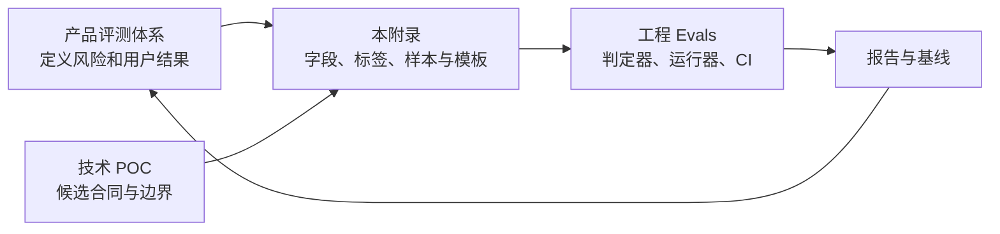
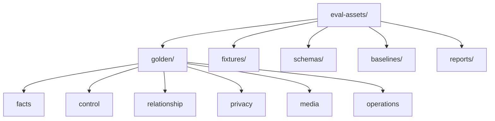
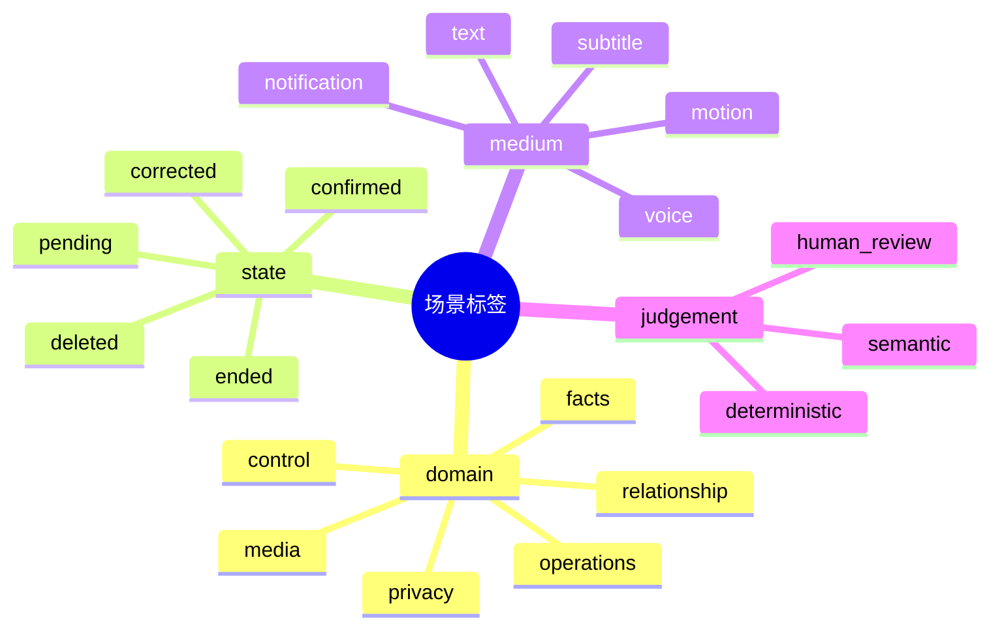
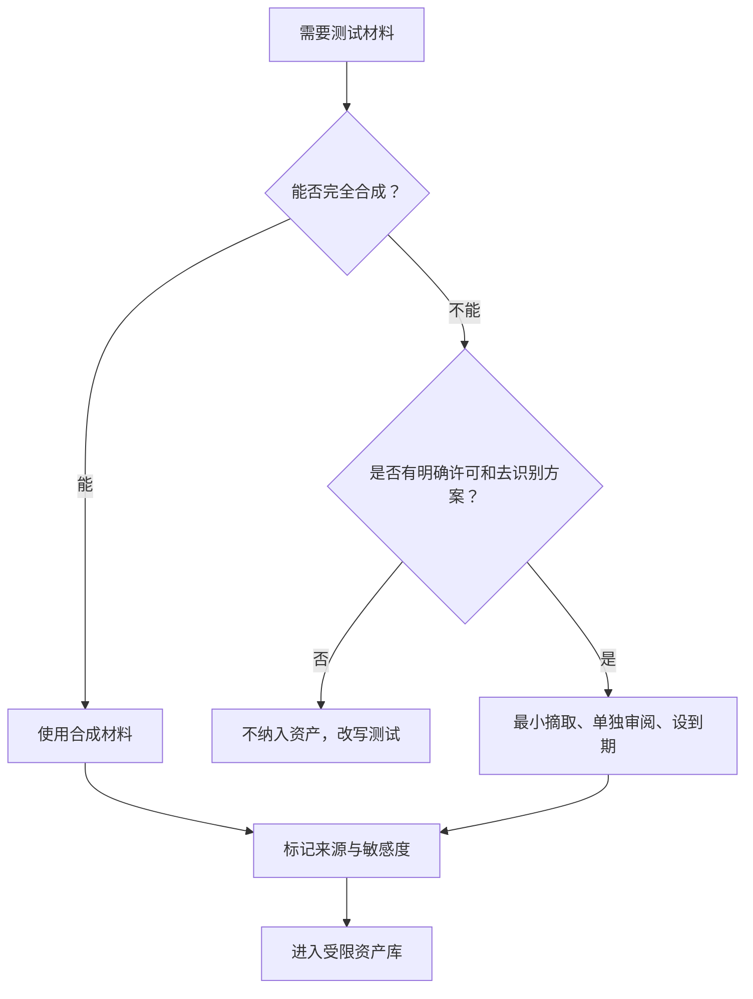
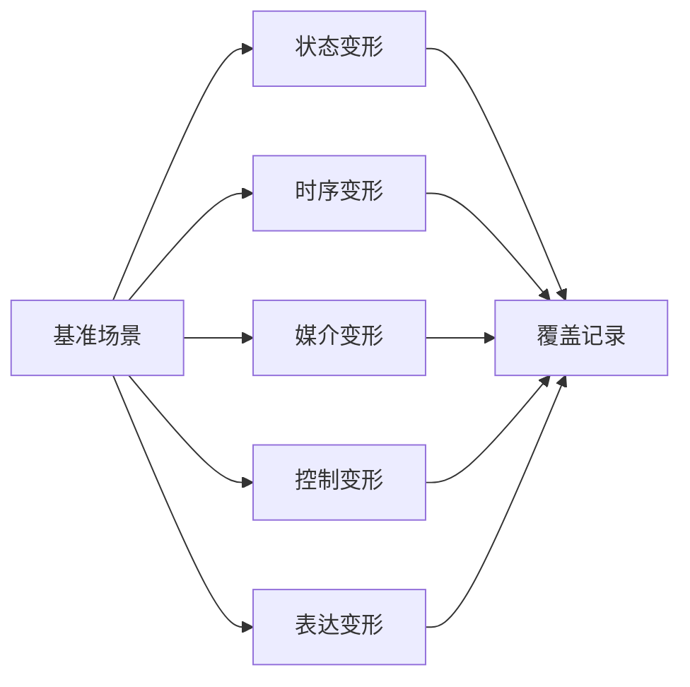
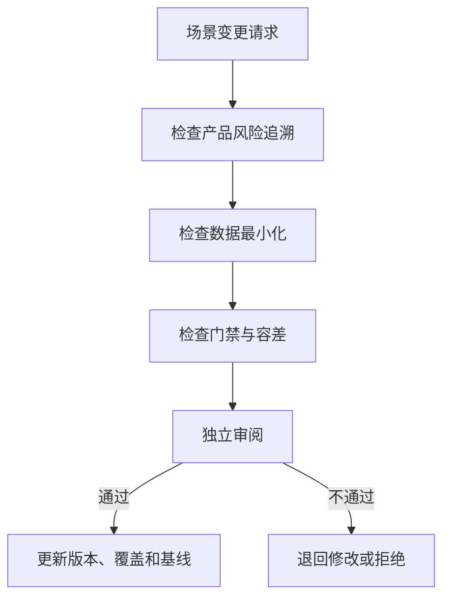

# 附录I：评测资产、黄金集与回归数据规范

> 文档性质：0→1 评测资产参考规范  
> 适用对象：负责维护黄金场景、标签、合成数据、报告和基线的产品质量与工程成员  
> 使用边界：本附录不决定产品风险、研究方法或工程发布策略；分别参见产品评测体系和工程 Evals。  
> 公开资料访问日：2026-01-28。

## 1. 资产在三层评测中的位置

本附录只回答“要保存什么、怎样命名、何时变更、哪些材料禁止进入”。它让产品场景可以交给工程运行器，又不把研究材料、真实用户资料或主观结论混进测试数据。



| 文档 | 决定什么 | 本附录提供什么 |
| --- | --- | --- |
| 产品评测体系 | 该评什么、何时收缩 | 场景卡和报告字段 |
| 原型验证 | 界面和控制先用什么材料验证 | 原型结论引用标识 |
| 技术 POC | 链路、选型和降级先用什么材料验证 | POC 合同与结果引用标识 |
| 工程 Evals | 怎样运行、断言和阻断 | 黄金集 Schema、变形和基线记录 |
| 本附录 | 资产如何可追溯、最小化和维护 | 模板、标签、示例和保留规则 |

## 2. 资产目录与命名



| 目录 | 内容 | 禁止内容 |
| --- | --- | --- |
| `golden/` | 已审阅的合成场景与预期结果 | 完整用户聊天、原始音频、联系方式 |
| `fixtures/` | 模拟赛事、设备、网络、时钟和供应商响应 | 未授权赛事内容和生产凭据 |
| `schemas/` | 用例、标签、结果和报告的版本化结构 | 业务实现细节的替代文档 |
| `baselines/` | 经批准的结果摘要和差异理由 | 被隐藏的失败、无法复现的截图 |
| `reports/` | 最小报告、复核和决定记录 | 不必要的敏感输入输出 |

稳定编号采用 `域-风险-序号`，例如 `FACT-PENDING-001`、`CTRL-END-004`。编号一旦分配，不可把旧编号复用给另一种伤害结构；场景退役只标为 `retired`，并保留抽象退役原因。

## 3. 黄金场景 Schema

### 3.1 必填字段

```yaml
case_id: CTRL-END-004
title: 结束后拒绝迟到声音与动作
asset_version: 0.1.0
domain: control
risk_level: P0
source_type: synthetic
preconditions:
  session: active
  spoiler_mode: strict
  presentation: speaking
events:
  - type: user_end_session
  - type: late_tts_chunk
  - type: late_motion
expected:
  session: ended
  visible_output: none_after_confirmation
  memory_write: false
forbidden:
  - resume_audio
  - resume_motion
  - reopen_session
judgement:
  deterministic: required
  semantic_review: not_required
trace:
  product_scenario: product-control-end
  review_status: approved
```

| 字段组 | 目的 | 规则 |
| --- | --- | --- |
| 标识 | 可定位、可版本化 | `case_id` 稳定，`asset_version` 随内容变更 |
| 风险 | 决定运行频率和门禁 | P0/P1 必填且不能用总分抵消 |
| 输入 | 重现完整情境 | 只放合成或明确许可的最小材料 |
| 预期 | 明确用户可见结果与资料副作用 | 固定状态与控制不能写成模糊偏好 |
| 禁止 | 描述伤害结构 | 可是行为、字段、输出或时序 |
| 判定 | 指出硬门或语义复核 | 硬门失败不可由语义评分覆盖 |
| 追溯 | 连接到产品风险与审阅 | 不包含内部个人身份信息 |

### 3.2 最小标签集



标签用于筛选覆盖和确定运行集，不是给用户贴标签，更不能把“脆弱”“依赖”“高价值”等人身推断写进场景属性。

## 4. 合成数据与最小化规则

### 4.1 默认材料来源



| 材料类型 | 默认处理 | 是否可进黄金集 |
| --- | --- | --- |
| 虚构文本、模拟事件、假设备状态 | 直接使用并标记 `synthetic` | 可以 |
| 公开标准、规则与抽象风险模式 | 记录来源后改写为场景 | 可以 |
| 研究观察的抽象模式 | 去识别、改写、独立审阅 | 有条件 |
| 原始用户对话、语音、截图 | 不复制进通用评测资产 | 不可以 |
| 未成年人、危机、投诉和关系材料 | 默认不进入；只保留抽象风险标签 | 原文不可以 |
| 生产日志与赛事受限内容 | 不作为默认 fixture | 需单独授权和隔离 |

### 4.2 合成材料生成卡

```text
目标风险：{例如：结束后迟到声音}
所需状态：{会话、事实、用户模式、网络}
允许材料：完全虚构的事件和文本；不得使用真实姓名、球队私密资料或用户表达。
输出格式：结构化事件序列 + 预期用户可见结果。
禁止：诱导依赖、真实危机细节、可识别资料、未经许可的赛事片段。
人工复核：确认伤害结构正确，且素材不保留私人信息。
```

## 5. 变形、覆盖与基线

### 5.1 变形矩阵

高风险场景不能只测试一条固定输入。每个 P0/P1 用例至少覆盖下列相关维度；不相关的维度必须写明不适用理由。

| 维度 | 示例 | 目的 |
| --- | --- | --- |
| 状态 | 已确认 / 待确认 / 已更正 | 防止规则只适用于正常状态 |
| 时序 | 正常、乱序、迟到、重连 | 防止旧内容复活 |
| 媒介 | 文字、声音、字幕、动作、通知 | 防止单一媒介绕过保护 |
| 用户控制 | 静音、严格保护、取消、结束、删除 | 验证控制优先级 |
| 表达 | 同义、否定、错别字、短句 | 防止依赖固定词表 |



### 5.2 覆盖记录

```yaml
capability: strict_spoiler_protection
risks:
  - fact_overstatement
  - cross_medium_leak
  - late_output_after_end
covered_cases:
  - FACT-PENDING-001
  - FACT-CORRECT-003
  - CTRL-END-004
gaps:
  - notification_delivery_on_offline_device
next_review: 2026-03-28
owner_role: quality_and_product
```

覆盖率不以“用例总数”衡量，而以每个高影响能力是否覆盖正常、失败、恢复和至少一种反例结构衡量。发现空白时创建空白登记，不能删除困难场景以提高通过率。

### 5.3 基线记录

```markdown
#### Baseline：0.1.0
- 黄金集版本：
- 被测构建标识：
- 运行环境摘要：
- P0/P1 结果：
- 允许的 P2/P3 已知项：
- 与上一基线的差异：
- 批准角色与日期：
- 失效条件：新增高风险能力 / 规则变更 / 发现事故模式
```

## 6. 报告与复核模板

### 6.1 最小结果报告


```markdown
#### Eval Report：[候选标识]

## 范围
- 黄金集与 Schema 版本：
- 运行层级：离线 / 集成 / 端到端
- 环境与替身版本：

## 硬门结果
| 风险级别 | 通过 | 失败 | 阻断用例 |
| --- | ---: | ---: | --- |

## 差异与最小复现
- 用例：
- 预期与实际：
- 影响媒介/状态：
- 是否可回退：

## 人工复核
- 需要复核的低置信项：
- 结论与理由：

## 决定
保留受限范围 / 修复后重跑 / 收缩能力 / 暂停。
```

### 6.2 场景变更审阅

任何新增、改写、退役或放宽容差的场景都要回答：它对应哪个产品风险？是否改变了 P0/P1 门？是否引入了不该保存的材料？是否需要更新变形、基线或报告解释？



## 7. 资产保留、删除与访问

**资产：合成黄金用例**
- **默认保留**：版本化保留，便于回归
- **访问**：评测维护角色
- **删除/退役规则**：风险失效后标记退役，保留抽象理由

**资产：运行结果摘要**
- **默认保留**：按发布与审计需要的最短周期
- **访问**：工程质量与发布审阅角色
- **删除/退役规则**：到期删除或聚合，避免保留完整敏感输出

**资产：去识别研究抽象**
- **默认保留**：只保留风险模式和必要标签
- **访问**：授权研究/产品角色
- **删除/退役规则**：原始来源撤回或到期时移除原材料

**资产：失败最小复现**
- **默认保留**：仅保留复现必需信息
- **访问**：修复责任人与审阅者
- **删除/退役规则**：修复确认后按最短周期清理

访问控制以角色和任务为单位。质量资产不是让运营、角色设计或增长团队读取用户表达的旁路；任何临时访问必须有目的、范围、到期和审计说明。

## 8. 公开资料

| 来源 | 本文用途 | 链接 |
| --- | --- | --- |
| NIST，AI RMF Generative AI Profile | 评测、治理和监测的资产化要求 | https://nvlpubs.nist.gov/nistpubs/ai/NIST.AI.600-1.pdf |
| OpenAI，Evals Design Guide | 用例、评分和持续评估的公开方法 | https://platform.openai.com/docs/guides/evals |
| NIST，Privacy Framework | 最小化、权限与资料生命周期原则 | https://www.nist.gov/privacy-framework |
