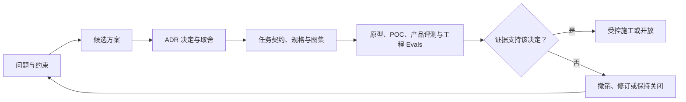
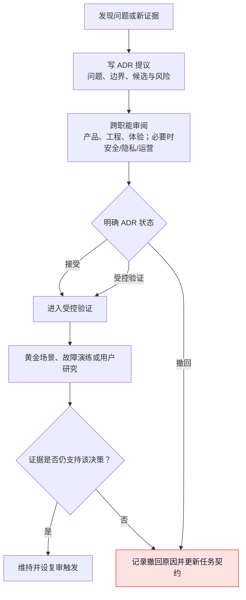

# 附录J：架构决策记录

> 文档性质：0→1 架构决策方法与首轮记录集。它记录为什么选择某条可验证、可回退的路径，而不是把后来的技术状态包装成唯一正确答案。  
> 适用对象：产品、工程、AI、数据、安全、隐私、体验、运维和值守成员。  
> 决策状态：所有记录均为首轮假设，必须在研究、演练和受控开放中被证实、调整、撤回或替换。  
> 公开资料访问日：2026-01-28。


## 1. 为什么从第一天就写决策记录

足球数字球友陪看服务的架构并不只决定“用什么语言或数据库”。它决定比赛事实会不会和角色猜测混在一起，用户结束后旧消息是否会重新出现，语音取消是否真的停止，资料删除是否会被晚到写入复活，人工值守能不能越权，以及服务在声音、动画或外部信息不可用时能否仍让用户完成核心任务。

如果只记录最终组件名称，团队会在几周后忘记当初为什么要求事实可追溯、为什么高风险能力默认关闭、为什么文字优先于声音、为什么角色不能读投诉与删除原因。架构决策记录的目的就是保存这些取舍和撤销条件，让下一次变化先问“前提是否变了”，而不是把过去的便利当作产品必然。

本文定义记录格式、评审流程和十条首轮候选决策。它不等同于已经搭建的系统，也不授权具体供应商、云账户、生产发布或真实资料处理。

## 2. 记录格式与状态

### 2.1 ADR 模板

```markdown
#### ADR-[编号]：[短标题]

- 状态：提议 / 已接受 / 受控验证 / 被替代 / 撤回
- 日期与适用阶段：
- 决策人和审阅角色：

## 要解决的问题

## 约束与不可违反边界

## 候选方案
- **方案**：
  - **用户影响**：
  - **事实、资料与控制影响**：
  - **维护与回退**：
  - **结论**：

## 决定

## 取舍与不做什么

## 证据与待验证假设

## 实施门与验收

## 停止、回退与复审触发

## 公开资料
```

### 2.2 状态语义

| 状态 | 含义 | 允许行为 |
| --- | --- | --- |
| 提议 | 有候选路径，但尚未获得跨职能确认 | 研究、原型、合成设计 |
| 已接受 | 当前范围内的默认选择 | 受限施工与离线验证 |
| 受控验证 | 可以在明确范围内演练或研究 | 监测、回退、收集限定证据 |
| 被替代 | 新决定已取代该记录 | 保留原因，迁移/回退按新记录 |
| 撤回 | 前提不成立或风险不可接受 | 停止使用，清理或隔离影响 |

状态不是“项目进度百分比”。即使一个决定是已接受，也可能只适用于合成演练，不自动适用于真实用户、更多赛事、更多地区或更高风险媒介。

## 3. ADR-001：事实账本与角色表达分离

### 要解决的问题

用户需要知道比分、事件与更正是否可信，同时又可能希望听到角色有限的足球观察。若把来源、模型猜测、用户吐槽和角色意见混在同一段文字或同一对象里，系统无法在冲突、剧透或投诉时解释“这句话到底依据什么”。

### 候选方案

**方案：用一段自由文本表示所有赛况与评论**
- **优点**：快，演示简单
- **风险**：无法区分事实与观点，难以更正或保护
- **结论**：拒绝

**方案：结构化事实对象 + 角色自由生成**
- **优点**：能追溯事实
- **风险**：角色仍可能把观点说成事实
- **结论**：不足

**方案：结构化事实状态 + 明确观点字段 + 媒介许可**
- **优点**：可解释、可更正、可限制剧透
- **风险**：增加状态与评测工作
- **结论**：接受

### 决定

比赛事件必须含来源类别、确认状态、发生时间、接收时间、版本和更正关系。角色输出把 `fact_sentence`、`observation_sentence` 和 `control_sentence` 分开；事实未确认或冲突时不得生成确定结论，声音与动作同样受状态限制。

### 取舍与门

取舍是首轮角色显得更克制、接口更复杂、部分“即时热评”不可用。验收要求：确认、待确认、冲突、更正、来源不可用均能在文本、声音和动作中一致表现；用户严格保护时不经任一媒介泄露。发现一次明确剧透或事实混淆即停止相关表达能力。

### 公开资料

[FIFA Laws of the Game](https://www.theifab.com/laws-of-the-game-documents/)、[NIST AI 600-1](https://nvlpubs.nist.gov/nistpubs/ai/NIST.AI.600-1.pdf)。

## 4. ADR-002：匿名优先与最少身份

### 要解决的问题

陪看核心任务不要求用户提交完整身份。若从第一天强制收集联系人、社交账号或精确资料，服务会增加共享设备、恢复、删除、泄露和关系误解风险。

### 决定

首轮采用匿名主体与本场会话分离的模型。访客可完成核心观看、文字控制和退出；只有用户主动保存偏好、记录或请求恢复时，才按目的增加最少身份/恢复路径。身份状态与角色表达隔离，角色不得因主体标识产生私人称呼或关系推断。

### 取舍与门

取舍是跨设备恢复、付费和长期资料能力需要另行设计，不能用“登录后更懂你”快速解决。验收要求共享设备不串用、退出后迟到内容被拒绝、删除请求建立屏障。若恢复机制需要收集联系信息，升级为 L3 资料与合规决策。

### 公开资料

[NIST Privacy Framework](https://www.nist.gov/privacy-framework)，[《中华人民共和国个人信息保护法》](https://flk.npc.gov.cn/detail2.html?ZmY4MDgxODE3YjE2ZWQ4YjAxN2I2Y2I2MzY0ZDMzZjg%3D)。

## 5. ADR-003：文字优先，多模态为可选增强

### 要解决的问题

声音和舞台能丰富体验，却可能打扰用户、阻碍无障碍、增加设备要求、泄露未确认赛况，并让取消变复杂。若把声音和动画当成核心路径，用户在办公室、公共场所、弱网、听力障碍或偏好安静时会失去服务。

### 决定

所有核心任务先有文字、字幕、键盘和低动态路径；声音和 Live2D 动作仅在用户明确允许、事实状态安全、会话未结束且未静音时启用。文字是事实、控制、错误、删除和结束的权威呈现层，声音/动作不得携带文字没有的关键含义。

### 取舍与门

取舍是首轮视觉冲击较低，需额外维护多媒介一致性。验收要求无声音、低动态、键盘与屏幕阅读器下仍能进入比赛、查看状态、提问、取消、结束和管理资料。W3C [WCAG 2.2](https://www.w3.org/TR/WCAG22/) 为研究起点。

## 6. ADR-004：用户控制状态高于自动生成

### 要解决的问题

实时系统常出现“用户已点取消，但旧任务晚到”的问题。若完成结果的优先级高于用户动作，静音、结束、严格保护和删除都会成为表面按钮。

### 决定

为会话和轮次建立单调递增的状态版本与取消令牌。`ended`、`cancelled`、`muted`、`strict_protection`、`deletion_pending/deleted` 等高优先级状态能拒绝后续消息、声音、动作和自动写入。客户端优先本地停止可见输出，服务端再完成跨层确认。

### 取舍与门

取舍是更多幂等、过期和错误处理，以及某些结果会被故意丢弃。验收要求取消、结束、重连、乱序、重复消息和语音迟到合成均不可旁路用户选择。无法证明本地停止和后端拒绝一致时，声音/主动行为不进入受控开放。

### 公开资料

[MDN WebSocket API](https://developer.mozilla.org/en-US/docs/Web/API/WebSockets_API)，[OpenTelemetry Specification](https://opentelemetry.io/docs/specs/otel/)。

## 7. ADR-005：偏好与共同记录须用户主动确认

### 要解决的问题

跨场连续性可能减轻重复设置，但也最容易把聊天、沉默和情绪变成隐性记忆。用户需要可理解的控制，而不是被系统宣称“我记得你”。

### 决定

首轮只保存用户明确确认的呈现偏好和共同记录。偏好采用有限枚举，记录标为 `user_confirmed`；用户可查看、修改、暂停、归档、导出和删除。角色不能自动保存、不能从行为推断、不能读取投诉或删除原因，也不能在用户未主动打开记录时引用内容。

### 取舍与门

取舍是个性化速度较慢，角色不会“自动越来越了解用户”。验收要求保存与本场选择区分清楚、共享设备不串用、删除后旧版本与缓存不能重现。任何亲密度、孤独、脆弱、留存价值或情绪评分提议都必须作为独立高风险决策，而非扩展该记录。

## 8. ADR-006：删除屏障优先于异步连续性

### 要解决的问题

删除请求常与离线恢复、缓存、队列和迟到消息竞争。若系统只删主存储，旧请求可能在稍后把被删偏好或记录重新写回，用户看到的“删除成功”就不可信。

### 决定

主体和可删除对象维护删除状态与单调递增屏障版本。每个写入请求携带对象版本和屏障版本；旧于屏障、指向已删除对象、或来自已结束会话的自动写入均被拒绝。删除流程覆盖读取、缓存、队列、生成上下文和通知候选的停止/失效检查。

### 取舍与门

取舍是离线设备可能需要用户重新确认新建内容，不能静默恢复。验收必须包含删除后重连、晚到写入、缓存读取、跨场召回和人工支持边界。用户说明需区分已不可用、处理中和依法/技术上另行处理的最少记录，不能承诺无法兑现的即时全网清除。

## 9. ADR-007：外部供应商置于可替换适配层之后

### 要解决的问题

赛事数据、语音、生成、身份和通知服务可能变化、失效、涨价、限制地区或改变资料政策。若用户控制和领域规则直接绑定到供应商格式，迁移时最容易牺牲取消、删除和事实边界。

### 决定

上层只使用稳定领域事件，如事实确认、冲突、语音取消、文字降级、删除屏障和中性故障。供应商专有字段在适配层隔离；每个接入须有公开能力研究、资料路径、失败/超时、取消、替代、可观察性和退出计划。默认不将真实用户资料发给尚未通过审查的服务。

### 取舍与门

取舍是首轮要写适配与模拟，不能最快接入某个演示服务。门槛包括：用户可以不用该供应商完成核心文字任务；不可用时安全降级；资料保存和训练用途可解释；取消与删除语义不被破坏；值守能够停用而不造成用户困住。

## 10. ADR-008：AI 工程采用任务契约和最少权限

### 要解决的问题

AI Coding 助手可迅速扩大模糊需求，读取不必要内容或把计划当成授权。若没有明确合同，助手生成的实现、测试和自述很容易形成“它说完成了”的假证据。

### 决定

每次 AI 协作使用任务契约，包含用户结果、范围、非目标、事实/关系/资料/控制边界、允许操作、禁止操作、验收、停止与回退。助手先复述并提出不超过五步计划；人工确认后只执行一步；结果以交付回执报告通过、失败、未执行和未知。高风险任务使用独立审阅与红队。

### 取舍与门

取舍是对话和交接更长，部分“顺手优化”被拒绝。收益是范围、权限和证据可审阅。公开的 [OWASP Top 10 for LLM Applications](https://genai.owasp.org/llm-top-10/) 可帮助研究提示词注入和过度权限风险。

## 11. ADR-009：受控开放先于规模扩张

### 要解决的问题

少量流畅演示不能证明真实网络、设备、赛事节奏、无障碍、资料权利或关系风险在更多用户中仍成立。过早扩大，会让问题从可修复演练变成用户伤害。

### 决定

采用阶段门：合成场景 → 内部演练 → 知情同意的原型研究 → 有停止条件的小范围受控开放 → 重新审议是否扩大。每阶段都有结果合同、排除范围、支持路径、反指标、值守、回退和复盘。P0/P1 或资料/关系边界不明时，选择修复、缩小或停止，而非用增长指标继续推进。

### 取舍与门

取舍是发布节奏更慢，不能因赛事窗口而跳门。门槛包括核心控制与事实场景通过、文字降级可用、资料最小化可验证、支持和值守已准备、用户研究结论不被过度外推。

## 12. ADR-010：可观察性记录类别，不记录私人内容

### 要解决的问题

团队需要发现取消失败、剧透、删除回写和供应商故障，但完整日志可能成为另一份隐性对话和音频档案。

### 决定

观测层优先记录去标识会话类别、事件类型、状态版本、错误类别、时间桶和处理结果。默认不记录原始声音、完整识别文本、完整生成内容、私密记录正文、联系人、密钥和风险表达。若某一故障需要更细证据，先走最小化、期限与权限审查，而不是永久提高日志粒度。

### 取舍与门

取舍是排障可能需要更精确的合成重放与复现实验。门槛包括能够用类别定位故障、用户资料不会进入常规监控、访问权限最小、保留与删除规则清楚。OpenTelemetry 提供追踪语义的公开资料，但不要求收集用户内容。[OpenTelemetry Specification](https://opentelemetry.io/docs/specs/otel/)

## 13. 交叉决策检查



这些 ADR 互相约束。任何单一决定改变时，都应检查下表，而不是只修局部实现。

| 变更 | 必须复查的 ADR | 原因 |
| --- | --- | --- |
| 新赛事来源或预测能力 | 001、004、007、009 | 事实确认、剧透、供应商与开放范围变化 |
| 新语音或动作能力 | 003、004、007、010 | 文字等效、取消、资料路径和观测变化 |
| 新跨场偏好或记忆 | 002、005、006、008 | 身份、明确确认、删除和 AI 权限变化 |
| 新通知或主动行为 | 003、004、005、009 | 用户控制、关系压力、资料与开放门变化 |
| 新人工操作 | 002、006、010 | 最小权限、权利处理和日志边界变化 |
| 新评测或分析数据 | 005、006、010 | 用户资料、删除和观测最小化变化 |

## 14. ADR 评审与撤销流程



撤回不是失败的污点。若一项选择导致用户控制、事实、资料或关系风险无法被接受，撤回并恢复到更小的文字/静态路径是正确的产品能力。真正危险的是把决定记录当成永久真理，忽视前提已经改变。

## 15. ADR-011：实时消息采用快照、版本与幂等，而非“最后到的算数”

### 要解决的问题

观赛过程中会出现重复、乱序、延迟、重连和跨设备消息。若用户端仅按到达顺序更新，旧的比分、保护状态、取消状态或舞台动作可能覆盖较新的用户选择。把网络偶然顺序当作业务真相，会直接伤害严格保护、结束与事实更正。

### 决定

每个实时消息包含会话/比赛范围、对象版本、事件标识、发生与接收时间、过期条件和幂等键。用户端在首次连接和重连后先获取一份可解释快照，再只接收比快照更新的事件。事件处理须区分：可合并的重复、可替代的更新、必须拒绝的旧版本、需要用户可见说明的冲突。会话终态和资料删除屏障始终高于普通状态更新。

### 取舍与门

取舍是协议设计和测试量增加，且某些“晚到但看起来新鲜”的内容被故意丢弃。验收涵盖重复事件、乱序事件、短断线、长断线、跨设备切换、结束后重连、事实更正和严格保护切换。若存在一种常见网络条件会让旧状态恢复，则不进入受控开放。

### 公开资料

[IETF RFC 6455: The WebSocket Protocol](https://www.rfc-editor.org/rfc/rfc6455)，[MDN WebSocket API](https://developer.mozilla.org/en-US/docs/Web/API/WebSockets_API)。

## 16. ADR-012：领域资料与分析资料分开，运行日志不成为用户画像

### 要解决的问题

赛事状态、用户偏好、删除请求、运维事件和分析指标都需要被处理，但它们有不同目的、访问者和保留条件。把它们放入一个“方便查询”的资料池，会造成角色、增长、支持和工程互相越权。

### 决定

资料按目的至少分为：公开比赛事实、当前会话短时状态、用户主动保存资料、权利与支持请求、去标识运行观测、独立研究材料、运营配置。跨类读取必须说明用户价值、权限、最小字段、保留和删除影响。角色只使用当前场已过滤的事实、控制与明确许可偏好；分析层只接收去标识聚合信号；投诉/权利请求与角色/增长层隔离。

### 取舍与门

取舍是报表和排障不能随意联表，需要设计去标识化聚合和专门支持流程。验收要求：支持人员不能批量浏览用户记录；增长分析不能读取危机/投诉材料；角色不能引用删除原因；运行日志不存完整音频、对话或密钥。发现跨目的读取时，先收缩权限并追溯影响，而不是在“内部使用”名义下继续。

## 17. ADR-013：内容与运营控制采用最小权限、双人复核和可撤销开关

### 要解决的问题

赛事日值守需要暂停不当表达、处理来源故障、收缩声音或开启中性降级。但运营控制若能直接重写比赛事实、批量读取私人资料、打开主动触达或绕过删除，就会成为产品边界的后门。

### 决定

运营控制分为事实候选处理、媒介/能力开关、支持请求、内容策略和系统状态。每类控制只允许相应角色在最小范围内操作；涉及事实发布、资料导出/删除例外、主动触达、支付、外部传输或高风险策略的动作要求双人复核或更高审批。所有高风险开关默认关闭，有明确用户影响、到期、审计、紧急停止和恢复验证。

### 取舍与门

取舍是值守不能“想到什么就改什么”，紧急场景需预先演练和职责明确。验收包含：权限不足操作被拒绝；暂停声音不影响文字核心路径；开关关闭后迟到任务不复活；审计只记录最少操作类别而非用户私人内容。若无法在事故中明确谁有权停止，能力不应开放。

## 18. ADR-014：提示词、策略与评测资产使用版本化发布门

### 要解决的问题

数字角色的行为可能只因一段提示词、一个工具描述或一条内容规则变化而显著改变。若这些变更被视作普通文案，团队无法知道哪条策略导致剧透、关系压力或资料越界，也无法稳定回退。

### 决定

将固定前言、人格宪法、工具权限、事实格式、媒介许可、红队题库和黄金场景作为版本化策略资产。每次变更写明范围、理由、受影响场景、审阅角色、评测结果、到期/复审日和回退条件。未通过关键黄金集的策略不能被发布；运行中出现 P0/P1 时停止相关版本并回退到上一个通过的收缩策略或中性文字模式。

### 取舍与门

取舍是快速调语气会变慢，需要保留更多可审阅元数据。收益是策略可解释、故障可定位、回退可执行。验收要求同一场景在文字、声音、动作与资料副作用上符合版本合同；提示词注入、外部网页和用户输入不能覆盖固定规则。公开的 [OWASP Top 10 for LLM Applications](https://genai.owasp.org/llm-top-10/) 可帮助研究相关攻击面。

## 19. ADR-015：生产容量以用户控制和降级优先，而非最大生成吞吐

### 要解决的问题

赛事高峰可能让事实来源、模型、语音、实时连接和舞台资源同时承压。若容量策略只追求多发回答、多播声音或更多动画，最先受损的往往是取消、文字、事实确认和结束路径。

### 决定

容量治理优先保证：用户进入/退出、静音/仅文字、事实快照、严格保护、取消、删除请求和中性状态说明。压力上升时按顺序收缩：高强度动作 → 自动声音 → 长生成 → 非必要主动候选 → 高成本辅助功能，最后才考虑限制新会话，并始终保留用户可见解释和文字替代。任何降级不得把未确认事实推给用户或改变其保存/删除选择。

### 取舍与门

取舍是高峰时体验看起来更朴素，且要对用户清楚说明声音/动作暂不可用。验收通过合成负载和故障演练验证：基础控制仍低于可接受等待，已取消轮次不被排队后补发，严格保护不因降级而关闭，值守可安全缩小范围。没有真实容量证据时，预算只能写为待验证，不得宣传“稳定实时”。

## 20. ADR-016：发布采用能力切片与明确停止权

### 要解决的问题

“上线”常把多种风险捆绑：用户进入、事实接入、角色表达、声音、跨场资料、运营工具和商业化同时开放。一处失败会让团队无法知道应回退哪一层，也可能迫使用户承受全部风险。

### 决定

发布按能力切片：先验证文字与用户控制，再验证事实状态，再验证可选角色表达，然后才评估声音、舞台、跨场资料、主动触达和商业路径。每一片都有独立用户范围、结果合同、指标与反指标、支持方式、停止条件和回退。任何成员发现 P0 级控制、事实、资料或关系问题，都拥有触发停止流程的路径；商业或赛事压力不能覆盖停止决定。

### 取舍与门

取舍是功能组合更多、运营协调更复杂，且部分用户在不同阶段获得不同能力。收益是风险隔离和学习更快。验收要求能力开关与用户说明一致、关闭后不遗留迟到输出或资料再利用、每次扩大均有新证据而非沿用旧演示结论。

## 21. 架构演练与证据回收

ADR 的价值在于能被反驳。每条已接受决定进入受控验证前，团队召开一次短演练：选一个主路径与两个反例，指定产品、工程、体验和必要的隐私/安全/运营角色，逐步说明对象、状态、权限、用户可见结果和回退。演练使用合成消息，不使用真实用户、密钥或生产资源。

### 21.1 演练问题卡

1. 哪个用户动作优先于所有自动行为？
2. 当前信息是事实、观点、用户观察、运营指令还是资料权利状态？
3. 这一步读取或写入了什么，谁能看，什么时候结束？
4. 网络、来源、语音或供应商失败时，用户仍能做什么？
5. 如果上一条消息晚到、重复或来自已结束会话，如何拒绝？
6. 若用户改为静音、仅文字、严格保护或删除，哪个媒介、队列或缓存必须停止？
7. 如果要回退，用户会看到什么，哪些资料和任务需要验证没有复活？

### 21.2 证据回收格式

```markdown
#### ADR 验证回收
- ADR 编号与版本：
- 演练/研究范围：
- 主路径结果：
- 反例结果：
- 证据等级：
- P0/P1 与空白：
- 是否仍符合原始前提：
- 决定：维持 / 修改 / 被替代 / 撤回
- 下一步任务契约与回退：
```

## 22. ADR-017：赛事时间、用户观察与剧透保护显式建模

### 要解决的问题

不同用户可能看的是不同延迟的转播、集锦或文字直播。单靠系统收到事件的时间决定展示，会让用户在尚未看到关键片段前被剧透，也会让角色误把“实时”当作可以主动打断的许可。

### 决定

将公开事件时间、系统接收时间、用户所选保护模式和用户明确确认的可见进度分别表示。严格保护下，事件可以进入待显示状态，但不能进入角色文字、声音、动作、通知或自动摘要。用户改变模式或确认后，系统只展示当时仍有效且已确认的快照；用户沉默不视为确认。

### 取舍与门

取舍是用户可能需要多一步操作，角色不能在最热闹的时刻立即反应。验收包括不同延迟、重连、事件更正、来源冲突、切换保护、声音关闭和结束后的状态。任何媒介泄露保护中事件均为 P0/P1，并要求立即收缩相关媒介。

## 23. ADR-018：支付与商业权益与陪伴关系隔离

### 要解决的问题

数字角色如果把订阅、加购、续费或限时权益描述成“支持我”“别离开我”“我们不能分开”，会把商业交易变成情感压力。支付资料也不能被角色或陪看运行时读取来改变亲密表达。

### 决定

商业权益使用独立、清楚、中性的产品页面与状态对象。角色只可在用户主动询问且当前环境允许时，指向正式说明入口；不得制造稀缺、内疚、专属承诺或在输球、脆弱表达、高风险场景中推销。支付信息、退款纠纷、促销资格和价格测试与角色上下文隔离，并遵循最少权限和可退出原则。

### 取舍与门

取舍是转化路径更克制、部分角色化营销创意不可用。验收包括用户可不解释地关闭商业入口、权益与取消说明可理解、角色不因付费状态改变关系语言、退款/投诉不进入记忆和主动性逻辑。任何关系化推销触发即撤回该文案/策略版本。

## 24. ADR-019：基础设施安全以最小暴露和密钥隔离为默认

### 要解决的问题

实时服务、外部供应商、开发协作和运营工具可能引入密钥、网络端点和高权限操作。若密钥出现在代码、截图、提示词、日志或测试材料中，任何后续角色边界和资料规则都会失去基础。

### 决定

密钥只通过受批准的秘密管理或本地安全机制引用，不进入版本材料、公开文档、提示词、回执、截图或合成样例。服务之间按最小网络与最小身份授权；环境与用户资料分离；开发、演练和受控开放使用不同凭证与范围。AI Coding 助手没有读取生产密钥、外部写入、付款或发布权限。

### 取舍与门

取舍是本地设置和演练需要占位符、模拟器和额外配置。验收检查示例文件无真实值、日志不回显秘密、权限变更可审计、密钥轮换与失效不会阻断用户安全退出。公开安全实践可参考 [OWASP Secrets Management Cheat Sheet](https://cheatsheetseries.owasp.org/cheatsheets/Secrets_Management_Cheat_Sheet.html)，仍需结合实际环境审查。

## 25. ADR-020：研究资料与正式服务资料独立治理

### 要解决的问题

用户研究、原型访谈和受控试用对理解需求很重要，但若研究材料被悄悄并入正式角色记忆、增长分群或模型改进，用户的研究同意会被扩大解释，且正式服务用户待遇可能被研究结论错误泛化。

### 决定

研究同意、招募信息、原始研究材料、去标识汇总和正式服务资料分离存放、分离权限、分离目的和分离保留。正式陪看不因拒绝研究而降低核心体验；角色不读取研究原话；研究结论优先以聚合主题和任务发现进入决策记录。任何二次使用、跨项目使用或模型改进需要单独评估与授权。

### 取舍与门

取舍是研究到产品的连接更慢，团队不能直接把访谈原话送进提示词。验收包括撤回研究同意后停止后续使用、研究人员不能访问无关正式资料、正式支持人员不能把投诉当研究样本。研究招募、同意和访谈的执行细则由相应附录与研究计划维护。

## 26. 架构的最小可运行切片

首轮不需要把所有 ADR 同时实现。按用户权利和失败路径排序，最小可运行切片应依次验证：

1. 匿名进入一场虚构比赛，并完整用文字查看状态与结束；
2. 事实对象能显示确认、待确认与冲突，角色不定论；
3. 静音、仅文字、低动态、严格保护和结束能跨媒介优先；
4. 实时消息有快照、版本与拒绝旧消息能力；
5. 用户主动保存一项有限偏好，能暂停、删除，并通过晚到写入演练；
6. 声音作为可选能力引入，先证明取消、文字降级和无权限路径；
7. 最小运营开关能收缩能力，且不读取无关私人资料；
8. 黄金集、回退和受控研究合同准备后，才讨论扩大范围或商业路径。

排序原则是“先保护失败，再增加丰富度”。若前一项不能通过，不应以更强模型、更多舞台动作或更多记忆去掩盖它。

## 27. 公开资料

1. [NIST AI 600-1: Generative AI Profile](https://nvlpubs.nist.gov/nistpubs/ai/NIST.AI.600-1.pdf)，2024。
2. [NIST Privacy Framework](https://www.nist.gov/privacy-framework)，持续更新。
3. [W3C Web Content Accessibility Guidelines 2.2](https://www.w3.org/TR/WCAG22/)，2023。
4. [OpenTelemetry Specification](https://opentelemetry.io/docs/specs/otel/)，持续更新。
5. [OWASP Top 10 for LLM Applications](https://genai.owasp.org/llm-top-10/)，持续更新。
6. [IFAB Laws of the Game](https://www.theifab.com/laws-of-the-game-documents/)，持续更新。
7. [《中华人民共和国个人信息保护法》](https://flk.npc.gov.cn/detail2.html?ZmY4MDgxODE3YjE2ZWQ4YjAxN2I2Y2I2MzY0ZDMzZjg%3D)，2021。

## 28. 放行清单

- [ ] 关键技术选择均以用户问题和不可违反边界开头；
- [ ] 每条 ADR 明确候选、取舍、证据、验收、停止和回退；
- [ ] 事实与角色表达、文字与多模态、控制与自动生成、资料与删除被分别记录；
- [ ] 高风险供应商、工具权限和受控开放有独立决策；
- [ ] 决策状态区分提议、接受、验证、替代和撤回，不把假设写成事实；
- [ ] 任何变化会检查交叉 ADR，而不是局部优化；
- [ ] 公开资料用于研究输入，具体选型仍由适用范围和验证决定；
- [ ] ADR 资产不包含真实用户内容、密钥或项目内部证据；
- [ ] 撤回和缩小范围被视为正常、可执行的结果。
