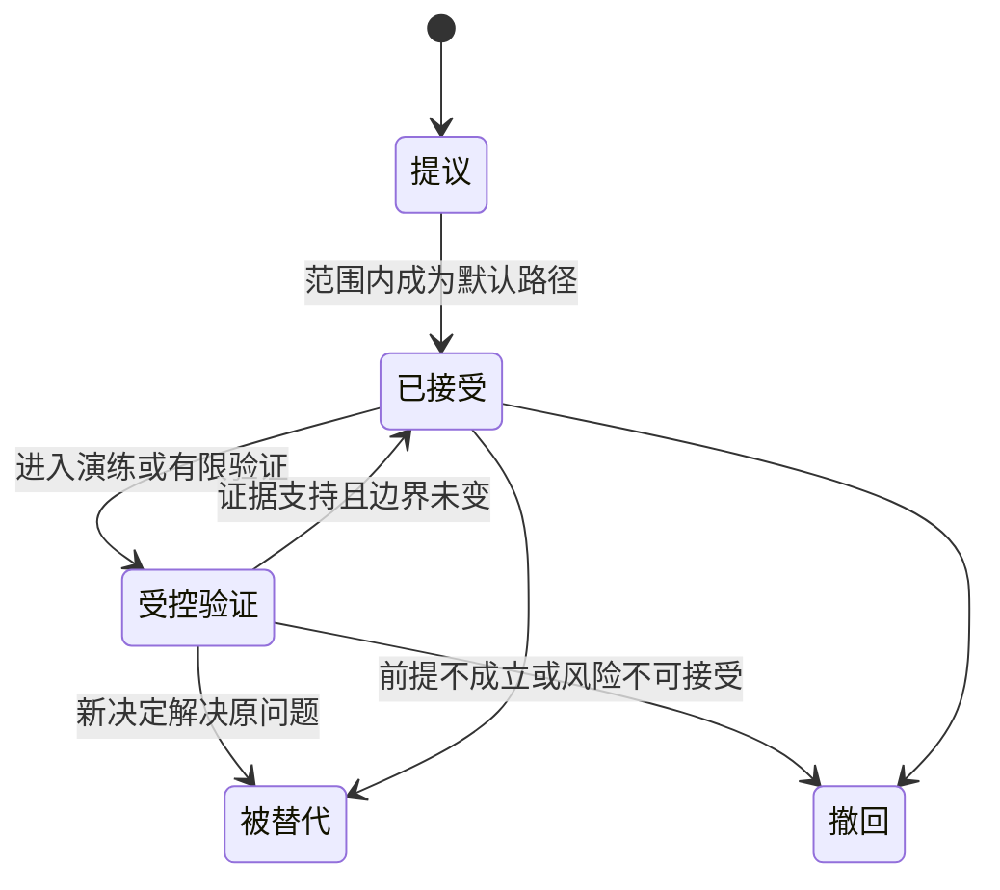
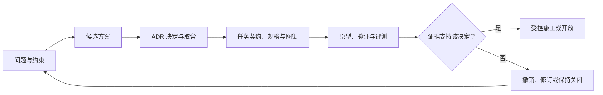
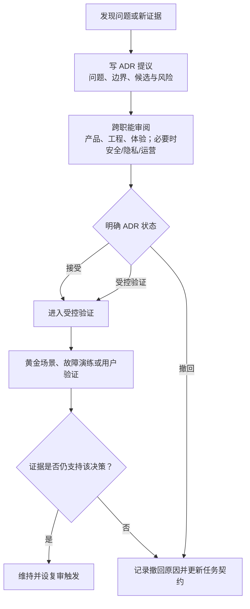

# 架构决策：方法论与决策对照

> **文档类型**：架构决策方法论篇——我们说明球球（Digital Ballmate）如何记录、评审与撤销架构决策，并给出早期决策条目与现行决定的一张对照表。  
> **适用读者**：关注球球技术构成的合作者与外部读者。  
> **阅读提示**：架构决策记录（ADR）的唯一权威在仓库的 docs/adr/ 目录（0001 起）。本篇不收录任何决策正文，只保留决策方法论与一张新旧对照表。

---

## 1. 为什么从第一天就写决策记录

足球数字球友陪看服务的架构并不只决定"用什么语言或数据库"。它决定比赛事实会不会和角色猜测混在一起，用户结束后旧消息是否会重新出现，语音取消是否真的停止，人工介入能不能越权，以及服务在声音、动画或外部信息不可用时能否仍让用户完成核心任务。

如果只记录最终选了什么组件，几周后就没有人记得当初为什么要求事实可追溯、为什么高风险能力默认关闭、为什么角色不能读取投诉与删除原因。架构决策记录的目的就是保存这些取舍和撤销条件，让下一次变化先问"前提是否变了"，而不是把过去的便利当作产品必然。

需要说明的是：本篇的早期版本（2026 年初）自称收录"十条首轮决策"，实际载有 ADR-001 至 020 共二十条。那些正文属于同一批次的前瞻设想，与仓库 docs/adr/ 中的现行决定同号不同义，已全部删除，不再作为任何系统行为的依据。现行架构决策记录的唯一权威是 docs/adr/ 目录（0001 起）；本篇只保留方法论，并用一张对照表交代早期条目的落定。

## 2. 决策状态机与记录模板

### 2.1 决策状态机



### 2.2 ADR 模板

```markdown
#### ADR-[编号]：[短标题]

- 状态：提议 / 已接受 / 受控验证 / 被替代 / 撤回
- 日期与适用阶段：
- 决策人和审阅角色：

## 要解决的问题

## 约束与不可违反边界

## 候选方案
- **方案**：
  - **用户影响**：
  - **事实、资料与控制影响**：
  - **维护与回退**：
  - **结论**：

## 决定

## 取舍与不做什么

## 证据与待验证假设

## 实施门与验收

## 停止、回退与复审触发
```

### 2.3 状态语义

| 状态 | 含义 | 允许行为 |
| --- | --- | --- |
| 提议 | 有候选路径，但尚未获得确认 | 研究、原型、合成验证 |
| 已接受 | 当前范围内的默认选择 | 受限施工与离线验证 |
| 受控验证 | 可以在明确范围内演练或验证 | 监测、回退、收集限定证据 |
| 被替代 | 新决定已取代该记录 | 保留原因，迁移/回退按新记录 |
| 撤回 | 前提不成立或风险不可接受 | 停止使用，清理或隔离影响 |

状态不是"项目进度百分比"。一个已接受的决定也可能只适用于受控范围，不自动扩展到更多用户、更多场景或更高风险的媒介。

## 3. 交叉检查



ADR 互相约束，任何单一决定改变时都应按下表检查关联面，而不是只修局部实现：

| 变更 | 必须复查的问题 | 原因 |
| --- | --- | --- |
| 新赛事来源或预测能力 | 事实确认、剧透边界、供应商依赖、开放范围 | 事实口径与呈现权限随之变化 |
| 新语音或动作能力 | 文字等效、取消语义、资料路径、观测边界 | 媒介扩展牵动控制与可及性 |
| 新跨场偏好或记忆 | 身份模型、记忆口径、删除语义、协作权限 | 连续性能力牵动资料与控制 |
| 新通知或主动行为 | 用户控制、关系压力、资料用途、开放范围 | 主动性牵动注意力与退出权 |
| 新人工操作 | 权限范围、用户权利处理、日志边界 | 运营能力不能成为边界后门 |
| 新评测或分析数据 | 用户资料范围、删除、观测最小化 | 分析用途不能反向改变服务行为 |

## 4. 评审与撤销流程



撤回不是失败的污点。若一项选择带来的风险无法被接受，撤回并退回更保守的路径是正确的产品能力；真正危险的是把决定记录当成永久真理，忽视前提已经改变。

## 5. 架构演练与证据回收

ADR 的价值在于能被反驳。每条已接受的决定进入受控验证前，做一次短演练：选一个主路径与两个反例，指定产品、工程、体验和必要的隐私/安全/运营角色，逐步说明对象、状态、权限、用户可见结果和回退。演练使用合成消息，不使用真实用户数据或生产资源。

### 5.1 演练问题卡

1. 哪个用户动作优先于所有自动行为？
2. 当前信息是事实、观点、用户观察、运营指令还是权利状态？
3. 这一步读取或写入了什么，谁能看，什么时候结束？
4. 网络、来源、语音或供应商失败时，用户仍能做什么？
5. 如果上一条消息晚到、重复或来自已结束的会话，如何拒绝？
6. 若用户改为静音、关闭主动性或删除资料，哪个媒介、队列或缓存必须停止？
7. 如果要回退，用户会看到什么，哪些资料和任务需要确认没有复活？

### 5.2 证据回收格式

```markdown
#### ADR 验证回收
- ADR 编号与版本：
- 演练/验证范围：
- 主路径结果：
- 反例结果：
- 证据等级：
- 高优先级问题与空白：
- 是否仍符合原始前提：
- 决定：维持 / 修改 / 被替代 / 撤回
- 下一步任务契约与回退：
```

## 6. 决策对照表：早期条目如何落定

下表把早期版本的二十条条目逐行对照到现行决定或现状。早期正文已删除，本表是它们唯一保留的记录形式；"结局"说明每条设想最终被证实、修正、取代、具体化，还是尚未裁决。

| 早期条目 | 现行对应与现状 | 结局 |
| --- | --- | --- |
| 001 事实账本与角色表达分离 | 已落地：比赛事实账本是唯一事实源（docs/adr/0002），角色表达经唯一表演合同交付（docs/adr/0005） | 证实 |
| 002 匿名优先与最少身份 | 现网即免登录的匿名身份：由设备标识派生，画像、关系阶段、记忆与投递历史都挂在它上面 | 证实 |
| 003 文字优先，多模态为可选增强 | 现行系统把实时语音与 Live2D 形象作为一等公民，文字不再独占核心路径 | 被修正 |
| 004 用户控制状态高于自动生成 | 用户权利高于运营与自动生成：话痨档位对运营只读，画像代客操作仅限条目读取与槽位删除（docs/adr/0008） | 证实 |
| 005 偏好与共同记录须用户主动确认 | 已被取代：记忆改为自动提取、事后可控——后台综合记忆，用户可逐条查看、暂停、删除（docs/adr/0006） | 被取代 |
| 006 删除屏障优先于异步连续性 | 用户删除权利已落地（隐私权利接口、画像逐条删除与审计）；旧条目设想的全链路屏障版本机制未整体实现 | 部分证实 |
| 007 外部供应商置于可替换适配层之后 | 已具体化：记忆领域接口加 Memobase 适配器（docs/adr/0006）、OpenAI 兼容统一传输层（docs/adr/0012） | 证实并具体化 |
| 008 AI 工程采用任务契约和最少权限 | 任务契约与交付回执已成为本套资料的工程协作方式 | 证实 |
| 009 受控开放先于规模扩张 | 服务尚未进入对外受控开放阶段，阶段门未经真实检验 | 未裁决 |
| 010 可观察性记录类别，不记录私人内容 | 已偏离：现行系统采用结构化轨迹（trace），路由意图与置信度等以 ReasonCode 入轨（docs/adr/0009） | 偏离 |
| 011 快照、版本与幂等 | 已证实：账本以确定性重放投影为基座（docs/adr/0002），写接口幂等且请求形状冻结（docs/adr/0011、0013） | 证实 |
| 012 领域资料与分析资料分开 | 尚未形成显式的数据分域决定 | 未裁决 |
| 013 最小权限、双人复核与可撤销开关 | 已具体化为 JWT 登录加 RBAC（director/auditor 两角色，docs/adr/0008、0010）；双人复核未采纳 | 具体化 |
| 014 提示词、策略与评测资产版本化 | 人格宪法、策略表与黄金评测集已存在并约束行为；完整的版本化发布门未齐备 | 部分证实 |
| 015 生产容量以用户控制和降级优先 | 局部降级路径存在（如记忆服务不可达时回退最近窗口）；容量治理未经真实负载检验 | 未裁决 |
| 016 发布采用能力切片与明确停止权 | 分步交付已在工程中实践（docs/adr/0011、0013 的分步重写与退役）；面向用户的能力切片发布未经检验 | 未裁决 |
| 017 赛事时间、用户观察与剧透保护显式建模 | 剧透保护的用户侧呈现全库无实现，仍在规划中 | 未裁决 |
| 018 支付与商业权益和陪伴关系隔离 | 尚无支付与商业化实现；隔离作为设计约束保留 | 未裁决 |
| 019 基础设施安全以最小暴露和密钥隔离为默认 | 密钥经环境配置注入、不入仓库，属工程惯例层面的常识级遵循 | 部分证实 |
| 020 研究资料与正式服务资料独立治理 | 尚无正式用户研究计划，治理规则随研究启动再启用 | 未裁决 |

## 7. 结语

方法论的价值在于让每个技术选择都有可审查的理由和可执行的退路；对照表的价值在于诚实——哪些早期设想被系统证实，哪些被推翻，哪些还在等待证据。新决策一律落在 docs/adr/，沿用本篇的状态机与模板；当一条记录被替代或撤回时，原因会留在原处，供下一个前提变化时查阅。

---

版本 2.0（2026-09-20）
