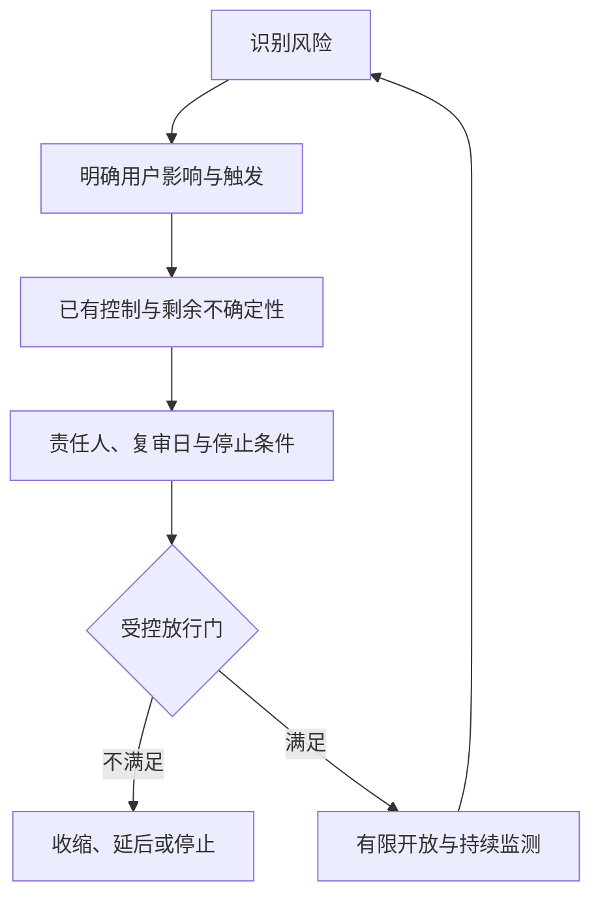
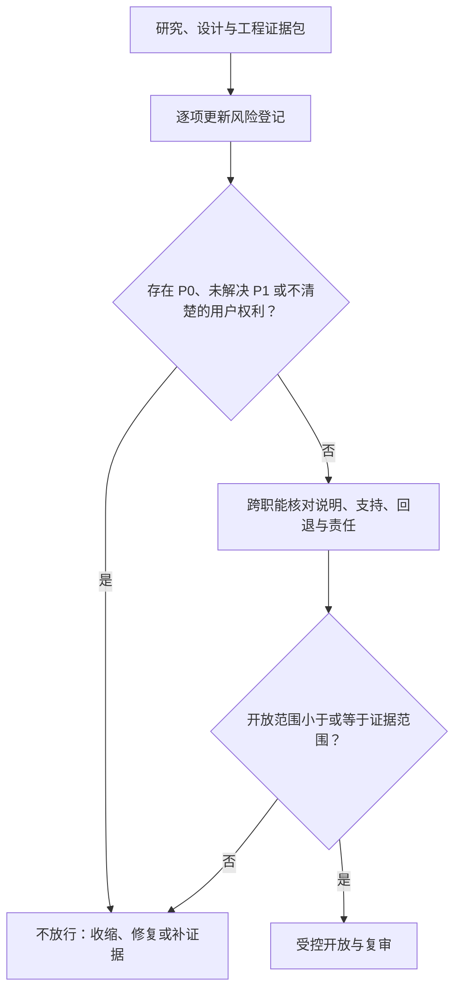
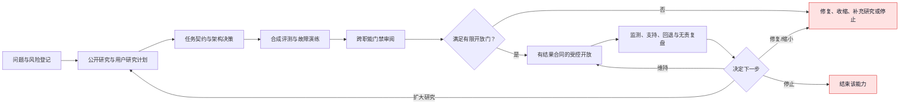

# 附录K：上市合规、隐私与风险登记

> 文档性质：0→1 风险与上市门禁规范。它提供一张在进入受控开放前持续更新的风险登记表和决策流程，不把公开规则或通用清单误写成自动合规批准。  
> 适用对象：产品、运营、法务/合规、隐私、安全、工程、内容、研究、支持和值守成员。  
> 决策状态：首轮风险框架。具体义务取决于服务地区、用户人群、功能、资料流、供应商、赛事权利和商业方式，必须由相应专业角色确认。  
> 公开资料访问日：2026-01-28。



## 1. 风险登记不是上线前的一次性表格

数字球友陪看服务同时涉及比赛信息、生成式内容、合成语音/形象、用户控制、实时连接、潜在个人信息、跨场偏好、商业权益和人工支持。它的风险不会在“功能做完”时自动消失，反而会随着新媒体、新供应商、新地区、新人群和新主动性能力不断改变。若只在上线前勾选一张安全清单，团队容易忽略最重要的问题：谁会被影响、用户是否理解、出了问题谁能立刻停止、处理过的资料会不会回来、以及积极增长指标是否正在掩盖关系或退出风险。

本文把风险登记作为一个持续的产品对象。每个风险都要有明确的触发、用户影响、现有控制、证据、剩余不确定性、责任人、复审时间、停止条件和回退。风险登记不用于给项目贴“安全/不安全”标签，而是帮助团队决定维持、修复、缩小、延后或停止某项能力。

## 2. 上市边界：先说清什么不是服务承诺

首轮服务定位为成年足球观众的单场数字陪看，不是官方直播、官方赛事数据发布者、博彩服务、通用聊天助手、医疗/心理服务、未成年人陪伴、现实关系替代或紧急响应渠道。角色有有限足球表达，但不能替代事实来源、裁判、专家、亲友、专业支持或用户本人决定。

在任何对外文案、商店描述、注册页、角色介绍、付费页、广告或支持话术中，都不应承诺：绝对实时、永不出错、官方比分、永远陪伴、真正理解用户、替用户保守一切秘密、自动删除所有副本、治疗孤独/焦虑、保证赛事可看、保证获利或通过付费获得亲密关系。能兑现的承诺应具体、可验证、可退出，例如“你可选择文字优先”“可随时结束本场”“待确认事件会显示等待状态”“已保存偏好可在设置中查看和删除”。

## 3. 风险登记格式与评分

### 3.1 单条风险卡模板

```markdown
#### 风险-[编号]：[短标题]

- 类别：事实 / 内容 / 关系 / 隐私 / 安全 / 无障碍 / 赛事权利 / 商业 / 运营 / 供应商
- 生命周期：发现 / 缓解中 / 受控验证 / 已接受残余风险 / 已关闭 / 已停止
- 触发条件：
- 受影响用户与情境：
- 可能伤害：
- 严重度：[低/中/高/严重]
- 发生可能性：[低/中/高/未知]
- 当前证据等级：[E0-E5]
- 已有控制：
- 剩余风险与未知：
- 用户可见说明/退出：
- 责任角色：
- 停止或回退触发：
- 复审日期：
- 相关任务契约/ADR/评测场景：
```

### 3.2 评分使用规则

严重度描述可能伤害的上限，发生可能性描述在已知范围内的暴露机会。二者都不应由主观乐观替代证据。对于剧透、删除失效、未授权资料、依赖诱导、危机处理、未成年人和支付压力等风险，即使当前发生概率未知，也应按高影响处理并限制开放范围。风险分数帮助排序，不允许把“低概率”当作跳过用户控制和回退的理由。

| 严重度 | 含义 | 示例 |
| --- | --- | --- |
| 低 | 可逆、短时、用户易理解的轻微负担 | 文案术语不一致 |
| 中 | 影响任务完成、理解或信任，需要修复 | 文字降级入口不易发现 |
| 高 | 可能造成明显误导、资料处理或退出伤害 | 静音后偶发迟到声音、保存范围不清 |
| 严重 | 可能造成高影响关系、隐私、事实或人身风险 | 严格保护剧透、删除后重现、危机中诱导依赖 |

## 4. 首轮关键风险登记

### 风险R-01：比赛事实错误、冲突或剧透

- **触发**：来源延迟、冲突、更正、用户转播延迟、模型猜测或角色动作先于确认。
- **伤害**：用户被误导、被提前告知关键事件、对服务与赛事失去信任。
- **控制**：结构化确认状态；事实、观点分离；严格保护；文字/声音/动作共同许可；更正与来源不可用状态；黄金场景回放。
- **剩余未知**：不同赛事来源、转播延迟和地区授权条件的真实表现。
- **停止门**：确认的跨媒介剧透或将待确认事实说成结论，立即停止相关媒介/策略，回退到中性文字状态。
- **证据**：合成状态机与受控研究前的走查，不把模拟通过写成真实直播验证。

### 风险R-02：关系依赖、操纵与离开压力

- **触发**：角色使用专属、恋爱、内疚、等待、嫉妒、现实替代、用户照顾义务，或用孤独/输球情绪触发主动联系和付费。
- **伤害**：用户退出成本上升、脆弱用户受到情绪操纵、服务被误作现实关系替代。
- **控制**：人格宪法、禁止词汇、主动性预算、自然结束、关系黄金集、独立审阅、高风险分流、商业与角色隔离。
- **剩余未知**：不同文化、语言、音色、动作和长期使用下的感受差异。
- **停止门**：出现 P0 级专属承诺、危机依赖诱导、关系化付费或持续挽留，停止策略版本并审查用户影响。
- **公开研究入口**：[FTC 对 AI companion chatbots 的调查公告](https://www.ftc.gov/news-events/news/press-releases/2025/09/ftc-launches-inquiry-ai-chatbots-acting-companions)。

### 风险R-03：资料超范围、删除失效与再利用

- **触发**：自动保存声音/对话、用行为推断偏好、缓存或离线写回、供应商保留、日志复制、投诉/研究材料与正式服务混用。
- **伤害**：用户失去控制、个人信息或私人表达被超目的处理、删除承诺失真。
- **控制**：最少字段、用户确认、目的分层、删除屏障、权限矩阵、缓存/队列/上下文检查、研究独立治理、供应商尽调。
- **停止门**：发现未授权长期写入、删除后重现、角色引用删除/投诉资料、无法说明外部资料路径时，停止相关能力和资料流。
- **公开研究入口**：[《中华人民共和国个人信息保护法》](https://flk.npc.gov.cn/detail2.html?ZmY4MDgxODE3YjE2ZWQ4YjAxN2I2Y2I2MzY0ZDMzZjg%3D)，[NIST Privacy Framework](https://www.nist.gov/privacy-framework)。

### 风险R-04：语音与多模态控制失效

- **触发**：取消未穿透合成/播放、静音被动作旁路、麦克风权限不清、声音是唯一通道、严格保护在音色/表情中泄露。
- **伤害**：用户被打断、无法结束、无障碍受损、被动暴露声音资料或被剧透。
- **控制**：用户主动开始、可见状态、取消令牌、本机优先停止、文字/字幕/低动态等效、状态码、语音演练。
- **停止门**：取消/结束后仍有可见输出，或关键事实只存在于声音/动作，停止声音/舞台能力并保留文字路径。
- **公开研究入口**：[MDN MediaDevices](https://developer.mozilla.org/en-US/docs/Web/API/MediaDevices)，[W3C WCAG 2.2](https://www.w3.org/TR/WCAG22/)。

### 风险R-05：生成内容、标识与用户误解

- **触发**：用户把角色当作真人、官方来源或完全自主主体；生成语音/形象未被适当说明；模型编造事实、承诺或资源。
- **伤害**：身份混淆、信任受损、错误依赖、合规与投诉风险。
- **控制**：清楚产品与角色说明、事实状态、生成内容标识研究、提示词/输出门、来源与版本记录、投诉入口。
- **停止门**：角色冒充真人/官方、隐去关键生成性质、或输出无法解释的高影响结论时停止相应呈现。
- **公开研究入口**：[人工智能生成合成内容标识办法](https://www.cac.gov.cn/2025-03/14/c_1743654684782215.htm)，[生成式人工智能服务管理暂行办法](https://www.cac.gov.cn/2023-07/13/c_1690898327029107.htm)。

### 风险R-06：未成年人、年龄不确定与适龄性

- **触发**：服务无法可靠判断年龄、角色表达或商业路径面对年龄不确定用户、语音/连续性能力超出适龄范围。
- **伤害**：不适龄内容、关系依赖、资料和支付保护不足。
- **控制**：在年龄不确定时收缩为中性足球信息；停止成人化、关系化、跨场连续性和高压商业表达；设置适龄研究、支持和地区规则审查。
- **停止门**：无法提供适用的年龄保护、用户说明和处理路径时，不向该范围开放相关能力。

### 风险R-07：高风险求助与现实支持错位

- **触发**：用户表达自伤、他伤、危机、医疗、心理、法律或财务求助。
- **伤害**：角色被误当作专业或现实支持，延误真实帮助，或以陪伴语言增加依赖。
- **控制**：短、中性、非诊断的分流；鼓励现实紧急/可信/专业支持；经审查的地区资源；人工升级流程；不保存为关系记忆。
- **停止门**：角色承诺替代现实支持、提供诊断/危机保证、或要求用户继续聊天证明安全时，立即下线策略并复审。

### 风险R-08：供应商、工具与供应链越权

- **触发**：外部服务变更资料政策、不可用、返回注入文本、密钥泄露、工具权限超过任务、组件漏洞或依赖停止维护。
- **伤害**：资料外泄、服务中断、生成越权、用户控制无法兑现。
- **控制**：适配层、最少权限、密钥隔离、公开尽调、供应商退出/降级、工具合同、注入红队、组件与安全公告研究。
- **停止门**：资料去向不明、外部工具要求额外权限、无法安全文字降级、秘密出现在材料中，立即隔离并停止接入。
- **公开研究入口**：[OWASP Top 10 for LLM Applications](https://genai.owasp.org/llm-top-10/)，[OpenSSF Scorecard](https://securityscorecards.dev/)。

### 风险R-09：无障碍、设备与网络排斥

- **触发**：关键信息只靠颜色、动作、声音、高性能设备或稳定网络；焦点、字幕、读屏、低动态、文字和弱网未被测试。
- **伤害**：部分用户无法理解事实、控制声音、结束、删除或获得支持。
- **控制**：文字权威层、键盘/读屏/字幕、低动态、弱网降级、任务走查、无障碍验收门。
- **停止门**：核心任务无法在无声音/低动态/键盘或目标辅助技术条件下完成，停止扩大范围并修复。

### 风险R-10：赛事权利、品牌与数据许可不清

- **触发**：使用赛事名称、徽标、视频、音频、实时数据或第三方内容时无明确授权或超出许可范围。
- **伤害**：权利纠纷、服务下架、用户误以为官方合作、事实来源不稳定。
- **控制**：权利清单、来源标识、许可审查、替代公开信息路径、不把未经授权内容用于宣传或模型素材。
- **停止门**：无法说明关键内容的权利与来源时，停止使用该内容并改为合规替代或静态演练。

### 风险R-11：商业化、退款与脆弱场景推销

- **触发**：价格/权益不清、自动续费、强情绪时推销、角色将付费变成关系承诺、取消困难。
- **伤害**：消费者误解、财务压力、信任与关系伤害。
- **控制**：中性独立付费页面、明确权益/价格/取消、角色与支付隔离、不在危机/脆弱/输球情绪中诱导购买、投诉与退款路径。
- **停止门**：发现关系化促销、隐藏条件或用户无法理解取消，暂停对应商业入口。

### 风险R-12：运行故障、值守与错误恢复

- **触发**：比赛来源、生成、语音、实时连接、数据库、权限或运营工具故障；值守人员操作不当。
- **伤害**：剧透、迟到输出、资料不一致、用户被困、人工越权。
- **控制**：能力切片、状态码、文字降级、快照/版本、最小权限、演练、监控类别、回退和中性说明。
- **停止门**：无法解释的高影响错误、重复回退失败、值守权限不清或用户控制失效时，收缩到可验证文字核心。

## 5. 上市门禁流程



### 5.1 从研究到受控开放



### 5.2 进入下一步前必须回答的问题

| 门类 | 必须有的回答 | 不可接受的替代 |
| --- | --- | --- |
| 产品范围 | 谁可以用、谁不能用、核心任务是什么 | “先所有人试试” |
| 事实 | 来源、确认、冲突、更正、保护如何呈现 | “模型会判断” |
| 关系 | 角色不做什么、用户如何结束 | “人格会自然把握” |
| 资料 | 最少字段、目的、权限、保留、删除、供应商路径 | “数据以后可能有用” |
| 无障碍 | 文字、字幕、键盘、低动态、弱网如何完成任务 | “后续做适配” |
| 语音/动作 | 用户同意、停止、降级、严格保护 | “先追求自然度” |
| 商业 | 价格、权益、取消、退款、角色隔离 | “转化团队再处理” |
| 支持 | 投诉、权利、危机、错误事实和服务故障路径 | “让角色解释” |
| 运行 | 监测、值守、停止、回退、资料清理 | “出现问题再修” |

### 5.3 跨职能签核不是橡皮图章

首轮签核至少包括：产品确认用户价值与非目标；工程确认状态、回退和可观察性；体验/无障碍确认多媒介控制；隐私/安全确认资料与权限；内容/运营确认角色、投诉和值守；必要时法律、赛事权利与商业负责人确认适用义务。签核者可以要求缩小范围、补研究或停止。任何一方的高影响异议不能被“赶赛事档期”覆盖。

## 6. 对外说明与用户权利材料

上市材料应使用用户能理解的语言，而不是把关键限制藏在冗长条款中。至少包括：服务是什么和不是什么、数字角色与事实状态的区别、声音/动作如何开启和停止、严格保护如何工作、会保存什么与默认不保存什么、偏好/记录怎样查看暂停删除、反馈和投诉入口、故障与降级说明、适龄范围、价格与取消、生成内容标识与隐私说明入口。

### 6.1 说明质量检查

- 用户是否能在首次使用前理解这是数字角色而不是官方或真人？
- 用户是否能在使用前或发生时理解声音、资料保存、通知和研究选择？
- 用户是否能不解释原因地结束、静音、改文字、暂停、删除和投诉？
- 是否避免“永远”“只属于你”“自动懂你”“绝不会出错”这类无法兑现或关系化承诺？
- 故障时是否显示当前能力与替代路径，而不是角色失落或挽留？
- 商业页面是否独立、清楚、可关闭，不利用比赛情绪或脆弱表达？

## 7. 事件响应与外部沟通

### 7.1 首先保护用户，再解释技术

发生事实剧透、删除失效、未授权资料、关系伤害、声音取消失败、供应商故障或无障碍阻断时，响应顺序是：停止/收缩可能伤害的能力；保持用户可用的文字和退出路径；最小化并隔离资料；记录去标识事实；按权限通知责任人；向受影响用户给出准确中性说明与可行动选项；修复、回退、复测和复盘。不要让角色代表团队道歉、要求用户安慰或继续对话。

### 7.2 事件卡模板

```markdown
#### 事件卡：[编号]
- 发现时间与方式：
- 受影响范围与用户任务：
- 已停止/收缩的能力：
- 用户可见说明与替代：
- 涉及资料类别与隔离动作：
- 事实/关系/无障碍/商业影响：
- 内部责任角色与外部沟通负责人：
- 是否需要专业法律、隐私、安全或赛事权利支持：
- 回退验证：
- 根因、改进和复审：
```

### 7.3 不要过度收集“事故证据”

事件调查需要足够信息判断影响，但不等于可以复制全部用户对话、原始音频或联系人。优先用时间、状态版本、错误类别、能力范围、去标识会话标签和用户主动提交的最少请求信息。若需要更详细材料，必须有明确目的、访问范围、期限和删除计划。

## 8. 风险复审节奏与变更触发

风险登记在下列情况下必须重新审阅：新资料字段或保留变化；新语音、动作、主动性、通知、支付或跨场能力；新赛事来源/地区/语言/用户人群；新供应商/工具权限；策略/提示词重大变化；P0/P1、用户投诉模式或公开规则变化；从演练进入受控研究或从受控研究申请扩大。即使没有功能变化，也应定期复核高风险剩余项，防止临时豁免永久存在。

## 9. 隐私与资料流审查工作包

风险登记中的“资料风险”不能只由一段隐私声明解决。每一种用户资料、设备信号、供应商调用和人工处理都需要一张可追问的资料流卡。该卡从用户动作出发，而不是从数据库表或供应商功能出发。

### 9.1 资料流卡模板

```markdown
#### 资料流卡：[用户动作/能力]

## 用户动作与价值
- 用户做了什么：
- 为什么服务需要处理这类资料：
- 不处理时的可用替代：

## 输入与去向
- **资料类别**：
  - **来源**：
  - **首次处理者**：
  - **后续接收者**：
  - **是否离开服务边界**：
  - **是否进入角色**：

## 生命周期
- 创建/读取条件：
- 用户可见控制：
- 缓存、队列、索引和备份：
- 保留终止条件：
- 导出、暂停、删除与撤回：

## 风险与门禁
- 共享设备/误触/恢复：
- 外部供应商与地区：
- 最小权限与人工访问：
- 用户说明：
- 停止与回退：
```

### 9.2 首轮资料流优先审查对象

| 能力 | 需要特别追问的资料问题 | 首轮保守选择 |
| --- | --- | --- |
| 匿名进入比赛 | 会话标识是否被用于跨场追踪？ | 最短会话、不可猜标识、退出后过期 |
| 保存呈现偏好 | 是用户主动保存还是从行为推断？ | 仅明确保存的有限枚举 |
| 共同记录 | 是否会混入角色摘要或用户私密对话？ | 用户确认后才保存，角色不可自动写入 |
| 语音问答 | 音频/转写是否离开设备，是否用于训练？ | 默认短时、文字替代、不长期保存 |
| 删除与导出 | 缓存、离线、队列、供应商和人工工单怎么办？ | 删除屏障、范围说明、最少处理证明 |
| 值守支持 | 人工能看到多少、多久、能否复制？ | 与请求范围绑定的最少权限 |
| 研究招募 | 正式服务与研究同意是否混合？ | 独立同意、独立存放、拒绝不影响服务 |
| 商业与支付 | 角色是否能读取支付状态、退款/争议？ | 与角色和陪看上下文隔离 |

### 9.3 用户控制的可见性门

即使资料流在内部被正确设计，用户看不见、找不到或看不懂控制时，保护仍不完整。每个资料能力要检查：控制是否在使用前或发生时可见；说明是否用日常语言描述保存内容而非抽象类别；暂停是否真的停止未来应用；删除是否说明处理范围和状态；拒绝研究/声音/通知是否不损害核心文字体验；支持入口是否不要求用户重复私人内容。

## 10. 内容、生成标识与赛事权利工作包

### 10.1 生成内容边界清单

| 内容类型 | 需要说明 | 首轮禁止/限制 |
| --- | --- | --- |
| 角色文本 | 是数字角色的有限观点还是事实说明 | 不冒充真人、官方、裁判或专家结论 |
| 合成声音 | 用户怎样开启/停止，是否有文字等效 | 不默认播放、不模仿未经授权真人声音 |
| 动态形象 | 是否能被降低动态或关闭 | 不以夸张反应剧透或制造情感压力 |
| 比赛事实卡 | 来源、确认、冲突、更正状态 | 不把传闻或模型预测标为确认 |
| 用户共同记录 | 作者、确认、编辑与删除 | 不自动将角色/模型内容写成用户记忆 |
| 推广与商业文案 | 权益、价格、取消、身份说明 | 不利用角色关系、输球或脆弱情绪 |

### 10.2 赛事权利核对表

在提供任何赛事名称、徽标、队服、视频、音频、实时数据、图片、解说片段或官方统计前，先确定内容来源、地域、使用方式、商用范围、时效、展示渠道、再分发限制、模型训练限制和到期/撤销条件。没有明确权利或适用公开许可时，首轮使用虚构场次、通用足球描述或经审查的公开资料演练，不把“不太可能被发现”当作授权。

### 10.3 标识与解释的任务提示词

```text
状态：DESIGN
任务：为一项数字角色文字/声音/动作能力设计用户可见说明与标识。
请输出：用户首次何时看到说明；事实与观点怎样区分；声音/动作如何关闭；
待确认与故障如何解释；哪些文案不得暗示真人、官方、绝对准确、专属陪伴或现实替代；
以及需要哪些地区、平台、赛事权利和专业审阅问题。
不要为未确认能力写对外承诺。
```

## 11. 商业与消费者权益工作包

商业化不应成为关系风险的放大器。即使服务未来提供订阅、单场权益或增值能力，用户也必须能知道价格、包含内容、试用、续费、取消、退款/争议、可用范围和声音/资料功能的关系。角色不可依据支付状态改变亲密称呼、挽留强度或现实支持态度。

### 11.1 商业门禁

| 问题 | 放行所需证据 | 阻断信号 |
| --- | --- | --- |
| 用户能否理解买到什么？ | 中性权益表和任务走查 | 只能通过角色对话得知限制 |
| 用户能否拒绝/取消？ | 清楚入口、确认与不惩罚核心退出 | 取消被藏起、被内疚话术阻碍 |
| 价格是否在情绪时刻被推送？ | 触发规则与排除范围 | 输球、危机、孤独或高风险输入后促销 |
| 支付资料是否隔离？ | 权限矩阵与资料流卡 | 角色/陪看运行时读取支付状态 |
| 儿童或年龄不确定用户如何处理？ | 适龄与支付保护方案 | 仅靠用户自称成年 |

### 11.2 对外承诺的反例检查

在发布任何广告或商店文案前，逐句问：它是不是让用户以为角色会永远陪伴、一定理解自己、能提供官方赛况、能解决现实问题、不会保存任何资料、永远没有延迟、付款后获得专属关系、或可以跳过专业/现实支持？如果是，将其重写成范围、状态和用户控制，而不是把语气调得更温柔。

## 12. 运营、支持与申诉工作包

### 12.1 用户支持分流

| 用户问题 | 第一响应 | 处理边界 |
| --- | --- | --- |
| 比赛事实疑问 | 显示来源/确认状态与反馈入口 | 不由角色强行裁定 |
| 声音/动画打扰 | 提供静音、文字、低动态与结束 | 不用角色挽留 |
| 删除/导出/暂停 | 资料管理入口与请求进度 | 不让角色读取原因 |
| 角色表达不适 | 停止/收缩相关表达与投诉入口 | 不把投诉变成“关系修复”素材 |
| 高风险现实求助 | 中性现实支持方向 | 不让角色扮演专业或唯一陪伴 |
| 支付/退款 | 正式、独立支持与权益说明 | 不混入角色亲密话术 |
| 无障碍障碍 | 文字替代和专门支持渠道 | 不要求用户使用声音/动作 |

### 12.2 申诉与更正原则

用户有权指出事实、资料、表达、支付或无障碍问题。处理流程应记录请求类型、范围、当前状态、需要的最少验证和结果说明，而非给用户贴“难处理”“低价值”“依赖风险”等标签。对事实更正，要区分公开赛况核验与用户个人观察；对角色表达投诉，要先停止可能伤害的策略，再收集最少信息；对资料权利请求，要让完成状态可见而不是只给自动回复。

## 13. 上市演练：一天中的三次停止测试

在真实用户接触前，团队可用虚构场次和合成资料进行三轮停止测试：

1. **赛前**：用户拒绝声音、拒绝研究、拒绝保存，并选择严格保护。检查核心文字入口、说明和退出是否完整。
2. **赛中**：来源冲突、网络中断、语音取消、角色高风险输入与值守暂停同时发生。检查事实、控制、分流和权限不会互相覆盖。
3. **赛后**：用户结束、删除偏好、离线旧写入恢复、投诉表达压力、请求退款/导出。检查迟到输出、缓存、资料、支持与商业路径不会复活或越权。

每轮演练后写明：用户看见了什么、哪些能力被停止、哪些资料仍在处理、谁有决定权、文字替代是否存在、哪些风险未覆盖。若任何一轮必须依赖“人工临场记得不要做错”，说明架构或流程尚未达到可开放门槛。

## 14. 上市前的最小材料包

受控开放前不需要制造大量宣传材料，但必须准备能让用户、值守者和负责人理解范围的最小材料包。每一份材料都应有负责人、版本、适用范围、复审日期和撤回条件。

**材料：产品范围说明**
- **服务谁**：用户与合作方
- **最少内容**：服务是什么/不是什么、适龄与可用范围、事实状态
- **不应出现**：官方/真人/永远陪伴暗示

**材料：隐私与资料说明**
- **服务谁**：用户
- **最少内容**：最少资料、用户控制、保存/删除、供应商与支持入口
- **不应出现**：“绝不保存任何东西”等无法兑现承诺

**材料：角色与生成标识**
- **服务谁**：用户
- **最少内容**：数字角色身份、事实/观点区别、声音/动作控制
- **不应出现**：拟人化掩盖或来源混淆

**材料：无障碍说明**
- **服务谁**：用户与支持
- **最少内容**：文字、字幕、键盘、低动态、故障替代
- **不应出现**：要求用户依赖声音/动画

**材料：赛事与内容权利清单**
- **服务谁**：负责人
- **最少内容**：来源、许可、地区、到期与替代
- **不应出现**：未审查的“公开就能用”假设

**材料：商业权益说明**
- **服务谁**：用户
- **最少内容**：价格、范围、取消、退款/申诉
- **不应出现**：关系化促销或隐藏条件

**材料：值守运行卡**
- **服务谁**：值守者
- **最少内容**：监测、停止、降级、支持、回退
- **不应出现**：全量用户资料访问

**材料：事件响应卡**
- **服务谁**：跨职能团队
- **最少内容**：触发、责任、用户说明、资料隔离、复测
- **不应出现**：让角色承担危机沟通

**材料：风险登记与决定记录**
- **服务谁**：负责人
- **最少内容**：剩余风险、证据、未覆盖项、复审
- **不应出现**：用“已上线”替代风险状态

### 14.1 材料一致性检查

同一项能力在用户介绍、设置、帮助中心、商业页、角色文案和值守卡中必须讲同一件事。例如，若用户页说“可随时删除”，运行卡必须描述删除如何阻止晚到写入；若角色说“可以安静看”，声音和动作能力默认不能继续打扰；若商业页写“可取消”，支持流程不能要求用户先与角色解释原因。发现不一致时，先收缩对外承诺或能力，而不是只修改最显眼的一处文案。

## 15. 残余风险接受规则

并非所有风险都能在第一版前降为零，但“接受残余风险”必须有边界。只可接受以下类型：低严重度、可逆、用户可理解、已有替代与退出、不会影响事实/删除/关系/无障碍核心权利，并且有明确复审日期的风险。不可接受的残余风险包括：P0 级剧透、删除回写、未授权资料、危机依赖诱导、无法结束、关键功能无文字等效、身份/支付误导、以及未知的外部资料用途。

### 15.1 接受记录模板

```markdown
#### 残余风险接受记录
- 风险编号：
- 为什么不能在本阶段完全消除：
- 严重度、可能性和证据：
- 用户范围与排除范围：
- 已有控制与可见说明：
- 用户替代与退出：
- 绝不允许扩大到的范围：
- 复审日期与触发：
- 接受人及需要的跨职能签核：
```

接受人不能是唯一负责增长或单一技术目标的角色。涉及资料、关系、语音、支付、未成年人或权利时，需要相应责任人共同确认，且任何新证据都能撤销该接受。

## 16. 公开资料

1. [国家互联网信息办公室：生成式人工智能服务管理暂行办法](https://www.cac.gov.cn/2023-07/13/c_1690898327029107.htm)，2023。
2. [国家互联网信息办公室：人工智能生成合成内容标识办法](https://www.cac.gov.cn/2025-03/14/c_1743654684782215.htm)，2025。
3. [《中华人民共和国个人信息保护法》](https://flk.npc.gov.cn/detail2.html?ZmY4MDgxODE3YjE2ZWQ4YjAxN2I2Y2I2MzY0ZDMzZjg%3D)，2021。
4. [NIST AI 600-1: Generative AI Profile](https://nvlpubs.nist.gov/nistpubs/ai/NIST.AI.600-1.pdf)，2024。
5. [NIST Privacy Framework](https://www.nist.gov/privacy-framework)，持续更新。
6. [FTC: Inquiry into AI companion chatbots](https://www.ftc.gov/news-events/news/press-releases/2025/09/ftc-launches-inquiry-ai-chatbots-acting-companions)，2025。
7. [W3C Web Content Accessibility Guidelines 2.2](https://www.w3.org/TR/WCAG22/)，2023。
8. [OWASP Top 10 for LLM Applications](https://genai.owasp.org/llm-top-10/)，持续更新。
9. [OpenSSF Scorecard](https://securityscorecards.dev/)，持续更新。

## 17. 放行清单

- [ ] 风险登记覆盖事实、关系、资料、语音、多模态、无障碍、供应商、权利、商业和运行；
- [ ] 每条高风险都有触发、用户影响、控制、证据、剩余风险、责任人、停止和复审；
- [ ] 上市范围明确写出服务不是什么，不对事实、关系、性能或隐私做无法兑现的承诺；
- [ ] P0/P1 和未知高影响风险不能被互动量、收入或赛事压力抵消；
- [ ] 跨职能签核有真实停止权，能够要求缩小或延后；
- [ ] 用户说明、资料管理、支持和商业入口清楚、中性、可退出；
- [ ] 事件响应先保护用户、收缩能力、保留文字与退出，再调查和沟通；
- [ ] 事故调查遵循最少资料原则，不把原始私人内容变成常规日志；
- [ ] 新能力、新资料、新供应商、新地区和重大策略变化都会触发风险复审；
- [ ] 公开资料仅作为研究起点，最终合规与赛事权利由适用专业角色确认。
