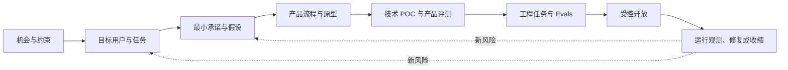
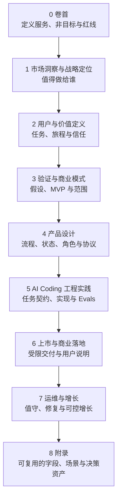
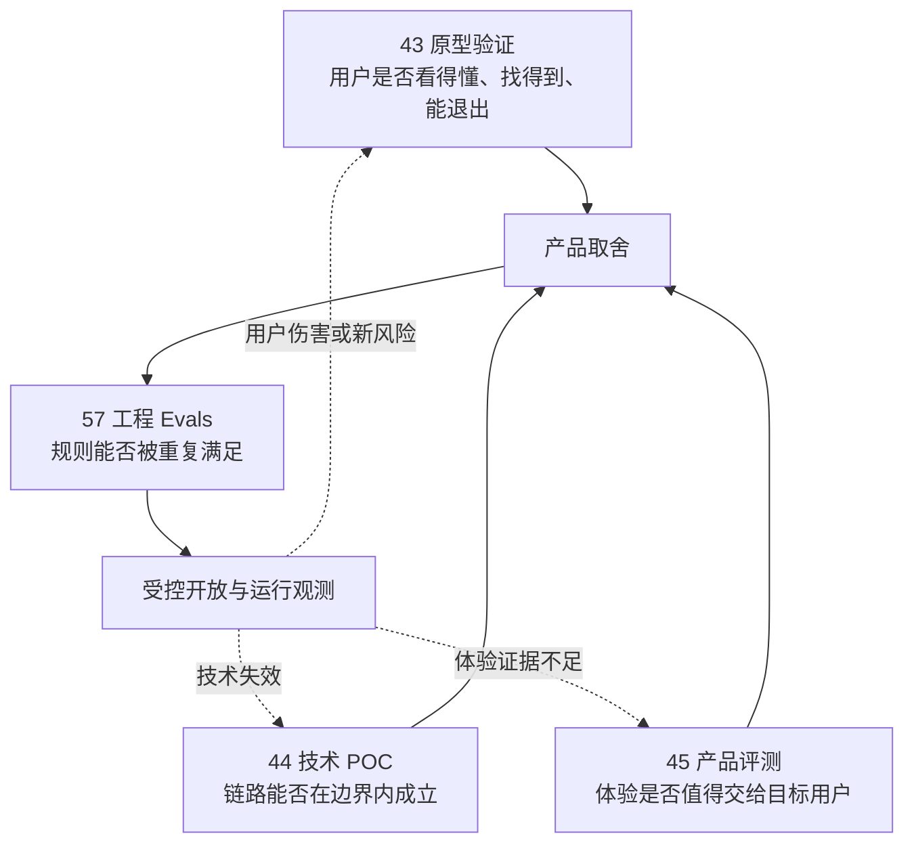
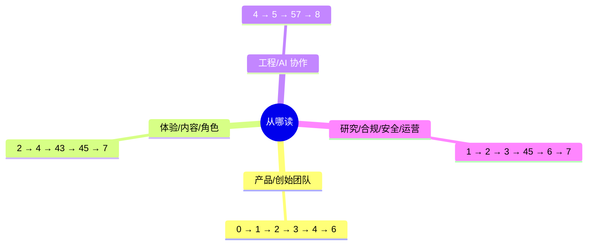
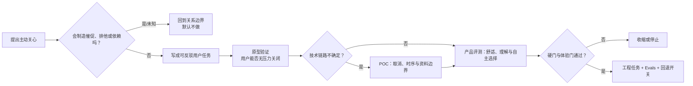
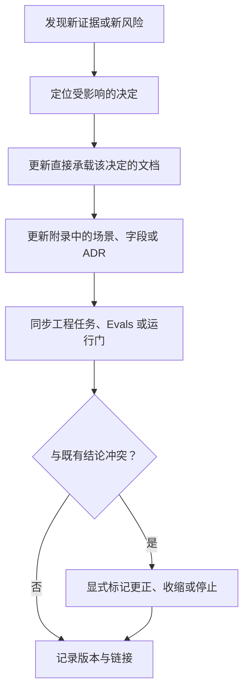

# 从 0 到 1资料包索引与使用说明

> **本资料包 v2 重写进行中（2026-09-20 启动）。**
> 依据 [ADR-0014](../adr/0014-docset-unfreeze-rewrite.md)，本目录已解冻并逐篇按现行系统与内容宪法（[docs/reviews/产品设计审查标准.md](../reviews/产品设计审查标准.md)）重写：九卷结构与编号保留；每篇主张带 status 锚（implemented-at / partial / planned / concept）或 A–D 证据分级；历史冻结版可由 git（`be1c94d^`）取回。重写按卷推进，已完成/进行中的篇目以篇内元信息为准。

> 文档类型：资料包入口与决策导航  
> 适用阶段：从机会判断到受控开放的首轮建设  
> 决策状态：首轮工作地图。每篇材料只能支持其写明范围内的决定，不能把设计假设、合成演练或工程结果包装成真实市场结论。  
> 公开资料访问日：2026-01-28。

## 遗留概念 → 现行概念映射表

| 遗留概念（旧词） | 现行概念 |
| --- | --- |
| 安静（作为一种理念/姿态） | 主动沉默（Chosen Silence，见 CONTEXT.md） |
| 静音 | 安静档／客户端控制（保留，属设置项） |
| 退出／离开权 | 干预级别（Intervention Level，三档）／结束本场／删除与退出路径 |
| 交回给用户 | 表演保持窗 + ReturnMode |
| 运营台 / operator.html | console 导播台（ADR-0011、ADR-0013） |
| `cmd/scenario` 等服务 | `backend/cmd/server` 单体 |
| 五级暂停 | 干预级别三档（"五级"为 Avoid 措辞，已废弃） |
| 话痨等级旧名（安静/轻量/标准；安静/只回应/有限提示） | 现网三档"安静/刚好/热闹"（quiet/normal/active） |
| "仅关键事实档" | planned（未实现，只能标注，不能当现状写） |
| 用户点选保存记忆 | 自动记忆 + 事后可控（画像可查可删） |

遇到旧词先查此表；重写各篇时按此表替换。

## 全套概念归属速查表

同一概念全库只在一处拥有正文，其余位置一句+链接。各概念唯一归属如下（重写代理与读者共用的导航底稿）。

| 概念 | 唯一归属（正文） |
| --- | --- |
| 红线（原则） | [0.卷首/00-产品全貌 §6.2](0.卷首/00-产品全貌.md) |
| 红线（角色实现） | [4/28 §3.3](4.产品设计/28-人格宪法与角色边界设计.md) |
| 红线（商业化） | [3/18 §7.1](3.验证与商业模式/18-商业模式与定价假设.md) |
| 非目标 | [卷首 §6.1](0.卷首/00-产品全貌.md) |
| "该不该说"开口判断 | [4/31 §4.2](4.产品设计/31-主动发言、主动沉默与话痨控制设计.md) |
| 强度分档规格 | [4/35 §3.1](4.产品设计/35-偏好、设置与无障碍设计.md)（命名以现网"安静/刚好/热闹"为准） |
| 记忆权利 | [4/38](4.产品设计/38-隐私、记忆删除与数据生命周期设计.md) |
| 记忆交互 | [4/30](4.产品设计/30-共同记忆与偏好召回设计.md) |
| 关系边界（概念／实现） | [2/11](2.用户与价值定义/11-关系边界与信任契约.md) ／ [4/28](4.产品设计/28-人格宪法与角色边界设计.md)、[4/29](4.产品设计/29-关系阶段与信任成长设计.md) |
| 事实状态机／四类表达 | [4/23](4.产品设计/23-比赛事实与公开比分设计.md) ／ [卷首 §8.1](0.卷首/00-产品全貌.md) |
| 干预（风险严重度／干预动作） | [4/36](4.产品设计/36-内容安全、依赖风险与人工干预设计.md) ／ [4/39](4.产品设计/39-实战导演台与运营配置设计.md)（动作映射 CONTEXT.md 三档） |
| 指标与反指标 | [3/16](3.验证与商业模式/16-北极星指标与指标体系.md) |
| 验证计划／验证闸门 | [3/13](3.验证与商业模式/13-需求假设与验证计划.md) ／ [3/14](3.验证与商业模式/14-MVP范围与验证闸门.md) |
| 降级优先级（语义／语音技术） | [卷首 §10.2](0.卷首/00-产品全貌.md) ／ [4/26](4.产品设计/26-语音打断、重连与降级体验设计.md) |
| 赛后收束（原则／执行） | [卷首 §7.4](0.卷首/00-产品全貌.md) ／ [4/40](4.产品设计/40-赛后跟进、通知与跨比赛回收设计.md) |
| 沉默语义 | [4/31 §4.4](4.产品设计/31-主动发言、主动沉默与话痨控制设计.md) |
| 范围收缩顺序（原则） | [卷首 §12.4](0.卷首/00-产品全貌.md) |
| 入口最小披露集 | [6/59 §6](6.上市与商业落地/59-上市准备与合规材料.md) |
| 假设登记册 | [3/13](3.验证与商业模式/13-需求假设与验证计划.md)（VH 全局编号；各篇自用假设加篇前缀） |
| L0–L4 记号 | 全库加域前缀：EV- / MEM- / REL- / RSK- / INT- / ENG- |

## 1. 这套资料包解决什么问题

它不是把项目拆成一堆"要写的文档"，而是把一个能力从问题、证据、取舍一路带到可回退的施工与受控开放。每个阶段都必须回答一个问题、留下一个可审阅的决定，并说明什么情况下要停。

贯穿全程只守五条原则：

- **先证伪再投入**：先问为什么不该做、什么会伤害用户，而不是先扩展功能清单。
- **事实与表达分开**：比赛事实、用户观察、角色表达和运营指令不能互相越权。
- **用户控制优先**：安静档等客户端控制、严格保护、干预级别、暂停与删除压过生成、播放、缓存和重试。
- **多媒介等价**：语音、舞台和动效可以成为主要体验出口；事实、控制、错误和退出必须始终清楚可达，关键任务至少保留文字或结构化等价路径。
- **范围小于结论**：每个结论都写明人群、场景、媒介和证据等级；未知就保留未知。

## 2. 九阶段怎么读

- **卷首**：冻结一句话定义、非目标、最低边界和待验证命题。
- **市场与战略**：判断观看行为、竞争、监管、市场规模和定位是否足以进入研究；不把"大市场"当立项理由。
- **用户与价值**：把人群、观看进度、用户任务、关系边界与退出路径写成可研究的问题。
- **验证与商业**：排出假设优先级，明确 MVP 不做什么，以及价格、获客和风险要怎样被证伪。
- **产品设计**：把一场陪看的进入、状态、控制、表达、结束和资料权利组织成完整体验。
- **工程实践**：工程实践卷（20 篇；其中 47/56/57 已被 [`docs/球球课程/`](../球球课程/README.md) 同源重写；整卷处置方式讨论中，属 ADR-0014 遗留项）。
- **上市与运维**：定义何时可以受控开放、怎样说明限制、谁值守以及出现风险如何停止。
- **附录**：沉淀场景卡、状态机、字段、协议、提示词和 ADR，供后续复用而非替代决策。

### 产品设计的分层阅读路径

进入"4.产品设计"时，先阅读 `20A-技术约束与选型原则.md`，再阅读 `20-产品设计总览.md`，随后按任务域阅读 `21–46`。推荐顺序为：`20A → 20 → 21–24 → 25–27 → 28–32 → 33–35 → 36–40 → 33A → 41–42 → 43–44 → 45–46`。`20A` 负责前置技术边界，`20` 负责产品命题与统一控制模型，后续文档负责各能力域的详细设计。其中 `43` 为历史存档（Stitch 原型阶段已被真实端与 Playwright 走查取代）；`44` 属卷 5 处置范围，见 §4 注。

## 3. 四类验证不能混写

这四篇都可能提到同一条能力，但问的是不同问题，产物不能互相替代。

- **原型验证**留下的是页面、流程、误解与退出观察；它不证明技术链路或用户价值已经成立。
- **技术 POC**留下的是受限输入下的可行性、失败收缩和候选方案；它不证明体验值得扩大。
- **产品评测**留下的是产品范围、硬门、受控研究和体验决定；它不替代可重复的工程断言。
- **工程 Evals**留下的是黄金集、判定器、回归和 CI 门；它不能把绿灯解释成用户喜欢或市场成立。

## 4. 按角色选择阅读路径

如果只需处理一个新需求，先看它影响哪一种边界：用户任务、比赛事实、用户控制、关系表达、资料权利还是工程可靠性。然后只打开相应阶段的材料，不以"补文档"为目标。

> 注：工程路径已移除 `44`（该篇属卷 5，整卷处置方式讨论中）；卷 5 处置后更新本图。

## 5. 一条新需求怎样变成可交付决定

以"为提高留存，增加主动关心"为例：它不能直接进入需求池，而要先经过边界、研究、原型和工程四次不同的审视。

交付时至少应有五件东西：问题与非目标、可反驳假设、用户可见失败路径、证据与范围、下一步的保留/收缩/停止决定。没有这些，就不是可交付决定。

## 6. 更新、冲突与审阅规则

- 证据冲突时，不静默覆盖旧结论；标明哪个范围失效、谁需要复审、相关能力是否先关闭。
- 产品决定优先于表现层便利；用户控制与资料权利优先于增长与自动化；硬门优先于平均分。
- 所有提示词、协议和测试资产都必须回链到一个用户承诺或风险场景，不能成为孤立的工程产物。
- ADR 的唯一权威在 [`docs/adr/`](../adr/)（0001–0014）；`8.附录/附录J` 仅为方法论与指针，不单独承载决定。

## 7. 资料包验收（ADR-0004 修订）

验收的重点不是关键词命中率——旧规则要求每章写「退出/边界/停止条件」，产出的是 1101 次「退出」而不是任何可核查的知识。验收结算的是证据：读者能否追溯「这个主张凭什么成立、在哪行代码、哪个评测会抓住它失效」。当任一答案缺失，就回到证据包补锚点，而不是继续增加表现层细节。

v2 重写由宪法审查代理按本节逐篇验收；每篇重写后，本表为通过标准。
