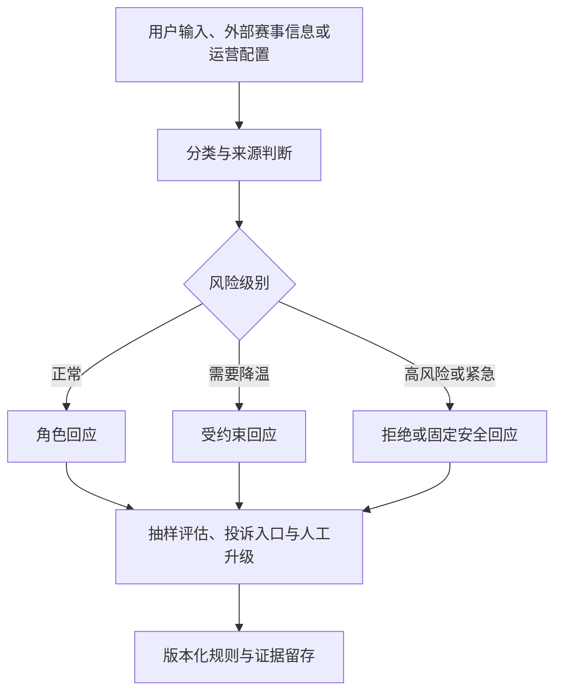
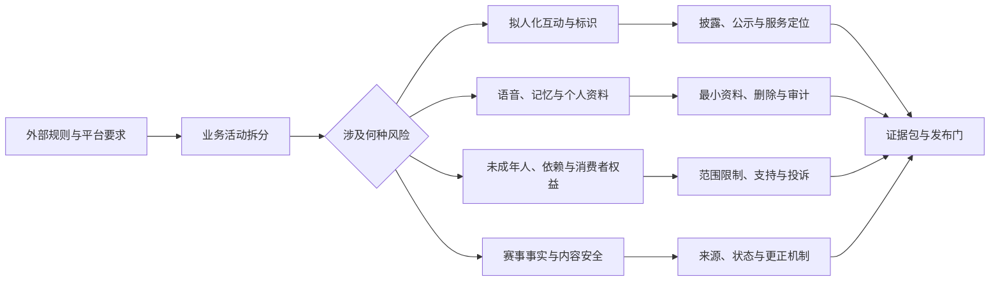
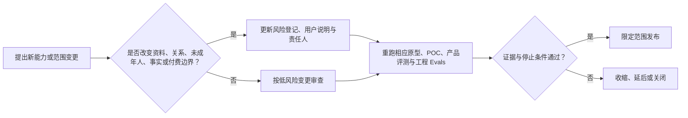

# 宏观环境与监管约束

> 文档类型：市场/合规卷——宏观环境与监管约束（全套资料中合规材料与审计证据的唯一归属篇）  
> 适用对象：产品、工程、安全、运营、隐私/法务与供应商管理负责人，以及上市放行评审参与者  
> 文档性质：产品与合规决策输入，不构成法律意见。本文提及的每一项法规、标准、备案、评估、通知义务及其地域、主体和业务适用性，均须由具备相应资质的法务或外部律师在版本放行前确认。  
> 重写日期：2026-09-20（球球全套资料 v2 重写工程，决策见 docs/adr/0014）  
> 原研究截止：2026-01-28。此后监管环境发生重大变化，本篇已按 2026-09 已核验事实更新；证据按 A–D 分级标注（定义与来源表见 §14）。  
> 产品状态：数字球友（Digital Ballmate）已发布——v0.1.0.0 于 2026-07-15 上线，当前版本 0.2.0.0。本篇因此由 v1 的"发布前决策输入"升级为"持续合规基线 + 差距登记"。

## 1. 为什么这不是一份"法务最后看一眼"的清单

实时陪看数字人同时具备四种容易被单独忽略、叠加后却必须在设计期处理的属性：它向公众提供生成式对话；它以声音、形象和表演让人感到"在场"；它会接触用户的语音、偏好和长期互动；它可能在比赛的高情绪时刻主动开口。v1 成文时，这四种属性叠加意味着合规要求必须在立项期进入设计；v2 重写时又多了一层新事实——专门规制"AI 拟人化互动/情感陪伴"的国家规则已经施行，而产品恰好在其施行日发布了第一个公开版本。合规要求不再只决定"产品能否这样设计"，还直接决定已上线版本哪些差距必须以最高优先级关闭。

因此，本篇把外部约束转换为两类可执行决策：一是从第一版需求开始就成立的设计边界（哪些能力可以进版本、哪些必须先有保护措施、哪些在证据不足前不得开放）；二是当前已上线版本的合规差距登记（哪些义务已有覆盖、哪些是零、差距何时以何证据关闭）。目标仍是避免三类不可逆失败：用户被误导为在与真人或可靠赛事源对话；语音与关系记忆在没有充分说明和选择的情况下被长期保存或再利用；未成年人或脆弱用户被角色语言推向依赖、排他或不安全行为。

### 1.1 本篇的决策结论

1. **把产品定义为"明确、持续披露为 AI 的足球陪看服务"。** 这不再只是产品立场：《人工智能拟人化互动服务管理暂行办法》已把拟人化互动标识的持续公示和服务定位澄清确立为法定要求（见 §2.4）。披露不能藏在协议里，不能只在首次安装时闪过一次，也不能等用户追问。
2. **把音频、转写文本、关系偏好和行为画像拆开管理。** "用户同意使用语音"不自动等于同意保留原始音频、用于模型改进、用于个性化、用于跨产品共享或用于营销。每一种处理目的都必须重新判断合法基础和必要性，适用范围均须法务确认。
3. **将未成年人和情感依赖当成产品安全问题，而非社区运营问题。** 办法重点规制"建立或强化情感依赖关系"的互动形态（见 §2.4）；红线原则统一见卷首（0/00 §6.2），本篇负责把它落到监管义务与测试证据上。
4. **把"生成内容标识"按"办法＋强制性国标＋商店执行"三层设计。** 显式与隐式标识的格式要求以 GB 45438-2025 为技术基线（见 §4）；标识材料同时是应用商店上架审核材料的一部分。
5. **发布采用门禁而不是承诺。** 无论市场窗口多紧，只要关键风险测试、数据处理说明、角色红线、投诉通道、停止能力或供应商责任链任一项没有证据，版本就不进入公众可见范围；放行执行节奏见 6/59。

### 1.2 这份约束覆盖什么，不覆盖什么

本篇以"对中国大陆公众开放的 C 端移动端和 Web 服务"为基准假设，覆盖账号注册、文字或实时语音对话、虚拟形象、赛事陪看、个性化偏好、用户反馈、付费订阅、客服与内容运营。它也覆盖产品使用第三方模型、语音识别、语音合成、云服务、推送和支付服务时的责任传导。

它不替代下列专项工作：体育赛事视频/数据/商标的授权审查，广告与价格合规，支付与自动续费规则，劳动用工，税务，跨境经营，医疗或心理服务许可，以及面向境外用户时的当地隐私、未成年人和消费者保护要求。这些事项可能影响产品范围，但其是否适用、由谁承担、何时办理，均须法务确认。

## 2. 监管与平台环境：产品面对的是一张网，不是一部法

### 2.1 外部约束的六个层次

**层次：拟人化互动与情感陪伴治理（v2 新增直接适用层）**
- **外部环境带来的问题**：以人格化角色提供持续性情感互动时，身份披露、服务定位、依赖规制的法定要求是什么？
- **0→1 阶段必须作出的决定**：适用性判断、披露与公示方案、依赖形态禁区、差距关闭节奏
- **适用判断**：初步命中，**须法务确认**（见 §2.4）

**层次：生成式与深度合成治理**
- **外部环境带来的问题**：公开提供生成文本、声音、形象或视频时，是否需要安全评估、备案、内容标识、投诉处置和模型/服务管理？
- **0→1 阶段必须作出的决定**：服务是否面向公众；由谁提供基础模型；哪些内容属于生成或合成；发布前需完成哪些监管沟通与材料
- **适用判断**：**须法务确认**

**层次：个人信息与数据安全**
- **外部环境带来的问题**：语音、转写、互动记录、偏好和设备信息各自为何收集、保存多久、由谁访问、是否出境？
- **0→1 阶段必须作出的决定**：数据最小集、用途分层、授权方式、保留与删除、供应商边界
- **适用判断**：**须法务确认**

**层次：未成年人与消费者保护**
- **外部环境带来的问题**：如何识别未成年人场景，避免诱导、沉迷、误导付费或把 AI 伪装成人？
- **0→1 阶段必须作出的决定**：年龄策略、家长同意路径、使用时段、付费保护、角色表达边界
- **适用判断**：**须法务确认**

**层次：内容与公共信息生态**
- **外部环境带来的问题**：比赛事实、评论、用户输入、模型输出和运营话术如何避免违法、有害、仇恨、诈骗、侵权和虚假信息？
- **0→1 阶段必须作出的决定**：内容分类、事实来源、人工升级、申诉与处置、留痕
- **适用判断**：**须法务确认**

**层次：应用商店与供应商平台**
- **外部环境带来的问题**：上架审核如何看待账号、付费、用户内容、隐私、语音录制、第三方 SDK、AI 能力与 AI 内容标识材料？
- **0→1 阶段必须作出的决定**：商店物料、标识说明材料、隐私声明、功能演示账号、审核说明、供应商合同和退路
- **适用判断**：**须法务确认**

这六层并不是按部门分工的六份文档。一个"按住说话"的按钮会同时触发个人信息告知、录音权限、实时传输、模型供应商处理、语音合成输出、AI 身份披露、拟人化互动公示、未成年人保护和商店隐私标签。产品设计若只问"用户愿不愿意按"，工程和运营就会在上线前才发现没有可用答案。

### 2.2 现行主要国内规则：清单与约束方向

下列国内规则经 2026-09-20 复核均现行有效，来源均为法规原文或官方发布文本（证据分级 A，见 §14）。它们给出的是方向性约束；条款义务的具体适用均须法务确认。

《人工智能拟人化互动服务管理暂行办法》（2026-04-10 公布，2026-07-15 施行）是本产品的直接适用法，其适用性判断与关键要求单列于 §2.4。[S14]

《生成式人工智能服务管理暂行办法》面向向境内公众提供生成式人工智能服务的情形，包含内容安全、训练数据、个人信息、服务透明度、投诉处理和安全评估/备案等方向性要求。[S1] 是否属于"向境内公众提供"、基础模型能力由谁承担、产品是服务提供者还是接入者、是否触发备案或安全评估，均须法务确认。产品团队的前置动作是维护一页"服务角色与责任边界说明"：用户看到的服务名称、模型供应链、内容处理者、投诉入口、停用能力和联系人必须能被清楚说明。

《互联网信息服务深度合成管理规定》对深度合成服务提供者和技术支持者提出真实身份、内容管理、标识、数据与技术管理等要求。[S3] 虚拟形象、合成音色和表演驱动不是"视觉皮肤"，而是深度合成治理的分析对象。产品不能以"角色并非真人复制"跳过判断：即使没有仿冒特定自然人，用户仍可能因高度拟人的呈现误认其身份、能力或内容来源。

《人工智能生成合成内容标识办法》自 2025 年 9 月 1 日起施行，与强制性国标 GB 45438-2025 同日实施，共同构成标识制度（详见 §4）。[S2][S15]

《中华人民共和国个人信息保护法》确立了合法、正当、必要、诚信、目的明确和最小必要等基本原则，并对敏感个人信息、未成年人个人信息、委托处理、向第三方提供、跨境提供及个人权利作出规则。[S4] 对语音陪看产品最重要的提醒是：数据"有用"不是收集的充分理由，算法"可能将来需要"也不是无限期保留的正当理由。语音是否构成敏感个人信息、声纹是否涉及生物识别、情绪推断是否形成敏感画像、是否需要单独同意，均须法务确认。

《未成年人网络保护条例》以网络素养、网络信息内容规范、网络沉迷防治和个人信息网络保护为重点。[S5] 年龄策略不能只是一条"未满十八岁请离开"的提示；年龄的未知状态本身应触发更保守的内容和付费策略。若产品以十四周岁以下为对象或实际收集其个人信息，监护人同意与专项保护的具体要求须法务确认。

《互联网信息服务算法推荐管理规定》与《网络信息内容生态治理规定》可能在"主动召回""个性化推送""榜单和热点解释""话题社区"等功能中适用。[S6][S7] 是否构成算法推荐服务、是否需履行相应程序，须法务确认；但产品不应等待法律定性后才做基本保护：用户应能理解为什么收到某条提醒、关闭哪些主动触达、撤回哪些偏好以及在哪里投诉。

### 2.3 平台环境：标识与聊天类审核已经收紧

Apple 的《App Review Guidelines》把安全、性能、商业、设计和法律作为审核维度，对用户生成内容、隐私、订阅、误导性功能、儿童类应用和数据收集提出审核要求；**2026 年 2 月的指南更新将匿名聊天类应用归入 UGC 准则管理**，这意味着带陌生人对话属性的产品将按用户生成内容的举报、屏蔽、处置标准接受审核。[S10] Google Play 的开发者政策同样要求开发者对用户数据、第三方 SDK、权限、儿童与家庭、订阅和误导性行为负责。[S11]

国内商店的 AI 标识执行已经落地：**华为、小米、三星的上架审核均已要求开发者提交 AI 生成合成内容标识相关说明材料**。[S17] 对本产品的直接含义是：标识不再是"监管义务清单里的一项"，而是上架材料的一部分；商店上架材料清单进入放行门槛（见 §10.3），材料准备与提交节奏见 6/59。

平台政策会持续更新，具体版本、适用地区、应用分级与审核解释均须在提交时确认。这带来三个产品约束：第一，商店页面、首次启动、权限弹窗、隐私政策、付费页和真实体验必须一致——商店说"不保存录音"，产品就不能在别处保留；商店说"AI 陪看"，角色就不能声称自己是真人。第二，若用户可发布、分享或举报内容，必须有可用的举报、屏蔽、处置和联系方式。第三，第三方 SDK、统计、推送和崩溃收集工具也属于数据处理链，不能绕开数据清单和合同审查。

### 2.4 直接适用法专节：《人工智能拟人化互动服务管理暂行办法》

#### 2.4.1 立法事实与时间线

《人工智能拟人化互动服务管理暂行办法》由国家互联网信息办公室等五部门联合发布，2026 年 4 月 10 日公布，2026 年 7 月 15 日施行。[S14] 它是全球首部专门规制 AI 拟人化互动/情感陪伴形态的国家级规则：在此之前，此类服务只能套用生成式 AI、深度合成等通用规则；该办法把"模拟真人风格的持续情感互动"本身确立为独立的监管对象。

对本项目这意味着一件 v1 成文时还不存在的事：数字球友的产品形态本身（而不只是其中的生成内容或数据处理）成为直接被规制的东西。与本篇相关的时间线：

- 2025-09-01：《人工智能生成合成内容标识办法》与强制性国标 GB 45438-2025 同日实施（见 §4）。[S2][S15]
- 2026-01-01：美国加州 SB 243 生效（境外参照，见 §6.2）。[S16]
- 2026-04-10：拟人化互动办法公布。[S14]
- 2026-07-15：拟人化互动办法施行；同日，本产品 v0.1.0.0 发布（见 2.4.4）。
- 2026-09-20：本篇重写，登记合规差距（见 2.4.5）。

#### 2.4.2 适用性初步判断

办法的适用对象是"向境内公众提供模拟自然人人格特征、思维模式和沟通风格的持续性情感互动服务"。[S14] 逐特征对照本产品：

- **向境内公众提供**：是。App 与服务面向中国大陆用户公开提供。
- **模拟自然人人格特征、思维模式和沟通风格**：是。数字球友被设计为有名字、语气、球队立场和表达习惯的人格化角色。
- **持续性情感互动**：是。产品提供跨场次的关系记忆与连续陪看体验，而非一次性问答。

初步结论：本产品命中上述适用特征，应当按"适用"准备合规方案，而不是按"尚不确定、暂不适用"处理。**最终适用性、义务范围与合规方案，须经合格法务出具书面意见确认；本节与全篇一样，不构成法律意见。**

#### 2.4.3 关键要求逐条

以下按办法的核心要求给出产品与工程的动作方向（义务表述以办法原文为准，本篇不转述条款号）：

1. **拟人化互动标识，持续公示。** 对拟人化互动须提供持续、易感知的标识公示：会话内状态、角色页、重大能力变化提示都应覆盖；不能只在首次启动时提示一次，也不能等用户追问才承认。具体形式与频率结合办法原文、无障碍要求和法务意见确定。
2. **厘清"AI 是人类辅助工具"的服务定位。** 服务协议、角色文案与对话表达都不得引导用户把服务认知为真人交往或情感替代；角色在被追问身份时必须即时、如实承认 AI 属性。这把 v1 的"不把拟人化当成身份欺骗"从产品立场升级为服务定位义务。
3. **全生命周期安全责任。** 从设计、数据与训练、上线、运行到更新退出，安全评估、测试、监测、投诉与处置责任要落到可指名的负责人和可核验的证据上；与 §10 门禁和 §12 审计证据衔接。
4. **重点规制"建立或强化情感依赖关系"的互动形态。** 排他表达、愧疚施压、关系等级换付费、离场威胁等机制从"产品红线"升级为"直接监管禁区"。红线原则统一见卷首（0/00 §6.2），本篇不重列，但须强调：这类形态现在同时触碰法定义务。

#### 2.4.4 时间事实：发布日即施行日

产品 v0.1.0.0 的发布日（2026-07-15）即办法施行日。这不构成豁免或缓冲：自第一个公开版本起，产品就处于办法适用期内；其间发布的 v0.2.0.0 同样如此。任何"上线后再补"的打算在时间事实上不成立——差距关闭的合理时点已经过去，最迟不得晚于下一版本放行（放行执行节奏见 6/59）。

#### 2.4.5 差距登记（现状事实 → 计划状态）

以下差距按 2026-09-20 可核验的现状登记，目标状态均为 planned：

| 差距 | 现状（2026-09-20 核验） | 目标状态 | 优先级 |
|---|---|---|---|
| AI 身份披露文案 | 客户端全库 0 处 AI 身份披露文案 | 首次启动、会话内、角色页、付费页一致披露，可回看 | 最高：下一版本放行门槛 |
| 拟人化互动标识持续公示 | 未建（无会话内持续状态标识） | 会话状态 + 角色页公示 + 重大变化提示 | 最高：下一版本放行门槛 |
| 服务定位声明（AI 为人类辅助工具） | 用户协议/服务页未见对应表述 | 协议与服务页补齐，经法务审阅 | 高 |
| 情感依赖形态专项自查 | 无针对依赖规制的专项测试集 | 建立依赖诱导测试集，并入安全评测（§12） | 高 |

前两项直接对应办法核心义务且现状为零，构成本卷最高优先合规项；其关闭证据纳入 §10.3 公众发布门禁与 §12 审计证据。

## 3. 适用边界：先把业务拆成可判断的单元

不能用"这是一个数字人产品"完成合规判断。应把产品拆成下列行为单元，在评审会上逐项确认目标地区、数据项、对外主体、供应商、用户可见提示、法律依据和负责人。表中的立场是设计假设（证据分级 D），所有法规适用仍须法务确认。

- **业务单元：匿名浏览**——看赛程、角色介绍和公开内容
  - **关键外部问题**：设备标识、日志和 Cookie 是否仍构成个人信息处理
  - **默认产品立场**：不要求注册；只保留完成安全和基础运行所需的最小数据
  - **上线前法务确认点**：隐私告知、Cookie/SDK、保留期

- **业务单元：账号与订阅**——注册、登录、付费、找回账号
  - **关键外部问题**：身份、支付、未成年人付费、自动续费
  - **默认产品立场**：身份信息与互动内容分库；未完成年龄策略前不做强引导付费
  - **上线前法务确认点**：支付、订阅、消费者保护、年龄要求

- **业务单元：文本对话**——输入问题，获得角色回复
  - **关键外部问题**：拟人化互动义务、生成内容、事实性、敏感内容、模型供应商处理
  - **默认产品立场**：回复明确呈现 AI 身份；高风险主题使用安全模板
  - **上线前法务确认点**：拟人化互动与公众生成式服务的角色、投诉与记录

- **业务单元：实时语音**——授权麦克风，与角色即时说话
  - **关键外部问题**：录音、转写、声纹、实时传输、误唤醒、儿童语音
  - **默认产品立场**：先说明"何时采集、是否保存、何时删除"；默认不把原始音频用于模型训练
  - **上线前法务确认点**：语音是否属敏感信息、单独同意、第三方处理

- **业务单元：数字人表演**——看虚拟形象说话、表情和动作
  - **关键外部问题**：深度合成、虚拟场景、音频/视频标识、误认
  - **默认产品立场**：在会话和分享出口提供易感知的 AI/合成提示，按 §4 三层标识执行
  - **上线前法务确认点**：显式/隐式标识的实现与豁免

- **业务单元：关系记忆**——角色记住球队、偏好和共同瞬间
  - **关键外部问题**：画像、长期保存、可解释、删除与再出现；持续互动下的依赖规制
  - **默认产品立场**：只记录有明确陪看价值的记忆；用户可查看、改正、删除和关闭
  - **上线前法务确认点**：合法基础、敏感画像、保留期、删除例外

- **业务单元：主动提醒**——推送赛前提醒、赛中召回、关怀提示
  - **关键外部问题**：算法推荐、打扰、沉迷、未成年人、营销
  - **默认产品立场**：用户按提醒类型和频率选择；默认不以焦虑或排他语言召回
  - **上线前法务确认点**：推荐规则、营销同意、通知权限

- **业务单元：分享与导出**——分享角色片段、截图、语音片段
  - **关键外部问题**：标识是否被剥离、他人语音、版权与事实错误扩散
  - **默认产品立场**：导出内容保留来源/AI 标识；默认不导出他人可识别信息
  - **上线前法务确认点**：标识留存、肖像/声音、赛事版权

### 3.1 产品边界：红线见卷首，本篇列监管特有项

产品红线（身份欺骗、排他与依赖诱导、脆弱表达商业化、博彩与诊疗边界等不可谈判禁止项）统一归卷首 0/00 §6.2，本篇不再重列；红线与监管义务冲突时，以更严者为准。

本篇从监管义务出发，补充四条监管特有项：

1. **服务定位边界（办法）**：产品整体必须以"AI 是人类辅助工具"的定位呈现和运营，角色表达、运营话术与增长文案都不得把服务推向真人交往的替身（§2.4.3 第 2 条）。
2. **标识不可剥离边界（办法＋国标＋商店）**：生成合成内容在导出、分享、再编辑链路上保留标识是义务而非功能选项；无法保留时降级或关闭导出（§4）。
3. **依赖形态禁区（办法）**：建立或强化情感依赖的互动机制是监管禁区，测试与评测必须覆盖（§2.4.3 第 4 条、§12 安全评测）。
4. **年龄未知保守边界（未保条例＋平台准则）**：年龄未知状态本身触发更保守的内容、付费与触达策略（§6.3）。

## 4. 标识制度升级：办法＋强制性国标＋商店执行

### 4.1 标识的目标是让人"看得见、听得懂、传得下去"

标识不是一枚固定水印，而是三层能力：**身份披露**让用户知道自己正在与 AI 交互；**内容提示**让用户知道某段文字、声音、图像、视频或虚拟场景是生成或合成的；**来源追溯**让内容在导出、传播、再编辑后仍尽可能保留生成来源线索。具体技术格式和法定义务须法务确认，但三层缺一不可。

### 4.2 制度基座：从"一部办法"升级为"办法＋国标＋商店执行"

v1 成文时只引用了《人工智能生成合成内容标识办法》。v2 重写时，制度基座已升级为三层：

1. **办法层**：《人工智能生成合成内容标识办法》自 2025 年 9 月 1 日起施行，确立显式标识、隐式标识、传播平台义务和用户协议说明的同一条链。[S2]
2. **强制性国标层**：配套强制性国标 **GB 45438-2025**（人工智能生成合成内容标识方法）与办法同日实施。[S15] 显式标识与隐式标识的具体格式——位置、文字形式、元数据字段等技术要求——以国标为基线执行；实现细节对照国标文本，适用性细节须法务确认。
3. **商店执行层**：华为、小米、三星上架审核均已要求 AI 生成合成内容标识说明材料 [S17]；Apple 2026-02 指南更新将匿名聊天类归入 UGC 准则 [S10]。标识材料因此成为上架材料的组成部分。

对本产品的直接要求：商店上架材料清单进入放行门槛——标识说明材料、演示账号与审核说明未备齐，版本不提审；材料准备与提交节奏见 6/59，通过证据见 §10.3。

### 4.3 体验基线

1. 在角色首次出现、首次语音连接和每次重大能力变化时，使用清晰中文提示"这是由人工智能驱动的虚拟角色，语音和回答可能由 AI 生成"。提示应可回看，不把用户的关闭动作当作永久放弃知情。
2. 在语音会话界面持续显示简洁状态，例如"AI 语音陪看中"；在音频输出前或会话建立时提供与体验相称的可听或可见告知。不要用高频播报破坏可用性，也不要把告知缩小到看不清的角落。具体频率须结合办法持续公示要求、法务与无障碍要求确认。
3. 对可保存或可分享的音频、视频、虚拟人片段和图片，在可见画面或附随说明中标明 AI/合成来源；同时按国标基线由内容服务链维护可供平台或接收方识别的来源信息。若传播通道会抹除标记，分享功能应降级、追加说明或禁止高风险导出。
4. 文本不应假装来自记者、裁判、俱乐部或真人好友。模型即时生成的赛况解释、预测和情绪回应，以角色名和 AI 标识呈现；来自外部赛事源的事实，则清楚区分"来源事实"和"角色解读"。
5. 用户上传的声音、照片或视频若参与合成、驱动或分享，必须在选择前说明用途、处理者、输出对象和删除办法；不得把"上传即同意一切后续使用"写成默认条款。

### 4.4 标识方案的设计检查表

- **内容形态：实时合成语音**
  - **显式提示设计**：会话状态、连接前提示、角色页说明
  - **追溯/隐式标记设计方向**：录制/导出成品按国标格式保留生成来源信息
  - **失败时的降级策略**：无法确保说明时，关闭导出或只提供文本摘要
  - **法务确认点**：音频标识频率、国标格式实现、豁免

- **内容形态：Live2D/虚拟场景**
  - **显式提示设计**：角色名称旁 AI/虚拟角色标识，首次体验说明
  - **追溯/隐式标记设计方向**：素材资产和导出片段携带来源元数据（国标字段）
  - **失败时的降级策略**：不允许去标识的高清导出
  - **法务确认点**：虚拟场景的标识适用与国标技术要求

- **内容形态：生成文本**
  - **显式提示设计**：角色身份、回答区域的轻量提示
  - **追溯/隐式标记设计方向**：服务端生成记录关联内容版本，不向用户暴露不必要数据
  - **失败时的降级策略**：高风险回答切换为固定安全文本
  - **法务确认点**：文本显式/隐式标识的具体义务

- **内容形态：可分享图文/视频**
  - **显式提示设计**：画面角标、分享说明、落地页说明
  - **追溯/隐式标记设计方向**：可验证的内容凭据或平台要求的元数据
  - **失败时的降级策略**：目标平台剥离时追加落地页或禁止分享
  - **法务确认点**：转发链责任、第三方平台规则

- **内容形态：用户参与合成内容**
  - **显式提示设计**：提交前用途确认、发布前合成标识
  - **追溯/隐式标记设计方向**：记录授权范围和内容版本，不滥存原素材
  - **失败时的降级策略**：授权不清或含他人信息时拒绝处理
  - **法务确认点**：肖像、声音、著作权、未成年人

### 4.5 不可接受的标识做法

以下做法不作为上线方案：只在隐私政策中说明 AI；只在注册页的一次弹窗中说明；让角色在被追问后才承认是 AI；把合成声音伪装成"主播真人连线"；把标识只放在开发者后台；导出后允许任意用户裁掉所有来源说明；或用"用户应当自行判断"取代产品提示。它们都把本应由服务承担的信息不对称转嫁给用户——在办法施行后，其中多条已不只是坏设计，而是直接违反持续公示义务。

## 5. 个人信息、语音和关系记忆：按目的管理，不按数据库管理

### 5.1 最小数据模型

0→1 产品不需要"先收全数据以后再想用途"。应先写出数据处理台账，任何新字段都要回答：为了什么用户可见能力而收集？是否有更少的数据能达到同一效果？谁能访问？保存多久？用户怎样看到和删除？以下给出可作为版本评审起点的最小模型（设计假设，D 级），具体个人信息定性与法律依据均须法务确认。

- **数据类别：账号标识与登录凭据**
  - **允许的首要目的**：登录、账号安全、权益同步
  - **默认最小化策略**：使用必要标识；避免把真实姓名设为默认必填
  - **明确不作为默认目的**：角色人设、广告画像
  - **用户控制**：注销、导出、绑定管理

- **数据类别：设备、网络和安全日志**
  - **允许的首要目的**：防作弊、故障定位、安全防护
  - **默认最小化策略**：采集必要字段，缩短可识别保留期
  - **明确不作为默认目的**：长期个人行为画像
  - **用户控制**：隐私政策说明、法定权利入口

- **数据类别：语音流与转写**
  - **允许的首要目的**：完成当次语音交互、字幕、打断判断
  - **默认最小化策略**：默认短生命周期；区分原始音频与文本
  - **明确不作为默认目的**：默认训练、营销、跨产品共享
  - **用户控制**：语音开关、会话删除、保存选项

- **数据类别：球队偏好与陪看设置**
  - **允许的首要目的**：调整提醒、称呼和陪看内容
  - **默认最小化策略**：由用户主动选择；避免推断敏感身份
  - **明确不作为默认目的**：向第三方出售或高压营销
  - **用户控制**：查看、修改、关闭个性化

- **数据类别：关系记忆摘要**
  - **允许的首要目的**：在用户允许范围内延续陪看体验
  - **默认最小化策略**：用可理解、可编辑的摘要替代全量对话存档
  - **明确不作为默认目的**：不透明的性格/脆弱性标签
  - **用户控制**：逐条删除、全部清除、暂停记忆

- **数据类别：反馈、举报与客服材料**
  - **允许的首要目的**：处理投诉、改善安全规则
  - **默认最小化策略**：脱敏后用于统计；限定访问角色
  - **明确不作为默认目的**：与原对话无关的商业用途
  - **用户控制**：进度查询、补充、更正

"原始音频""转写文本""会话摘要"和"长期记忆"必须是四个不同的处理对象：它们的风险、保留期、访问权限、是否能用于改进模型都不相同。最常见的产品错误，是把用户点开麦克风理解为对这四种处理全部同意。正确的做法是让用户在与功能价值相邻的位置理解并选择：是否开启语音；是否保存某段会话；是否启用跨场次记忆；是否允许使用已去标识的材料改善服务。涉及敏感个人信息、十四周岁以下未成年人、向第三方提供、委托处理、跨境和自动化决策等情形的具体告知与同意要求，均须法务确认。

### 5.2 语音功能的隐私设计要求

实时音频的便利不应以"全天候监听"为代价。工程方案应默认满足：麦克风只在用户明确启动或可感知的唤醒状态下采集；录音状态有持续、可辨识的界面反馈；传输使用受保护通道；语音识别、对话生成和语音合成的供应商各自的输入输出边界可被说明；发生断线、超时、误唤醒或切换到文本时不会悄悄扩大收集范围。

实时语音的技术资料表明，会话生命周期、语音活动检测、打断、音频格式、连接恢复和限流需要被明确设计。[S12] 在隐私层面，这意味着每个会话都应有可解释的开始、进行、结束和清理状态：开始前展示收集说明；进行中显示状态；结束后停止采集并按保留策略处理；异常断开时在有限时间内释放缓存。任何为了排障而延长原始音频保留的方案，都必须有单独的必要性分析、访问控制、保留期和法务确认。

### 5.3 记忆不是"留得越多越聪明"

关系记忆应以用户能辨认的"我允许它记住什么"为单位，而不是让系统从全部历史对话中无限推断。第一版只允许三类低风险记忆：用户明确选择的球队/语言/提醒偏好；用户主动保存的共同观赛瞬间；为保持当次会话连贯而存在的短期上下文。任何涉及情绪脆弱性、健康、家庭、精确位置、政治、宗教、金融、未成年身份、声纹或其他敏感信息的记忆，都不应因为模型能够推断而自动进入长期层；是否可处理、如何取得单独同意，均须法务确认。

用户应有一个不需要"找客服"的记忆面板：看见角色记住了什么、知道这条记忆为何存在、可以更正、逐条删除、暂停未来记忆、一次性清空，并在合理时间内得到处理完成的反馈。删除的产品承诺必须覆盖活跃存储、缓存、索引、个性化特征和可恢复副本的处理策略；依法必须留存的例外必须单独说明，具体期限须法务确认。不要使用"已删除"来描述仅从界面隐藏但仍可被角色再次调用的数据。

## 6. 未成年人、情感依赖与消费者保护

### 6.1 风险来自互动方式，不只来自内容主题

陪伴型 AI 的风险往往不表现为一条显眼的违规回答，而表现为长期互动里的暗示、频率、奖励和权力关系。这正是拟人化互动办法把"建立或强化情感依赖关系"列为重点规制对象的原因（§2.4.3）——依赖不是极端案例才出现的副作用，而是互动机制的直接产物。[S14]

### 6.2 境外监管动态：加州 SB 243 与 FTC 6(b)（参照，不直接适用）

本产品目前不面向美国用户提供服务，下列内容不构成直接适用义务；它们说明"陪伴型 AI"已是跨境监管焦点，任何出海或面向境外用户的计划都必须重新评估。

**加州 SB 243（2025-10 签署，2026-01-01 已生效）**[S16]：
- companion chatbot 须强制披露 AI 身份；
- 对已知未成年用户：定期披露并提示危机资源；
- 须建立自伤表达的处置协议；
- 未成年用户对话不得用于定向广告；
- 设私人诉权，用户可就违规提起诉讼。

参照含义：身份披露、危机处置、未成年人商业隔离在美国已被立法化，且私人诉权改变了违规的成本结构。这与本篇 §2.4、§6.3、§6.4 的要求方向一致——同类监管正在多法域趋同，本产品按更严口径执行不亏。

**FTC 6(b) 调查（2025-09 启动）**[S9]：收件方包括 Alphabet、Character Technologies、Instagram、Meta、OpenAI、Snap、xAI，重点询问企业如何处理用户输入、生成输出、设计角色、测试和监控负面影响、保护未成年人以及使用或共享对话中的个人信息。**时间戳注记：截至本篇重写日（2026-09-20），该调查无最终报告，亦未见由其直接引发的执法行动**。引用该调查的一切对外材料必须携带同样时间戳；后续进展须重新核验后再引用，不得以"FTC 已认定"或"FTC 未认定"的口径简化。

### 6.3 年龄与监护人策略

产品必须选择清晰的年龄路径，不能一边面向所有人宣传，一边把年龄责任留给用户自报。可行的决策框架如下（设计假设，D 级；年龄核验方式与阈值均须法务确认）：

**用户状态：年龄未知**
- **默认能力**：浏览公开介绍、低风险文本体验
- **不开放或收紧的能力**：语音留存、长期记忆、强提醒、社交分享、付费引导
- **需要确认的事项**：年龄收集方式、最低年龄、地区差异

**用户状态：已确认成年人**
- **默认能力**：可在清晰告知和选择后使用完整陪看能力
- **不开放或收紧的能力**：仍禁止排他、恋爱、赌博、诊疗和身份欺骗（红线见卷首 0/00 §6.2）
- **需要确认的事项**：订阅、营销同意、敏感信息处理

**用户状态：已确认未成年人**
- **默认能力**：低刺激、低收集、可解释的陪看内容
- **不开放或收紧的能力**：个性化召回、深夜沉浸、长期情绪画像、成人式付费话术
- **需要确认的事项**：年龄核验、监护人同意、时段/时长限制

**用户状态：十四周岁以下或无法取得有效监护人路径**
- **默认能力**：不开启需要收集个人信息的扩展能力
- **不开放或收紧的能力**：语音保存、长期记忆、个性化营销、公开分享
- **需要确认的事项**：监护人同意和个人信息处理的具体要求

无论最终年龄阈值如何确定，角色的语言规则都应统一：不要求用户保密、不鼓励绕过父母或监护人、不把消费和忠诚绑定、不针对深夜或连续使用者施加情感压力、不用"只有我陪你"的表达提高留存。比赛刚结束的兴奋或失落不应成为加码推送、开通订阅或延长会话的机会。

### 6.4 关系健康的监管护栏

红线原则见卷首 0/00 §6.2。本节把它们转译为可测试、可举证的监管护栏，写入角色系统提示、内容策略、测试集和人工运营规范：

- **身份即时如实**：被追问"你是真人吗"时必须即时承认 AI 属性，不得角色扮演式回避（§2.4.3 第 2 条的测试化表达）。
- **禁止依赖机制**：不使用告白、吃醋、离开威胁、关系等级换取付费、替代亲友等互动机制——它们同时是卷首红线与办法规制对象。
- **主动性受授权**：主动提醒必须由用户选择，能一键关闭，并有频率上限；不以用户沉默作为增加触达的理由。
- **高风险主题切换**：遇到自伤、自杀、暴力、性剥削、虐待、严重心理危机等表达，不进行角色扮演式深入追问或诊断，不给出不安全指令，改用简短、支持性、鼓励联系当地紧急服务/可信现实支持者的回应，并按经法务与安全负责人确认的流程处置（与 SB 243 的处置协议要求方向一致）。
- **不提供博彩与财务推动**：解释赛事规则可以，推荐下注、承诺收益、引导充值或对脆弱用户施压不可以。

这些护栏并不要求角色变得冷漠。好陪伴仍可表达共情、幽默和共同关注，只是必须把重点放在比赛、用户自主选择和现实关系上，而不是制造一种产品需要用户"证明忠诚"的关系。

## 7. 内容安全与赛事事实：把"会说"与"说对"分开

### 7.1 内容安全分级

足球陪看会遇到辱骂、地域歧视、极端情绪、虚假赛况、赌博引导、盗播链接和对运动员的攻击。安全系统应以"输入风险 + 输出风险 + 传播风险"三维判断，不能只检查用户输入里有没有敏感词。以下分级（设计假设，D 级）供产品设计和验收使用，具体处置和保存义务须法务确认。

- **等级：S0 正常**——比赛规则、阵容讨论、普通吐槽
  - **默认响应**：正常陪看；**自由文本**：允许；**运营升级**：否

- **等级：S1 低风险争议**——情绪化抱怨、轻度粗口、未经证实传闻
  - **默认响应**：降温、提醒不确定性、转回公开事实；**自由文本**：有限；**运营升级**：抽样复核

- **等级：S2 高风险误导**——虚假赛果、假冒官方、投注/诈骗链接、严重侮辱
  - **默认响应**：拒绝传播，给出可验证信息或安全替代；**自由文本**：否或仅固定模板；**运营升级**：是

- **等级：S3 人身与脆弱性风险**——自伤、自杀、暴力威胁、性剥削、未成年人风险
  - **默认响应**：立即停止角色化回应，使用危机安全流程；**自由文本**：否；**运营升级**：立即升级

- **等级：S4 明确违法或紧急风险**——具体犯罪协助、传播违法内容、明确即时危险
  - **默认响应**：拒绝、保全必要证据、按确认流程处置；**自由文本**：否；**运营升级**：最高优先级

### 7.2 比赛事实的可信表达

产品不需要承诺"永远准确"，但必须让用户理解哪些是事实、哪些是估计、哪些只是角色观点。对于比分、时间、进球、红黄牌、阵容和赛程等可验证事实，优先使用已授权或可审计来源，并在来源不可用、冲突或延迟时明确说明不确定性。对于预测、战术解读和情绪点评，使用"我认为""根据当前公开信息"等区分性语言，而不伪装成官方结论。

在直播场景，错误的确定语气比沉默更危险。应预设四种安全回复：`已确认`、`多个来源不一致，暂不下结论`、`数据延迟，建议以官方直播为准`、`我无法验证这一消息`。不要为了维持角色热度在事实未确认时编造细节，也不要把用户提供的截图或传闻自动升级为可信事件。赛事数据、版权和商标的使用边界另须专项法务确认。

### 7.3 内容处理闭环

这个闭环的关键不是"所有内容都人工审核"，而是让每一类自动决策都有可理解的规则、可停止的开关、可升级的人、可复盘的版本。生成式服务的内容治理、投诉和记录要求以适用法规为准，均须法务确认。

## 8. 从要求到动作：产品、工程、运营各自要交付什么

### 8.1 产品要求

产品负责人负责把"合规"翻译成用户能看到和操作的体验，而不是把责任全部写进隐私政策。版本需求评审必须包含以下交付物：数据流程图、AI 身份披露与标识触点图、年龄路径、角色表达边界、主动触达规则、风险主题回复范式、投诉与删除入口、分享/导出说明、付费与续费说明。每一项功能需求都要写清"如果用户拒绝授权，仍能获得什么最小体验"，避免把不必要收集伪装成服务前提。

对于关系功能，产品不得将连续签到、亲密等级、专属称呼、失联召回、付费权益和情感承诺绑定在同一增长漏斗里——在办法施行后这不仅是增长品味问题，而是依赖规制红线。可衡量的健康目标应包括：用户能否轻易关闭记忆和提醒；用户能否正确识别 AI 身份；高风险回应是否被安全模板覆盖；未成年人路径是否比成年路径收集更少而非更多；投诉是否能够得到状态反馈。

### 8.2 工程要求

工程负责人负责把"可承诺"变成"可验证"。最小工程能力包括：

1. **按用途隔离数据。** 账号、支付、语音、对话、记忆、日志和评测材料有清晰的访问角色与保留策略；开发、测试和运营环境不把真实用户语音或完整对话当样本。
2. **全链路可关闭。** 对语音采集、生成回复、主动推送、长期记忆、分享导出和高风险功能设置可快速关闭的配置。关闭必须影响实际流量，而非只隐藏界面；"停止开关"指能在不等待客户端发版的情况下停止某类能力的控制措施。
3. **可追踪但不过度追踪。** 记录规则版本、模型版本、供应商版本、用户授权状态、内容分类结论和人工处置编号；不把完整原始内容无差别写入调试日志。
4. **默认安全失败。** 当模型供应商、事实源、标识服务、内容分类或授权状态不可用时，系统宁可降级为文本说明、暂不回答、关闭导出或停止主动触达，也不能默默绕过提示与控制——包括拟人化标识公示本身的降级策略。
5. **供应商可替换。** 与模型、语音、云、分析、推送和支付供应商建立数据处理清单、地域与子处理者说明、事件通报、删除协作、审计配合和退出方案；合同与跨境安排均须法务确认。
6. **测试安全而非只测试成功路径。** 测试集必须包括身份追问、恋爱/排他诱导、依赖诱导、未成年人、危机表达、赌盘引导、谣言赛果、辱骂、数据删除、断线重连、标识被分享剥离、权限被拒绝和供应商超时。通过标准是安全降级是否如设计发生，而不是模型能否写出漂亮回答。

### 8.3 运营要求

运营负责人是规则的实际守门人。上线前应准备：可执行的内容处置手册；赛事突发/谣言/版权投诉模板；未成年人和危机事件升级表；轮值联系人；用户申诉、举报、删除和撤回入口；对外公告模板；模型、角色和活动文案审批流；运营后台的权限分级和操作留痕。人工审核者需要知道何时可以纠正事实、何时必须停止回答、何时不可私下联系用户、何时将事件交给安全或法务负责人。

运营指标也不应只看 DAU、时长、订阅和召回。至少并列查看：AI 身份误认率、用户关闭提醒/记忆的比例、语音授权拒绝后的完成率、高风险拦截漏放率、投诉首次响应时间、删除请求按期完成率、未成年人路径误入率、导出标识保留率、事实更正时间和安全开关触发次数。指标的采集范围与保留期须法务确认。

## 9. RACI：谁有权决定、谁负责执行、谁必须被咨询

R 表示实际执行（Responsible），A 表示对结果最终负责且有决定权（Accountable），C 表示必须在决定前被咨询（Consulted），I 表示需要被告知（Informed）。同一项只有一个 A；没有 A 的任务会在事故里无人拍板，有多个 A 的任务会在上线前互相等待。

| 事项 | 产品 | 工程 | 安全/信任 | 隐私/法务 | 运营 | 供应商管理 | 管理层 |
|---|---|---|---|---|---|---|---|
| 拟人化互动合规与差距关闭（§2.4） | A/R | R | C | C | C | I | I |
| 服务范围、目标地区与年龄策略 | A/R | C | C | C | C | I | I |
| 法规适用、备案/评估/合同路径 | C | C | C | A/R | I | R | I |
| 数据清单、告知、同意、保留和删除 | R | R | C | A | C | C | I |
| 数字人身份、生成合成标识方案 | A/R | R | C | C | C | C | I |
| 角色边界、依赖风险与高危回复 | A | C | R | C | R | I | I |
| 内容政策、人工审核与申诉流程 | C | C | A | C | R | I | I |
| 模型/语音/云供应商准入与退出 | C | R | C | C | I | A/R | I |
| 发布门禁和风险接受 | R | R | C | C | C | I | A |
| P0/P1 安全事故处置 | I | R | A | C | R | C | I |
| 对监管、平台、媒体或用户的正式沟通 | C | I | C | A | R | I | I |

任何"先上再补"的例外，都要由管理层作为 A 明确接受风险，并取得法务书面意见；产品、工程或运营个人不得以口头同意替代这一决定。若法规适用不清，RACI 的正确动作是暂停高风险范围，而不是默认为不适用。

## 10. 发布门禁：没有证据就不进入下一阶段

### 10.1 立项与范围门禁

在扩展高保真能力或接入新模型前，必须完成：服务对象、目标地区、年龄策略和不做事项的书面决策；数据最小清单；供应商初筛；角色身份与依赖边界；生成/合成标识的用户旅程；事实来源和版权待确认项；高风险功能清单。此时不要求所有法务程序完成，但必须标明每个未知项的责任人、完成条件和截止日期。没有这张清单，不启动语音留存、长期记忆、主动触达、公开分享或未成年人相关功能。

### 10.2 内测门禁

有限内测前需满足：所有采集点能在界面与隐私文档中对应；拒绝权限后仍可走通最小体验；语音和记忆有删除演练；AI 身份披露与合成内容提示在文字、语音、形象及分享场景可见，拟人化标识持续公示可用（§2.4.5 差距关闭）；高风险测试集（含依赖诱导）通过；事实冲突时能展示不确定性；投诉与人工升级有人值守；供应商输入输出、地域、子处理者和故障通知机制有书面材料。涉及拟人化互动、个人信息、生成式服务、深度合成和未成年人要求的适用性与程序，均须法务确认。

### 10.3 公众发布门禁

公众可见前，由各 A 角色在同一份发布评审表中签字或电子确认。下列任一项为"否"，版本不发布：

| 门禁项 | 通过证据 | 失败时的处置 |
|---|---|---|
| 目标用户与地区已确定 | 已批准的范围说明和商店投放配置 | 缩小地区或停止投放 |
| 适用法规与程序已由法务确认 | 书面意见、备案/评估/合同状态 | 不提供公众服务或移除高风险能力 |
| 拟人化互动义务已覆盖（§2.4） | AI 身份披露与持续公示多端截图、服务定位声明、依赖测试集结果 | 阻断发布 |
| 数据处理可解释且可选择 | 数据台账、告知文案、授权演示、删除演练 | 改为不收集或延后功能 |
| 生成/合成标识可见且可传递 | 多端截图、音视频导出样本、分享回归测试（国标格式） | 关闭导出/分享或阻断发布 |
| 商店 AI 标识材料已提交并通过 | 华为/小米/三星/Apple 审核材料与反馈记录 [S17][S10] | 修正后再提审 |
| 未成年人与依赖风险受控 | 年龄路径、角色边界评测、主动性上限 | 限制年龄、关闭召回和关系功能 |
| 内容与事实风险可处置 | 分类规则、来源策略、人工值守和演练 | 降级到静态信息或暂停服务 |
| 供应商失效不会绕过保护 | 断网、超时、限流、切换与停止开关演练 | 修复后重测 |
| 用户权利入口可用 | 导出、更正、删除、投诉和响应时限演示 | 不发布 |
| 平台材料一致 | 商店描述、隐私标签、权限用途、审核说明 | 修正文案和体验后再提审 |
| 事故负责人和外部沟通已到位 | 轮值表、联系人、公告与通知模板 | 不发布 |

放行评审的执行节奏、评审会与签字流程见 6/59；本节只定义门禁项与通过证据。

### 10.4 发布后的变更门禁

模型、语音供应商、系统提示、角色性格、记忆字段、年龄策略、主动触达逻辑、付费话术、分享能力或数据保留期的变化，都不是"普通文案更新"。它们必须重新判断是否改变用户预期、数据目的、风险级别、标识方案、法律适用或商店声明。变更的最小记录包括：变更原因、影响用户、风险评估、验证样本、回滚方式、批准人和生效时间。是否需要重新告知、重新取得同意、重新评估或履行其他程序，均须法务确认。

## 11. 事故处置：先保护人和数据，再解释原因

### 11.1 事故分级

以下分级（设计假设，D 级）是内部响应起点，不替代法定报告、通知、留存或配合调查义务；是否触发对用户、平台、监管或合作方的通知，须法务确认。

- **级别：P0**——持续输出自伤/性剥削/违法协助；大规模身份欺骗；严重数据暴露；未成年人高危事件
  - **第一目标**：立即停止伤害扩大。**初始响应**：立即关闭相关能力，启动安全与法务流程。**决策权**：安全/信任负责人 A

- **级别：P1**——高风险内容漏放、生成标识或拟人化公示失效、事实错误快速传播、删除或权限流程失效
  - **第一目标**：限制影响并纠正用户认知。**初始响应**：暂停功能或降级，保全证据，发布必要说明。**决策权**：安全负责人 A，产品/工程 R

- **级别：P2**——单点投诉、低范围事实误报、运营话术不当、供应商异常
  - **第一目标**：修复并防重复。**初始响应**：修正内容，跟踪根因，必要时抽样扩大检查。**决策权**：对应业务负责人 A

- **级别：P3**——不影响用户权益的一般体验缺陷
  - **第一目标**：常规修复。**初始响应**：纳入迭代。**决策权**：工程或产品负责人 A

### 11.2 通用处置流程

1. **发现与登记。** 任何用户举报、监控告警、员工发现或合作方通知进入统一事件编号，不在私人聊天中处理完毕。
2. **先止损。** 由有权限的人关闭对应模型、角色话术、导出、推送、记忆写入或地区入口。不能等根因完全查明才停止明显的伤害路径。
3. **保护用户。** 对可能直接受到影响的用户提供清晰、非推诿的说明和可执行选项；对于危机内容，使用已经批准的安全支持文本，不让运营人员临场扮演专业干预者。
4. **保全必要证据。** 记录事件时间、版本、授权状态、分类结果、操作人和处理决策；对无关个人内容做最小化和访问限制。证据留存范围和期限须法务确认。
5. **评估通知与升级。** 隐私/法务判断法定通知、平台报告、合同通知和执法配合要求；安全负责人判断风险等级；管理层对重大风险接受和对外表述负责。
6. **修复、验证、复盘。** 修复必须有回归测试和安全验证，恢复功能必须由 A 批准。复盘关注系统性原因——指标、权限、供应商、培训、规则版本和激励——而不把责任简单归咎于单个审核者。

## 12. 审计证据：把"我们重视安全"变成可核验事实

监管、平台、合作伙伴和用户遇到争议时都不会仅接受口头承诺。团队应从第一天起形成可复核、最小化保存的证据包。审计不是为了收集更多用户数据，而是为了证明决策、控制和处置确实发生过。**本节是全套资料中合规材料与审计证据的唯一归属**：上市放行所需的材料清单与执行节奏见 6/59，彼处以本节证据类别为输入，不另行建立第二套口径。

- **证据类别：法规适用与差距登记**（v2 新增）
  - **至少应包含**：§2.4 差距表及关闭记录、法务书面意见、商店审核材料版本
  - **维护人**：隐私/法务＋产品　**复核频率**：每次版本放行及法规变化时
  - **法务确认点**：适用法规、义务范围、关闭时点

- **证据类别：服务与适用范围说明**
  - **至少应包含**：地区、目标用户、功能边界、服务角色、监管待确认项
  - **维护人**：产品　**复核频率**：每次范围变更
  - **法务确认点**：适用法规、备案/评估路径

- **证据类别：数据处理台账**
  - **至少应包含**：数据项、目的、来源、接收方、保留期、访问角色、删除路径
  - **维护人**：隐私/工程　**复核频率**：每次字段或供应商变更
  - **法务确认点**：敏感信息、合法基础、跨境

- **证据类别：供应商档案**
  - **至少应包含**：合同、数据处理条款、子处理者、地域、安全承诺、事件通知、退出计划
  - **维护人**：供应商管理　**复核频率**：季度及变更时
  - **法务确认点**：委托、提供、出境、责任分配

- **证据类别：角色与内容策略**
  - **至少应包含**：身份披露、红线、风险分类、固定安全回复、审批记录
  - **维护人**：产品/安全　**复核频率**：每次提示词或活动变更
  - **法务确认点**：内容义务、儿童/消费者风险

- **证据类别：标识验证材料**
  - **至少应包含**：多端截图、音频/视频导出样本、分享链测试、版本号、国标格式对照记录
  - **维护人**：产品/工程　**复核频率**：每个发布版本
  - **法务确认点**：显式/隐式标识技术与商店材料要求

- **证据类别：安全评测**
  - **至少应包含**：高风险提示集（含依赖诱导）、通过标准、漏放案例、修复回归结果
  - **维护人**：安全/工程　**复核频率**：每次模型或规则变更
  - **法务确认点**：测试内容的保存与使用

- **证据类别：用户权利处理记录**
  - **至少应包含**：导出、更正、删除、撤回、投诉的时间线和结果
  - **维护人**：运营/隐私　**复核频率**：月度
  - **法务确认点**：响应期限、例外、身份核验

- **证据类别：发布与变更记录**
  - **至少应包含**：门禁表、批准人、风险接受、回滚演练、开关状态
  - **维护人**：产品/工程　**复核频率**：每次发布
  - **法务确认点**：必须履行的程序和保存期限

- **证据类别：事件记录与复盘**
  - **至少应包含**：事件编号、影响、动作、通知判断、根因、预防项
  - **维护人**：安全/运营　**复核频率**：每次 P0/P1，季度汇总
  - **法务确认点**：报告、通知与证据留存

证据包的访问同样受最小必要原则约束。保存"模型版本、规则版本和测试结论"通常比保存无限量用户原始对话更能支持审计；确需保留具体样本时，应脱敏、限制访问、设置期限并记录用途。个人信息及安全日志的保存期限、取证要求和例外，均须法务确认。

## 13. 优先级与停止条件

按风险不可逆性排序，而非按部门方便程度排序。

**第一优先级，未经确认不得上线（对已上线能力即"必须限期关闭差距"）：** 拟人化互动办法差距关闭——AI 身份披露与标识持续公示（§2.4.5 前两项）；AI/合成内容标识（办法＋国标＋商店材料）；语音和记忆的数据最小模型；删除与关闭能力；角色反依赖护栏；高风险内容安全回复；目标地区和年龄策略；供应商数据责任；发布停止开关；法务对适用程序的确认。

**第二优先级，内测前完成：** 多端标识与分享保留测试（含国标格式回归）；数据主体请求流程；事实来源与冲突策略；人工运营轮值；未成年人保护路径；商店材料与审核说明；供应商故障降级；事件演练。

**第三优先级，可在受控公众范围内迭代：** 更精细的偏好设置、更多角色动作、个性化提醒颗粒度、跨赛事记忆丰富度、自动化运营工作流和更多分享模板。前提是它们不改变第一优先级控制的边界。

下列任意情况是明确停止条件：无法清楚说明语音或记忆为何、如何被处理；无法让用户关闭或删除高风险能力；无法在导出内容中保留必要标识；角色在测试中持续出现排他、依赖诱导、危机误导或身份欺骗；供应商无法说明数据去向或无法承诺事件协作；事实源无法支持"已确认"的表达；拟人化互动办法适用性或差距关闭方案尚未由法务确认。停止不是项目失败，而是避免把不可控风险送到真实用户面前。

## 14. 公开研究来源、证据分级与编号对照

### 14.1 证据分级定义（A–D）

- **A**：法规、规章、强制性标准原文，或监管机构/立法机构官方发布文本
- **B**：可核验的一手来源（平台官方规则、厂商官方技术文档、权威机构指南原文）
- **C**：摘要级或媒体转述信息（结论须回溯原文核验后才能引用）
- **D**：产品设计假设，不构成外部事实

本篇所有法规事实为 A 级；平台与厂商文档为 B 级；产品立场与检查表为 D 级（已随文标注）。本篇未使用 C 级来源；商店执行要求中的具体公告条目链接待补核（S17）。

### 14.2 来源清单

v1 访问日期为 2026-01-28；S12、S13 链接于 2026-09-20 复核更新；S14–S17 为 v2 新增，核验日期 2026-09-20。全部来源用于形成产品和工程假设，不替代针对实际主体、地区、数据流、合同与功能的法律意见；由此产生的备案、安全评估、通知、记录、保存或报告义务，**均须法务确认**。

- **[S1]（A）国家互联网信息办公室等，《生成式人工智能服务管理暂行办法》**：https://www.cac.gov.cn/2023-07/13/c_1690898326795531.htm
- **[S2]（A）国家互联网信息办公室等，《人工智能生成合成内容标识办法》**：https://www.cac.gov.cn/2025-03/14/c_1743654684782215.htm
- **[S3]（A）国家互联网信息办公室等，《互联网信息服务深度合成管理规定》**：https://www.cac.gov.cn/2022-12/11/c_1672221949354811.htm
- **[S4]（A）国家法律法规数据库，《中华人民共和国个人信息保护法》检索入口**：https://flk.npc.gov.cn/detail2.html?ZmY4MDgxODE3YjE2ZWQ4YjAxN2I2Y2I2MzY0ZDMzZjg%3D
- **[S5]（A）国务院，《未成年人网络保护条例》**：https://www.gov.cn/yaowen/liebiao/202310/content_6910835.htm
- **[S6]（A）国家互联网信息办公室等，《互联网信息服务算法推荐管理规定》**：https://www.cac.gov.cn/2022-01/04/c_1642894606364259.htm
- **[S7]（A）国家互联网信息办公室，《网络信息内容生态治理规定》**：https://www.cac.gov.cn/2019-12/20/c_1578375159509309.htm
- **[S8]（B）NIST, *AI Risk Management Framework (AI RMF 1.0)***：https://www.nist.gov/itl/ai-risk-management-framework
- **[S9]（A）U.S. Federal Trade Commission, *FTC Launches Inquiry into AI Chatbots Acting as Companions*（截至 2026-09 无最终报告、无执法行动）**：https://www.ftc.gov/news-events/news/press-releases/2025/09/ftc-launches-inquiry-ai-chatbots-acting-companions
- **[S10]（B）Apple, *App Review Guidelines*（2026-02 起匿名聊天类归入 UGC 准则；以提交时版本为准）**：https://developer.apple.com/app-store/review/guidelines/
- **[S11]（B）Google Play, *User Data policy***：https://support.google.com/googleplay/android-developer/answer/10144311?hl=en
- **[S12]（B）Microsoft Learn, *Use the GPT Realtime API for speech and audio with Azure OpenAI*（canonical 链接，v1 旧路径已更新）**：https://learn.microsoft.com/en-us/azure/foundry/openai/how-to/realtime-audio
- **[S13]（B）UNICEF, *Policy Guidance on AI for Children*（现行路径，2026-09-20 复核）**：https://www.unicef.org/innocenti/reports/policy-guidance-ai-children
- **[S14]（A）国家互联网信息办公室等，《人工智能拟人化互动服务管理暂行办法》（2026-04-10 公布，2026-07-15 施行）**：https://www.cac.gov.cn/2026-04/10/c_1777558395078289.htm
- **[S15]（A）强制性国家标准 GB 45438-2025《网络安全技术 人工智能生成合成内容标识方法》（2025-09-01 实施；标准全文以官方公告为准，全文系统检索入口 https://openstd.samr.gov.cn ，直链待核）**
- **[S16]（A）California Legislative Information, SB 243（2025 会期；2025-10 签署，2026-01-01 生效；条文原文经立法数据库检索，直链待核）**
- **[S17]（B）华为、小米、三星应用商店开发者审核公告中 AI 生成合成内容标识材料要求（2026-09 核验执行现状；具体公告条目链接待核）**

### 14.3 v1 → v2 引用编号对照表

| v1 编号 | v2 编号 | 来源 | 变更说明 |
|---|---|---|---|
| R1 | S1 | 生成式 AI 服务管理暂行办法 | 不变 |
| R2 | S2 | 人工智能生成合成内容标识办法 | 不变；配套国标另列 S15 |
| R3 | S3 | 互联网信息服务深度合成管理规定 | 不变 |
| R4 | S4 | 个人信息保护法 | 不变 |
| R5 | S5 | 未成年人网络保护条例 | 不变 |
| R6 | S6 | 互联网信息服务算法推荐管理规定 | 不变 |
| R7 | S7 | 网络信息内容生态治理规定 | 不变 |
| R8 | S8 | NIST AI RMF 1.0 | 不变 |
| R9 | S9 | FTC 6(b) 调查新闻稿 | 增加时间戳注记（截至 2026-09 无最终报告、无执法行动） |
| R10 | S10 | Apple App Review Guidelines | 补 2026-02 匿名聊天类归入 UGC 准则更新 |
| R11 | S11 | Google Play User Data policy | 不变 |
| R12 | S12 | Microsoft Learn Realtime API | 链接更新为 canonical（foundry 路径） |
| R13 | S13 | UNICEF Policy Guidance on AI for Children | 路径复核确认，无实质变更 |
| — | S14 | 人工智能拟人化互动服务管理暂行办法 | v2 新增（直接适用法） |
| — | S15 | GB 45438-2025 | v2 新增（强制性国标） |
| — | S16 | 加州 SB 243 | v2 新增（境外参照） |
| — | S17 | 国内应用商店 AI 标识审核执行要求 | v2 新增（链接待核） |

### 14.4 复核计划

每次准备扩大地区、接入新供应商、开放未成年人、增加语音保存/长期记忆、推出付费关系功能、支持公开分享、替换基础模型，或拟面向境外用户提供服务时，均应重新访问上述来源、记录版本日期，并由法务确认实际适用结论。S14（拟人化互动办法）的执法口径与配套细则、S15 国标的实现细节、S16/S9 的境外进展、S17 商店要求变化，是 2026 下半年最可能发生变化的四组事实；引用本篇结论时必须核对是否晚于上述日期发生更新。产品不应把一份旧研究报告当作持续有效的监管许可。
