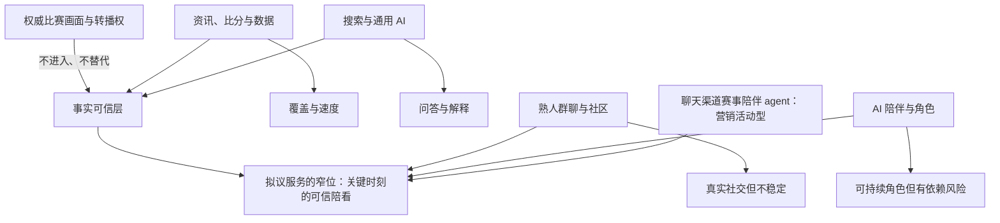
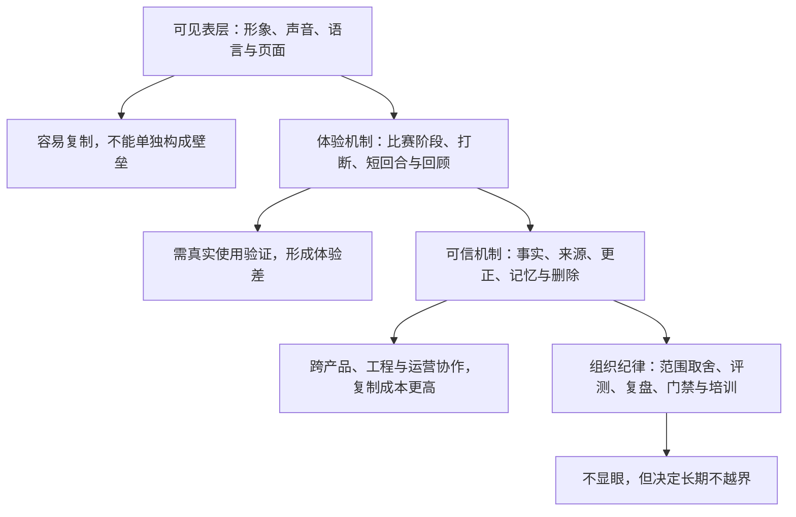

# 竞品格局与差异化机会

> **文档性质**：市场与产品决策输入，不是竞品功能清单，也不是融资宣传材料  
> **所属**：球球全套资料 v2，卷 1「市场洞察与战略定位」第 3 篇（重写工程依据 docs/adr/0014）  
> **版本**：v2.0  
> **重写日期**：2026-09-20  
> **原研究截止**：2026-01-28；此后新增的竞品与监管事实按 2026-09 口径补注，均带时间戳  
> **现实口径**：球球为足球陪看数字人（Flutter + Go + console + evals），现网 VERSION 0.2.0.0。本篇所有「现实形态」判定只以仓库路径与 ADR 为 B 级证据（分级见 §3.1），不使用口头结论或会话记忆  
> **证据规则**：见 §3.1 的 A–D 证据分级（全卷统一模板）

---

## 1. 这篇文档要帮助团队作什么决定

一个「能和用户聊足球的数字人」表面上很容易被归进 AI、体育资讯或虚拟人赛道，实际上它会同时与一组完全不同的替代品竞争：用户可以看转播、刷比分、在群里喊一句、搜网页、打开通用 AI，或者干脆什么都不做。若只把同样使用大模型的应用称为竞品，团队会高估技术新颖性；若只把体育 App 称为竞品，团队又会低估陪伴、信任和互动节奏的难度。

本篇回答的仍是同一组决策问题，但 v2 增加了第四问的现实维度：

1. 用户在一场比赛的不同阶段，实际上雇佣了哪些替代品来完成任务？
2. 其中哪些替代品已经足够好，不值得正面硬碰；哪些任务仍有明显空位？
3. 数字球友必须在哪些方面明显更好，才配得上一次下载、一次麦克风授权和一次回访？
4. 哪些差异属于可被复制的界面包装，哪些只能靠长期机制、数据治理和运营纪律积累——而其中哪些，0.2.0.0 已经建成了？
5. 首版应主动放弃什么；当竞品快速模仿、监管快速收紧时，产品怎样守住用户信任和可持续的经营边界？

本文的核心结论不变：**首个机会不在于取代直播、资讯、社群或通用 AI，而在于在合法观赛过程中的少数关键时刻，提供「可信、合拍、可停止」的在场感。** v2 需要补充的是这条窄命题在 0.2.0.0 中的兑现并不均匀：事实边界与介入时机两条腿已经落地，而「明确披露为 AI」与用户侧可信呈现两条腿还没有（见 §6）。差异化当前最大的缺口不在能力总量，在合规与可见的信任。

---

## 2. 竞争的正确单位：不是 App，而是用户任务

### 2.1 不要从「应用类别」开始

用户不会在开赛前郑重比较「体育媒体」和「AI 陪伴产品」。真实过程通常更短：看到赛程时想知道几点开球；争议判罚后想确认发生了什么；主队丢球时想吐槽；看完球后不想独自消化情绪；第二天想知道错过的细节。每一个瞬间都可能由不同工具接管。

因此，本项目使用「任务竞争」而非「品类竞争」的口径。竞争单位是一项用户愿意花注意力完成的工作，而不是一个下载量相近的产品。按比赛阶段纵向看，六个阶段各自雇佣不同的替代品：

- **赛前数小时至开赛前**
  - **任务**：确认赛程、阵容、看点与观看渠道
  - **替代品与短板**：搜索、资讯 App、球迷群——信息分散、内容同质、通知噪声
  - **须证明的额外价值**：用少量可靠信息把「要不要看、怎么看、值得关注什么」讲明白，不制造焦虑
- **开场至平稳比赛段**
  - **任务**：获得陪看感，又不被打断
  - **替代品与短板**：同看的朋友、群聊、弹幕——朋友未必在线，群聊过吵，弹幕失控
  - **须证明的额外价值**：只在被允许或确有价值时说话，沉默也让人舒服
- **进球、红牌、点球等高情绪时刻**
  - **任务**：立刻确认事实、表达情绪、理解影响
  - **替代品与短板**：转播解说、比分推送、社媒——快但缺语境，讨论快但易失真
  - **须证明的额外价值**：不抢转播节奏，给出可追溯事实与恰当回应
- **争议、规则或战术困惑**
  - **任务**：问一个具体问题并拿到可信解释
  - **替代品与短板**：搜索、百科、通用 AI——成本高，缺实时上下文
  - **须证明的额外价值**：区分已确认、推断与观点，必要时指回官方信息
- **情绪低谷或胜利后**
  - **任务**：找到可表达但不被操纵的出口
  - **替代品与短板**：熟人、社媒、通用陪伴 AI——不总可得，公开表达有社交压力
  - **须证明的额外价值**：温和回应、不过度拟亲密、不要求用户留在会话里
- **赛后数分钟至次日**
  - **任务**：回顾、补课、决定是否继续关注
  - **替代品与短板**：集锦、新闻、播客——信息过量，难对应自己的观看经历
  - **须证明的额外价值**：可删除、可解释的回顾，而非无限累积画像

### 2.2 七类竞争者，而非一张「竞品 Logo 墙」

第一轮研究把替代品分成六类；2026-09 补注第七类。每一类都满足某个任务，也都有它不适合承担的部分。

1. **转播、短视频与官方赛事渠道。** 拥有最强的比赛画面、叙事权和部分权威信息。任何陪看产品都不应冒充、复刻或承诺提供其拥有的内容与权利。
2. **体育资讯、比分与数据产品。** FotMob、Sofascore、懂球帝等，以极低摩擦提供赛程、比分、数据与社区内容。它们是事实基础设施与注意力入口，也是最难在「覆盖广度」上超越的对象。
3. **熟人群聊、球迷社区与社交平台。** 提供真实的人际共鸣与热点速度，但也带来噪声、冲突、剧透与信息失真。
4. **通用搜索与通用 AI。** 擅长一次性知识获取与开放式问题，但通常不天然拥有合法实时数据、比赛上下文、对话节奏或角色边界。
5. **通用 AI 陪伴/角色产品。** Replika、Character.AI 等证明了用户会为持续角色付费；同时提醒长期角色关系、未成年人、情感依赖和商业化引导带来高风险。2025 年下半年起，这一类受到实质性监管与行业自我改制（见 §4.2）。
6. **博彩、预测、游戏化与幻想体育产品。** 利用比赛不确定性与激励驱动高频互动。拟议服务不以投注、荐彩、赔率为价值主张，必须主动保持距离，不把情绪高点转化为刺激交易的按钮。
7. **聊天渠道承载的赛事陪伴 agent（2026-09 补注）。** 2026-07-02，Infobip 发布 PitchMate：面向大赛的 AI fan companion，跑在 WhatsApp 等聊天渠道，定位为营销活动型产品（来源见 [S15]，细节待核）。它证明「用对话承载赛事陪伴」已被行业当作可复制的营销组件。对本项目它有两重含义：需求存在的旁证；以及这类入口按活动生命周期运营，不承诺持续的事实可信——恰好反衬窄命题里「可信」的稀缺。

### 2.3 竞争边界图

图中的中间位置不是「把几类产品功能相加」。如果产品试图同时成为数据平台、社交网络、百科、直播间和恋爱型角色，它会得到最复杂的成本结构与最模糊的承诺。第一版必须把位置压缩为：**用户已经在合法渠道看球；服务只围绕有限的赛事上下文，替用户减少不确定、孤独和打断，而不是接管注意力。**

---

## 3. 比较方法：先建立可复查的证据，而不是凭印象打分

### 3.1 公开资料、走查与「现实形态」的证据分级（全卷模板）

竞品材料经常混合了营销文案、媒体转述、老版本截图与个人体验；自家产品的「现状」同样容易混入口头印象。为避免把「听说有」写成「稳定提供」，本项目将证据分成四级：

**级别：A 级：公开产品声明**
- **可接受材料**：官方网站、官方帮助中心、官方定价页、官方应用商店页、公开条款、官方监管公告
- **可以得出的结论**：产品公开宣称提供某功能、某方案或某条价格
- **不能得出的结论**：不能证明该功能在每个地区、设备和账户都可用

**级别：B 级：可复现走查与可复查的工程事实**
- **可接受材料**：记录日期、地区、设备、账号状态、操作步骤、截图/录屏的内部走查；以及带路径的仓库证据（代码、ADR、设计文档）
- **可以得出的结论**：某一条件下的实际路径、权限、打扰频率、错误提示和付费墙；某一机制在当前版本（0.2.0.0）确实存在
- **不能得出的结论**：不能外推到所有用户，不能代替长期留存结论，不能证明「建了」等于「用户感知到了」

**级别：C 级：用户研究**
- **可接受材料**：已同意的访谈、日记研究、可用性测试、问卷开放题
- **可以得出的结论**：目标人群对任务与替代品的真实叙述、可观察障碍
- **不能得出的结论**：不能用小样本直接估计整体市场规模

**级别：D 级：待验证假设**
- **可接受材料**：团队推断、竞品评论线索、行业常识
- **可以得出的结论**：用于设计实验与优先级
- **不能得出的结论**：不能写进对外结论，不能当成立项事实

> **全卷模板声明**：本节 A–D 分级是全套资料 v2 统一的证据分级模板（docs/adr/0014 确立），其他各篇引用同一分级、不再重复定义。市场与战略卷的两个约定：一、不做代码锚点表——仓库路径只作为 B 级证据的出处标注，逐行讲解留给工程卷；二、涉及「现实形态」的判定，一律给出仓库路径或 ADR 编号，否则降为 D 级。

本篇写到的 FotMob、懂球帝、Replika、Character.AI 和 ChatGPT，只使用 A 级公开页面说明其公开定位或公开价格。关于「体验是否打扰」「回应是否温暖」「用户是否信任」等判断，一律留给 B、C 级研究，不把公开文案当体验事实。

### 3.2 统一任务卡：所有走查都按同一场比赛完成

第一轮走查不让研究员随意浏览首页，而是让每个竞品在同一组任务卡下接受观察。八张任务卡一览（完整记录模板：访问时间、地区、设备与版本、登录与付费状态、失败点、截图编号、原文案与待确认问题——没有这些元数据的「竞品体验感受」不得进入决策会）：

| 卡 | 情境 | 记录重点 | 通过不等于什么 |
|---|---|---|---|
| T1 | 三分钟内知道时间、对阵、渠道与看点 | 入口是否直接；是否区分事实与观点；是否强迫注册 | 信息多不等于愿意长期使用 |
| T2 | 开赛后只想安静观看 | 默认通知、自动播放、弹窗、关闭路径 | 「可关闭」不等于默认体验合适 |
| T3 | 争议判罚后想知道已确认与未确认的部分 | 来源、时间戳、状态、纠错机制 | 回答快不等于回答可信 |
| T4 | 主队丢球后只想说一句失望 | 是否尊重短回应；是否制造依赖、愧疚、诱导付费 | 语言热情不等于情绪支持安全 |
| T5 | 离开二十分钟后回来恢复上下文 | 简洁回顾；是否误把旧状态当新状态 | 有记忆不等于记忆恰当 |
| T6 | 赛后想保存一个瞬间但不想被无限记录 | 保存前是否解释范围；能否查看、编辑、删除 | 有删除入口不等于真正理解数据用途 |
| T7 | 只用文字或拒绝麦克风 | 是否仍完整可用；是否降级惩罚 | 有语音不等于语音是必需 |
| T8 | 账户属于年龄未知用户 | 年龄门槛、角色表达、付费、推送的变化 | 生日输入不等于已完成保护 |

### 3.3 评分维度：不以功能数量胜负

每项任务可在 1 至 5 分上评分，但分数只用于组织讨论，不用于宣称市场排名。评分需至少两名研究员独立完成，分歧保留而非强行平均。七个维度，各取 1 分与 5 分的锚点：

- **事实可信**：1 分=无来源、时态混乱或明显误导；5 分=能说明事实、时间、来源和不确定性。入场券，不能靠人格魅力补救。
- **上下文恢复**：1 分=用户需从头找信息；5 分=用极短回顾恢复比赛与对话上下文。衡量回归用户价值。
- **介入合拍**：1 分=默认打扰、抢占注意力；5 分=尊重沉默、主动权和观赛节奏。陪看区别于信息工具的核心。
- **解释质量**：1 分=只给结论或自信胡说；5 分=解释深浅可控，事实、推断、观点分层。不能把「会说」误判为「可信」。
- **关系边界**：1 分=拟人化越界、诱导依赖或不透明；5 分=身份透明、表达温暖、退出自由、无排他暗示。陪伴产品的安全底线（展开唯一归属 [2/11](../2.用户与价值定义/11-关系边界与信任契约.md)）。
- **数据可控**：1 分=不说明采集或只给笼统条款；5 分=用户能理解、选择、查看和删除重要数据。决定语音与记忆是否值得授权。
- **价格透明**：1 分=价格、试用、续费难找；5 分=价格、周期、权益、自动续费与取消路径清晰。影响付费信任，不等于定价高低。

---

## 4. 公开可核验样本：它们公开承诺了什么，尚未证明什么

> 本节主体为 2026-01-28 研究口径（A 级公开页面）；4.2 末尾补注 2025 年末至 2026 年的行业与监管变化。所有定价以购买页当日核验为准。

### 4.1 体育信息与球迷入口

- **FotMob**：官网定位为足球比赛日 App，公开说明提供实时比分、赛程、积分榜、数据与个性化新闻，覆盖 500 余个联赛；Premium 入口公开，金额须按目标地区购买页记录（A 级，[S1]）。启示：用户对「快速知道比赛发生了什么」的期待已很高，首版不应把比分列表和联赛覆盖当卖点。
- **Sofascore**：官网强调多运动实时比分、统计、赛程、提醒（A 级，[S2]）。启示：数据广度与页面密度是成熟优势；拟议服务应把数据压缩成用户当下需要的解释，而不是堆更多指标。
- **懂球帝**：首页定位为足球资讯、直播、数据与专家预测的一站式平台（A 级，[S3]）。启示：中文球迷已有「新闻+数据+讨论」的熟悉入口；新产品要嵌入观赛前后的小缺口，不要求迁移全部信息习惯。
- **OneFootball**：提供新闻、比分、赛程、视频及部分地区观看服务；观看权益因版权而异（A 级，[S4]）。启示：版权与地区限制决定了陪看服务必须把「合法观看渠道」留给拥有权利的一方。

这里的重点不是判断谁「最好」，而是承认成熟体育信息产品已经把「快、全、可查」做成用户习惯。若服务在事实层的错误率更高、打开速度更慢或要用户重复输入比赛信息，就没有资格要求用户再多开一个入口。

### 4.2 通用 AI 与角色陪伴样本（行业基线在 2025 年已变）

- **ChatGPT**：通用 AI 助手，多档计划；Plus 长期公开标价每月 20 美元，功能与地区以结算页为准（A 级，[S5]）。启示：用户已形成「有问题就问 AI」的行为；但通用问答不等于比赛事实可信，更不等于合适的实时陪看节奏。
- **Replika**：官方首页明确定位 AI friend，强调聊天、反思与建立有意义的连接（A 级定位，[S6]）。启示：持续角色与低压力私密对话可能产生回访；但不能把「有意义连接」简化成停留时长，更不能复制排他、恋爱或退出愧疚式话术。
- **Character.AI**：官方页面提供角色对话与创建角色；官方公告曾公开 c.ai+ 每月 9.99 美元（2026-01 记录；原博客根链已改版，定价历史锚点弱化，金额以购买页复核为准）。启示：角色可降低空白输入框的压力；但「可创建无限角色」与「持续可靠的足球陪看角色」是两种问题，前者也放大治理成本。**2026-09 补注**：官方于 2025-10-29 宣布、2025-11-25 起生效安全改制——移除未成年人开放聊天、设每日 2 小时使用上限（[S7]）。「开放角色关系」的行业基线已经收缩，「关系边界」不再是理想主义加分项而是入场要求；这直接佐证卷首红线 5（不向未成年人提供不受约束的高强度陪伴，见 [卷首 §6.2](../0.卷首/00-产品全貌.md)）。

**监管视野扩围（2026-09 口径，引用带时间戳）**：美国 FTC 于 2025-09 对扮演陪伴角色的 AI 聊天机器人启动 6(b) 调查，收件方包括 OpenAI 与 xAI——通用 AI 正式纳入陪伴监管视野，不再只有角色陪伴类产品独享关注；截至 2026-09，该调查无最终报告（[S8]）。对本项目的含义：无论被归类为「通用助手」还是「陪伴产品」，角色设计、未成年人、商业化与数据披露都在同一束探照灯下。

定价信息的正确用法是比较**价值交换结构**，而不是把美元标价换算成人民币后定价。通用 AI 的订阅费包含广泛生产力任务；陪伴产品的订阅费可能包含角色或关系权益；足球陪看服务必须先回答用户愿意为何付费：少广告、可控的实时陪看、深度回顾，还是某种会员身份。若不能清楚回答，先做付费墙只会损害信任。

### 4.3 公开定价核验的操作规范

价格最容易在竞品研究中失真。任何进入正式决策表的价格，必须同时记录下列字段：

| 字段 | 必填原因 |
|---|---|
| 产品名、版本号与购买入口 URL | 同一品牌的 Web、iOS、Android 方案可能不同 |
| 访问日期与时区 | 折扣、活动、涨价和试用常随时间变化 |
| 国家/地区、货币与税费显示方式 | 不能把美国未税价格当作中国价格，也不能忽略应用商店地区差异 |
| 月付、年付、一次性付费、试用与自动续费说明 | 用户真实承担的是整个续费路径，而非一个大号数字 |
| 免费层能力、付费后增加的能力、限制条件 | 只有「价格」无法判断用户买到什么 |
| 取消方式、退款规则与失败提示 | 这是订阅信任的一部分 |
| 截图/录屏编号与操作人 | 让后续复查者能确认不是二手转述 |

在上述字段不完整前，表格应写「未核验」，而不是用搜索摘要、媒体报道或个人记忆补一个看似准确的金额。

---

## 5. 从替代品反推用户空位

### 5.1 已被做得很好的工作，不应作为首版战场

- **全联赛赛程、比分、积分榜和球员数据库**：体育数据产品已凭规模、速度与多年习惯形成优势。为什么不应硬碰：数据覆盖、纠错与用户习惯的规模优势不是一次迭代能追平的。正确姿势：只取互动所需的最小合规事实范围，外部信息指回权威渠道。
- **比赛画面、权威解说与集锦**：权利与制作成本决定这不是 0→1 团队的战场。为什么不应硬碰：既无权利，也无内容预算。正确姿势：不播放、不转播、不暗示拥有比赛内容，围绕用户已在观看的合法来源提供辅助。
- **大规模公共讨论与热点传播**：网络效应与内容治理成本极高。为什么不应硬碰：陌生人社交会改变产品风险等级，把一对一陪看拖入平台级治理。正确姿势：不把建群、发帖、排行榜当留存捷径，先完成一对一、低压体验。
- **开放世界问答、写作和泛知识**：搜索与通用 AI 不占劣势。为什么不应硬碰：泛化能力、模型投入与用户心智均不占优。正确姿势：只回答与当前赛事、用户明确偏好和陪看任务直接相关的问题，不确定时收窄或承认不知道。

### 5.2 仍可能有空位的六个任务（承重墙：全套控制权理念的母本）

下面六项不是既定需求，而是比「再做一个比分 App」更值得验证的假设。**本节是全套资料中「控制权在用户手里」这一产品理念的文字母本**：v2 保留全部论证，并为每一项补上 0.2.0.0 的现实对齐——哪些已兑现、哪些换形态、哪些仍是 planned。

#### 空位一：无需组织社交的共同观看感

许多用户想与人一起看球，并不等于他们想在公开社区发言、维护群聊或打扰熟人。真正的空位是：不需要解释自己、不需要等朋友在线、不必承受陌生人攻击，却在关键时刻感到有人「跟得上」。

反面同样成立：有些用户会把 AI 陪看视为多余，宁愿安静看球或与真实朋友交流。因此研究不能只问「你会不会用」，而要观察用户何时主动打开、何时主动关闭，以及关闭后是轻松还是被打扰。**现实对齐**：该命题的用户侧验证至今未执行（见 §9 H1），产品侧的承载形式（三档陪看强度）见空位三。

#### 空位二：把事实、解释和情绪反应放在同一个短回合

比分产品很快，聊天产品很能说，熟人很有情绪，但三者很少在同一个回合中满足用户。点球判罚后，用户可能同时需要「裁判现在的决定是什么」「这会如何影响比赛」「我真受不了」。服务若能先给事实边界，再按用户选择解释或回应情绪，可能减少跨应用切换。

难点在顺序：先共情再说错事实，用户会失去信任；只报数据，产品又没有陪看价值；每次都长篇分析，则会错过比赛。这个空位只能靠秒级至十几秒级的可用性实验验证，不能靠口头偏好。**现实对齐**：回合结构的工程载体已建成（统一 TurnPlan 回合计划，ADR-0003/0005），但「短回合」是否真的在用户侧成立，仍待可用性实验。

#### 空位三：把「主动说话」变成可被拒绝的服务，而不是打扰

大多数产品都能推送消息，极少产品能准确决定什么时候不说话。对观赛场景，**主动沉默**不是失败，而可能是对注意力最好的尊重；「何时主动、说什么、何时停止」是一个独立的产品能力。首版不应宣称「懂你」，更可验证的目标是让用户明确设置模式，并在每种模式下观察打扰率、关闭率和赛后满意度。没有用户授权的主动性不构成差异化，只构成通知风险。

**现实对齐（v2）**：现网已落地三档话痨强度——**安静/刚好/热闹**（backend quiet/normal/active，客户端设置项），但三档**只调主动介入的量，不调内容类型**：`backend/internal/relationship/talkativeness.go`（L14–19、L31–32）的注释写明，「热闹」用户选择的是更多主动性，绝不是新增主动类（active 也绝不新增主动类）；安静档只能抑制、不能启用（IsQuiet 为 L0-safe by construction）。原设想中「安静/仅关键事实/可对话」是一个**内容分档**——限制「说什么」而不只是「说多少」——其中「仅关键事实」档**未实现，标 planned**。换句话说，这个空位完成了量的一半：强度可拒绝已是 B 级事实，内容分档还没有。介入决策的细化唯一归属 [4/31](../4.产品设计/31-主动发言、主动沉默与话痨控制设计.md)。

#### 空位四：为短暂共历保留用户可控的回忆

用户可能想记住「那场逆转时我说过的一句话」，但不一定想让产品永久保存整段情绪与全部聊天记录。成熟 AI 陪伴产品的「记忆」概念需要被拆小：什么值得保存、谁决定保存、保存后有什么用、如何修正、何时到期、如何删除。它也可能完全不是首版需求——若用户只想看完即走，记忆只会增加解释负担与隐私疑虑。

**现实对齐（v2）**：落地形态与原设想不同。原假设以「用户主动点选保存一个瞬间」为起点；现网是**自动记忆 + 事后可控**——记忆自动抽取，用户事后可查、可改、可忘（记忆 seam：ADR-0006；删除与生命周期：backend/internal/privacy/service.go，卷首红线 7 同源）。「拆小」的轴从「存不存」移到了「存了之后用户能不能改」：原方案把控制点放在事前授权，现实把控制点放在事后治理。两种形态的信任效果差异，仍待用户研究验证。

#### 空位五：在不确定时仍值得信任

体育事实天然经历「直播画面看到了→数据源报了→裁判复核中→官方确认→后来修订」的过程。常见替代品有时以速度优先，通用 AI 则可能把不完整信息填成完整叙述。服务若能把「已确认」「待确认」「这是我的解释」分清，并在更正时可见地修订，可能建立更慢但更稳的信任。风险是把谨慎做成迟钝：用户不会因为产品诚实就愿意等很久，因此首版需限定赛事和事实范围，宁可回答「我还不能确认」。

**现实对齐（v2）**：事实分层的**后端与导播台已建**——FactStatus 五态与 FactTimeline 在 backend 域模型（backend/internal/matchstate/store.go）与导播台接口中运行，事实的确认、冲突、撤销与修订有了工程载体（B 级证据；详述唯一归属 [4/23](../4.产品设计/23-比赛事实与公开比分设计.md) 与 [卷首 §8.1](../0.卷首/00-产品全貌.md)）。但**用户侧呈现 planned**：用户今天看不到状态标记与更正时间线。也就是说，「值得信任的机制」已存在，「可见的信任」还没有——这与 §6.1 披露缺口同构，是差异化命题当前最典型的半成品。

#### 空位六：一段无需表演的安全退出

陪伴类产品常把「继续聊」当作成功，容易忽略用户想安静离开、想回到比赛、想删除记录或不想接收提醒的权利。若服务能自然地说「先看球吧，需要时叫我」，并让退出、关麦、清除和关闭提醒都很轻，可能比更黏人的设计更值得信任。这在短期指标上可能吃亏（降低会话时长），但若产品定位是长期、可持续的数字球友，用户的控制感应优先于单场停留时长。

**现实对齐（v2）**：**可打断、可退出、可忘掉已实现**（B 级：语音打断与降级链路见 [4/26](../4.产品设计/26-语音打断、重连与降级体验设计.md)；记忆删除见空位四所引隐私服务）；但「先看球吧，需要时叫我」式的**自然交回话术未实现，标 planned**——用户能离开，数字球友还不会得体地放手。关系边界的展开唯一归属 [2/11](../2.用户与价值定义/11-关系边界与信任契约.md)。

---

## 6. 差异化命题：不是「更像人」，而是「更适合在这时出现」

### 6.1 候选定位：五个条件与它们的现实状态

首个版本的工作定位可写为：

> 为独自或低社交压力观看足球比赛的人，提供一个明确披露为 AI、以比赛事实为边界、只在合适时刻介入的数字球友。它不替代转播、朋友、社区或专业分析，而帮助用户在关键时刻更从容地确认、理解、表达和回到比赛。

这句话有五个不可拆开的条件。v2 在原表上增加「现实状态」一列——五个条件里只有两个半已经建成：

| 条件 | 它排除了什么 | 它要求团队做什么 | 现实状态（B 级证据/标注） |
|---|---|---|---|
| 明确披露为 AI | 用暧昧拟人化制造信任、假装真人在线 | 首屏、声音、形象、付费与分享内容一致标识 AI 属性 | **未实现，planned，已升级为最高优先合规项**：客户端 0 处披露文案；《人工智能拟人化互动服务管理暂行办法》2026-07-15 施行，要求拟人化标识持续公示——详见 [1/02](02-宏观环境与监管约束.md) |
| 以比赛事实为边界 | 泛娱乐聊天、无根据评论、借热点延伸到高风险建议 | 设计事实状态、来源、时效和「不知道」的表达 | **已实现**：比赛事实账本为唯一事实源（ADR-0002）+ 内容宪法与证据锚点（ADR-0004） |
| 合适时刻介入 | 以更多消息、更长对话冒充陪伴 | 把主动沉默、打断、模式和停止能力做成核心交互 | **已实现**：意图路由（ADR-0009）+ 观察保持窗 |
| 数字球友而非专家替身 | 争夺专业解说、数据终端或心理咨询的位置 | 解释深度交给用户选择，不作医疗、博彩或确定性预测承诺 | 原则不变；角色与边界归属 [2/11](../2.用户与价值定义/11-关系边界与信任契约.md) |
| 帮用户回到比赛 | 把注意力留在应用内作为唯一目标 | 所有回应默认短、可跳过、可停止，不制造退出压力 | **换形态已实现**：PresentationPlan.HoldMS/ReturnMode 就是「表演结束交回舞台权」的工程化——投递保持期内后端持有表演权，ReturnMode 结束后客户端接管（ADR-0007） |

读法提醒：五条件是「合取」关系——宣传定位句之前，五项必须全部为真。当前按字面使用这句定位是超前的；在披露落地之前，对外表述应降级为能力事实（「基于比赛事实账本的陪看数字人」），不做拟人化暗示。

### 6.2 四层差异化：建成顺序与设想相反

虚拟形象、音色和提示词很容易被视觉模仿；可持续差异必须分层建立。原设想由深到浅四层，v2 逐层标注建成状态：

- **可见表层（Live2D 形象、voiceStyle 音色、页面）**：**投入最重、最先建成**。角色有辨识度，但这一层按定义最容易被复制。
- **体验机制层**：**已建**。三档话痨强度、TurnPlan 回合结构、打断与静音都在 0.2.0.0 运行（B 级，见 §5.2 各条）。
- **可信机制层**：**限运营侧**。FactStatus/FactTimeline 建在事实账本与导播台，用户侧呈现 planned——机制在后台转，用户看不见（§5.2 空位五）。
- **组织纪律层**：以 **ADR 流程**的形式存在（0001–0014：范围取舍、所有权、门禁都有文字决议），这是四层中最便宜也最真实的一层，但它约束的是团队，还不是产品体验。

**v2 修正（如实标注）**：四层的**建成顺序与本文设想的由深到浅恰好相反**——设想是深层的可信与纪律支撑浅层的包装，现实是表层最先最重、深层停在运营侧或纸面。这不推翻分层论证本身：用户不会因为一个漂亮形象而容忍错报进球、抢话或删不掉记录。它推翻的是隐含的进度假设——**壁垒没有已建成，第二、三层的用户侧兑现是当前最大的差异化缺口。**

### 6.3 差异化承诺的可检验表述

营销语言容易写成「最懂球迷的陪伴」。这种说法无法验证，也会诱导团队过度承诺。应改写成可观测承诺（评测集与指标的唯一归属在 [4/45](../4.产品设计/45-产品评测体系设计.md) 与 [3/16](../3.验证与商业模式/16-北极星指标与指标体系.md)）：

| 模糊说法 | 可检验表述 | 首轮证据 |
|---|---|---|
| 懂球迷 | 用户能在开赛后 30 秒内选择安静、刚好或热闹，并在赛后说明该强度是否符合预期 | 可用性测试、赛后访谈、模式切换日志 |
| 懂比赛 | 在限定赛事和事件类型内，回答明确区分已确认事实、待确认状态和解释性观点 | 标注集评测、人工复核、错误更正演练 |
| 像朋友 | 用户把角色描述为「合拍但不越界」，而不是「黏人」「假」「让我内疚」 | 访谈原话、负面反馈分类、退出情境测试 |
| 有记忆 | 用户能轻易查看、修正或删除记忆，且记忆在下一场比赛中带来可感知价值 | 纵向日记研究、删除成功率、回访对照 |
| 不打扰 | 用户认为关键时刻提醒有用，且能一次操作内降低或停止主动触达 | 通知关闭率、打扰投诉率、任务完成率 |

（v2 微调说明：「有记忆」一行的表述已按现实形态调整——现网为自动记忆+事后可控，故把「用户主动保存」改为「可查看、可修正、可删除」优先。）

---

## 7. 战略取舍：第一版必须故意不做什么

### 7.1 首个滩头场景

首版研究限定在一个明确而非宏大的场景：**已能通过合法渠道观看一场重点足球比赛、倾向独自或低压力观看、愿意偶尔用文字或语音说一句的成年用户。** 这一选择同时缩小了赛事范围、语言范围、时区范围、数据复杂度、角色表达边界和研究样本。

首版的最小体验不以「聊得久」为目标，而以三段旅程为目标：

1. **赛前 90 分钟至开场。** 用户快速知道这场比赛的基本信息，选择陪看强度，并理解服务是 AI、能做什么、不能做什么。
2. **比赛中的有限关键时刻。** 用户可以主动问、表达，或让服务在已授权强度下做极短介入；服务能被立刻打断或静音。
3. **终场后 10 分钟。** 用户得到可跳过的事实回顾，可保存或直接离开；不强迫复盘、不借情绪诱导订阅。

### 7.2 非目标：唯一归属不在本篇

非目标清单（不碰转播、不全量覆盖、不做公共广场、不碰博彩、不做恋爱型关系、不默认长期保存）在本套资料中**唯一归属 [卷首 §6](../0.卷首/00-产品全貌.md)（非目标与产品红线）与 [1/05](05-战略定位与非目标.md)（战略定位与非目标）**，本篇不再维护副本，以免两处口径漂移。

### 7.3 先文字还是先语音：次序已被现实改写

原方法论仍然成立：语音与数字人形象是差异的一部分，但不应成为掩盖价值不清的昂贵装饰；语音的评价标准应是「更自然地回到比赛」，不是「听起来像真人」。

**现实结算（v2）**：原计划「同一任务，双通道验证——若文字已够用，推迟语音投入」**没有按此执行**：语音未经 A/B 对照直接成为一等公民（见 §9 H4）。这不必然是错误——语音打断、重连与降级的工程梯子已经按 [4/25](../4.产品设计/25-实时语音陪看体验设计.md)、[4/26](../4.产品设计/26-语音打断、重连与降级体验设计.md) 系统展开——但它意味着「语音在哪些时刻真的优于文字」至今是一个未验证的开放问题，评测体系（4/45）应把「语音相对文字的净收益」列为待测项，而不是当作已决事项。

### 7.4 先订阅还是先证明价值

在没有连续比赛日留存和明确价值单位之前，不把「会员订阅」当首版成败标准。顺序仍是：先验证用户是否主动在第二场比赛再次进入；再验证是否愿意为可理解的额外价值做小额、可取消的承诺；最后才比较订阅、赛事包或其他模式的单位经济。早期付费问题应具体到价值交换（「你愿意为一个月的重点赛事陪看支付吗，前提是关键时刻稳定、无广告且你能控制记忆与提醒」），而不是「你愿意为 AI 付费吗」。定价假设的展开归属 [3/18](../3.验证与商业模式/18-商业模式与定价假设.md)。

---

## 8. 可复制性与脆弱点：不夸大护城河，也不低估进入门槛

### 8.1 容易被复制的部分

| 容易复制的元素 | 为什么脆弱 | 应如何处理 |
|---|---|---|
| 足球主题头像、Live2D 表情、拟人语气 | 视觉资产与基础提示词可被快速仿制 | 当品牌识别，不当唯一价值主张 |
| 「给我赛前预测/赛后总结」的单轮问答 | 通用 AI 和资讯产品都能提供相近输出 | 只作进入体验，不以其衡量留存 |
| 简单的比分提醒和进球祝贺 | 成熟 App 已具备通知基础设施 | 仅在用户主动选择、结合当前强度时做 |
| 泛化的「我会一直陪着你」话术 | 既容易复制又容易越界 | 直接禁止，不把情感强度当转化手段（红线 2） |

### 8.2 较难复制、但尚未证明可积累的部分

- **关键时刻介入策略**：
  - **为什么可能形成差异**：需要长期理解不同用户对沉默、短回应、解释深度的偏好
  - **成立前提**：用户有清晰的强度选择，系统能尊重关闭与打断
  - **失败信号**：用户普遍调低强度，或觉得所有提示都一样
  - **现实**：机制已建（ADR-0009），偏好理解未验证
- **事实状态与可见更正**：
  - **为什么可能形成差异**：需要数据、产品文案、运营和评测共同维护同一套准确性纪律
  - **成立前提**：限定赛事范围；来源、时效、修订机制明确
  - **失败信号**：高频错误、无法说明不确定性、纠错无感知
  - **现实**：机制限运营侧，用户侧呈现 planned（§5.2 空位五）——「可见更正」这半句还没有发生
- **可控的共同瞬间**：
  - **为什么可能形成差异**：不是收集越多越好，而是知道何时让用户选择留下什么
  - **成立前提**：明确用途、短路径查看/删除、下一次确有价值
  - **失败信号**：用户不愿保存，或保存后感到被窥探
  - **现实**：换形态为自动记忆+事后可控，事前选择的意愿未验证
- **安全而不冷漠的角色边界**：
  - **为什么可能形成差异**：需要角色写作、风险分类、评测和客服升级共同完成
  - **成立前提**：温暖表达不以排他、恋爱、愧疚和操纵为代价
  - **失败信号**：用户反馈「像客服」「像恋人」两极化，均说明边界失衡
  - **归属**：[2/11](../2.用户与价值定义/11-关系边界与信任契约.md)
- **比赛日复盘组织能力**：
  - **为什么可能形成差异**：需要每场真实使用后的问题分类、策略调整与发布门禁
  - **成立前提**：团队愿意为小范围、慢扩张付出运营成本
  - **失败信号**：为追求覆盖盲目扩赛，质量持续下滑
  - **现实**：ADR 门禁流程已立，比赛日运营节奏未形成

### 8.3 最大脆弱点不是模型，而是信任断裂

这类服务有四个容易造成一次性流失的断裂点，v2 逐条对照 0.2.0.0：

1. **错报关键事实。** 一次自信地说错进球、红牌或裁判决定，比十次正确回答更有记忆点。现实：事实账本与五态状态是正确的一线防御，但用户侧不可见，防御效果未交付到感知层。
2. **在错误时机出现。** 用户正看点球、与家人看球或只想安静时，角色突然说话就是打扰。现实：意图路由与观察保持窗正是为此而建，属于当前最强的已建成防御。
3. **把温暖做成越界。** 暗示排他、恋爱或用「不要离开我」挽留用户，会让产品失去正当性。现实：红线已立（卷首红线 1/2），表达层审计待评测体系覆盖。
4. **让用户觉得数据不可控。** 一旦用户不知道语音是否保存、记忆如何生成、删除是否有效，就很难再取得麦克风或长期关系的信任。现实：删除与生命周期机制已建（backend/internal/privacy/service.go），但「可查/可改/可忘」的用户侧入口与解释同样需要被用户看见。

这四项都不能通过「模型更强」自动解决。反过来说，若能在真实比赛中证明这四项稳定，哪怕功能少，也比功能丰富但不可预测更有机会形成口碑。

---

## 9. 首轮验证假设的结算（v2 结算注）

原 §9 设计了六项假设（H1–H6）与六项决策门槛，作为「允许停止，而不是为项目找理由」的预先承诺。v2 按现实逐项结算；假设条目与后续验证计划的**唯一归属是 [3/13](../3.验证与商业模式/13-需求假设与验证计划.md)（VH 编号体系）**，本篇只保留结算结论，不再维护实验设计。

> 编号说明：下表 H1–H6 为本篇 v1 原编号，与 3/13 现行 H1–H15 **同名不同义**（如本篇 H1=同看不愿进群，3/13-H1=关键时刻确认需求），不构成对应关系；全局映射以 3/13 的 v2 重写为准。

| 原假设 | 结算 | 现实形态 |
|---|---|---|
| H1 目标用户存在「想有人同看但不想进群」的具体时刻 | **未执行** | 用户研究未开展；空位一仍是假设 |
| H2 事实边界+短情绪回应比单纯事实或泛聊天更有价值 | **换形态** | design-demos/prototype-a-broadcast、b-sofa、c-terrace 三原型是**视觉方向探索**，不是「数据卡 vs 通用聊天 vs 事实分层球友」的三概念对照实验 |
| H3 用户愿意主动选择陪看模式 | **换形态** | 落地为三档话痨（安静/刚好/热闹），只调主动介入量、不调内容类型；「仅关键事实」档 planned |
| H4 「可打断的短语音」在部分关键时刻优于文字 | **被现实否定** | 语音未经 A/B 对照直接成为一等公民；「先文字验证、推迟语音投入」的次序没有执行 |
| H5 用户愿意保存少量共同瞬间、不愿默认长期记忆 | **换形态** | 落地为自动抽取+忘掉（自动记忆、事后可查/可改/可忘），非点选保存 |
| H6 用户会为清楚、可控的高级陪看权益付费 | **未发生** | 付费验证未启动 |

**六项决策门槛同样未执行。** 结算提示的不是「失败」，而是预先承诺机制本身被跳过了：H4 表明门槛未拦住它本应拦住的决策，H1/H6 表明最便宜的两个验证（访谈与付费意向）至今欠账。后续验证的编号、门槛与排期，全部在 3/13 的 VH 体系下管理；本篇的 §5 空位与 §6 条件即为该体系的输入。

---

## 10. 风险与反制：竞争策略不能以伤害换留存

| 风险 | 容易出现的错误竞争动作 | 产品反制原则 |
|---|---|---|
| 为了「陪伴感」越界 | 用恋爱、排他、嫉妒、愧疚或永远在线承诺提高回合数 | 角色始终明确为 AI；温暖但不占有；鼓励回到比赛与现实支持 |
| 为了「实时」错报事实 | 把未确认数据、传闻或模型猜测包装成确定结论 | 事实、待确认与观点分层；宁可承认不知道 |
| 为了「活跃」过度打扰 | 默认开语音、密集推送、比赛高潮连发消息 | 用户强度优先；一键静音；主动提醒默认克制 |
| 为了「个性化」过度收集 | 默认保存完整语音、情绪、偏好并无限期使用 | 最小收集、用途拆分、可见删除 |
| 为了「变现」利用情绪 | 在失利、愤怒或孤独时推会员、预测或外部交易 | 付费与高情绪时刻隔离；不做博彩或收益暗示 |
| 为了「覆盖」牺牲质量 | 一次扩到所有比赛、所有语言、所有功能 | 每次扩展前证明现有范围的可信与运营能力 |
| 为了「像真人」弱化披露 | 让用户误以为有人工解说、真人朋友或官方关系 | 多触点明确 AI 身份、能力与局限 |

每一行反制原则都需要证据支撑才算落地，对应需要验证的证据依次为：红队对话集与未成年人情境测试；事件级准确性评测与更正演练；通知关闭率与打扰反馈；用户理解测试与删除演练；付费页可用性测试与情绪情境审查；赛事范围门禁与错误率跟踪；首次使用理解测试与商店物料一致性检查。

陪伴型 AI 的风险不是抽象的品牌问题。美国 FTC 2025-09 对扮演陪伴角色的 AI 聊天机器人启动 6(b) 调查，公开关注商业化如何影响互动设计、角色设计与审批、上线前后对负面影响的测试与监控、未成年人保护、数据处理与披露；收件方包括 Character Technologies、Meta、OpenAI、xAI 等（截至 2026-09 无最终报告）。[S8] 国内侧，《人工智能拟人化互动服务管理暂行办法》自 2026-07-15 施行，对拟人化服务提出标识与公示要求（详见 [1/02](02-宏观环境与监管约束.md)）；加上 Character.AI 未成年改制（§4.2），「披露 + 未成年人 + 数据」三条监管线的收紧是 2025–2026 年的既成事实，而非预测。这不是对本项目适用性的法律结论，却足以说明：把「角色关系」和「商业目标」放在同一个产品里，必须同时测伤害、误解和退出自由，不能只测转化率和留存。

NIST 的 AI 风险管理框架及其生成式 AI Profile 也强调，风险治理应贯穿设计、开发、使用和评测，而非在模型选型结束后才出现。[S9][S10] 因而本项目的竞品策略不应是「做得比同行更黏」，而应是「在用户最敏感的时刻，做得比同行更可解释、更可控、更值得信任」。对本项目而言，这句话的当前含义非常具体：**在能力差异化之前，先补上披露这一条最高优先合规项。**

---

## 11. 立项结论（v2 修订）

### 11.1 当前可作出的结论

1. **市场不是空白，而且仍在吸引新形态进入者。** 足球用户已有极成熟的比分、资讯、直播、社交、搜索和 AI 替代品；2026-07 聊天渠道赛事陪伴 agent（PitchMate）的出现说明「对话承载赛事陪伴」的任务真实存在（§2.2 第七类）。新服务不能靠「能聊天」取得位置。
2. **空位不在功能总量，而窄命题已半建成。** 事实边界、介入时机、可打断可退出已是 0.2.0.0 的 B 级事实；「明确披露为 AI」、用户侧可信呈现与「仅关键事实」内容档还是 planned。差异化缺口集中在「让用户看见信任」，而不是再造能力。
3. **边界本身是竞争策略，且已从内部纪律变成外部合规。** 不碰转播、博彩、公共社交与恋爱型关系的取舍，如今同时被国内拟人化办法、FTC 6(b) 调查与 Character.AI 改制从外部背书；红线不再是保守的删减，而是让用户、平台和监管都能理解服务承诺什么的前提。

### 11.2 进入下一阶段前仍欠的输入

| 输入 | 要回答的具体问题 | 现状 |
|---|---|---|
| 竞品走查记录 | 目标地区与设备下，替代品实际如何完成 T1–T8？ | 未执行 |
| 用户任务研究 | 哪类人在哪场比赛的哪个时刻愿意尝试？ | 未执行（§9 H1） |
| 语音 vs 文字的净收益评测 | 语音在哪些关键时刻真的优于文字？ | 未验证（§9 H4 遗留） |
| 披露与用户侧可信呈现方案 | 拟人化标识如何在客户端持续公示？ | planned，最高优先（§6.1；详见 1/02） |

只有在这些输入清楚后，才应继续讨论形象、记忆机制与运营工具的下一轮扩张。否则团队可能先为一个漂亮数字人搭建更复杂的系统，而用户看到的仍是一个没有自我披露、看不见事实状态的角色。

---

## 12. 公开来源与访问记录

以下链接用于复查公开陈述与监管背景。链接可访问不代表其功能、价格或适用地区永久不变；涉及购买、权限、订阅与地区内容的结论，均应在具体研究当天重新核验。

- **S1**　FotMob——实时比分、赛程、数据与联赛覆盖的公开产品说明。https://www.fotmob.com/ （访问 2026-01-28）
- **S2**　Sofascore——实时比分、统计、赛程与提醒的公开产品入口。https://www.sofascore.com/ （访问 2026-01-28）
- **S3**　懂球帝——足球资讯、直播、数据与预测的公开定位。https://www.dongqiudi.com/ （访问 2026-01-28）
- **S4**　OneFootball——新闻、比分、赛程及地区化观看服务的公开入口。https://onefootball.com/ （访问 2026-01-28）
- **S5**　OpenAI——ChatGPT 公开计划与定价入口。https://openai.com/chatgpt/pricing/ （访问 2026-01-28）
- **S6**　Replika——AI friend 的公开产品定位。https://www.replika.com/ （访问 2026-01-28）
- **S7**　Character.AI——官方安全改制公告（2025-10-29 宣布、2025-11-25 生效：移除 U18 开放聊天、每日 2 小时上限）。官方博客根链 https://blog.character.ai/ 现以该公告置顶；原 c.ai+ 定价历史帖不再可锚，精确 permalink 待核。（根链访问 2026-09-20）
- **S8**　U.S. FTC——6(b) 调查新闻稿，含收件方名单（Alphabet、Character Technologies、Instagram、Meta、OpenAI、Snap、X.AI Corp）与调查关注点；截至 2026-09 无最终报告。https://www.ftc.gov/news-events/news/press-releases/2025/09/ftc-launches-inquiry-ai-chatbots-acting-companions （访问 2026-01-28；2026-09-20 复核收件方名单）
- **S9**　NIST——AI Risk Management Framework。https://www.nist.gov/itl/ai-risk-management-framework （访问 2026-01-28）
- **S10**　NIST——Generative AI Profile。https://www.nist.gov/publications/artificial-intelligence-risk-management-framework-generative-artificial-intelligence （访问 2026-01-28）
- **S11**　国家互联网信息办公室——《生成式人工智能服务管理暂行办法》。https://www.cac.gov.cn/2023-07/13/c_1690898326795531.htm （访问 2026-01-28）
- **S12**　国家互联网信息办公室——《人工智能生成合成内容标识办法》。https://www.cac.gov.cn/2025-03/14/c_1743654684782215.htm （访问 2026-01-28）
- **S13**　Apple——App Review Guidelines。https://developer.apple.com/app-store/review/guidelines/ （访问 2026-01-28）
- **S14**　Google Play——Developer Policy Center。https://play.google.com/about/developer-content-policy/ （访问 2026-01-28）
- **S15**　Infobip——PitchMate 发布（2026-07-02）：WhatsApp 等聊天渠道的大赛 AI fan companion，营销活动型。官方新闻稿 URL 待核（本篇事实口径以正文描述为限）。

> **来源编号声明**：本篇 [S#] 编号为本篇自有，与其他篇（如 01 篇）的 S 编号互不对应；全卷统一的来源引用与编号索引以卷首附录为准。
>
> **研究使用提醒**：S1–S7、S15 是公开产品信息，不能替代真实体验走查；S8–S14 是外部治理与平台背景，不能替代适用地区的正式法律意见。任何把这份文档转成产品承诺、支付设计、数据政策、赛事数据接入或公开上线计划的动作，都必须在相应专题文档中重新确认范围、责任人与验收条件。
