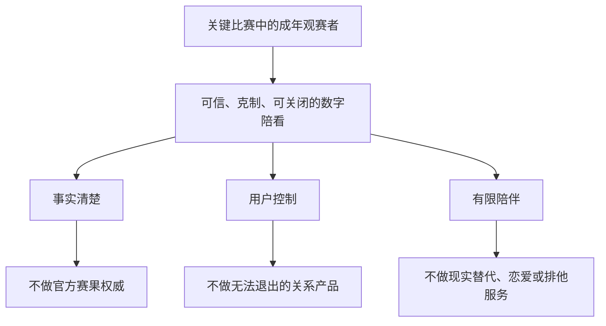
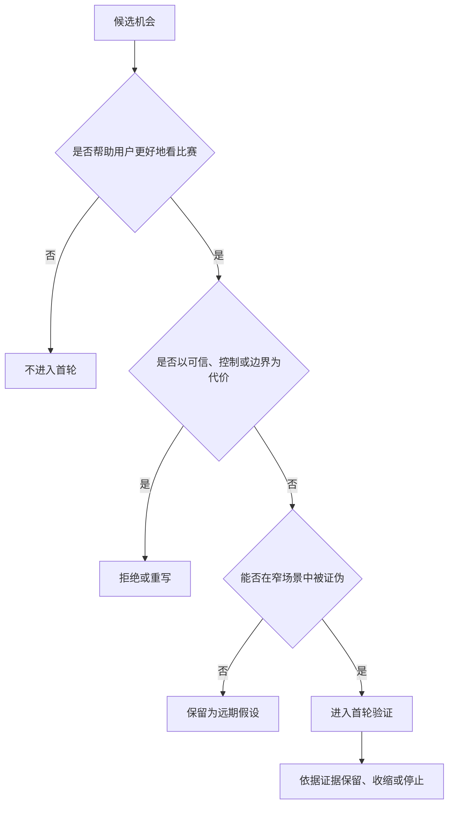

# 战略定位与非目标

> (v2 重写:球球全套资料重写工程,见 docs/adr/0014;大幅收敛理念重复,逐节对齐系统现状)

> **文档性质**:市场/战略卷第 5 篇——0→1 阶段的战略定位与非目标决策稿,不是项目复盘、功能清单或技术实现说明。  
> **重写日期**:2026-09-20(球球全套资料 v2 重写工程,见 docs/adr/0014);原方案形成/研究截止:2026-01-28。  
> **版本基线**:球球 VERSION 0.2.0.0(2026-09-20)。  
> **决策对象**:面向成年足球观赛者的实时数字陪看服务;面向用户的位置是**数字球友(Digital Ballmate)**。  
> **核心原则**:非目标先于功能清单写定;任何商业、增长与角色设计都不得绕过用户控制权。  
> **v2 改写说明**:本篇是全库理念重复密度最高的一篇(初版"安静"命中 16 处、"退出"18 处、"控制权"10 处)。v2 承重保留价值主张三件事(§5)、战略取舍(§9)与八条战略原则(§8),其余大幅收敛:非目标压为索引表并指向卷首§6.2 红线(§7);假设清单指向 3/13(VH 编号,§3.3);验证指标指向 3/16(§12);闸门改为到 3/14 G 编号的映射表(§13.2);90 天顺序与战略评审清单按实际状态压缩(§14、§15)。全部"现实对照"以仓库与 ADR 为 B 级证据;被推翻的表述删除,不作存档辩护。

---

## 0. 证据分级与读法

本篇属市场/战略卷,不做代码锚点表,使用四级证据标注:

- **A 级**:真实用户研究证据(访谈、观赛观察、行为数据)。**截至重写日为 0**——用户研究未执行,该债务如实记录于 1/06 §6.3。
- **B 级**:仓库与工程产物——ADR 编号、代码路径、评测集、端到端报告。本篇全部"已实现/换形态/planned/未发生"判定均属此类。
- **C 级**:公开规范与公开研究(NIST、FTC、网信办办法、UNICEF 等),提供问题方向,不构成对本地业务的直接法律结论。
- **D 级**:工作假设与设想。本篇全部定位论点、承诺与研究设计,在获得 A 级证据之前均为 D 级。

**术语约定**:

- **数字球友(Digital Ballmate)**:服务对用户的自我定位;明确为 AI,不是真人、官方裁判或权威赛事源。
- **强度分档**:现网为全局三档——**安静(quiet)/ 刚好(normal)/ 热闹(active)**;"仅关键事实"档为 planned(未实现)。
- **主动沉默(Chosen Silence)**:用户主动选择的安静,是产品状态而非失败。本篇仅在 §8 原则四展开,其余位置一句带过。
- **planned**:已规划、未实现。本篇不将 planned 项写作已有能力。

**交叉引用简写**:卷首=0.卷首/00-产品全貌;1/02、1/06=本卷第 2/6 篇;3/13、3/14、3/16=《验证与商业模式》卷第 13/14/16 篇。假设登记册(VH 编号)见 3/13;验证闸门(G0–G5)定义见 3/14;指标与反指标见 3/16;不可谈判红线见卷首§6.2。

## 1. 先做什么决定

本项目不以"做一个会聊足球的 AI"作为立项理由,也不以"给比赛加一个虚拟形象"作为品类定义。要做的,是一种有清晰身份边界的**实时足球陪看数字人**:在用户愿意被陪伴的观赛时刻,理解比赛语境和用户当下的参与方式;在该说话时提供简洁、可信、可控制的回应;在不该说话时安静;任何时候不假装真人、不替代现实关系、不诱导过度停留【D】。

这一定位包含三个同时成立的约束:

1. **它服务的是一个时刻,不是一段无限时长的聊天。** 第一场景是赛前、赛中、赛后的短窗口;用户打开它是为了让看球更投入、更轻松或更容易理解,不是找全天候倾诉对象。
2. **它提供的是"陪看"而非"权威事实"。** 比赛事实、观点、情绪回应和推测必须被清楚区分;不能把未经确认的信息伪装成赛事结论。
3. **它是一项可退出、可关闭、可纠正的服务。** 用户可以随时改为安静、只看、停止会话、管理记忆;任何商业、增长和角色设计都不得绕过这些控制权(红线见卷首§6.2)。

本篇建议批准的战略方向是:

> **先以"一个人看关键比赛时,希望既不孤单、又不被打扰"的成年球迷为滩头用户,做一位懂比赛、懂分寸、可随时关掉的实时数字球友。**

这不是营销文案,而是后续产品、运营和工程决策的筛子:一个需求如果不能同时提升"关键时刻的陪伴质量""事实可信度"或"用户控制权",就不应进入首个版本;一个需求如果靠制造依赖、误导信息或打断观赛来提高使用时长,则应被拒绝。

## 2. 要解决的问题:研究框架,不是功能堆叠

### 2.1 观赛不等于信息消费:四种需要

足球观赛中,用户经常在四种需要之间切换。这张表是研究框架,不是市场事实【D】:

- **观赛需要:获取事实** —— 用户此刻想完成的事:知道发生了什么、还剩多久、局势意味着什么。现有替代(比分应用、转播字幕、社交平台)信息多但语境碎、来源混杂,用户要自己判断重要性。待验证的机会:能否用更少打扰,让用户更快得到与当前情境相关的信息。
- **观赛需要:理解比赛** —— 想听懂战术、换人、判罚或双方走势。解说不一定覆盖用户的疑问,懂球的朋友未必在线或愿意解释。待验证的机会:能否按用户的知识水平解释,并承认不知道。
- **观赛需要:分享情绪** —— 进球、失误、逆转时想有人回应。群聊嘈杂、线下同看不可得、公开表达有社交成本。待验证的机会:能否让独自观赛者得到低压力、非占有式的情绪回应。
- **观赛需要:保持投入** —— 比赛节奏变慢时不想失去兴趣。刷短视频、切应用会把注意力带离比赛,回来时错过关键片段。待验证的机会:能否把用户带回比赛,而非把用户留在自己这里。

这张表故意不把"用户无聊"当作唯一问题,因为无聊最容易被无限内容、提醒轰炸和情感操纵利用。首个版本必须证明的是更窄的命题:**在有限、可预期的观赛窗口中,适量的上下文陪伴能让一部分成年用户更愿意专注观看,并在需要时感到被理解。**【D;尚未有 A 级证据】

### 2.2 为什么不是相邻品类

| 品类 | 用户买到的核心价值 | 若作为本项目第一定位 |
|---|---|---|
| 足球问答/搜索工具 | 快速得到答案 | 低频工具;难解释为何需要数字人与实时互动 |
| 比分、赛程、资讯工具 | 及时、完整、可订阅的信息 | 进入数据分发竞争,陪伴价值退为装饰 |
| 球迷社区 | 与真实球迷建立连接 | 需先解决陌生人社交与内容审核,不是最小闭环 |
| 虚拟主播/解说 | 单向娱乐内容 | 用户难控节奏,且挤占观看注意力 |
| **实时数字陪看(本项目的选择)** | 关键时刻可控的理解、回应和陪伴 | 需同时解决情境识别、事实边界与安全治理,但闭环最聚焦 |

首个版本不是要成为"所有球迷需求的入口",而是先赢得一个具体位置:用户一个人看一场自己在意的比赛时,愿意主动打开它,并在赛后认为它让这场比赛更好看,而不是更吵、更慢或更难抽离。

### 2.3 外部环境给出的是约束,不是答案【C】

- NIST《AI RMF: Generative AI Profile》要求生成式 AI 风险在设计与运行全生命周期被治理——角色的说话方式、记忆保留、错误修正都是产品设计问题,不是上线前的法务附录。
- 美国 FTC 2025 年对陪伴型 AI 启动调查,聚焦角色设计、商业激励与负面影响监控——它提醒的普遍商业风险是:当陪伴感与留存、订阅直接绑定时,产品会有诱导依赖的内在激励。
- 《生成式人工智能服务管理暂行办法》提出服务治理与防范未成年人沉迷等要求;《人工智能生成合成内容标识办法》自 2025-09-01 施行,要求显式/隐式标识与协议说明——身份披露与标识不能临近发布才考虑。

战略结论不是"风险大,所以不做",而是:**只做能把身份、事实、关系和退出路径设计清楚的那部分体验。** 一项增长、商业或角色能力若无法解释其安全边界,就不进入首发范围。

## 3. 目标用户与假设

### 3.1 滩头用户定义

首发研究对象建议限定为中国大陆的成年足球观赛者,满足以下条件中至少三项【D】:

- 近三个月有规律观赛,至少完整看过一场关键比赛;对至少一个俱乐部、国家队或联赛有明确关注;
- 有独自观赛、异地同看或"身边有人但没人可聊球"的经历;愿意用手机、耳机或第二屏辅助观看;
- 对"多一个数字角色陪看"不排斥,但不以寻求情感替代为主要目的。

这不是永久人群边界,而是把最初的验证做小。成年人优先不表示未成年人没有需求,而是拟人化互动、声音、记忆与情绪回应尚未充分验证前,不应拿未成年人作早期增长对象。研究亦应排除处于急性心理危机、明确寻求替代性亲密关系或无法自主同意的人群——这既是研究伦理,也是避免把脆弱性误读为需求。

### 3.2 按观赛任务切,不按"懂不懂球"切

| 任务类型 | 典型时刻 | 用户想得到 | 需避免的误判 |
|---|---|---|---|
| 独自投入型 | 夜间关键战,朋友不在线 | 有人理解胜负压力,但不持续占据注意力 | 把高情绪表达误判为愿意长时间聊天 |
| 轻量理解型 | 看重要比赛但规则战术不熟 | 能问到不尴尬的解释,不被科普轰炸 | 把知识缺口误判为需要大量资讯流 |
| 同步共鸣型 | 异地同看、错峰打开转播 | 一个稳定的情绪锚点和简短互动 | 把它做成对真实朋友关系的替代品 |
| 赛后回味型 | 赛后情绪未散 | 几分钟回顾高光、遗憾和下场期待 | 用无止境复盘把用户拖入产品 |

产品不为每种任务各做一套应用,而是用一个明确的"此刻你想怎么一起看"入口,让用户选择互动强度,并允许会话内随时改变。这个入口既是体验控制,也是战略防线:它把陪伴从系统单方面揣测,变成用户可见、可调整的授权。

> **现实对照【B】**:该入口以设置页全局三档(安静/刚好/热闹)+ 显式进入陪看实现(client settings_screen.dart:107-116);赛前逐场选择的形态 planned。

### 3.3 核心假设:登记在 3/13,本篇不自带编号

立项假设统一以 **VH 编号**登记并验证于 **3/13 假设登记册**(含验证方式、最低证据等级与优先级),本篇不再自带 H 编号、不重复反证与调整规则。初版 H1–H8 覆盖的主题——"不孤单但不被打扰"优于更多信息、赛前主动开启、接受拟人但要求披露与控制、可信优于自信、短回应与可打断、付费对应明确权益而非情绪回应、记忆明示可删、安全边界不显著损害体验——作为问题域输入由登记册承接;初版编号废弃,不做逐条映射。

## 4. 定位陈述:把承诺写成可被否决的话

### 4.1 对内定位陈述

**对于**在重要足球比赛中独自或缺少合适同看对象的成年观赛者,  
**我们提供**一位可由用户控制参与程度的实时数字球友,  
**帮助他们**在关键时刻更快理解场上局势、表达情绪并把注意力留在比赛里,  
**不同于**比分资讯、泛聊天机器人、公开球迷社区或单向虚拟主播,  
**因为它**把比赛语境、用户当下意图、事实不确定性和关系边界一起作为体验的一部分设计。

其中最重要的词不是"实时""数字人"或"懂球",而是"可由用户控制"。没有控制权,陪伴会滑向打扰;没有事实边界,陪伴会滑向误导;没有明确身份,陪伴会滑向欺骗。

### 4.2 对外可测试表达

首轮概念测试应随机呈现三种力度的表达【D;该测试尚未执行,见 1/06 §6.3】:

1. **场景表达**:`看一场你在意的比赛时,有个懂分寸的数字球友在旁边。想聊就聊,想安静就安静。`
2. **功能表达**:`它会结合比赛进程,用语音或文字回答你的问题、回应关键时刻,并让你随时切换为只看比赛。`
3. **边界表达**:`它是 AI 生成的数字角色,不替代真人关系;不会鼓励你因为它而离开朋友、家人或正常生活。`

被测试的不是文案点击率,而是:用户是否说得出它解决什么问题;是否知道它不是什么;是否愿意在下一场关键比赛中尝试;是否担心被打扰、犯错、窥探或尴尬。若受访者只能复述"一个会聊天的足球 AI",定位即未成立。

### 4.3 品类命名原则

内部使用"实时足球陪看数字人"作工作品类名,面向用户使用"数字球友(Digital Ballmate)"。不建议早期使用"AI 恋人""情感陪伴""虚拟伴侣""全天候朋友"等称谓——原因不是语言保守,而是这些称谓把用户期待推向亲密关系替代和持续依附,与首发场景、伦理边界和产品能力不一致。

## 5. 价值主张:只承诺三件事(承重保留,逐件对照现实)

### 5.1 第一价值:让用户更容易留在比赛里

陪看服务的第一成功不是用户说了多少话,而是用户是否更愿意观看、理解和回味比赛。产品应在关键时刻提供短而有用的支持——解释当前变化、确认用户的感受、提醒一段值得看的回放——但不能靠制造 FOMO、连环追问、无关推荐或持续自言自语抢走注意力。

**可验证承诺**:用户在赛后能具体描述至少一个"它帮助我更好看比赛"的时刻,而不是只说"它很可爱"或"我和它聊了很久"。【D】

> **现实对照【B】**:工程面"留在比赛里"由表达保持窗(HoldMS)与 ReturnMode 交回注意力的机制承担(ADR-0007)——系统主动把身体与注意力交还给用户,而非挽留;但"帮助时刻"的用户验证数据不存在(A 级证据为 0),本承诺仍待验证。

### 5.2 第二价值:让互动匹配用户此刻的参与意愿

用户的意愿不是常量:开场前想聊阵容,胶着时只想安静,进球后愿意共鸣,赛后想回顾或立刻离开。产品的价值不在于猜中全部心事,而在于把"轻聊、解释、提醒、安静、结束"这些选择做得显眼、低成本且可逆。

**可验证承诺**:用户可以在十秒内改变互动强度,不需要解释原因,不因选择安静而被反复召回。

> **现实对照【B】——已实现印证**:设置页三档(安静/刚好/热闹)即时生效,打断即停、显式进入陪看(client settings_screen.dart:107-116;match_session_controller.dart 的 interrupt/serverInterrupted 与 socket `interrupt` 命令)。"十秒"是表述性目标,未做计时验证;安静后的召回路径现网不存在。

### 5.3 第三价值:让用户知道自己能信什么、不能信什么

赛事场景里"快"很有诱惑力,但错误的快会伤害信任。产品必须区分:已确认事实、待确认信息、基于公开规则的解释、主观观点和情绪回应。它可以说"我还不能确认这个信息",也可以说"这是我的看法",但不能用自然、笃定的语气遮蔽不确定性。

**可验证承诺**:在事实不确定或来源冲突的测试中,用户能正确理解信息状态,并认为表达没有误导自己。【D】

> **现实对照【B】——部分**:事实状态治理已在后端与导播台建成(ADR-0002,FactStatus 贯穿 backend/internal/companion);**用户侧的状态呈现 planned**。"用户能正确理解信息状态"的验证未做。

### 5.4 不能作为价值主张的东西

以下表述即使短期提升点击,也不应使用:

- "永远陪着你""只有我懂你""你不需要任何人"——制造排他感(红线:卷首§6.2-2);
- "比真人朋友更懂球、更懂你"——拟人欺骗;
- "绝不出错""比直播更快知道结果"——事实承诺;
- "陪你熬夜到底""不看球也来找我"——过度使用;
- "根据你的情绪替你做决定"——决策代替;
- 将投注、赌盘、冲动消费包装成"懂你的建议"——高风险商业诱导(红线:卷首§6.2-6)。

> **现实【B】**:该原则的工程形态是参数化内容策略——ForbiddenTopics / ProfanityLevel / MaxSentences(backend/internal/companion),由 boundary 评测套件守护(evals/cases/boundary);是策略参数与评测回归,不是字符串黑名单。

## 6. 差异化:五个支点

首发差异化建立在五个能被用户感知、也能被测试的能力组合上:

| 支点 | 用户感知 | 团队必须做到 | 现实对照 |
|---|---|---|---|
| 语境 | "它知道现在是赛前、胶着、进球后还是赛后" | 互动与比赛阶段、用户选择和会话状态连接 | 已印证:会话强绑定比赛窗口【B】 |
| 分寸 | "它不是一直说,但我需要时它在" | 主动沉默、频率限制、明确结束、可打断 | 已实现:三档即时生效+interrupt【B】 |
| 可信 | "它不知道时会说不知道" | 明示事实状态、来源策略、时延与不确定性 | 部分:后端/导播台已建(ADR-0002),用户侧呈现 planned【B】 |
| 连续但可撤销 | "它记得我喜欢什么,但我能改、能删" | 记忆成为用户可见的授权,而非隐藏画像 | 部分,张力见 §8 原则五【B】 |
| 角色一致 | "它有稳定个性,但不会越界" | 角色语气、禁区、冲突处理与安全降级 | 部分:参数化护栏+boundary 评测已建(ADR-0001);危机语言库 planned【B】 |

这五项不是护城河声明。竞争者都可以复制形象和人设文案;真正难的是在高情绪、信息不完整、网络不稳定、用户随时改变意愿的情况下,仍保持同样的事实边界和互动分寸。首个版本只需证明其中两件:**用户能感到差异,团队能稳定交付差异。**

## 7. 非目标:索引表

初版 18 条非目标的展开段已收敛至此表;不可谈判红线统一见**卷首§6.2**,本篇只保留品类与战略层特有条目的一句话判断。

| 编号 | 首发明确不做 | 归属与本篇特有判断 |
|---|---|---|
| NG-01 | 不做全量比分、赛程、资讯聚合平台 | 卷首§6.1;数据覆盖竞争会掩盖陪看闭环验证 |
| NG-02 | 不做开放式球迷广场、陌生人匹配或公共弹幕社区 | 卷首§6.1;社交治理是另一项独立业务 |
| NG-03 | 不做博彩、赔率推荐、下注提醒或任何变相导流 | 卷首§6.2-6;不作为战略方向重新开启 |
| NG-04 | 不承诺成为赛事官方信息源或替代转播 | 卷首§6.1;版权、时效与权威承诺首发无法承担 |
| NG-05 | 不从"所有体育、所有语言、所有地区"同时启动 | 本篇特有:宽覆盖稀释场景研究;单一足球场景达标后逐项扩展(§9 取舍一) |
| NG-06 | 不以广告曝光时长作为核心成功指标 | 本篇特有:该指标会激励打断观赛与无价值停留;反指标口径见 3/16 |
| NG-07 | 不把数字角色设计为恋爱对象、专属伴侣或排他关系 | 卷首§6.2-2;不用告白、吃醋、要求承诺等脚本 |
| NG-08 | 不鼓励用户因产品减少与现实支持系统的联系 | 卷首§6.2-2;面对"只有你了"类表达应去排他化 |
| NG-09 | 不把连续使用、深夜使用或高频情绪表达当作"忠诚" | 本篇特有:这些信号首先是体验与安全风险线索,不是留存成绩 |
| NG-10 | 不假装具有意识、真实经历、身体感受或人类身份 | 卷首§6.2-1 |
| NG-11 | 不在用户脆弱、悲伤或愤怒时推销订阅、礼物或付费解锁 | 卷首§6.2-4;商业触达与高情绪互动隔离 |
| NG-12 | 不默认永久保存完整对话、音频或情绪标签 | 卷首§6.2-7;现实:记忆经 Memobase seam 自动抽取、保留期与删除受控(ADR-0006) |
| NG-13 | 不将对话用于未经说明的广告定向或跨场景画像 | 卷首§6.2-7;用户须能理解数据用途并拒绝非必要使用 |
| NG-14 | 不以隐藏"记忆"制造惊喜或监控感 | 卷首§6.2-7;现实:画像可查可删可暂停(client portrait_screen.dart:98-151) |
| NG-15 | 不生成或传播看似确认但未经核验的赛事新闻、伤病、交易、判罚结论 | 卷首§6.2-3;现实:FactStatus 状态治理已建(ADR-0002),不确定信息降低语气或拒答 |
| NG-16 | 不对未成年人提供拟亲密、深夜陪伴或绕开监护的互动 | 卷首§6.2-5;年龄保证建立前不将其作为服务对象 |
| NG-17 | 不把安全提示设计成一次点击即永久免责 | 本篇特有:安全是持续的产品行为、监控、申诉与人工处置;**当前危机语言库与人工处置 planned,进入用户面测试前必须补齐**(1/06 §7 阶段 4) |
| NG-18 | 不把用户无法理解的自动化判断直接变成高影响建议 | 本篇特有:涉消费、健康、关系或现实行动时限制能力,并提示寻求适当的人类支持 |

这些非目标不是"以后永远不能做",而是首发阶段的资源和伦理边界:一个新需求若迫使产品成为另一个品类,或需要牺牲用户控制权才能成立,就必须单独立项,而不是悄悄塞进陪看服务。

## 8. 战略原则:八条判断规则(承重保留,逐条标现实)

**原则一:场景优先于日活。** 我们追求的是"在合适的比赛里被主动选择",而不是"每天都找理由把用户拉回来"。日活可以是结果,不能是首发阶段的驱动。若一个提醒不能明确说明它与用户订阅的比赛、已选择的偏好或用户请求有关,就默认不发。  
> 现实【B】——已印证:会话强绑定比赛窗口,无比赛外闲聊场景。

**原则二:事实可信优先于语言流畅。** 一句漂亮但错误的赛事判断,比一句简短的"不确定"更伤害长期信任。事实服务必须允许慢一点、少一点、明确一点。观点和情绪可以有个性,事实状态不能被个性覆盖。  
> 现实【B】——已印证:事实状态治理先行建成(ADR-0002)。

**原则三:用户意图优先于系统猜测。** 系统可以提出一次低打扰的建议,但不能把推测当作授权。用户说"安静""先看比赛""别提醒""不要记住"时,应立即生效,并比任何增长目标优先。  
> 现实【B】——已印证:三档即时生效+interrupt 即停。

**原则四:主动沉默是功能,不是缺陷(Chosen Silence)。** 一位好的陪看角色不需要填满每一分钟。沉默、简短确认、等待用户发起和在关键节点再出现,都是产品能力。任何团队成员都不能以"空白会降低参与度"为由默认增加话术。  
> 现实【B】——已印证:quiet 档压缩主动量;沉默是产品状态,不是超时失败。

**原则五:关系连续性必须可见、可撤销。** 偏好与记忆只有在用户知道其存在、知道其作用、能改变其内容时才有价值。长期关系不能建立在用户看不到的数据积累上。  
> 现实【B】——部分,张力如实写明:实际建成的是"自动记忆+事后可控"——Memobase 自动抽取记忆,画像可查、可删、可暂停(ADR-0006;client portrait_screen.dart:98-151),而非本条原设想的"显式授权前置"。**v2 修订:本条从"显式授权前置"修订为"自动记忆+可见可删可暂停的事后控制",差异记录于 ADR-0006**;删除全流程演练仍欠。

**原则六:商业化不得利用脆弱性。** 订阅、增值服务或商业合作可以存在,但不能在用户失落、孤独、愤怒、熬夜或表达依赖时触发。商业化设计要接受"如果这句话由一个现实销售人员说出口,会不会令人不适"的检验。  
> 现实【B】——未发生:无商业化,原则当前没有可违反的对象;作为前置约束保留。

**原则七:安全不是拒绝体验,而是设计替代路径。** 仅说"不能"会把用户推向其他地方。更好的做法是明确不能做什么,同时给出不越界的替代:把排他性表达引回现实支持,把不确定的赛事传闻转化为等待确认,把过度互动引导为暂停或安静模式。  
> 现实【B】——部分:替代路径的判定与守护由 boundary 评测承担,替代了初版设想的人工评审路径;危机场景的人工升级路径缺失(§10.2)。

**原则八:先把服务边界讲清楚,再追求角色魅力。** 用户喜欢角色是好事,但如果用户不知道它是 AI、不知道它会保存什么、不知道怎样停止,角色魅力就是风险放大器。身份、数据和控制权的说明应在关键选择点自然出现,而不是藏在冗长协议里。  
> 现实【B】——部分被否定,如实记录:Live2D 表演与语音链路先于边界披露建成(实际建序见 1/06 §6.1);AI 首次说明 planned,构成合规敞口(1/02、1/06 §7)。

## 9. 战略取舍:明确放弃什么,才能知道第一版要做好什么(承重保留)

- **取舍:广泛用户覆盖 vs. 窄场景验证**
  - **首发选择**:先做成年关键比赛观赛者。
  - **放弃的收益**:初期注册量与话题广度。
  - **换来的收益**:更清楚的需求信号与更低的安全复杂度。
  - **重新打开条件**:连续两轮研究显示相邻人群需求高度相似。

- **取舍:全天候聊天 vs. 比赛窗口陪看**
  - **首发选择**:以赛前、赛中、赛后为主。
  - **放弃的收益**:更长停留时长。
  - **换来的收益**:避免关系替代定位,强化场景价值。
  - **重新打开条件**:用户研究证明非比赛场景有独立且健康的任务。

- **取舍:连续讲解 vs. 用户可控的短互动**
  - **首发选择**:默认短回应、可打断、可安静。
  - **放弃的收益**:"看起来很聪明"的表演感。
  - **换来的收益**:不抢转播、不压迫用户。
  - **重新打开条件**:用户明确偏好连续讲解,且可证明不影响观看。

- **取舍:高人格化 vs. 边界优先的人格化**
  - **首发选择**:稳定但非亲密的人设。
  - **放弃的收益**:更强的角色黏性叙事。
  - **换来的收益**:降低欺骗、依赖和未成年人风险。
  - **重新打开条件**:安全评测和用户理解测试持续通过。

- **取舍:默认长期记忆 vs. 最小化记忆**
  - **首发选择**:默认不保存或显式选择。
  - **放弃的收益**:更快的个性化感。
  - **换来的收益**:建立信任,降低数据风险。
  - **重新打开条件**:用户主动要求且理解数据生命周期。
  - **v2 现实【B】**:已按换形态落地为"自动记忆+事后可控"(ADR-0006);重开条件相应改为——用户理解数据生命周期,且删除全流程演练通过。

- **取舍:付费解锁情感回应 vs. 付费购买明确权益**
  - **首发选择**:不为"被陪伴"本身设付费墙。
  - **放弃的收益**:可能损失短期转化技巧。
  - **换来的收益**:商业目标不反向塑造角色关系。
  - **重新打开条件**:找到不伤害边界的价值包并经实验验证。

- **取舍:追逐所有赛事 vs. 聚焦少量高意愿场景**
  - **首发选择**:选择有限赛事和时间段验证。
  - **放弃的收益**:覆盖率与营销叙事。
  - **换来的收益**:保障体验、运营和事实质量。
  - **重新打开条件**:现有场景达标且扩展不降低服务质量。

取舍必须被写进路线图。当数据不如预期时,团队最容易用"多做一点""更会聊天一点""多发几条提醒"补救,而这些恰恰侵蚀定位。

## 10. 伦理与治理边界

### 10.1 数字身份与生成内容标识【C】

用户在首次体验、关键互动、内容导出和分享场景中,应能合理理解自己正在与 AI 生成的数字角色互动;它不是真人客服、真实朋友或官方赛事代表。具体标识形式依适用法律与发布渠道确认,战略层原则只有一条:**不能用拟人化设计换取身份模糊。**  
> 现实【B】:AI 首次说明(身份披露)planned——这是当前最明确的合规敞口(1/02;1/06 §7 阶段 2)。

### 10.2 情绪互动与依赖风险:两种"升级"必须分开

角色不能以占有、内疚、奖励或恐惧驱动用户回归;对表达明显孤立、依赖、危机或自伤风险的用户,产品不能假装提供专业支持,也不能以亲密角色姿态加深对话,应采用经专家审阅的去升级表达和求助引导。**危机语言库与人工升级规则当前 planned,未实现。**【B】

**必须区分的两个"升级"**:

1. **危机人工升级(crisis escalation)**:把高风险用户转交人工处置或外部求助资源——即上段的机制,**planned**。
2. **关系阶段自动晋升(stage advancement)**:现网机制为 backend/internal/relationship/policy.go 按共同观赛证据(共同观看场次与证据类别)自动推进 first_meeting → familiar → watch_buddy → old_ballmate,由策略约束而非人工评审。【B】

两者不矛盾:自动晋升的只是**互动规范姿态**——各阶段允许的主动性与话题范围;它始终受参数化内容策略(ForbiddenTopics 等)与 boundary 评测护栏约束。本篇"不以亲密姿态加深对话"约束的是表达内容与关系宣称;晋升不等于关系承诺,角色仍是 AI,仍受卷首§6.2 红线约束。

### 10.3 未成年人保护

首发策略是"先不以未成年人为服务或增长对象",而不是"后续补一个年龄弹窗"。未来若面向未成年人,必须先证明年龄保证、内容分级、监护沟通、时间控制、数据最小化与风险处置形成完整闭环,并单独立项(卷首§6.2-5)。UNICEF 儿童 AI 政策指引同样强调儿童最佳利益前置,而非事后补救。【C】

### 10.4 数据与记忆

只收集达成当前体验所需的数据;用户应能知道哪些偏好影响回应、内容保留多久、如何纠正、导出、删除。"同意参加研究"不得延伸解释为"同意长期使用对话训练模型或营销画像";涉及声音、情绪标签或敏感信息的设想需单独论证与审查。  
> 现实【B】:记忆为自动抽取+事后可控(ADR-0006,画像可查可删可暂停);"不默认永久保存"以保留期控制与删除路径落实,全流程删除演练未做。

### 10.5 商业透明度

赞助、推荐和付费权益必须与角色的情绪互动区分;用户应知道一条内容是普通陪看、基于公开事实的解释还是受赞助内容;禁止把广告主目标伪装成角色偏好,禁止在用户脆弱时使用限时付费刺激。  
> 现实【B】:未发生——无商业化;本节作为商业化启动前的前置约束保留。

## 11. 对业务、产品与工程的共同要求

战略若不能落成可验收的要求就只是口号。以下要求在每次范围变更时复核:

**业务要求**:

1. 收入模型先接受边界审查:是否把陪伴感本身商品化?是否会在用户脆弱时触发?是否让免费用户被故意做得更孤单?答案不清楚时不进入实验。
2. 首发增长只寻找高意愿场景,不用泛娱乐话题、连续签到或社交裂变掩盖场景价值不足;优先验证用户是否愿意在下一场自选比赛中主动回来。
3. 合作方不改变事实与角色底线:不因流量、数据或内容合作而引导投注、虚假背书、过度推送或隐藏广告属性。
4. 市场规模采用情景模型,首轮研究完成前只讨论可触达高意愿用户、使用频率、留存与支付意愿的区间,不宣称精确 TAM。

**产品要求**:

1. 用户必须能在进入时选择互动强度,在过程中一键安静、关闭语音、改为文字、结束会话和管理记忆。
2. 每个主动触发都要有可解释的理由(明确订阅、主动请求或已选模式),不能因"系统预测用户会喜欢"高频打断。
3. 事实表达要有状态规则:已确认、待确认、解释、观点、情绪回应不能混写。
4. 角色人格需要一份可审查的行为规范,至少覆盖语气、主动性、禁止表达、敏感场景降级和商业内容隔离。
5. 所有高风险体验都应有"退出优先"方案:退出不需要多次确认,不因退出被情绪挽留,也不降低基础比赛信息的可用性。

**工程与数据要求**:

1. 以事实可追溯和状态可解释为目标,而不是只追求生成回复更自然;对赛事事实、修订、延迟和来源冲突,应能展示或复核其状态。
2. 以"用户说停即停"为系统级要求:语音、动画、推送、会话和记忆写入都应支持及时取消与明确结果反馈。
3. 发布前定义可测量的体验预算:响应时间、故障降级方式、提示失败时不误导;数值门槛由真实设备与网络测试确定,不能凭演示环境拍板。
4. 建立隔离评测集,覆盖事实错误、不确定信息、排他性诱导、未成年人、情绪危机、广告混入、删除请求和断网恢复等场景。
5. 默认最小数据化:长期记忆、音频保存、跨会话分析和模型训练使用分别开关、分别记录、分别审查。  
> 现实【B】:评测集已建(evals,含 boundary 套件);"说停即停"的会话侧已建(interrupt);运行时全局暂停能力未建(1/06 §9)。

**运营要求**:

1. 为比赛日建立内容、事实、风险和反馈的当班机制:运营不是给角色"加更多话术",而是确保高风险场景有明确处置人和停止开关。
2. 维护事实争议和用户投诉的接收、分级、回应、修复与复盘流程;不能让用户只能在公开社交平台求助。
3. 对角色表达、主动触发和商业内容做抽样审查,重点检查是否偏离身份披露、分寸和非依赖边界。
4. 每次重大赛事、重大版本或合作活动后,复查是否出现"提升数据但伤害体验"的迹象,并有权撤回功能或暂停活动。  
> 现实【B】:值守、投诉与复盘机制未建设,当前多项依赖创始人手工盯守(1/06 §5.1)。

## 12. 验证指标:名录(定义见 3/16)

七个测量维度的定义、建议指标与判读方式统一见 **3/16**,本篇只留名录:

- **场景匹配**——用户会不会在下一场自己在意的比赛中主动选择服务;
- **体验增益**——它是否让比赛更投入、更易理解或更有陪伴感;
- **信任**——用户能否理解事实、观点和不确定性的差别;
- **控制权**——用户能否顺畅改变互动强度或退出;
- **关系健康**——产品是否在制造不必要的依赖或排他感;
- **商业可行**——用户是否愿为明确权益而非依赖关系付费;
- **运行质量**——实时场景是否稳定到足以承载承诺。

北极星候选与"每项正向指标必须配一个反指标"的规则见 3/16。

四类"看似好看"的坏指标保留在本篇,因为它们是定位筛子的一部分:**总消息数**(可能来自过度追问)、**连续在线时长**(可能说明被拖离比赛或夜间过度使用)、**推送点击率**(可能来自焦虑诱导)、**角色喜爱度**(喜欢角色不等于定位成立、不等于关系边界健康)。任何增长看板都应与"打扰感、事实信任、退出成功、风险反馈"并列展示;若前者上升后者变差,优先修复体验。

> 现状【B/D】:以上指标当前均无可测数据——无真实用户使用;第一批可测时点在 1/06 §7 阶段 4 用户面开始之后。

## 13. 失败模式与停止门槛

### 13.1 七种失败模式(名录)

| 失败模式 | 最早信号 | 禁止的错误补救 | 正确动作 |
|---|---|---|---|
| 只被当作普通聊天机器人 | 说不出赛中价值,只在比赛外闲聊 | 增加拟人话术和召回 | 缩小场景,重测关键时刻价值 |
| 赛中太吵 | 频繁静音、跳过、投诉打扰 | 降低静音入口可见性、调高主动频率 | 默认更安静,主动触发须有明确授权 |
| 事实错误击穿信任 | 反复纠错,赛后不再开启 | 用更笃定语言掩盖不确定 | 降低断言范围,建立确认、修订与解释机制 |
| 角色越界带来不适 | 反馈暧昧、占有、催促或像在监控 | 只删单句,不复查触发逻辑 | 暂停相关能力,审查角色规则、评测集与商业激励 |
| 付费被理解为"买陪伴" | 认为不付费就被冷落,高情绪时冲动购买 | 加强限时折扣和情感话术 | 重构权益,基础尊重与安全不依赖付费 |
| 为扩范围牺牲质量 | 覆盖增加,延迟、错误、投诉同步上升 | 用激进增长掩盖服务不稳 | 关停扩张,回到少量赛事验证运行质量 |
| 未成年人或高风险用户被吸引 | 注册与反馈显示年龄、脆弱性识别不足 | 把风险用户当高留存用户运营 | 暂停触达,完善年龄与风险处置后再评估 |

> **现实【B】**:"赛中太吵"一类的工程预防已建成——quiet 档压缩主动量、主动触发受授权与冷却约束、可打断(interrupt);其余模式的预防多数仍依赖未建的运营处置与用户验证,不能视为已覆盖。

### 13.2 停止门槛:映射到 3/14,本篇不重复定义

停止不是失败,而是避免把错误假设做大。初版四道闸门(A–D)的定义与数值已收敛至 **3/14 的 G 编号门禁体系**,本篇只保留映射与状态;上线硬门槛另见**卷首§14**,阶段视角见 1/06 §7。

| 初版闸门 | 一句话内容 | 映射至 3/14 | 状态 |
|---|---|---|---|
| 闸门 A:概念研究后是否进入原型 | 核心价值可复述;需求不被比分/新闻盖过;身份披露不摧毁尝试意愿 | G0 问题存在 + G1 概念可理解 | 未触发(研究未执行,1/06 §6.3) |
| 闸门 B:原型体验后是否进入封闭试用 | 有具体体验增益;控制项可发现可完成;事实状态被正确理解;越界事件被处置 | G2 最小闭环 + G3 控制与安全 | 未触发(同上) |
| 闸门 C:封闭试用后是否测试付费 | 二次开启靠主动选择而非提醒;付费理由不是"怕失去它";基础体验无缺口 | G4 真实节奏 + G5 重复选择 | 未到 |
| 闸门 D:付费试验后是否扩大规模 | 增长不伴随打扰、风险与信任下降;不靠放宽年龄、模糊身份换增长;运营可承受 | 3/14 §11(Go / No-go / 停止) | 未到 |

> **现状【B】**:各门均未对真实用户触发;迄今发生的验证全部是工程验收型(评测集与 phase 端到端报告),其性质与局限见 1/06 §6.3。

## 14. 首个 90 天:顺序原则保留,执行如实记录

初版把"先研究后工程"写成 13 周顺序(问对问题 → 低保真原型 → 最小服务合同 → 下一轮验证准备)。**该顺序未按此执行**:工程先行、研究 0 执行,已记录为证据债(1/06 §6.3)。保留的只有顺序原则本身——先问对问题、再验证位置、再把承诺写成可验收规范、再准备下一轮;具体研究设计(访谈、日记、实验卡、八周节奏)见 **3/13**。90 天的理想产出是一个能回答以下问题的决策包,而不是功能演示:谁会在什么时刻自愿使用;他们为何觉得更好;哪些人不适合;哪些边界不可谈判。

## 15. 战略评审清单(压缩)

初版"新功能/新赛事/新人群/新收入方式入表前十问"(服务哪个观赛时刻、提升哪一类价值、能否被看见和撤销、是否推向相邻品类、是否混合事实与商业、是否加深身份模糊、是否在脆弱时加压、出错可否纠正、不做的代价、由哪个指标与门槛裁决)保留为评审提问集,不在此展开。**该评审机制事实上由 openspec + ADR 流程承担**——ADR-0011/0013/0014 即"高风险变更须重新评审"的实际实例;十问作为提案评审的检查单附于提案材料。

## 16. 公开研究来源与使用边界【C】

以下资料用于识别治理方向和实时交互约束,不构成对本地市场规模、付费意愿或产品成功的证据;访问日期均为 **2026-01-28**(v2 重写日 2026-09-20 未新增来源)。

1. NIST, *AI Risk Management Framework: Generative AI Profile*, 2024。<https://doi.org/10.6028/NIST.AI.600-1>
2. U.S. FTC, *FTC Launches Inquiry into AI Chatbots Acting as Companions*, 2025-09。<https://www.ftc.gov/news-events/news/press-releases/2025/09/ftc-launches-inquiry-ai-chatbots-acting-companions>
3. 国家互联网信息办公室等,《生成式人工智能服务管理暂行办法》,2023-07-13。<https://www.cac.gov.cn/2023-07/13/c_1690898326795531.htm>
4. 国家互联网信息办公室等,《人工智能生成合成内容标识办法》,2025-03-14 发布,2025-09-01 施行。<https://www.cac.gov.cn/2025-03/14/c_1743654684782215.htm>
5. UNICEF, *Policy Guidance on AI for Children*, 2021。<https://www.unicef.org/globalinsight/reports/policy-guidance-ai-children>
6. Microsoft Learn, *Get started with Voice Live for real-time voice agents*,持续更新——提醒实时语音须把连接、打断、会话状态与延迟作为完整链路设计。<https://learn.microsoft.com/en-us/azure/ai-services/speech-service/voice-live-quickstart>

## 17. 结论

首发阶段唯一值得争取的位置,不是"最像人的足球 AI",也不是"功能最多的看球应用",而是一项用户愿意在重要比赛中主动打开、又能随时安静和退出的服务:让一部分成年球迷觉得比赛更容易投入,却不被系统绑住;让他们得到帮助,却不把猜测当事实;让数字角色有个性,却不假装拥有真人关系。

如果研究证明这个位置不存在,或者只能靠模糊身份、制造依赖、牺牲事实可信度才能成立,就应停止或转向。把这条结论写在立项之初,比在规模扩大后再解释"为什么当时没有刹车"更有价值。

**v2 补记(2026-09-20)**:截至重写日,本篇的战略判断仍是 D 级假设;已兑现的部分是控制与边界的工程形态(三档强度、打断即停、事实状态治理、参数化护栏与 boundary 评测)。定位成立与否,等待 A 级证据。
