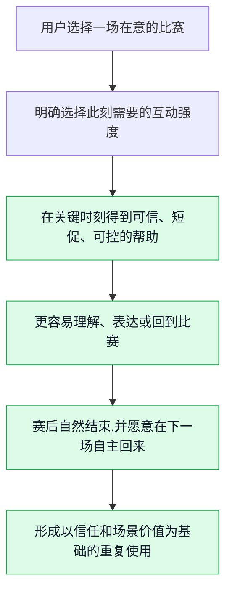
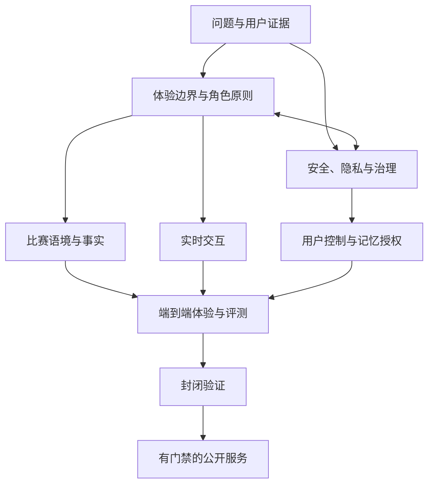
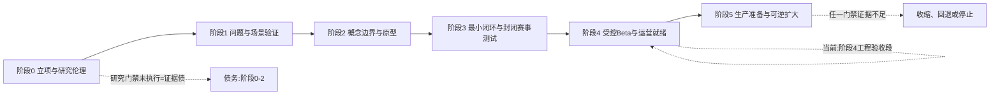

# 产品愿景与阶段门禁

> (原:产品愿景与阶段路线图;v2 按实际建序与证据现状改写)

> **文档性质**:市场/战略卷第 6 篇——0→1 愿景与阶段门禁决策稿,不是项目复盘、功能说明书或组织汇报材料。
> **重写日期**:2026-09-20(球球全套资料 v2 重写工程,见 docs/adr/0014);原方案形成/研究截止:2026-01-28。
> **版本基线**:球球 VERSION 0.2.0.0(2026-09-20);v0.1.0.0 发布于 2026-07-15。
> **决策对象**:面向成年足球观赛者的实时数字陪看服务;它面向用户的位置是**数字球友**。
> **核心原则**:门禁按"风险是否已经被降低"推进,不按"已经做了多少功能"推进。v2 补充:本原则同样约束已建成的工程——工程验收通过不等于风险已被降低。
> **v2 改写说明**:初版写于工程建设之前,其"研究先行、文字优先、语音形象靠后"的排序叙事已被实际建设顺序推翻。v2 保留愿景与门禁框架,按实际建序重排叙事(§6),对能力域逐域标注现实(§5),对六阶段标注状态与证据类型(§7);被推翻的表述删除,不作存档辩护。收敛后的内容以链接指往:反面画面→卷首§6;赛后收束→卷首§7.4;战略取舍→1/05;指标与反指标→3/16;假设登记册→3/13;门禁定义→3/14。

---

## 0. 证据分级与读法

本篇属市场/战略卷,不做代码锚点表,使用四级证据标注:

- **A 级**:真实用户研究证据(访谈、赛事日观察、行为数据)。**截至重写日,本项目 A 级证据数量为零**——用户研究 0 执行,这是本篇如实记录的最大债务(§6.3)。
- **B 级**:仓库与工程产物——ADR 编号、代码路径、评测集、phase 端到端报告。本篇全部"已实现/换形态/planned/未执行"判定均属此类。
- **C 级**:公开规范与公开研究(NIST、FTC、网信办办法、ICO 等),提供问题方向,不构成对本地业务的直接法律结论。
- **D 级**:工作假设与设想。本篇全部愿景、论点与机制设计,在获得 A 级证据之前均为 D 级。

**术语约定**:
- **数字球友**:服务对用户的自我定位;明确为 AI,不是真人、官方裁判或权威赛事源。
- **强度分档**:现网为全局三档——**安静(quiet)/ 刚好(normal)/ 热闹(active)**。初版设想的"赛前四选项"(只看要点/有问题再问/轻量陪看/这场安静)未按该形态实现;**"仅关键事实"档为 planned(未实现)**。
- **主动沉默(Chosen Silence)**:用户主动选择的安静,是产品状态而非失败。
- **planned**:已规划、未实现。本篇不将 planned 项写作已有能力。

**交叉引用简写**:卷首=全套资料卷首篇;1/02、1/05=本卷第 2/5 篇;3/13、3/14、3/16=《验证与商业模式》卷第 13/14/16 篇。假设登记册(VH 编号)见 3/13,本篇引用不自带编号;阶段门禁 G 编号定义见 3/14,本篇只标注状态;指标与反指标见 3/16。

---

## 1. 愿景:我们要抵达什么未来

本项目要探索的不是一个"更会聊天的足球 AI",也不是在比分、赛程或直播流旁边放置一个会说话的形象。它要验证的是一种更窄、更可被否决的服务:在用户主动选择的关键观赛时刻,一位明确为 AI 的数字球友,能以可信、克制、可中断的方式帮助用户理解比赛、承接短暂情绪,并把注意力留在比赛及真实生活中。

用一句可以被后续工作推翻的话描述,愿景是【D】:

> **让独自观看重要足球比赛的成年用户,在不被打扰、不被误导、也不被关系绑架的前提下,拥有一位懂比赛、懂分寸、随时可以安静或离开的数字球友。**

这句话包含四个缺一不可的承诺。

**承诺:关键时刻**
- **用户最终应感到什么**:"它在我需要时出现,不占据整场比赛。"
- **团队不能偷换成什么**:用持续推送、连环追问和长对话提高时长。
- **验证方式**:赛事日观察、回放访谈、主动关闭原因(均为待执行的 A 级验证,见 §6.3)。

**承诺:懂比赛**
- **用户最终应感到什么**:"它能解释我眼前发生的事,也会承认不知道。"
- **团队不能偷换成什么**:用流畅口吻掩盖不确定、猜测或延迟。
- **验证方式**:事实状态理解测试、错误纠正演练(用户面待执行;工程面事实状态已建,见 §5)。

**承诺:懂分寸**
- **用户最终应感到什么**:"我可以选择轻聊、提问、安静或结束。"
- **团队不能偷换成什么**:把热情、黏性和拟人化当成陪伴质量。
- **验证方式**:交互强度切换测试、越界语料红队(红队部分已由 boundary 评测承担【B】)。

**承诺:可离开**
- **用户最终应感到什么**:"它不是我的替代关系,关闭后不会追着我。"
- **团队不能偷换成什么**:用排他语言、愧疚感或稀缺感换留存。
- **验证方式**:退出路径测试、风险访谈、长期日记研究(待执行)。

因此,首发版本的终点不应是"有一个完整的数字人产品",而应是一个更严格的状态:一小群明确的成年用户,愿意在下一场自己在意的比赛中**自主**再次打开服务;他们说得出它在哪个时刻帮到了自己;他们知道它是什么、会记录什么、不能保证什么;同时,没有证据显示服务通过打扰比赛、模糊事实或诱导依赖换取了使用。

如果这四个条件无法同时成立,项目应缩小、转向或停止,而不是以增加功能掩盖问题。

---

## 2. 目标画面:写成用户的一场比赛

愿景必须落在可观察的行为上。以下场景是用来约束研究、设计和工程取舍的目标画面【D】,不是对已实现体验的描述;每节末尾标注现实对照【B】。

### 2.1 赛前:用户决定"要不要让它参与"

一位成年用户在开赛前打开服务。页面首先说明这是 AI 数字角色,而不是真人、官方裁判或权威赛事源。用户看见清晰且不打扰的选择:`只看要点`、`有问题再问`、`轻量陪看`、`这场安静`。如果选择陪看,用户还能设定语音、文字、提醒频率、是否保存本场偏好,以及何时自动结束。

这里真正要解决的不是"让用户尽可能多授权",而是让用户在十秒内完成一次知情且可撤销的选择。若用户不想说话、不愿保存偏好或只想看比赛,产品仍须成立。把沉默视作失败,会迫使系统把每一次安静都当成需要被填补的空白,最终反而损害观赛。

> **现实对照【B】**:强度选择已实现,但形态为**全局三档(安静/刚好/热闹)**,而非赛前四选项;"仅关键事实"档(≈"只看要点")planned;赛前语境化的授权项(提醒频率、本场偏好、自动结束)planned。"AI 首次说明"(身份披露)未实现,planned,构成合规敞口(见 1/02 拟人化办法)。

### 2.2 赛中:服务围绕比赛而不是围绕自己组织互动

比赛进行时,数字球友不承担替代解说、抢先播报或持续表演的职责。它的机会来自三个被用户允许的时刻:用户明确提问;比赛出现可解释的显著变化;用户此前选择了有限的提醒或回应。它应优先使用短回应,并保留可见的信息状态,例如"已确认""仍待确认""这是基于规则的解释"或"这是我的看法"。

用户若说"安静一点"、摘下耳机、切换为只看,系统应立即让位。用户若打断回答,也不需要解释或道歉。服务在这里的成熟标志不是"总能接住话",而是"知道何时不该接"。

> **现实对照【B】**:可打断与主动沉默已实现(语音链路与 VAD,见 §5"实时交互");信息状态的后端与导播台侧已建(ADR-0002 matchstate),**用户侧呈现 planned**。

### 2.3 赛后:帮助收束,而不是制造无尽停留

赛后收束的原则(自然结束是产品质量的一部分;保存对象、用途、期限与删除入口必须说清楚;不以"再聊五分钟"作留存策略)已收敛至**卷首§7.4**,本篇不再重复。

> **现实对照【B】**:赛后收束流程未实现,planned。

### 2.4 目标状态的反面

反面画面(关键回合持续插话、把未确认信息说成确定事实、诱导"错过回应"、暗示比现实关系更懂用户、把基础情绪回应做成付费墙、保存不透明、用"陪伴感"包装过度使用等)已收敛至**卷首§6**,本篇不再重复。愿景的价值正体现在这些拒绝上:任一画面成为常态,产品就从"帮助用户看球"转为利用用户的注意力、情绪或信息不对称。

---

## 3. 机会选择:为何只从这个问题开始

### 3.1 先选择场景,再选择人群,再选择能力

0→1 最容易犯的错,是先拥有一堆能力,再为每项能力寻找用途,把项目推向没有主任务的功能集合。本项目反向选择:先从"用户独自观看一场在意的比赛"的有限时段入手,再确认哪些成年用户真正存在这个问题,最后决定值得建设哪些能力。选择这个切口的五个理由【D】:

1. **时刻天然有限**:赛事有明确的赛前、赛中、赛后边界,把陪伴从全天候承诺缩小为可观察的使用窗口。
2. **替代品真实存在**:直播解说、比分应用、群聊、朋友、社区、搜索。若不能比某一种替代方式更好,问题会很快暴露。
3. **价值可以被描述**:用户能在赛后回忆"哪个时刻帮助了我",把主观陪伴感转化为可访谈、可测试的证据。
4. **风险可以被前置**:事实错误、打扰、角色越界、隐私和依赖风险都能在封闭场景中测试。
5. **规模扩张有天然约束**:先把一个用户—赛事—任务闭环做对,比早期追求覆盖更重要。

这不是宣称足球是唯一垂类。它只是第一个能同时检验价值、信任、边界和工程可行性的试验场;若这条路径无法成立,不应靠扩大赛事或用户来"稀释"失败。

### 3.2 机会筛选标准

每个候选方向用同一张筛选表,不由创始人偏好或模型能力决定【D】:

| 筛选维度 | 必须回答的问题 | 高分证据 | 一票否决信号 |
|---|---|---|---|
| 问题强度 | 用户是否在比赛发生时主动寻找替代方案? | 行为日记、真实转播记录、反复出现的具体情境 | 只有抽象好奇,说不出上次何时发生 |
| 替代缺口 | 现有工具为何没有解决? | 用户能清楚指出群聊、解说、资讯的不足 | 所有需求已被单一替代品低成本满足 |
| 付出意愿 | 用户是否愿意给出时间、注意力、授权或金钱? | 主动预约、赛前开启、连续参与或真实付费测试 | 只愿在访谈中说"会用" |
| 信任可建 | 用户能否理解信息边界并接受不确定性? | 能区分事实、解释和观点,遇纠错仍愿继续测试 | 期待绝对正确、绝对即时且不接受说明 |
| 风险可控 | 是否能在首发范围内控制伤害? | 清晰的年龄、隐私、退出和人工处理路径 | 价值依赖模糊身份、强依赖或不可解释的数据实践 |
| 供给可行 | 体验是否依赖无法稳定获取的内容、版权或人工? | 关键输入的来源、时效和责任已被验证 | 没有受限内容或人工高成本即无法提供价值 |

候选方向分三类:**进入验证**(问题强度、替代缺口、风险可控均有正向证据)、**保留观察**(问题存在但价值或边界不清)、**明确拒绝**(价值主要来自排他陪伴、刺激时长、虚构确定性或受限内容分发)。资源只投第一类;第三类记录为非目标,防止它在增长压力下重新出现(非目标清单见卷首§6)。

> **现状【B】**:本表迄今未对真实候选用户执行过——它是待启用的工作工具,不是已通过的筛选记录。

### 3.3 起始用户的选择原则

早期研究对象优先是能独立同意参与的成年观赛者,以行为条件组合招募,不以年龄、性别、城市或消费能力做单一切分【D】:

- 近期确实观看过完整或大部分足球比赛;
- 对至少一场赛事、球队或球员存在真实关注;
- 有过独自观看、异地同看、想问问题但不想在公开群聊发言的时刻;
- 愿意在比赛前后接受短访谈或记录观察;
- 能接受测试 AI 数字角色,但不以寻找替代性亲密关系为主要目的。

研究应主动招募反例:认为"看球就该安静"的用户、只相信官方事实源的用户、讨厌拟人角色的用户、强依赖群聊的用户、愿意看球但从不使用第二屏工具的用户。反例不是阻碍,而是帮助团队确认产品边界的必要样本。

---

## 4. 战略叙事:从"陪伴"到"更好的观看"

### 4.1 战略的因果链

产品不应把"更长的聊天"误当作"更好的陪伴"。战略因果链【D】:

若某环节被替换为"用户被提醒拉回""角色不断追问""用户舍不得离开",说明增长机制已脱离价值机制。所有能力、指标和商业化试验都应能在这条因果链上找到位置;找不到位置的能力即使可做,也不应优先。

### 4.2 三个必须同时成立的产品论点

**论点一:观看体验可以因"恰当参与"而改善。** 我们不假设用户需要更多内容,而假设他们在少数时刻需要更合适的支持:一个简短解释、一次不过度的情绪回应、一个可选提醒、或一次安静。必须通过真实赛事观察证明,不能只靠态度问卷。【D;工程面已可支持该体验形态,B】

**论点二:可信度来自清楚的边界,而不只来自模型能力。** 系统应把"已确认事实""待确认信息""基于公开规则的解释""个人化观点""情绪回应"分开呈现,并让用户知道数据延迟和可用范围。若体验需要假装无所不知才能显得有价值,方向本身有问题。【D;事实状态分级工程面已建(ADR-0002),用户面呈现 planned】

**论点三:陪伴必须可控、非排他且可结束。** 拟人形象、声音和记忆会放大用户对关系的感受,也放大过度依赖、情绪操控和隐私误解的风险。自主开关、主动沉默、边界表达、记忆授权、删除和升级路径必须视为核心体验,而不是合规附录。【D;可控与可结束的工程面部分成立,危机升级路径缺失】

### 4.3 战略取舍

六项战略取舍(先成年用户、先关键比赛、先可控短互动、先事实透明、先少量场景、基础安全免费默认)及各自的"为什么/放弃什么/何时重估"已收敛至 **1/05**,本篇不再重复。其中"延后商业化"一项与现状一致:商业模式未实现,属按取舍延后,不是失败【B】。

---

## 5. 能力域依赖:逐域现实判定

愿景由一组相互制约的能力域构成,任何一域缺失都会让其他投入失去意义。本节保留初版的能力域框架(承重墙),并对每域补充 v2 的现实判定。

### 5.1 七个能力域:原设想与现实

- **能力域:用户问题证据** —— 判定:**未实现**(研究未执行)【B:档案核查】
  - **原设想**:行为访谈、赛事日观察、替代方案比较,产出用户—场景—任务陈述与反例。
  - **最小可交付物**:明确的用户—场景—任务陈述与反例。**依赖谁**:研究、产品。
  - **现实**:A 级证据为 0;问题定义目前以 D 级工作假设暂代,登记于 3/13(VH 编号)。
  - **不满足时的行动**(初版原文,仍然有效):停止做泛化功能,重做问题研究。

- **能力域:角色与边界** —— 判定:**换形态已实现,危机升级规则无**【B】
  - **原设想**:角色原则、禁区、升级规则和示例集,来自用户对身份披露、主动性、结束方式的反应。
  - **最小可交付物**:角色原则、禁区、升级规则和示例集。**依赖谁**:产品、研究、治理。
  - **现实**:以 ContentPolicy/编译期护栏 + boundary 评测的形态落地(ADR-0001);**危机升级规则未建设**;用户面身份披露(AI 首次说明)planned(合规敞口,见 1/02)。
  - **不满足时的行动**:降低拟人化,先做非人格化交互。

- **能力域:事实可信** —— 判定:**已实现(工程面);用户侧呈现 planned**【B】
  - **原设想**:信息分级、延迟说明、纠错流程。
  - **最小可交付物**:信息分级、延迟说明、纠错流程。**依赖谁**:数据、产品、运营。
  - **现实**:事实状态治理已建(ADR-0002,matchstate),后端与导播台可见;"已确认/待确认/解释/观点"的用户侧呈现 planned。
  - **不满足时的行动**:限制为解释/观点,不宣称实时事实。

- **能力域:实时交互** —— 判定:**换形态(与初版设想相反,语音是一等公民)**【B】
  - **原设想**:文字优先的最小闭环,语音形象靠后;先证明延迟预算、打断测试。
  - **最小可交付物**:可中断回合、字幕、失败降级。**依赖谁**:工程、设计、评测。
  - **现实**:语音链路自始为一等公民——backend/internal/asr、backend/internal/tts;client 侧 vad_service 承担打断/静音;连续对话开关见 client settings_screen.dart:123-128。
  - **不满足时的行动**:先改为文字或异步,不强推语音(该条款作为未来回退选项保留)。

- **能力域:用户控制与记忆** —— 判定:**换形态(自动记忆 + 事后可控,非"首发不保存")**【B】
  - **原设想**:可见控制面板、会话级默认、删除承诺;"首发不保存长期记忆"。
  - **最小可交付物**:可见控制面板、会话级默认、删除承诺。**依赖谁**:产品、隐私、工程。
  - **现实**:记忆经 Memobase seam 接入(ADR-0006);自动记忆已开,用户可事后查看与控制(client portrait_screen.dart:98-151);全流程删除演练未做。
  - **不满足时的行动**:初版"首发不保存"已被实际建序取代;现行约束是"记忆默认开、事后可控、删除路径必须可演练"。

- **能力域:评测与运营** —— 判定:**部分实现(评测有,值守/复盘无)**【B】
  - **原设想**:评测集、事件分级、值守与复盘机制、责任人。
  - **最小可交付物**:评测集、事件分级、值守与复盘机制。**依赖谁**:评测、运营、治理。
  - **现实**:evals 评测集(100 例,含 boundary)在案;console 导播台具备 RBAC(ADR-0008/0010/0011/0013);**值守、投诉、事件复盘机制未建设**;phase 端到端报告在案(工程验收型证据)。
  - **不满足时的行动**:不进入更多用户测试(见 §5.2 硬规则第 5 条)。

- **能力域:商业模式** —— 判定:**未实现(符合既定延后取舍,见 1/05)**【B】
  - **原设想**:先证明付费不改变关系设计,再定价。
  - **最小可交付物**:不伤害核心承诺的定价假设。**依赖谁**:商业、产品、治理。
  - **现实**:未启动收费;与初版取舍一致。
  - **不满足时的行动**:延后收费或换成非关系型权益。

### 5.2 依赖关系的硬规则:现状核查

1. **没有问题证据,不建设复杂能力。** —— **按字面已违反**:语音、形象、记忆均已建设而研究证据为 0。这就是证据债(§6.3),不是对该规则的否定。
2. **没有边界设计,不启动高拟人化测试。** —— **部分满足**:边界以护栏+评测先行(ADR-0001);危机升级规则缺失,Live2D 表演(ADR-0005/0007)上线使该缺口更紧迫。
3. **没有事实治理,不承诺赛事权威性。** —— **基本满足(工程面)**:matchstate 已建(ADR-0002);对外措辞仍需持续检查。
4. **没有退出和删除,不引入连续性。** —— **部分满足**:记忆已引入(ADR-0006)且事后可控(portrait_screen.dart:98-151),但"查看—改正—删除"全流程未经演练。
5. **没有评测和人工处置,不扩大人群。** —— **当前最硬的一条**:评测已建(100 例),人工处置未建;因此在值守与复盘建立之前,**不得扩大人群**。

### 5.3 能力建设优先级

初版此处"文字优先→语音形象靠后"的七级优先清单整体作废,由 §6 的实际建序取代。

---

## 6. 实际建序与证据债

初版宣称"文字优先的最小互动闭环"先行、"语音、形象和表演的一致性"靠后(初版 §5.3),并断言"语音、形象、长期记忆是后续能力,非立项卖点"(初版 §13-6)。**这些排序叙事已被实际建设过程推翻,全部删除。** 以下为按仓库与 ADR 如实记录的实际建序。

### 6.1 实际建设顺序【B:ADR 与仓库】

1. **边界与事实先行。** ADR-0001(ContentPolicy/编译期护栏)与 ADR-0002(事实状态 matchstate)是第一批被固化的系统行为:护栏与事实分级先于体验表演成为"不可妥协层";角色边界以 boundary 评测形式获得可回归验证。
2. **语音与形象是一等公民。** ASR/TTS 链路(backend/internal/asr、backend/internal/tts)、VAD 与打断(client vad_service)、连续对话开关(client settings_screen.dart:123-128)、Live2D 形象与表演映射(ADR-0005/0007)——语音不是增强层,而是初始交互形态。
3. **记忆以接缝(seam)进入。** Memobase seam(ADR-0006):自动记忆默认开启,用户事后可控(portrait_screen.dart:98-151),而非初版设想的"首发不保存"。
4. **运营台与评测同步建设。** console 导播台(ADR-0008/0010/0011/0013,RBAC);evals 评测集 100 例;phase 端到端报告在案——三者共同构成当前的工程验收型证据。

### 6.2 与初版设想的差异

| 初版设想 | 实际发生 | 判定 |
|---|---|---|
| 文字优先,语音形象靠后 | 语音与形象自始为一等公民 | 初版叙事被推翻 |
| 首发不保存长期记忆 | Memobase seam 自动记忆+事后可控 | 换形态实现 |
| 研究先行(阶段 0-2 先于工程) | 工程先行,研究未执行 | 证据债(§6.3) |
| 初版 §12"12-18 个月先研究后 Beta"叙事 | 工程验收段先行到达 | 初版叙事被推翻,不再保留 |

### 6.3 证据债(如实记录)

- **工程先建,用户研究 0 执行。** 初版路线的阶段 0-2(研究伦理校准、问题与场景验证、概念与边界原型验证)未按原路线执行;其预期产出——问题假设登记册、用户—场景—任务选择、替代方案地图、反例库、概念测试结论——均不存在。A 级证据为 0【B:档案核查】。
- **性质判定:这是债务,不是验证。** 工程验收型证据(评测通过、端到端报告)只能证明"系统按设计行为运行",不能证明"用户需要它、理解它、不被它伤害"。§4.2 的全部论点仍为 D 级。
- **登记与门禁口径**:假设以 VH 编号登记于 3/13;阶段门禁以 G 编号定义于 3/14。本篇只标注各门禁状态,不重复定义。
- **偿还顺序建议**:在进入阶段 4 用户面(受控 Beta)之前,至少补齐——①阶段 1 最小版本:用户—场景—任务确认与反例访谈;②阶段 2 两项关键测试:AI 首次说明的身份理解、事实状态的用户理解。否则阶段 5 生产准备缺乏前提。

---

## 7. 六阶段门禁与当前位置

初版六阶段框架与各阶段门禁保留;门禁定义引用 3/14 的 G 编号体系,本篇只标注每阶段的两件事:**状态**(已越过/当前/未到/未执行)与**证据类型**。

> **当前位置(2026-09-20,VERSION 0.2.0.0)【B】**:处于**阶段 4 的工程验收段**(阶段 5 之前)。依据:客户端、导播台、评测集已交付并具工程验收型证据(phase 端到端报告在案);阶段 0-2 的用户研究门禁未执行,构成证据债(§6.3);阶段 5 生产准备未启动。初版对阶段的日历式想象不再保留;阶段是证据阶段,不是排期。

### 阶段 0:立项准备与研究伦理校准 —— 状态:**未执行(证据债)**;证据类型:无

目标保留:把问题、研究范围和不可碰的边界写清楚,确保团队不会在第一轮访谈中就把自己的愿望灌输给用户。初版四项成果的现状【B:档案核查】:

| 初版成果 | 合格标准(初版原文,保留) | 现状 |
|---|---|---|
| 问题假设登记册 | 每项假设有反证条件、负责人和决策后果 | 未建立;假设现登记于 3/13(VH 编号) |
| 招募与同意流程 | 成年人优先、退出权、记录范围和处理方式明确 | 未建立 |
| 风险清单 | 覆盖事实、隐私、角色、未成年人、过度使用、版权与运营 | 未建立为研究口径;工程侧风险由 ADR 与评测部分覆盖 |
| 研究脚本 | 问过去行为和具体赛事,不诱导想象未来 | 未建立 |

门禁(3/14)未触发。此阶段是 §6.3 债务的一部分,补建成本随工程推进而上升。

### 阶段 1:问题与场景验证 —— 状态:**未执行(证据债)**;证据类型:无 A 级

目标保留:确认存在足够具体、足够重复、替代方式未解决的观赛任务。研究方式(深度访谈、赛事日微日记、转播前后短访、替代方案地图、概念卡排序)与反例招募原则(§3.3)保留为待执行的脚本。初版四项成果的现状【B:档案核查】:

| 初版成果 | 通过门槛(初版原文,保留) | 现状 |
|---|---|---|
| 用户—场景—任务选择 | 用户能说出频率、触发时刻和替代缺口 | 不存在;D 级假设暂代(3/13) |
| 替代方案地图 | 存在无法由单一替代品低成本解决的缺口 | 不存在 |
| 反例库 | 反例能明确边界而非被忽略 | 不存在 |
| 风险初筛 | 用户能理解并接受基本身份和控制方式 | 不存在 |

进入下一阶段的门槛保留:只保留一个主任务和一个辅助任务;若写不出"用户在何时、为完成什么而打开",不应进入原型。

### 阶段 2:概念、边界与交互原型验证 —— 状态:**未执行(证据债);部分验证对象被工程替代物覆盖**;证据类型:B(工程)/ D(概念)

初版五个验证对象的现状【B】:

| 验证对象 | 现状 | 判定 |
|---|---|---|
| 首次说明(AI 身份披露) | 未实现,planned;合规敞口(见 1/02 拟人化办法) | planned |
| 互动模式(强度切换) | 现网全局三档(安静/刚好/热闹);"仅关键事实"档 planned;非赛前四选项 | 已实现(换形态) |
| 事实表达(区分事实/待确认/解释/观点) | 后端与导播台已建(ADR-0002);用户侧呈现 planned | 部分(换形态) |
| 角色边界(不被理解为恋人/唯一朋友/权威) | ContentPolicy/护栏 + boundary 评测;危机升级规则无 | 已实现(换形态) |
| 结束方式(自然结束,不受愧疚干扰) | 连续对话可关(settings_screen.dart:123-128)、主动沉默可用;赛后收束 planned | 部分 |

初版的告诫保留:人工模拟测试必须说明是模拟,不得伪装成自动化能力;任何一项验证不过,先重写概念和流程,而非叠加功能。初版五个"常见误判"一并保留为测试设计警示:只看用户是否觉得"可爱"、把更多点击当作更高参与、通过删掉所有人味来回避风险、只检验回答是否"像懂球的人"、用"再聊一下"提升表面满意。

### 阶段 3:最小可行闭环与封闭赛事测试 —— 状态:**换形态执行(工程验收替代封闭用户测试)**;证据类型:B

未做真实赛事的封闭用户测试;以评测集与端到端 phase 报告构成工程验收型替代证据。初版"必须具备的能力"逐项对照【B】:

| 初版设想 | 现状 | 判定 |
|---|---|---|
| 赛前选择互动强度 | 全局三档(安静/刚好/热闹),非赛前四选项 | 已实现(换形态) |
| 赛中立即静音或结束 | 主动沉默可用;连续对话可关;VAD 打断(client vad_service) | 已实现 |
| 说明信息状态、保守表达 | 后端/导播台已建(ADR-0002);用户侧呈现 planned | 部分 |
| 对话可被打断、失败有降级 | ASR/TTS/VAD 链路已建;降级子项本篇不判定,以仓库为准 | 部分 |
| 人工观察、异常报告、暂停和复盘通道 | 值守/复盘机制未建设 | 未实现 |
| 数据仅服务于已说明目的,可退出并删除 | 记忆事后可控(portrait_screen.dart:98-151);全流程删除演练未做 | 部分 |
| 每场测试前后记录帮助/打扰/不可信 | 无真实用户测试;phase 端到端报告在案(工程验收型) | 换形态 |

阶段 3 门禁(3/14)现状:任务价值、观赛干扰、事实可信、关系边界四类的**用户面证据全部缺失**;运营可控一类仅有工程面替代证据(evals + console)。本阶段不以规模为目标的原则保留。

### 阶段 4:受控 Beta 与运营就绪 —— 状态:**当前(部分:工程验收段)**;证据类型:B

本阶段重点是重复运行能力,而非铺开内容。准备项现状【B】:

| 准备项 | 现状 | 判定 |
|---|---|---|
| 入门与披露 | AI 首次说明 planned | 未备 |
| 年龄与脆弱用户保护 | 危机升级规则无 | 未备 |
| 隐私与记忆控制 | 自动记忆+事后可控已建(portrait_screen.dart:98-151);删除全流程演练无 | 部分 |
| 内容与角色治理 | 护栏 + boundary 评测;危机升级规则无 | 部分 |
| 赛事与信息治理 | matchstate 已建(ADR-0002),导播台可核查 | 已备(工程面) |
| 客服与事件响应 | 值守、响应时限、复盘未建设 | 未备 |
| 商业化约束 | 未启动收费(符合 1/05 延后取舍) | 满足(默认) |

> **当前位置重申**:已交付客户端、导播台、评测(工程验收型证据);用户面受控 Beta 未开始,且**不应在阶段 1-2 研究债偿还前开始**(§6.3)。任何一项能力只能靠创始人手工盯住时,不具备扩大用户范围的条件——初版此条保留,当前多项正属此状态。

### 阶段 5:生产准备与可逆扩大 —— 状态:**未到**;证据类型:—

目标保留:形成可对真实用户负责的服务。扩大遵循可逆原则:每次只改变一个主要变量(赛事类型/互动模式/用户类),观察后再决定保留、回退或修订;不同时扩大人群、提升主动性、引入付费和增加长期记忆。生产门禁的含义保留:**不是"没有任何负面反馈",而是团队能够发现、解释、修复和必要时停止。** 前提:阶段 1-2 研究债偿还 + 阶段 4 用户面运行 + 运行时暂停能力补齐(§9)。

---

## 8. 指标与反指标(名录)

初版本章压缩为名录,完整定义见 **3/16**。四层结构:问题价值、观看质量、信任与控制、健康增长;每项正向指标必须配一个反指标;北极星候选为"被用户确认'有帮助且不打扰'的关键观赛时刻比例";禁止单用时长、消息数、语音分钟数或订阅转化解释成功。

> **现状【B】**:以上指标目前均为 D 级设计——无真实用户数据可测。第一批可测时点在阶段 4 用户面开始之后。

---

## 9. 风险停止条件:何时不应该继续

停止条件是本篇承重结构,保留。下表信号出现时,默认动作是暂停相关能力、保护用户、复盘证据,而不是优化转化文案。

| 风险类别 | 停止或升级信号 | 立即动作 | 恢复条件 |
|---|---|---|---|
| 需求不存在 | 用户不能描述重复问题,或真实赛事中不愿主动使用 | 停止扩功能与投放,返回问题研究 | 找到新场景并通过独立验证 |
| 观看被打扰 | 关键用户反复表示回应妨碍看球,静音/退出成为常态 | 默认降到更安静档,暂停主动介入 | 时机和控制机制经新一轮测试改善 |
| 事实误导 | 未确认信息被当作事实,或纠错无法被用户看到 | 停止相关事实表达,人工复核事件 | 来源、状态和纠错链路完成演练 |
| 关系越界 | 角色表达排他、诱导依附、情绪绑架或贬低现实关系 | 下线相关策略,保留审计记录并人工处理 | 角色规则、评测集和升级流程通过复核 |
| 脆弱用户风险 | 急性危机、未成年人不适配、现实生活受损信号 | 停止对相关用户的自动互动,按预案提供人工支持或外部资源指引 | 保护机制、招募限制和培训完成 |
| 隐私不可控 | 用户无法理解、导出、纠正或删除其数据 | 停止新增收集与长期记忆,优先修复权利路径 | 全流程可被独立演练和验证 |
| 商业激励冲突 | 订阅、推送、文案或任务设计鼓励过度使用 | 暂停商业试验,进行治理审查 | 证明收入指标不依赖伤害性机制 |
| 运营不可承受 | 严重反馈无人处理、事件无负责人或复盘失效 | 限制用户范围或暂停开放 | 值守、响应和复盘责任重新建立 |

> **运行时能力现状【B】**:当前**无运行时 kill switch**;"事实误导/关系越界"两类的即时处置由**编译期护栏(ContentPolicy)+ 评测集(boundary)**在构建与验收环节承担。这意味着护栏外的新伤害模式无法在运行中被即时暂停,只能经重新构建与重新评测处置。在进入任何用户面测试(阶段 4 用户面/阶段 5)之前,必须补齐运行时暂停能力。

停止不是失败的同义词。能及时停止一条伤害性路径,恰恰说明治理在发挥作用;真正的失败是明知信号出现仍把它当作"成长的代价"。

---

## 10. 路线图治理:如何防止它变成愿望清单

### 10.1 证据门评审

每阶段结束应召开短而严格的证据门评审:原始假设与反证条件、支持/反对/不确定证据、样本局限、风险与近失事件、被明确拒绝的做法、下一阶段唯一主任务建议、四态结论(继续/缩小后继续/回退研究/停止转向)。不设"原则上通过"状态。

> **事实状态【B】**:本项目当前由 **openspec + ADR 流程**承担证据门职能——ADR-0011/0013/0014 即"高风险变更须重新评审"的实际实例。上述四态结论保留为门禁语言,与 3/14 的 G 编号门禁对接;用户面证据(A 级)进入评审材料的要求自阶段 4 用户面起生效。

### 10.2 决策权与否决权

| 决策领域 | 必须负责的问题 | 至少参与的角色 | 否决条件 |
|---|---|---|---|
| 用户价值 | 需求是否真实、是否值得继续 | 产品、研究、业务负责人 | 没有行为证据不得进入开发扩张 |
| 角色与体验 | 是否清晰、可控、不越界 | 产品、内容/设计、治理 | 角色需要排他或操控才"有吸引力" |
| 事实与数据 | 是否可解释、可纠正、边界明确 | 数据/产品、运营、治理 | 不能说明来源和延迟却声称确定 |
| 隐私与用户权利 | 收集是否必要、删除是否可执行 | 隐私/安全、产品、工程 | 用户无法行使基本控制权 |
| 运营与事件 | 出事后谁响应、谁暂停、谁复盘 | 运营、客服、治理、业务负责人 | 没有值守和升级路径却扩大用户 |
| 商业化 | 收入是否扭曲陪伴关系 | 商业、产品、治理 | 机制奖励过度使用或脆弱性利用 |

否决权必须连接真实的暂停流程;只写在文档里的否决权不是治理能力。

### 10.3 变更控制

以下为高风险变更,必须重新研究和门禁,不作为普通运营配置发布:提升拟人化/亲密化/主动性;新增长期记忆、跨场景画像或更宽数据用途;面向未成年人或降低年龄限制;新增付费墙、连续订阅、召回和奖励;变更事实来源、延迟表达或纠错规则;增加语音、形象、视频等生成合成呈现;新增影响用户情绪、健康、消费或人际关系的建议能力。每项变更回答:改变了谁的预期?新增什么风险?用户如何知情并重新选择?如何回退?无答案不排期。

---

## 11. 组织与运营准备(设想,concept)

> **本节定位【D】**:以下为组织设计设想,截至重写日未按此配置执行;保留作为阶段 4 用户面前的人员与机制清单。

### 11.1 最小跨职能配置

| 能力 | 0→1 阶段最小职责 | 不能被什么取代 |
|---|---|---|
| 用户研究 | 招募、访谈、观察、反例记录、证据归档 | 用内部直觉或行业报告代替真实行为 |
| 产品与体验 | 明确任务、控制方式、边界和验收 | 用功能列表代替用户旅程 |
| 内容与角色 | 维护角色原则、语气样例、禁区和升级表达 | 用单一提示词代替可审阅的角色治理 |
| 工程与质量 | 把控制、降级、可逆和可测试做成系统行为 | 用演示成功代替异常场景验证 |
| 数据与事实运营 | 维护来源、延迟、冲突和纠错流程 | 用"模型会判断"代替信息治理 |
| 安全、隐私与治理 | 审查数据用途、未成年人保护、事件与停止机制 | 上线前临时补一份协议 |
| 用户支持与运营 | 接收反馈、响应事件、组织复盘和公告 | 把所有问题留给自动回复 |
| 商业 | 设计不扭曲核心承诺的试验 | 用提升续费率作为唯一正确答案 |

### 11.2 运营例行机制(设想)

每场重点赛事前核对服务范围、事实源可用性、值守与暂停开关;每场赛后复盘有效时刻、打扰时刻、纠错、越界、退出与未处理反馈;每周审阅指标与反指标、抽检角色与事实样本;每版本周期重看假设登记册(3/13),明确该停、该退、该继续的能力;每次严重事件先保护用户再复盘。运营的输出应包含被关闭的策略、被修改的文案、被缩小的范围和被拒绝的商业机会;没有"负向决策"的运营只是在记录增长。

### 11.3 商业准备的边界(设想)

早期可测试方向:高价值赛事体验包、用户主动选择的个性化主题、透明服务权益、不改变基础安全与退出路径的订阅。三条红线:基本的情绪安抚、危机表达或退出控制不得付费;不得用角色关系、孤独感或稀缺陪伴催付费;不得以降低免费用户尊严、增加打扰或削弱事实透明制造升级压力。依靠上述做法才成立的收入假设,结论是该假设不进入产品。

---

## 12. 公开研究与合规约束

公开规范提供必须正视的风险问题与责任方向【C】,不构成对本地业务的直接法律结论,也不能替代面向实际发布地区、业务模式与用户群体的专业审查。

| 公开来源 | 对路线图的可用启发 | 应落到哪个阶段 | 不能被误读为 |
|---|---|---|---|
| NIST《AI RMF: Generative AI Profile》 | 风险管理覆盖设计到监控;治理、映射、测量、管理贯穿周期 | 阶段 0 起,贯穿所有门禁 | 填一张风险表就完成治理 |
| 美国 FTC 对陪伴型 AI 的调查说明 | 角色设计、商业激励、未成年人、负面影响测试是核心问题 | 阶段 0、2、4、5 | 对中国业务的直接法律结论,或"尚在调查可忽略" |
| 《生成式人工智能服务管理暂行办法》 | 服务治理、不良信息处置、未成年人沉迷防范 | 阶段 0、4、5 | 合规责任可完全外包给内容过滤 |
| 《人工智能生成合成内容标识办法》 | 文本、音频、视频、虚拟场景需纳入标识安排 | 阶段 4、5 | 角落写一句"AI 生成"即解决知情问题 |
| 英国 ICO 关于 AI 与数据保护的指南 | 数据保护从设计开始;能说明目的、风险和控制 | 阶段 0、2、4、5 | 英国指南等同本地全部合规要求 |

---

## 13. 本文的决策输出(v2 修订)

1. 采用"实时足球陪看数字人"作为内部工作定义,面向用户强调数字球友、身份清楚和可控参与;
2. 以"让用户更好地观看一场比赛"而不是"让用户聊得更久"为最高层价值方向;
3. 首轮研究范围:成年、关键赛事、独自或低社交压力观赛者,主动纳入反例样本——**待执行,当前为 0**(证据债,§6.3);
4. 以阶段 0-5 的门禁(3/14,G 编号)管理投入;任何阶段允许缩小、回退或停止;
5. 角色边界、事实可信、退出路径、隐私控制、未成年人保护和运营暂停能力为生产前提;
6. (初版第 6 条"语音、形象、长期记忆是后续能力而非立项卖点"**已被实际建序推翻,删除**——语音与形象自始是一等公民;记忆以 seam 接入;商业化按 1/05 延后);
7. 所有指标同时报告正向与反指标,禁止单用时长、消息数或订阅转化解释成功(见 3/16);
8. 提高拟人化、主动性、数据连续性、付费压力或用户范围的变更须重新评审——由 openspec + ADR 流程承担,实例:ADR-0011/0013/0014。

**下一步(v2 修正)**:不是初版所说的"启动阶段 0 和阶段 1"——工程已经越过该时点。当前是**并行双线**:(a)偿还研究债——按 §6.3 顺序补阶段 1 最小版本与阶段 2 关键测试(AI 首次说明、事实状态用户理解);(b)收尾工程验收段——补运行时暂停能力(§9)、危机升级规则、赛后收束与用户侧信息状态呈现(planned 项)。两线必须在阶段 4 用户面开始之前汇合。

---

## 参考资料与访问日期

以下资料用于形成风险与治理问题的研究框架,均为公开来源;访问日期为 **2026-01-28**(初版研究截止日;v2 重写日 2026-09-20 未新增来源)。除明确法律文本外,本文不将任何来源解释为对特定业务的法律意见。

1. National Institute of Standards and Technology, *Artificial Intelligence Risk Management Framework: Generative Artificial Intelligence Profile (NIST AI 600-1)*,2024。
   <https://www.nist.gov/publications/artificial-intelligence-risk-management-framework-generative-artificial-intelligence>
2. U.S. Federal Trade Commission, *FTC Launches Inquiry into AI Chatbots Acting as Companions*,2025-09。
   <https://www.ftc.gov/news-events/news/press-releases/2025/09/ftc-launches-inquiry-ai-chatbots-acting-companions>
3. 国家互联网信息办公室等,《生成式人工智能服务管理暂行办法》,2023-07-13。
   <https://www.cac.gov.cn/2023-07/13/c_1690898326795531.htm>
4. 国家互联网信息办公室等,《人工智能生成合成内容标识办法》,2025-03-14。
   <https://www.cac.gov.cn/2025-03/14/c_1743654684782215.htm>
5. Information Commissioner's Office, *Artificial intelligence and data protection*。
   <https://ico.org.uk/for-organisations/uk-gdpr-guidance-and-resources/artificial-intelligence/>
