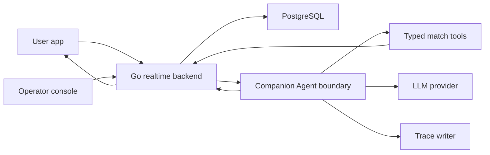

# Companion Agent Upgrade Design

## 1. Runtime Boundary

Target boundary:

Go keeps ownership of:

- WebSocket delivery
- match API
- operator authorization
- match fact mutations
- persistence

The companion agent boundary owns:

- intent classification
- memory retrieval plan
- prompt/context construction
- guarded LLM generation
- response policy
- decision trace

First implementation preference: keep this boundary in Go and make it explicit through interfaces, DTOs, tool contracts, and evals.

Introduce a TypeScript service only if:

- tool orchestration becomes hard to express safely in Go
- OpenAI Agents SDK or LangGraph materially reduces complexity
- deployment and local demo reliability remain acceptable
- the Go-to-agent DTO is already stable

## 2. Tool Boundary

Allowed tools:

| Tool | Purpose | Mutates match facts |
| --- | --- | --- |
| `match.read_snapshot` | Read current score, clock, period, teams, recent events | No |
| `match.search_events` | Search recent or filtered match events | No |
| `match.get_player_timeline` | Read events involving a player | No |
| `conversation.read_recent` | Read recent user and QiuQiu turns for follow-up resolution | No match facts |
| `conversation.append_turn` | Store user and QiuQiu turns | No match facts |
| `trace.write_decision` | Store decision trace | No |
| `response.emit_companion_reply` | Deliver text/audio/action | No |

Forbidden from user-facing agent:

- `operator.create_event`
- `operator.correct_event`
- direct database writes to match facts

## 3. Agent Pipeline

1. Normalize incoming user message.
2. Classify intent.
3. Load short-term conversation context.
4. Select tools based on intent.
5. Build a grounded context packet.
6. Generate reply with deterministic template or guarded LLM.
7. Select Live2D action and speech mode.
8. Write conversation turn and trace.
9. Emit response to the user.

## 4. Memory Levels

Level 1: match memory

- structured facts from operator and data provider
- source of truth for score and event facts

Level 2: short-term conversation memory

- last 6-10 user/QiuQiu turns
- used for follow-ups and pronouns

Level 3: preference memory

- talkativeness
- analysis vs emotional style
- language preference

Level 4: future vector memory

- fuzzy conversation recall
- recap and summarization
- never authoritative for score or assists

## 5. LLM Guardrails

The LLM may:

- make language warmer
- explain recorded events
- ask clarifying questions
- summarize known facts

The LLM may not:

- invent goals, assists, cards, substitutions, VAR outcomes, or injuries
- change score or clock
- claim a player event without retrieved facts
- override a correction

Current implementation: LLM polish is optional and runs only after deterministic fact retrieval has produced a safe reply. The polish layer receives the deterministic reply plus required fact anchors. Empty output, provider error, timeout, or an anchor mismatch falls back to the deterministic reply and records the fallback reason in the trace.

## 6. Framework Direction

Do not start by splitting runtime. Start by making the agent contract explicit inside the existing Go backend.

If orchestration later moves beyond current Go templates, TypeScript remains a candidate for the agent service. Candidate frameworks:

- OpenAI Agents SDK for typed tools, traces, and model orchestration
- LangGraph for explicit graph/state-machine flows
- Lightweight custom TypeScript service if the first phase only needs tool schemas and guarded prompts

Initial recommendation: start with a thin Go agent boundary and typed tools. Revisit OpenAI Agents SDK or LangGraph after the follow-up memory evals are passing and the tool schemas are stable.
