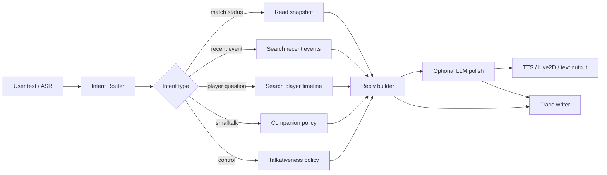

# Companion Explorer Design

## 1. Scope

Companion Explorer is the user-facing reasoning path for QiuQiu when the user speaks or types during a match.

It does not replace the director console. It consumes the director console's match memory and turns it into a safe reply pipeline.

## 2. Runtime Flow

## 3. Intent Model

Required intents:

- `match_status_question`
- `recent_event_question`
- `player_question`
- `emotion_reaction`
- `smalltalk`
- `control_command`
- `unknown`

Intent routing must be deterministic first and model-assisted only if needed later.

## 4. Tool Boundary

The explorer may read these facts:

- current match snapshot
- recent active events
- player-linked event timeline
- user conversation history

The explorer may write only:

- conversation turn
- trace log

The explorer may not write:

- match events
- corrected match facts
- score
- participants

## 5. Reply Policy

The reply builder should prefer structured templates:

- Score query -> direct factual answer
- Recent event query -> event summary with participant roles
- Player query -> last known player-linked event or a safe "not recorded" response
- Control command -> change conversation style, not match facts
- Smalltalk -> short companion-style response

The LLM, if used, should only rephrase the policy output and must not override the factual payload.

## 6. Trace Schema

Each turn should store:

- turn id
- match id
- user id
- input text
- intent
- tool calls
- retrieved event ids
- reply text
- reason / policy label
- latency
- error if any

## 7. Eval Scenarios

Baseline:

1. Director sets Spain vs Germany.
2. Director publishes goal at 23:41 with scorer Pedri, assist Fabian, pre-assist Yamal.
3. User asks who assisted.
4. User asks current score.
5. User asks whether Musiala scored.

Boundary:

1. User asks about a player with no recorded event.
2. User issues a quiet / less-chatty command.
3. A corrected goal disappears from the answer path.
4. A quiet proactive event emits no speech.

## 8. Implementation Shape

Suggested modules:

- `intent_router`
- `memory_tools`
- `reply_policy`
- `trace_writer`
- `companion_agent`

The first implementation can live inside the Go backend. The module boundaries should still be clean enough to move later into a TypeScript agent service.
