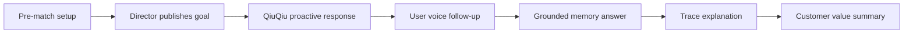

# Delivery Demo Package Design

## 1. Demo Story

## 2. Demo Sequence

1. Start backend.
2. Seed Spain vs Germany.
3. Open user app.
4. Open director live console.
5. Publish or verify the canonical Pedri goal.
6. QiuQiu proactively replies.
7. User asks "刚才谁助攻？" by text or voice.
8. QiuQiu answers from director facts.
9. User asks "谁策动的？"
10. QiuQiu uses short-term memory.
11. Show trace detail.
12. Explain director-console authority and no external sports-data dependency.

## 3. Package Contents

- demo runbook
- one-command seed
- smoke scripts
- voice smoke script
- MiMo configuration instructions
- customer-facing project introduction
- architecture diagram
- acceptance checklist

## 4. Customer Value Framing

The package should explain:

- Human director console replaces expensive or unavailable realtime sports feeds.
- QiuQiu only answers from structured director facts and memory.
- Voice interaction makes the digital human feel alive.
- Traceability makes model output auditable.
- The same pattern can be reused for live events, education, e-commerce, and guided customer experiences.

## 5. Secret Handling

- Use placeholders like `{MIMO_API_KEY}`.
- Never include real keys in docs, screenshots, OpenSpec, or tests.
- Smoke scripts read keys from environment variables only.

## 6. Handoff Bar

The package is ready when a non-developer presenter can follow it without editing code.
