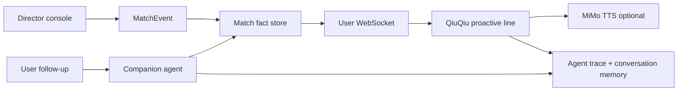

# Director Proactive Line Design

## 1. Proactive Event Loop

## 2. Required Event Contract

Director-published events must preserve:

- `matchId`
- `period`
- `clock`
- `eventType`
- `teamId`
- `teamName`
- `playerName`
- `participants`
- `score`
- `intensity`
- `description`
- `proactiveText`
- `recommendedAction`
- `source=operator`
- `operatorId` when available

## 3. Publication Modes

- proactive: write event and emit QiuQiu text/audio
- quiet: write event only, no proactive user output
- manual: use director-written proactive text exactly
- fallback: generate deterministic grounded proactive text if the director leaves it blank

## 4. Follow-up Memory

The proactive event should be recorded as a conversation/memory anchor so follow-up questions like:

- "谁助攻？"
- "谁策动的？"
- "刚才那球是谁进的？"

can resolve against the correct active event.

## 5. Correction Authority

When a director corrects an event:

- original event becomes `corrected`
- replacement event becomes active
- traces keep both IDs where relevant
- QiuQiu answers from active replacement facts only

## 6. Trace Contract

Each proactive and follow-up turn should capture:

- event ID
- user ID or broadcast target
- tool calls
- retrieved event IDs
- output text
- TTS status when available
- fallback reason when used
