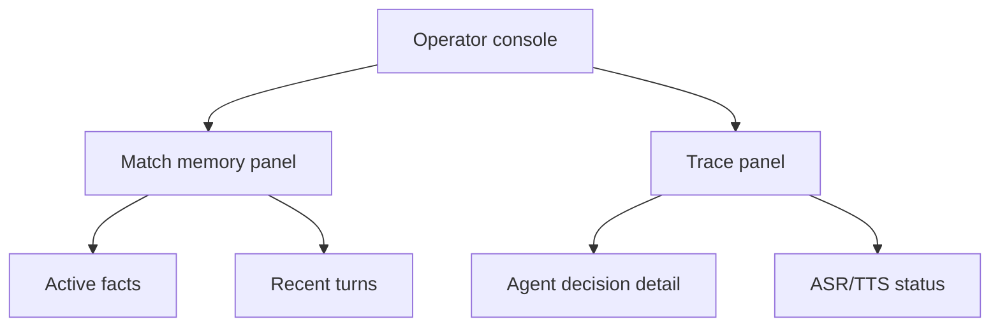

# Memory Trace Console Design

## 1. Console Layout

## 2. Match Memory Panel

Show:

- current score
- period and clock
- recent active events
- key events
- participants by role
- latest public description
- latest recommended action
- recent user/QiuQiu turns

Inactive or corrected events should be visually separated from active facts.

## 3. Trace Detail

Each trace detail should show:

- trace ID
- match ID
- user ID
- input text
- ASR text if available
- intent
- tool calls
- retrieved event IDs
- output text
- reason
- error/fallback reason
- latency
- created timestamp
- TTS status and byte count when available

## 4. Safety Rules

- Never display API keys or authorization headers.
- Never display raw environment variable values.
- Do not allow trace UI actions to mutate match facts.
- Keep trace detail readable for non-engineering demos.

## 5. Data Flow

Existing trace and match APIs should be reused where possible:

- `GET /api/matches/{matchId}/state`
- `GET /api/matches/{matchId}/events`
- `GET /api/matches/{matchId}/traces`
- `GET /api/matches/{matchId}/traces/{traceId}`

If voice metadata is not present, extend trace payloads with non-secret structured metadata.

## 6. Demo-Focused UX

The UI should let a presenter show:

1. director event was recorded
2. QiuQiu used that exact event
3. follow-up memory linked to the same event
4. voice succeeded or degraded safely
5. corrected facts are not used as active truth
