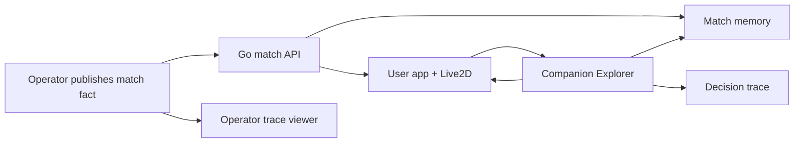

# Stabilize Demo Pack Design

## 1. Product Goal

The demo pack should prove the core product loop:

The goal is not to make every feature production-ready. The goal is to make one canonical story reliable.

## 2. Canonical Demo Scenario

Use a fixed match:

- match ID: `test`
- home: Spain
- away: Germany
- period: `first_half`
- clock: `24:10`
- score: `1-0`
- event: goal
- scorer: Pedri
- assist: Fabian
- pre-assist: Yamal
- proactive line: short, factual, and companion-like

## 3. Demo Reset And Seed

Provide a UTF-8 safe script or endpoint flow that:

1. Clears or supersedes previous demo state.
2. Writes match config.
3. Writes the canonical goal event.
4. Optionally verifies snapshot and trace preconditions.

PowerShell callers must avoid the Chinese encoding corruption seen in manual `Invoke-WebRequest` usage. Prefer a Node script, Go helper, or explicit UTF-8 body handling.

### Reset Strategy

The first implementation must pick one of these approaches explicitly:

- Add a demo-only reset endpoint guarded by the operator token and limited to known local demo match IDs.
- Use a unique deterministic match ID per demo run, such as `demo-spain-germany-{timestamp}`, and make the runbook open that match ID.

The endpoint approach is better for a polished demo because URLs stay stable. The unique match ID approach is safer if we want no new mutation endpoint yet.

Do not seed into an existing dirty memory state without reset. A stale event with corrupted Chinese text can change the snapshot and make QiuQiu answer from the wrong fact.

## 4. Browser QA

Minimum QA targets:

- `/`
- `/operator.html?token={APP_TOKEN}#live`
- `/operator.html?token={APP_TOKEN}#setup`
- `/operator.html?token={APP_TOKEN}#settings`
- `/operator.html?token={APP_TOKEN}#traces`

Checks:

- page loads
- WebSocket status visible
- Live2D iframe exists
- operator templates render for goal events
- context preview includes match state and realtime event
- trace list/detail renders after a user question
- console has no blocking application errors
- Chinese user questions and Chinese event facts round-trip without corruption

## 5. Known Issue Policy

Known issues are acceptable only if they are documented and invisible to the core demo path. Console errors, encoding corruption, and stale in-memory events are not acceptable for the demo pack because they directly reduce trust.

## 6. Documentation

Add a short demo runbook:

- prerequisites
- start command
- seed/reset command
- user URL
- operator URL
- trace URL
- expected script of actions
- expected outputs
- troubleshooting notes for port 8080 and Windows executable blocking
- chosen reset strategy and how to recover from dirty in-memory state
