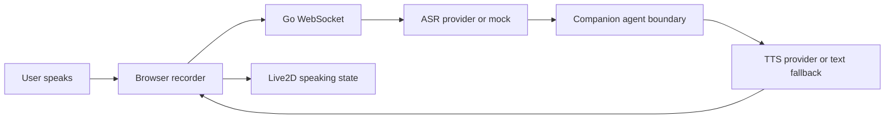

# Voice Interaction Closure Design

## 1. Voice Loop

## 2. Browser Voice States

- idle
- permission required
- listening
- processing
- replying
- failed, with text fallback

The user must always be able to type if voice fails.

## 3. ASR Contract

Input:

- match ID
- user ID
- audio bytes or base64
- optional language
- optional client timestamp

Output:

- text
- confidence if available
- provider metadata without secrets
- error if failed

If ASR fails, the client shows a clear fallback and the WebSocket remains connected.

## 4. TTS Contract

Input:

- reply text
- voice ID or configured default
- speaking style if supported

Output:

- audio frame or binary payload
- mime type
- duration if available

If TTS fails, the text reply still appears and Live2D uses a short expression/motion instead of audio lip sync.

## 5. Live2D Synchronization

State mapping:

- microphone active: `listen`
- waiting for ASR/agent: `think` or `focus`
- TTS playback: `speak`
- high-intensity event while voice is idle: event-specific action
- failure: calm fallback expression

Idle motions must not interrupt active listening or speaking.

## 6. Browser Audio Policy

Modern browsers may block autoplay. The first voice-enabled user gesture should unlock playback. If unlock fails, QiuQiu still displays the text reply and shows a recoverable audio state.
