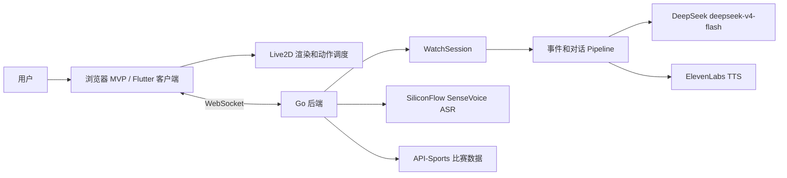
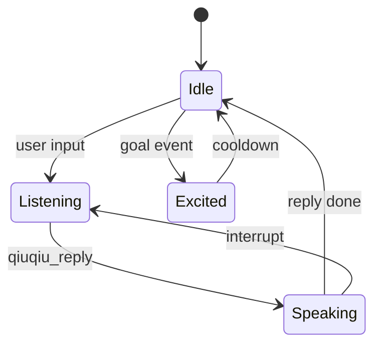

# Project Roadmap 设计

## 1. 目标架构



## 2. 关键设计决策

### 2.1 先浏览器 MVP，后 Flutter

浏览器 MVP 已经能跑通 `Live2D + WebSocket + DeepSeek`。继续沿这条线补齐动作、语音、TTS、比赛数据，可以更快验证体验；Flutter 等核心闭环稳定后再迁移，减少权限和平台差异带来的干扰。

### 2.2 WebSocket 协议作为唯一交互边界

客户端只依赖 WebSocket 消息，不直接耦合后端内部 pipeline。

客户端到服务端：

```json
{ "type": "user_speech", "text": "...", "audio": "...", "talkativeness": "normal" }
{ "type": "ping" }
{ "type": "interrupt" }
```

服务端到客户端：

```json
{ "type": "match_status", "status": "live" }
{ "type": "expression", "state": "chat" }
{ "type": "event", "event": "qiuqiu_reply", "data": { "text": "..." } }
```

后续要补充音频帧和结构化比赛事件，但保持向后兼容。

### 2.3 Live2D 动作调度在客户端

服务端只发送高层状态：`chat`、`listening`、`excited`、`idle`。客户端根据状态和当前播放阶段选择具体 motion，避免服务端知道模型文件细节。

动作状态机：



### 2.4 对话记忆由后端 session 管理

`ConversationContext` 应挂到 `WatchSession`，记录最近 6 轮对话。prompt 构造时注入最近对话和比赛上下文，避免前端自行拼 prompt。

### 2.5 事件数据必须有 mock 模式

足球数据 API 受比赛时间、key、额度影响。开发和演示必须支持 mock match：

- 固定比赛双方。
- 手动触发 goal/card/shot/start/end。
- 复用真实 pipeline 和 Live2D 动作。

这样即使没有真实比赛，也可以稳定演示产品。

## 3. 风险和对策

| 风险 | 影响 | 对策 |
|------|------|------|
| API key 缺失或失效 | ASR/TTS/比赛数据不可用 | 每条外部 API 都要有清晰降级和本地 mock |
| Live2D motion 互相打断 | 角色抽搐、不自然 | 客户端动作调度器统一排队和防打断 |
| 浏览器音频自动播放限制 | TTS 有数据但播不出 | 首次点击解锁 AudioContext，UI 显示音频状态 |
| 比赛事件去重不准 | 漏报或重复评论 | 修复 Poller ID，使用 event hash 而不是分钟+类型长度 |
| Prompt 乱码 | 回复质量差 | 全量修复 prompt 和页面文案编码 |
| Flutter 工具链缺失 | 移动端无法验证 | 保持浏览器 MVP 可用，同时补 Flutter 安装步骤 |

## 4. gstack 工程评审

### 架构评分

当前：6/10。

优点：核心后端、Live2D、DeepSeek、WebSocket 已闭环；模块边界基本清晰。

主要缺口：对话记忆未接入、动作调度太薄、外部 API 缺降级矩阵、比赛数据 mock 不够产品化、Flutter 路径未验证。

目标：8/10。达到 P0-P5 后，产品体验可信；达到 P6-P7 后，工程可交付。

### 关键路径

1. 修编码和动作调度。
2. 接对话记忆。
3. 接 TTS，让角色“说出声”。
4. 接比赛 mock 和 API-Sports。
5. 接 ASR，完成语音闭环。
6. 再迁移/验证 Flutter。

### 不建议现在做

- 账号系统。
- 多比赛并发。
- 角色商店。
- 复杂数据后台。
- 生产部署自动化。

这些会拉长路径，但不会让当前助手更快“能用起来”。

## 5. 验证矩阵

| 阶段 | 验证 |
|------|------|
| P0 | `/app.html` 连续 20 轮文字聊天无断连，角色始终可见 |
| P1 | 每类快捷按钮触发不同 motion，回复结束回 idle |
| P2 | 连续追问能引用上一轮上下文 |
| P3 | 麦克风输入一句话，ASR 文本正确进入后端 |
| P4 | TTS 音频可播放，Live2D 嘴型同步 |
| P5 | mock 进球事件触发激动回复，真实 API 有 key 时可拉 live fixture |
| P6 | Flutter Web 或 Android 至少一个平台可完成同样交互 |
| P7 | 一条命令启动，一条 smoke test 验证核心链路 |
