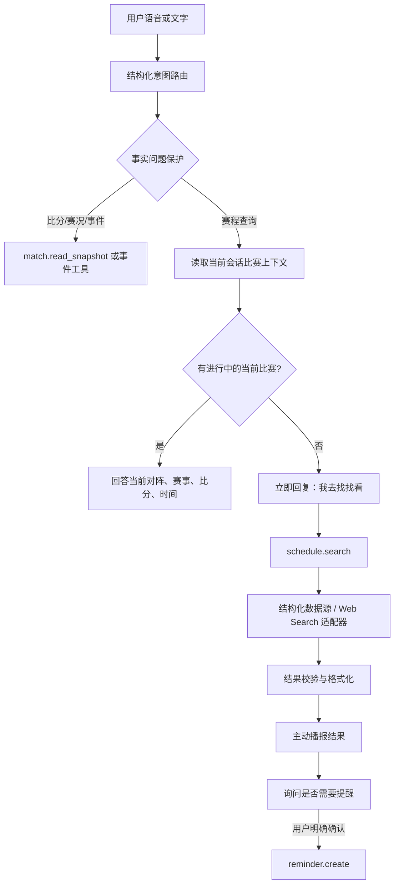

# Schedule-Aware Companion Agent Design

## 1. Runtime Flow



The agent must not call external search when the current match snapshot already answers the question. This prevents a stale web result from overriding the match currently being watched.

## 2. Structured Intent

The router returns a small typed object instead of selecting a sentence-specific rule:

```json
{
  "topic": "football_schedule",
  "action": "query",
  "scope": "current",
  "competition": null,
  "confidence": 0.94
}
```

Supported scopes:

| Scope | Meaning | Default behavior |
| --- | --- | --- |
| `current` | The match currently attached to the session or live matches | Read current match context first |
| `today` | Fixtures on the user's local calendar date | Search from today's local midnight to midnight |
| `tomorrow` | Fixtures on the next local calendar date | Search the next local calendar day |
| `nearby` | The user did not specify a date | Search the current match, then today and tomorrow |

The router may use an LLM structured-classification call, but it must have a bounded timeout and a deterministic fallback. The fallback should inspect topic, question act, and time scope as independent fields; it must not grow a list of complete example sentences.

Fact guards run before schedule routing. Questions containing score, clock, event, or player-status language stay on the structured match-fact path.

## 3. Context Resolution

`match.read_snapshot` is the first tool for `current` and `nearby` requests.

The active context is usable only when:

- the session's `matchID` has configured home and away teams;
- the period is in progress or paused during play, not `pre_match` or `fulltime`;
- the snapshot passes the existing integrity checks;
- the score and clock have a known freshness timestamp.

The current-match response contains:

- home and away teams;
- competition when available;
- score and period/clock;
- a freshness qualifier if the source is delayed or degraded.

Example:

> 现在正在看西班牙对德国的友谊赛，西班牙 1-0 领先，比赛在上半场，数据刚刚更新。

If the snapshot is absent, stale, conflicted, or finished, the agent does not present it as a live answer and continues to schedule search.

## 4. Schedule Search Tool

Introduce a typed read-only tool:

```text
schedule.search({
  from: RFC3339,
  to: RFC3339,
  timezone: IANA timezone,
  competition?: string,
  query?: string
}) -> {
  fixtures: Fixture[],
  source: string,
  fetchedAt: RFC3339,
  freshness: fresh | delayed | unknown
}
```

Each fixture should include:

- fixture ID and source;
- competition name;
- kickoff time with timezone;
- home and away teams;
- lifecycle status;
- score when the source provides it;
- source freshness and a link or source label where permitted.

Source policy:

1. Use a structured football provider for fixtures and live scores.
2. Use a configured Web Search adapter for discovery when the structured provider has no coverage.
3. Normalize and validate search results before they reach the response layer.
4. Never use an unverified search snippet to overwrite the match fact ledger.

The current runtime already has a narrow `ScheduleReader.TodayFixtures` seam. The implementation phase should extend it to a date-range/search contract without breaking the existing in-process test reader.

## 5. Progressive Delivery

For an external lookup, the user-visible state machine is:

```text
requested -> acknowledging -> searching -> announced -> reminder_offered
```

Immediate acknowledgement:

> 我去找找今天和明天的比赛，找到后告诉你。

Result announcement:

> 找到了，今天有西班牙对德国的友谊赛，还有一场皇马对巴萨。需要我帮你预约提醒吗？

The acknowledgement and result trace share a `lookupID`. The result is delivered through the existing proactive WebSocket path with a distinct source such as `schedule_lookup`, so the client can render and play it like other proactive turns.

Delivery rules:

- User speech interrupts or supersedes a pending lookup.
- A lookup has a deadline and a single-result deduplication key.
- A disconnected client does not receive a stale result after reconnect unless the result is explicitly recoverable.
- The result must be suppressed when the match context changed and the old query is no longer relevant.

## 6. Reminder Offer

The result announcement may ask whether a reminder is wanted. That question is not a mutation.

Only an explicit confirmation creates a reminder:

```text
reminder.create({
  fixtureID,
  userID,
  remindAt,
  timezone,
  channel
})
```

Reminder creation must be idempotent and must store the source fixture ID, requested time, timezone, and cancellation key. Ambiguous confirmations require a follow-up question rather than guessing a reminder time.

## 7. Trace and Error Model

Lookup traces should record:

- structured intent and confidence;
- selected scope and timezone;
- current snapshot status;
- tools called and their durations;
- source, fetched time, and freshness;
- number of normalized fixtures;
- acknowledgement and result delivery states;
- timeout, cancellation, or source errors.

User-facing errors should be short and honest:

- no source configured: `我先去找可靠的赛程，接上数据后告诉你。`
- source timeout: `赛程源这次没接上，我不先乱报。`
- no fixtures: `我查到这个时间段暂时没有可靠的赛程。`

Internal provider errors, credentials, and raw search responses must not leak into the user reply.

## 8. Rollout

1. Add the structured schedule DTOs and classifier seam behind existing deterministic routing.
2. Add current-context precedence and fixture normalization tests.
3. Extend the provider adapter to date ranges and source freshness.
4. Add asynchronous lookup acknowledgement and proactive result delivery.
5. Add reminder persistence only after lookup delivery is stable.
6. Enable the Web Search adapter behind configuration and rate limits.
7. Promote the feature after unit, integration, WebSocket, interruption, and source-failure evals pass.

## 9. Provider Configuration and Local Evaluation

- `APISPORTS_API_KEY` enables the structured fixture provider. When it is empty, the server does not create an external schedule reader and returns the existing honest no-source response without fabricating fixtures.
- `APISPORTS_BASE_URL` defaults to `https://v3.football.api-sports.io`. It may be overridden for a private proxy or a local compatibility server; credentials must never be included in the URL.
- PR browser evaluations start an isolated local API-Sports-compatible server, inject a test-only key and base URL, and close the server with the backend. The fixture date follows the requested date, so tests do not depend on the public network or a real provider account.
- The local evaluation source intentionally delays fixture responses so the acknowledgement and interruption behavior can be asserted deterministically.
