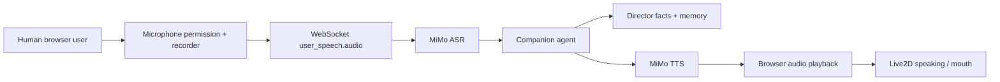

# Voice Browser E2E Acceptance Design

## 1. Acceptance Loop

## 2. Required Test Fixture

Use the canonical Spain vs Germany demo:

- Score: Spain 1-0 Germany
- Clock: 24:10
- Goal: Pedri
- Assist: Fabian
- Pre-assist: Yamal

The fixture must be seeded before browser voice acceptance begins.

## 3. Browser States

The acceptance flow must observe:

- idle: text input usable
- listening: microphone active and Live2D listening
- processing: audio sent and ASR/agent pending
- replying: text reply visible and TTS/audio pending or playing
- speaking: Live2D mouth motion active
- failed: clear fallback message while text input remains usable

## 4. Verification Evidence

The runbook or automation should capture:

- ASR text
- companion reply text
- TTS audio byte count or playback event
- Live2D state transition evidence
- trace ID for the companion turn
- browser console error check after the flow

## 5. Failure Matrix

| Failure | Expected Behavior |
| --- | --- |
| Microphone denied | Show fallback state; text chat still works |
| ASR fails | Show ASR fallback; do not disconnect WebSocket |
| TTS fails | Show text reply; Live2D performs non-audio speaking fallback |
| Audio autoplay blocked | Show recoverable audio status; keep reply visible |
| WebSocket reconnect | Voice control returns to idle after reconnect |

## 6. Automation Boundary

Full real microphone acceptance may remain manual because browser permission prompts require user confirmation. Non-permission checks should be automated with existing smoke scripts where possible.
